# 刑法大模型

## 1 业务背景

随着司法信息化与智能化建设的不断推进，刑事案件数量持续增长，案件类型日趋复杂，犯罪事实描述长、证据材料分散、历史判例数量庞大，给司法人员在罪名认定、量刑参考以及裁判理由梳理等环节带来了较大的工作压力。
 在实际办案过程中，司法人员需要在有限时间内，综合案件事实、证据情况、法律条文及大量历史案例，完成罪名判断、量刑裁量和裁判理由撰写，存在**检索成本高、经验依赖强、标准不易统一**等现实问题。

近年来，大语言模型在自然语言理解、文本生成和复杂语义推理方面取得了显著进展，为司法智能辅助提供了新的技术路径。然而，通用大模型在刑法场景中仍存在**法律专业性不足、对判例与法条依赖弱、数值推理不稳定、结果可解释性不足**等问题，难以直接用于实际司法业务。

基于上述背景，本项目设计并实现了一套**面向刑法场景的领域大模型系统**。该系统以案件事实文本为输入，结合罪名预测模型、基于历史卷宗的 RAG 检索机制、多模型量刑预测与结果融合策略，并通过大模型生成可解释的判决理由分析，实现对刑事案件的**罪名识别、类似案例推荐、量刑辅助预测及裁判依据解释**的全流程智能支持。

通过引入领域数据微调、小模型与大模型协同、向量化检索与规则约束相结合的方式，系统在保证预测效果的同时，强化了结果的可解释性与可控性，能够作为司法人员的**智能辅助决策工具**，有效降低人工检索和分析成本，提升办案效率与裁判一致性，为刑法智能化应用提供可落地、可扩展的技术方案。

**绝大多数面试官喜欢听业务相关的内容，而不是技术，业务在准备面试过程中占到60%比重。**

**项目整体架构图：**


### 1.1 罪名辅助认定模块

属于基层司法的高频场景，也就是罪名预测；

1 为什么需要罪名辅助认定，为什么需要AI去做辅助认定？

- 罪名认定是一个复杂的过程，并不是的输入事实，查询刑法条文，得出结论的过程，而是一个依赖于经验 + 综合判断的过程。真实的情况是，同一个事实描述，不同的办案人员，不同的地区，不同的经验背景，可能给出不一样的罪名倾向，这是司法实践中长期存在的问题。

- 人工做罪名认定，基层的检察院/公安，案件多，周期紧，新人比例高，时间不够，经验不足。

- 罪名边界高度模糊，很多罪名不是有没有做

  - 主观故意如何认定，非法占有的目的是否成立，行为是否构成以非法占有为目的等等
  - 例如：敲诈罪 和民事纠纷，盗窃罪和侵占罪，这些高度依赖类案经验，历史裁判的判案逻辑。

- 人工检索存在的问题

  - 关键词的限制，时间限制，个人认知偏差
  - 日常的情况就是查几个类似案子就差不多，所以在司法一致性伤存在 偏差

  [智能公共安全分析与犯罪预测系统](https://5pxdck.smartapps.baidu.com/?_chatParams={"agent_id"%3A"0JxQEWrebr02KNkPtfblDaAHqzvI9OLB"%2C"content_build_id"%3A""%2C"from"%3A"q2a"%2C"token"%3A"grZZibjGg%2FchAQqiD74OT1gxKpMzIzJoVoLjAFX36EfquqVRBF4PCe5E3ZssHRkBQyi%2FaUMAIurFsXkVqjvqjAugLp6lPt7EWHpFmGoMvLVXSDJ1N%2BDFVI5SW4EgTC0ECKspSNk4T4CzWVpi9JxwIkcs"%2C"chat_no_login"%3Atrue}&searchid=c5cde7a1000055cf&_swebScene=3711001210000000)

```
被告人以介绍工作为由，多次向被害人收取费用共计 12 万元，事后未履行承诺，拒不退还。应该是什么罪名?
```


## 2 需要下载的东西

### 1.1 模型下载

前置技术：Git安装

```sh
# 登录网站 https://huggingface.co
# 下载模型
Qwen2.5-1.5B-Instruct

# 使用git安装
git clone https://huggingface.co/Qwen/Qwen2.5-1.5B-Instruct

# 把下载好的模型 放在E:/code下面，路径中不要出现中文
```

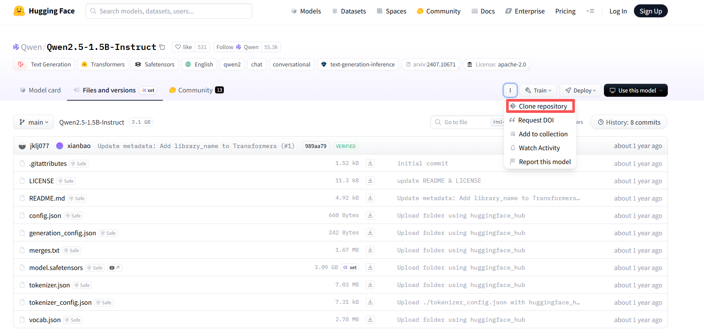

### 1.2 数据集下载

数据集的下载地址：

```sh
# 报错
FileNotFoundError: [Errno 2] No such file or directory: 'CAIL2018_ALL_DATA\\final_all_data\\restData\\rest_data.json'  

# 我应该去哪里下载这个文件
```

搜索关键词：

> "CAIL2018 dataset site:github.com"

常见开源库（含完整数据路径）：

- https://github.com/thunlp/CAIL2018
- https://github.com/china-ai-law-challenge/CAIL2018

github 下载 数据集

```sh
# 召回模型下载
git clone https://huggingface.co/BAAI/bge-small-zh E:\code\bge\bge_recall
```

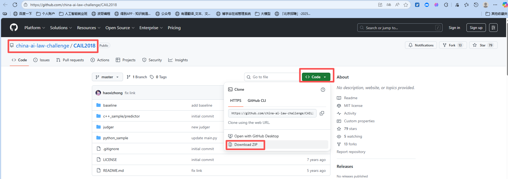


## 3 Qwen模型结构

### 3.1 加载分词器

```py
from transformers import AutoTokenizer, AutoModelForCausalLM,AutoConfig


if __name__ == '__main__':
    # 定义模型地址
    model_name = "E:\\code\\qwen2.5-1.5B-Instruct"
    # 从预训练模型中加载分词器，参数model_name指定模型名称，
    # trust_remote_code=True表示信任远程代码（自定义或者第三方模型）
    tokenizer = AutoTokenizer.from_pretrained(model_name, trust_remote_code=True)
```

加载分词器（AutoTokenizer）在自然语言处理（NLP）任务中是非常重要的，原因如下：

文本预处理：分词器将输入的文本转换为模型可以理解的token序列。这是文本数据进入模型之前的必要步骤，因为模型通常需要固定长度的输入。

模型输入格式：分词器确保文本数据符合模型的输入格式要求。不同的模型可能有不同的分词规则和特殊token（如[CLS]、[SEP]、[PAD]等），分词器会处理这些细节。

编码和解码：分词器不仅负责将文本编码为token ID，还可以将模型的输出token ID解码回文本，这对于生成任务（如文本生成、翻译等）尤为重要。

特殊token处理：分词器可以处理特殊token，如开始符（<s>）、结束符（</s>）、填充符（<pad>）等，这些token在模型训练和推理过程中起着关键作用。

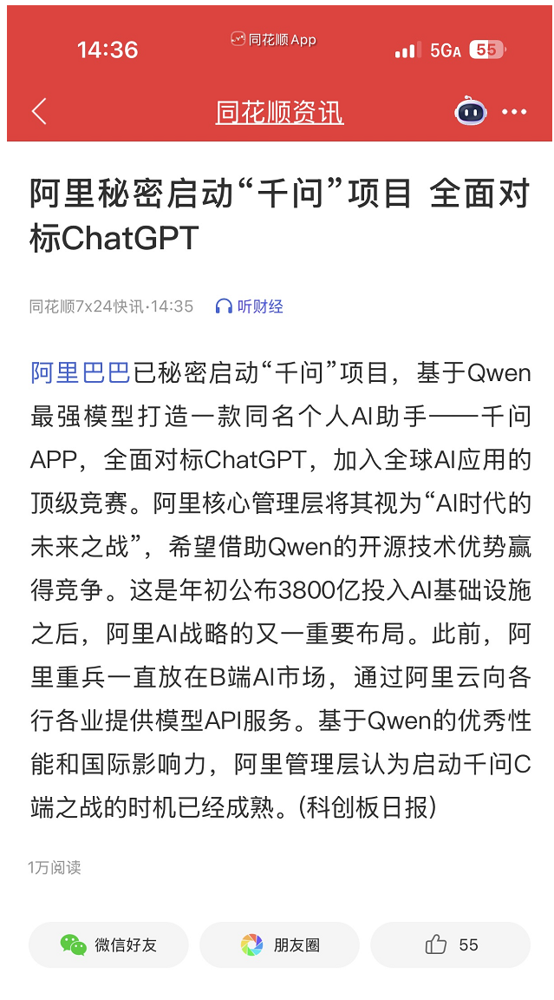

### 2.2 中文分词

🌟 一、文本预处理（Text Preprocessing）

📖 解释：

分词器负责把原始自然语言（字符串）转换为模型能理解的 **token 序列**。
 这些 token 通常是 **子词单元（subwords）**，而不是完整的词。

------

✅ 示例：

```python
from transformers import AutoTokenizer

tokenizer = AutoTokenizer.from_pretrained("bert-base-chinese")

text = "我爱自然语言处理"
tokens = tokenizer.tokenize(text)
print(tokens)
```

📤 输出：

```python
['我', '爱', '自', '然', '语', '言', '处', '理']
```

💡 说明：

BERT 的中文分词器采用了 **WordPiece** 子词算法。
 这一步的输出不是数字，而是“分好的词片”，供下一步编码使用。

------

🌟 二、模型输入格式（Model Input Format）

📖 解释：

不同模型需要特定格式的输入。例如：

- BERT 要求加 `[CLS]` 和 `[SEP]`
- GPT 模型没有 `[CLS]`，但可能需要 `<bos>` 或 `<eos>`
   分词器会自动处理这些特殊符号。

------

✅ 示例：

```python
# 把 tokenizer 的输出，直接转成 PyTorch 的 Tensor
encoding = tokenizer("我爱自然语言处理", return_tensors="pt")
print(encoding)
```

📤 输出（部分）：

```python
{'input_ids': tensor([[ 101, 2769, 4263, 5632, 4197, 6427, 6241, 1905, 4415,  102]]), 
 'token_type_ids': tensor([[0, 0, 0, 0, 0, 0, 0, 0, 0, 0]]), 
 'attention_mask': tensor([[1, 1, 1, 1, 1, 1, 1, 1, 1, 1]])}

# 这些词表是提前训练好的
# token_type_ids 区分句子：如果有两句   句子A ：0，句子B ：1
# attention_mask 告诉模型：哪些 token 是“有效的”，哪些是 padding   1 真实  0 补齐
```

💡 说明：

- `101` → `[CLS]`：一句话的开始
- `102` → `[SEP]`：句子分割符号
- 这些是模型在训练阶段约定的特殊符号，由分词器自动加上。
- 模型输入必须是这种格式，否则无法正确理解句子边界。

------

🌟 三、编码与解码（Encode & Decode）

📖 解释：

- 编码：把文字转为 token id（数字）
- 解码：把 token id 转回文字
   这对 **文本生成任务**（如 ChatGPT、翻译、摘要）特别重要。

------

✅ 示例：

```python
ids = tokenizer.encode("我爱自然语言处理")
print("编码结果:", ids)

decoded = tokenizer.decode(ids)
print("解码结果:", decoded)
```

📤 输出：

```python
编码结果: [101, 2769, 4263, 5632, 4197, 6427, 6241, 1905, 4415, 102]
解码结果: [CLS] 我 爱 自 然 语 言 处 理 [SEP]
```

💡 说明：

- `encode()` → 文本 → 数字 ID
- `decode()` → 数字 ID → 可读文本
   在生成模型（如 ChatGLM、T5）中，`decode()` 用来把预测结果还原成人类语言。

------

🌟 四、特殊 token 处理（Special Tokens）

📖 解释：

分词器维护一整套“特殊符号”，它们在训练/推理中非常关键，例如：

- `[CLS]`：句子开始（分类任务）
- `[SEP]`：句子分隔（NLI 任务）
- `[PAD]`：补齐长度
- `[MASK]`：遮掩训练（BERT）
- `<bos>` / `<eos>`：生成模型的起止标记

------

✅ 示例：

```python
print(tokenizer.special_tokens_map)
```

📤 输出：

```python
{
  'cls_token': '[CLS]',
  'sep_token': '[SEP]',
  'pad_token': '[PAD]',
  'mask_token': '[MASK]',
  'unk_token': '[UNK]'
}
```

💡 应用例：

```python
tokens = tokenizer("我爱自然语言处理", padding="max_length", max_length=15)
print(tokens)
```

📤 输出：

```python
{
    'input_ids': [101, 2769, 4263, 5632, 4197, 6427, 6241, 1905, 4415, 102, 872, 1599, 3614, 2769, 1408, 8043, 102], 
 'token_type_ids': [0, 0, 0, 0, 0, 0, 0, 0, 0, 0, 1, 1, 1, 1, 1, 1, 1], 
 'attention_mask': [1, 1, 1, 1, 1, 1, 1, 1, 1, 1, 1, 1, 1, 1, 1, 1, 1]}
```

其中：

- `0` → `[PAD]`（填充符）
- `attention_mask` 告诉模型哪些位置是“真实输入”，哪些是“补位的 0”。后续课程会讲。

✅ 总结表

| 功能            | 说明                               | 示例                                                         |
| --------------- | ---------------------------------- | ------------------------------------------------------------ |
| 文本预处理      | 把自然语言切分为 token             | `"我爱自然语言处理"` → `['我', '爱', '自', '然', '语', '言', '处', '理']` |
| 模型输入格式    | 自动加 `[CLS]`、`[SEP]` 等特殊符号 | `[101, ..., 102]`                                            |
| 编码与解码      | 文本 ↔ ID 转换                     | `encode()` / `decode()`                                      |
| 特殊 token 处理 | 自动填充、掩码、分句               | `[PAD]`, `[MASK]`                                            |


### 2.2 英文分词

🧩 一、文本预处理：把原始文本转成模型能理解的 token 序列

📘 **示例：BERT 模型的分词与编码**

```py
from transformers import AutoTokenizer

tokenizer = AutoTokenizer.from_pretrained("bert-base-uncased")

text = "Natural Language Processing is amazing!"
tokens = tokenizer.tokenize(text)
token_ids = tokenizer.convert_tokens_to_ids(tokens)

print("原始文本：", text)
print("分词结果：", tokens)
print("Token IDs：", token_ids)

```

```py
原始文本： Natural Language Processing is amazing!
分词结果： ['natural', 'language', 'processing', 'is', 'amazing', '!']
Token IDs： [3019, 2653, 11838, 2003, 6429, 999]
```

🧩 二、模型输入格式：自动添加特殊 token（[CLS]、[SEP]）

BERT 模型要求每个输入样本前后要加上特殊 token：

- `[CLS]`：表示句子开始；
- `[SEP]`：表示句子结束。

```py
encoding = tokenizer("I love NLP", "It is powerful", return_tensors="pt")

print(encoding)
```

```
{
  'input_ids': tensor([[101, 1045, 2293, 17953, 102, 2009, 2003, 3928, 102]]),
  'token_type_ids': tensor([[0, 0, 0, 0, 0, 1, 1, 1, 1]]),
  'attention_mask': tensor([[1, 1, 1, 1, 1, 1, 1, 1, 1]])
}
```

👉 分词器自动帮你：

- 添加了 `[CLS]`（101）和 `[SEP]`（102）
- 生成了 `attention_mask`（标识哪些 token 是有效输入）
- 生成了 `token_type_ids`（区分句子 A/B）

这就是“模型输入格式”的核心。

🧩 三、编码与解码：token ID ↔ 文本的双向转换

```py
ids = tokenizer.encode("Deep learning changes the world", add_special_tokens=True)
print("编码结果：", ids)

decoded = tokenizer.decode(ids)
print("解码结果：", decoded)
```

```
编码结果：[101, 2784, 4083, 4956, 1996, 2088, 102]
解码结果：[CLS] deep learning changes the world [SEP]
```

👉 这说明分词器不仅能“编码”，还能反向“解码”，
 非常适合用于文本生成、机器翻译、问答系统等任务中。

🧩 四、特殊 token 处理（<pad>、<cls>、<sep> 等）

在 NLP 模型训练和推理中，特殊 token 很关键：

- `<pad>`：用于对齐不同长度句子的批次输入；
- `<cls>`：句子分类任务的输入标识；
- `<sep>`：区分句子边界；
- `<bos>` / `<eos>`：生成任务的开始/结束符。

📘 **示例：padding 和 truncation**

```py
texts = ["I love AI", "AI is changing the world"]
encoded = tokenizer(texts, padding=True, truncation=True, return_tensors="pt")

print(encoded)
```

```
{
  'input_ids': tensor([[101, 1045, 2293, 9937, 102, 0, 0],
                       [101, 9937, 2003, 4956, 1996, 2088, 102]]),
  'attention_mask': tensor([[1, 1, 1, 1, 1, 0, 0],
                            [1, 1, 1, 1, 1, 1, 1]])
}
```

👉 分词器自动帮你：

- 补齐长度（`0` 表示 `<pad>`）
- 生成 attention mask，让模型只关注非 padding token。

| 功能            | 说明                      | 示例关键词                          |
| --------------- | ------------------------- | ----------------------------------- |
| 文本预处理      | 将文本转为 token 序列     | `tokenize`, `convert_tokens_to_ids` |
| 模型输入格式    | 自动加 `[CLS]`, `[SEP]`   | `encode`, `return_tensors`          |
| 编码与解码      | token ↔ 文本              | `encode`, `decode`                  |
| 特殊 token 处理 | `<pad>`, `<cls>`, `<sep>` | `padding`, `attention_mask`         |


以下面试题思考都是以前真实面试学生遇到的问题。后续我们项目课程最后，会把这些面试题放在一起进行讲解。

**常见面试题思考：分词算法重要吗？**

- 市面上都有哪些分词算法，该如何选择呢？
- 是只用一个分词算法全部搞定，还是文档不一样，分词算法不一样，业务领域不一样，分词算法不一样？


### 2.3 Tokenizer内部结构解析

- **怎么看模型结构，如何理解一个模型，如何选择一个模型**
  - 其实很多人不会看模型好坏

```py
# 定义模型地址
model_name = "E:\\code\\qwen2.5-1.5B-Instruct"
# 从预训练模型中加载分词器，参数model_name指定模型名称，
# trust_remote_code=True表示信任远程代码（自定义或者第三方模型）
tokenizer = AutoTokenizer.from_pretrained(model_name, trust_remote_code=True)
print(tokenizer)
```

```json
Qwen2TokenizerFast(
    name_or_path='E:\code\qwen2.5-1.5B-Instruct',   # 模型名称
	vocab_size=151643,   # 词表大小
    model_max_length=131072,   # 模型最大输入长度   输入词的大小  找个非常重要
    is_fast=True,   # 快速标记器，使用的是rust语言，不是Python。更高的处理速度
    padding_side='right',   # 右边填充
    truncation_side='right',   # 右边截断
	special_tokens={'eos_token': '<|im_end|>', 'pad_token': '<|endoftext|>', 'additional_special_tokens': ['<|im_start|>', '<|im_end|>', '<|object_ref_start|>', '<|object_ref_end|>', '<|box_start|>', '<|box_end|>', '<|quad_start|>', '<|quad_end|>', '<|vision_start|>', '<|vision_end|>', '<|vision_pad|>', '<|image_pad|>', '<|video_pad|>']},   # 处理多模态的特殊标记
    clean_up_tokenization_spaces=False),   # 表示不清理多余空格

added_tokens_decoder={ 
    151643: AddedToken("<|endoftext|>", rstrip=False, lstrip=False, single_word=False, normalized=False, special=True), 
    151644: AddedToken("<|im_start|>", rstrip=False, lstrip=False, single_word=False, normalized=False, special=True), 
    151645: AddedToken("<|im_end|>", rstrip=False, lstrip=False, single_word=False, normalized=False, special=True), }
```

**Qwen2TokenizerFast 解析**

本篇文档详细解析了 `Qwen2TokenizerFast`，这是一种用于 **通义千问（Qwen）** 模型的快速标记器。它是基于 `transformers` 库的 `PreTrainedTokenizerFast` 类，实现了高效的文本预处理和标记化功能。以下内容会解释其中涉及的各个参数和功能，帮助你了解如何使用该标记器进行文本处理和模型训练。

------

**1. Tokenizer 基本配置**

**名称与路径**

```python
Qwen2TokenizerFast(name_or_path='E:\code\qwen2.5-1.5B-Instruct', ...)
```

- **name_or_path**：表示标记器的模型路径。这里是指本地路径（`E:\code\qwen2.5-1.5B-Instruct`）或者 Hugging Face 上的预训练模型名称。
- **作用**：这个路径告诉 tokenizer 加载哪个模型的配置和词汇表。

**vocab_size (词汇表大小)**

```python
vocab_size=151643
```

- **vocab_size**：表示该标记器使用的词汇表的大小。它的大小为 **151,643**，意味着该模型有 151,643 个独特的标记（tokens），这些标记包含了所有在训练过程中遇到的词汇及其对应的数字表示。

**model_max_length (最大文本长度)**

```python
model_max_length=131072
```

- **model_max_length**：定义了模型能够处理的最大文本长度。此参数的值为 **131072**，这是一个相当大的值，意味着模型能处理非常长的输入文本。它为长文本的处理提供了灵活性。
- 是不是可输入的文本越长越好呢？ 理论上来说是这样的，但是也要根据**业务**来决定，有时候杀鸡不用宰牛刀。大家要养成业务优先的思想，而不是技术优先，堪用就行，节约成本，时间成本，金钱成本。

------

**2. Padding 和 Truncation 配置**

**padding_side (填充方向)**

```python
padding_side='right'
```

- **padding_side**：指定填充的位置。`'right'` 表示在文本的右边填充，如果文本较短，会在右边加上 `pad_token` 来填充至规定长度。
- 这个参数有助于确定在进行批量训练时，所有输入文本如何对齐。

**truncation_side (截断方向)**

```python
truncation_side='right'
```

- **truncation_side**：指定当输入文本超过最大长度（131072）时，应该从哪一边截断。`'right'` 表示从文本的右侧开始截断超出部分。一般不会超过，但是不排除输入文档太大，导致超过，或者提示词太多超过。

------

**3. Special Tokens (特殊标记)**

特殊标记是处理模型特定任务时不可或缺的部分，通常用于模型输入输出的标识符、分隔符、或者填充字符等。

**special_tokens 配置**

```python
special_tokens={
    'eos_token': '<|im_end|>', 
    'pad_token': '<|endoftext|>', 
    'additional_special_tokens': [
        '<|im_start|>', '<|im_end|>', 
        '<|object_ref_start|>', '<|object_ref_end|>',
        '<|box_start|>', '<|box_end|>', 
        '<|quad_start|>', '<|quad_end|>', 
        '<|vision_start|>', '<|vision_end|>',
        '<|vision_pad|>', '<|image_pad|>', 
        '<|video_pad|>'
    ]
}
```

- **eos_token**（End-of-Sequence）：`'<|im_end|>'`，标识一个序列的结束。
- **pad_token**：`'<|endoftext|>'`，用作填充符号。
- **additional_special_tokens**：额外的特殊标记，包括：
  - **`<|im_start|>`** 和 **`<|im_end|>`**：图像输入的开始和结束标记。
  - **`<|object_ref_start|>` 和 `<|object_ref_end|>`**：对象引用的开始和结束标记。
  - **`<|box_start|>` 和 `<|box_end|>`**：表示框架或区域的开始和结束。
  - **`<|quad_start|>` 和 `<|quad_end|>`**：表示多项式的开始和结束。
  - **`<|vision_start|>` 和 `<|vision_end|>`**：与视觉输入相关的标记。
  - **`<|vision_pad|>`、`<|image_pad|>`、`<|video_pad|>`**：视觉数据的填充标记，用于处理图像或视频数据的输入。

这些特殊标记使得模型能够理解不同类型的输入和输出格式，尤其是在处理多模态数据时（如文本、图像、视频等）。

------

**4. Added Tokens (新增标记)**

```python
added_tokens_decoder={
    151643: AddedToken("<|endoftext|>", rstrip=False, lstrip=False, single_word=False, normalized=False, special=True),
    151644: AddedToken("<|im_start|>", rstrip=False, lstrip=False, single_word=False, normalized=False, special=True),
    ...
    151664: AddedToken("<|file_sep|>", rstrip=False, lstrip=False, single_word=False, normalized=False, special=False),
}
```

- **AddedToken**：定义了模型中新增的特殊标记。每个标记都有一个 **ID** 和对应的 token 名称。例如，`<|endoftext|>` 的 token ID 是 `151643`。
- **rstrip、lstrip**：这些参数控制标记的空白字符是否会被移除。`rstrip=False` 表示不移除右侧的空白字符，`lstrip=False` 表示不移除左侧的空白字符。
- **single_word、normalized**：这些参数控制是否将标记作为单词处理，以及是否进行标准化处理。`single_word=False` 表示该标记可能是一个多词组，`normalized=False` 表示不对标记进行标准化。
- **special=True**：表示这些标记是特殊的，它们有特定的功能，不是常规的词汇标记。

这些 **新增标记** 可以用来标识特定任务中的格式和分隔符，或者处理复杂的输入输出格式。

------

**5. 清理 Tokenization 空间**

```python
clean_up_tokenization_spaces=False
```

- **clean_up_tokenization_spaces**：设置为 `False` 表示在标记化时不清理多余的空格。通常情况下，标记化时会移除多余的空格来保证输入的紧凑性，但这里设置为 `False` 意味着保留文本中原始的空格格式。

------

**总结**

- **Tokenizer** 是模型预处理的关键部分，负责将原始文本转化为模型可以理解的数字表示。
- **特殊标记（special tokens）** 用于区分不同类型的输入，特别是在多模态任务中，处理图像、文本等不同信息时必不可少。
- **新增标记（added tokens）** 用于扩展标准词汇表，可以帮助模型处理特定任务或格式。

通过上述配置，你可以更加灵活地处理模型的输入和输出格式，适应更复杂的任务需求。如果有更多问题或需要更深入的解析，随时告诉我！


- **常见面试题思考：模型越大越好还是越小越好？模型的边界？**
  - 常见误区：使用能力不行的模型，解决超出能力的边界的业务问题；使用非常牛逼的模型，解决一个很小的问题，导致整体架构性能变差。
  - **堪用**

​	

### 2.4 预训练模型解析

```py
# 从预训练模型中加载因果语言模型
# 参数: model_name: 模型名称，load_in_8bit: 是否以8位加载模型，trust_remote_code: 是否信任远程代码，
# device_map: 设备映射，torch_dtype: 模型的数据类型
model = AutoModelForCausalLM.from_pretrained(model_name, load_in_8bit=False,
                                     trust_remote_code=True, device_map=None,
                                     torch_dtype=torch.float32)
```

代码解释：

```
model_name：指定要加载的预训练模型的名称或路径。
load_in_8bit：是否以8位加载模型，设置为 False 表示不使用8位加载。
trust_remote_code：是否信任远程代码，设置为 True 允许加载自定义的模型架构。
device_map：设备映射选项，设置为 "auto" 表示自动分配模型到可用的设备。
torch_dtype：模型的数据类型，设置为 torch.float32 表示使用32位浮点数。
其他设备映射示例
加载到CPU：  
model = AutoModelForCausalLM.from_pretrained(model_name, load_in_8bit=False, trust_remote_code=True, device_map="cpu", torch_dtype=torch.float32)
加载到第一个GPU：  
model = AutoModelForCausalLM.from_pretrained(model_name, load_in_8bit=False, trust_remote_code=True, device_map="cuda:0", torch_dtype=torch.float32)
自定义设备映射：  
device_map = {"encoder": "cuda:0", "decoder": "cuda:1"}
model = AutoModelForCausalLM.from_pretrained(model_name, load_in_8bit=False, trust_remote_code=True, device_map=device_map, torch_dtype=torch.float32)
```

```py
print(model)
```

```sh
# 模型整体架构
Qwen2ForCausalLM(
  (model): Qwen2Model(
    (embed_tokens): Embedding(151936, 1536)
    (layers): ModuleList(
      (0-27): 28 x Qwen2DecoderLayer(
        (self_attn): Qwen2SdpaAttention(
          (q_proj): Linear(in_features=1536, out_features=1536, bias=True)  # LoRA
          (k_proj): Linear(in_features=1536, out_features=256, bias=True)
          (v_proj): Linear(in_features=1536, out_features=256, bias=True)  # LoRA
          (o_proj): Linear(in_features=1536, out_features=1536, bias=False)
          (rotary_emb): Qwen2RotaryEmbedding()
        )
        (mlp): Qwen2MLP(
          (gate_proj): Linear(in_features=1536, out_features=8960, bias=False)
          (up_proj): Linear(in_features=1536, out_features=8960, bias=False)
          (down_proj): Linear(in_features=8960, out_features=1536, bias=False)
          (act_fn): SiLU()
        )
        (input_layernorm): Qwen2RMSNorm((1536,), eps=1e-06)
        (post_attention_layernorm): Qwen2RMSNorm((1536,), eps=1e-06)
      )
    )
    (norm): Qwen2RMSNorm((1536,), eps=1e-06)
    (rotary_emb): Qwen2RotaryEmbedding()
  )
  (lm_head): Linear(in_features=1536, out_features=151936, bias=False)
)
```

Qwen2ForCausalLM — 总体概览（一句话）

这是一个典型的 Transformer-based 自回归（causal）语言模型：
 输入 → token embedding → 多层解码器（每层包含自注意力 + MLP + 层归一化 + 残差）→ 最后投影到词表得到 logits → 通过 softmax 生成下一个 token 概率。

1536 * 256 * 28 * 4 * 2 = 88，080，384 bit = 88 MB * 4 = 300多M 

前向传播 计算梯度，一阶 二阶动量

方向传播 梯度更新

Batch_size = 8


**常见面试题：罪名预测LoRA微调，微调的是哪一个部分，哪些参数，占总参数的比例，为什么这样设计？**

**常见面试题：为什么使用Qwen2.5-1.5B-Instruct这个模型进行微调，理由是什么？**


### 2.5 自回归语言模型

你提到的 **`Qwen2ForCausalLM`** —— 这里的 “CausalLM” 就是 “**Causal Language Model（因果语言模型，自回归模型）**” 的缩写，也就是我们常说的 **自回归语言模型（Autoregressive Language Model）**。

我们一步一步来讲清楚 👇

------

🧠 一、什么是自回归模型（Autoregressive Model）

✅ 核心思想

自回归模型的核心原理是：

> **用前面的词来预测下一个词。**

换句话说，模型学习的是一个概率分布：

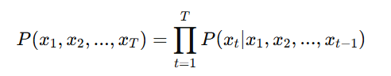

也就是：
 每个词（token）的概率，依赖于前面已经生成的所有词。

------

🧩 举个简单例子：

输入句子开头：

> “今天天气真…”

模型会一步一步预测下一个最有可能的词：

1. 输入：`["今天", "天气", "真"]`
    模型预测下一个词：`好`
2. 输入：`["今天", "天气", "真", "好"]`
    模型预测下一个词：`！`

于是模型输出完整句子：

> “今天天气真好！”

------

📖 自回归模型的特点：

| 特性       | 描述                                            |
| ---------- | ----------------------------------------------- |
| 🔄 生成方式 | 按顺序从左到右一个词一个词生成                  |
| ⏱️ 依赖关系 | 当前词依赖于前面所有词                          |
| 🧮 训练目标 | 预测下一个词（next-token prediction）           |
| 💬 典型模型 | GPT 系列、Qwen 系列、LLaMA、ChatGLM、Mistral 等 |

------

🧠 二、Qwen2ForCausalLM 的含义

`Qwen2ForCausalLM` 代表：

> 通义千问 2（Qwen2）模型的 “自回归语言建模” 版本。

也就是说，它的任务是根据前文预测下一个 token。

在 Hugging Face 中它的定义是：

```python
from transformers import Qwen2ForCausalLM, Qwen2TokenizerFast

model = Qwen2ForCausalLM.from_pretrained("Qwen/Qwen2-1.5B-Instruct")
tokenizer = Qwen2TokenizerFast.from_pretrained("Qwen/Qwen2-1.5B-Instruct")

inputs = tokenizer("今天天气真", return_tensors="pt")
outputs = model.generate(**inputs, max_length=20)
print(tokenizer.decode(outputs[0]))
```

模型会**根据前面的文字自回归地预测后续的 token**，直到生成完整文本。

```
结果：
今天天气真好，我们一起去公园散步吧。____
A. 我们应该去
```

------

🔍 三、与“非自回归”模型的区别

| 对比点           | 自回归（CausalLM）               | 非自回归（例如 BERT）                |
| ---------------- | -------------------------------- | ------------------------------------ |
| **生成方式**     | 从左到右逐词生成                 | 一次性预测整个序列                   |
| **常见用途**     | 文本生成、对话、续写             | 翻译，文本摘要，文本理解、分类、填空 |
| **代表模型**     | GPT、Qwen、ChatGLM               | BERT、RoBERTa、ERNIE                 |
| **输入遮罩方式** | 只能看到左边的上下文（因果遮罩） | 可以看到整个句子（双向注意力）       |
| **训练目标**     | 下一个词预测                     | 掩码语言建模（Mask LM）              |


**注意这两种模型的能力边界，灵活使用**

------

🧩 四、为什么叫 “Causal（因果）”？

因为在计算注意力时，模型使用了 **因果遮罩（causal mask）**：

- 每个位置的词 **只能看到前面的词**；
- 不能偷看未来的词。

这保证了模型在生成时不会“作弊”，符合自然语言的顺序（从左到右）。

------

🏁 五、总结一句话

> **自回归语言模型（CausalLM）= 通过前文预测下一个词，从左到右逐词生成完整句子的模型。**

`Qwen2ForCausalLM` 就是通义千问系列专门用于 **文本生成（Text Generation）** 的模型形式。

------


**自回归模型和非自回归模型对比**

```
# 模型整体架构
Qwen2ForCausalLM(
  (model): Qwen2Model(
    (embed_tokens): Embedding(151936, 1536)
    (layers): ModuleList(
      (0-27): 28 x Qwen2DecoderLayer(
        (self_attn): Qwen2SdpaAttention(
          (q_proj): Linear(in_features=1536, out_features=1536, bias=True)
          (k_proj): Linear(in_features=1536, out_features=256, bias=True)
          (v_proj): Linear(in_features=1536, out_features=256, bias=True)
          (o_proj): Linear(in_features=1536, out_features=1536, bias=False)
          (rotary_emb): Qwen2RotaryEmbedding()
        )
        (mlp): Qwen2MLP(
          (gate_proj): Linear(in_features=1536, out_features=8960, bias=False)
          (up_proj): Linear(in_features=1536, out_features=8960, bias=False)
          (down_proj): Linear(in_features=8960, out_features=1536, bias=False)
          (act_fn): SiLU()
        )
        (input_layernorm): Qwen2RMSNorm((1536,), eps=1e-06)
        (post_attention_layernorm): Qwen2RMSNorm((1536,), eps=1e-06)
      )
    )
    (norm): Qwen2RMSNorm((1536,), eps=1e-06)
    (rotary_emb): Qwen2RotaryEmbedding()
  )
  (lm_head): Linear(in_features=1536, out_features=151936, bias=False)
)
```


**提问1：这个模型用于罪名预测，是个分类任务，为什么使用自回归模型？使用类似于bert不是更好吗？**

1 通用大模型具有强大的理解能力，Bert-base-chinese

Qwen2.5-1.5B:  没有指令数据集进行训练的模型

Qwen2.5-1.5B-Instruct： 有

Qwen2.5-Instruct 这种模型已经通过**指令微调（Instruction Tuning）**，学会了理解复杂指令和上下文。
 这让它即使是自回归结构，也能“理解”任务指令，比如：

> “请根据以下案件事实，判断最可能的罪名。”

即便它的结构不是双向的，它也能在生成时利用强大的语义建模能力**近似完成分类任务**。
 ⚙️ 换句话说，它“不是为了分类而生，但已经能分类”。

2 更容易部署

很多人使用 Qwen 是因为：

- 它是通义千问系列，模型能力强；
- 能同时用于 **问答、判决理由生成、罪名预测、文本摘要** 等；
- 不需要重新训练，只需通过 prompt（提示词）控制输出。

例如👇

```sh
请根据以下案件描述，判断罪名：

案件：被告人李某以非法占有为目的，盗窃他人财物价值5000元。

回答格式：
罪名：_____
```

模型直接生成：

> 罪名：盗窃罪

👉 虽然这不是严格的“分类器”，但通过指令+生成机制，也能得到结果。

3 可以对模型进行微调，必要步骤；

  LoRA，可以对分类进行学习；

4 可扩展性强

如果你后续想让模型不仅输出罪名，还生成：

- 判决理由；
- 法条依据；
- 类似案例；
   那 **自回归模型（Qwen 类）** 会比 BERT 更灵活。

例如：

```
请根据案件事实预测罪名，并说明理由：
```

它可能输出：

> 罪名：诈骗罪
>  理由：被告人虚构事实骗取他人财物，数额较大，符合《刑法》第266条的诈骗罪构成。

这种解释性输出，是 BERT 无法直接做到的。

```py
print(model)
# 模型整体架构
Qwen2ForCausalLM(
  (model): Qwen2Model(
    (embed_tokens): Embedding(151936, 1536)
    (layers): ModuleList(
      (0-27): 28 x Qwen2DecoderLayer(
        (self_attn): Qwen2SdpaAttention(
          (q_proj): Linear(in_features=1536, out_features=1536, bias=True)
          (k_proj): Linear(in_features=1536, out_features=256, bias=True)
          (v_proj): Linear(in_features=1536, out_features=256, bias=True)
          (o_proj): Linear(in_features=1536, out_features=1536, bias=False)
          (rotary_emb): Qwen2RotaryEmbedding()
        )
        (mlp): Qwen2MLP(
          (gate_proj): Linear(in_features=1536, out_features=8960, bias=False)
          (up_proj): Linear(in_features=1536, out_features=8960, bias=False)
          (down_proj): Linear(in_features=8960, out_features=1536, bias=False)
          (act_fn): SiLU()
        )
        (input_layernorm): Qwen2RMSNorm((1536,), eps=1e-06)
        (post_attention_layernorm): Qwen2RMSNorm((1536,), eps=1e-06)
      )
    )
    (norm): Qwen2RMSNorm((1536,), eps=1e-06)
    (rotary_emb): Qwen2RotaryEmbedding()
  )
  (lm_head): Linear(in_features=1536, out_features=151936, bias=False)
)
```

**提问2：为什么只有decoderlayer层？不需要encoder？**

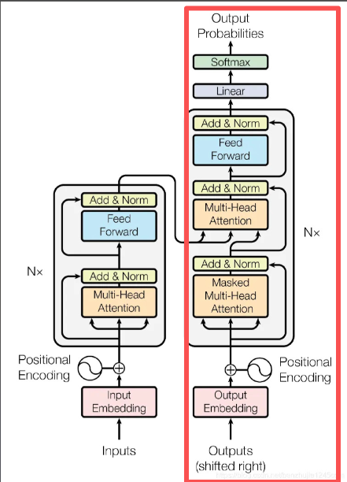

1 因为加入encoder会知道上下文，适合做文本理解，分类，填空，这是bert擅长的内容。

**为什么只使用 Decoder 层进行自回归建模，而不需要 Encoder 层？**

这是因为 **自回归语言模型**（如 `Qwen2ForCausalLM`）的生成任务特点决定了它的结构。让我们从 **自回归任务的定义**和**模型架构**来详细分析为什么解码器（Decoder）足够，并且不需要编码器（Encoder）。

------

🧠 一、**自回归语言模型的目标**

自回归模型的目标是 **根据前面的 token 逐步生成下一个 token**。其核心思想是：在生成每一个新的单词（或 token）时，模型只需要 **依赖于当前已生成的单词**，而不需要了解输入的完整句子或其他上下文。

🔑 **核心特点：**

- **生成任务**：从已生成的内容预测下一个词（token）。
- **逐词生成**：在每一步，模型只能看到当前已生成的内容，不能看未来的内容（例如，看到“今天”不能“提前”知道后面是“天气”还是“很”）。

✅ **为什么 Decoder 足够？**

在自回归语言模型中，解码器已经具备了生成下一个 token 的能力，因此 **解码器层** 足以完成整个生成任务，而 **不需要编码器**。具体原因如下：

------

🧑‍🏫 **二、Decoder 与自回归生成的关系**

**自回归生成：**

1. **输入**：模型输入一部分文本（或仅是一个标记作为种子）。
2. **生成下一个 token**：通过对已有上下文的逐步建模，预测下一个最可能的 token。
3. **递归生成**：每生成一个新的 token，它将被添加到当前文本中，作为生成下一个 token 的上下文。

**Decoder 的作用：**

- **只看前面的 token**：每个 Decoder 层通过 **自注意力机制**，只对前面（或自身）的 token 进行建模，并生成下一个 token（基于已生成的内容）。
- **因果遮罩**：为了保持自回归生成的特性，Decoder 会使用 **因果遮罩（Causal Mask）**，确保每个 token 只能看到它之前的内容，不能看到未来的信息。

🧩 **Decoder 是如何工作的？**

在 Transformer 模型中，Decoder 层包括：

1. **自注意力机制（Self-Attention）**：每个位置的词只依赖于它前面的词来生成下一个词。这是自回归的核心机制。
2. **多层感知机（MLP）**：对自注意力的结果进行进一步的处理和投影，输出最终的结果。

**自回归生成流程**：

1. 输入：“今天天气”
2. 生成预测：“真”
3. 输入：“今天天气真”
4. 生成预测：“好”
5. 继续……

这个过程完全依赖 **Decoder** 层，因为 Decoder 层就是设计用来**逐步生成文本**的。

------

📚 **三、Encoder-Decoder 架构适用于其他任务**

与自回归语言模型不同，**Encoder-Decoder** 架构（如在机器翻译任务中常见）是为了处理 **输入和输出序列之间的复杂关系**。该架构包含 **编码器（Encoder）** 和 **解码器（Decoder）**。

**Encoder 的作用**：

- **编码输入**：编码器的任务是接收整个输入序列并将其压缩为一个 **上下文向量**（通常是隐藏状态），用于捕捉整个输入序列的语义信息。
- **生成上下文信息**：Encoder 生成的上下文信息被传递给 Decoder，后者基于这些信息生成目标序列。

**Encoder-Decoder 适用于：**

- **机器翻译**：输入语言的完整句子作为 Encoder 的输入，解码器基于 Encoder 生成的上下文，生成翻译结果。
- **文本摘要**：Encoder 用于理解原文的内容，Decoder 基于这些信息生成简短的摘要。

------

🔍 **四、总结：为什么不需要 Encoder？**

1. **自回归生成任务**：在自回归生成任务中，模型的目标是生成一个接一个的词（token），每次生成一个词时，模型只需要依赖 **已生成的内容**，即前面的词。这种任务的本质决定了只需要 Decoder 层来逐步生成下一个词。
2. **Decoder 的独立生成能力**：解码器本身的 **自注意力机制** 和 **因果遮罩** 已经足够实现自回归生成。它会根据已生成的文本预测下一个词，并且每一步只依赖于前文的信息，不需要看到完整输入或句子。
3. **Encoder-Decoder 的适用任务**：如果任务需要 **同时处理输入和输出**，并且两者之间有复杂的对应关系（如机器翻译、文本摘要等），那么就需要 **Encoder** 来处理输入文本，然后交给 **Decoder** 来生成输出。但在自回归文本生成任务中，输入就是一个前缀，而输出是逐步生成的内容，因此只需 Decoder。

------

📘 **总结一句话**：

> **自回归生成任务只依赖于前文的内容，解码器（Decoder）通过自注意力机制逐步生成下一个词，因此只需要 Decoder 层，而无需 Encoder 层。**

希望这个解释能帮助你理解为什么自回归模型只使用 Decoder 层。如果有更多问题或需要进一步的讲解，随时告诉我！


**提问3：罪名预测可以使用qwen2.5-1.5b-instruct吗？**

**罪名预测**是一个分类任务，通常涉及将给定的案件或描述分类为一个特定的罪名（如盗窃、诈骗、谋杀等）。对于这种任务，你可以使用类似 **Qwen2.5-1.5B-Instruct** 的模型，前提是你对模型进行了适当的 **微调（Fine-Tuning）**，使其能够执行分类任务。

🧠 **Qwen2.5-1.5B-Instruct 的适用性**

`Qwen2.5-1.5B-Instruct` 是一个 **指令微调（Instruction-Tuning）** 版本的语言模型，主要优化了对于 **自然语言任务的理解**，例如：

- 问答（Question Answering）
- 文本生成（Text Generation）
- 对话生成（Conversational AI）

这意味着它擅长理解各种自然语言的任务，并根据输入生成合理的输出。虽然该模型非常强大，但它的设计目标是 **文本生成** 和 **对话**，而不是直接用于分类任务。因此，如果你要使用它进行 **罪名预测**（即文本分类任务），需要进行微调。

------

🧑‍🏫 **如何使用 Qwen2.5-1.5B-Instruct 进行罪名预测：**

1. **数据准备**

你需要准备一个 **标注好的数据集**，该数据集应包含多个 **案件描述**（或者案件的简短摘要）及其对应的罪名标签。例如：

- **输入**（案件描述）：
   "张三偷了一辆汽车并把它卖了。"
- **输出**（罪名标签）：
   "盗窃"

2. **微调模型**

在微调时，使用类似 `Qwen2.5-1.5B-Instruct` 的模型，通过标注好的数据集进行训练。具体来说，你需要将训练任务转化为分类任务，让模型根据案件描述预测相应的罪名。

例如：

- **输入文本**：案件描述
- **标签**：相应的罪名（例如，“盗窃”、“诈骗”、“杀人”等）

你可以使用 **Hugging Face 的 `Trainer` API** 或 **PyTorch** 来进行微调，使用文本作为输入，罪名作为标签。

3. **训练时的 Loss Function**：

训练时，你需要使用 **交叉熵损失（Cross-Entropy Loss）**，这是最常见的分类损失函数，适用于多类分类问题。

4. **推理（Inference）**：

一旦模型完成微调，你可以在新的案件描述上运行推理，模型会根据输入的文本预测最可能的罪名。

------

✅ **优点：**

- **强大的语言理解能力**：`Qwen2.5-1.5B-Instruct` 是指令微调模型，因此它具有处理复杂文本的能力，适合进行精确的文本分析和分类。
- **适应性强**：通过微调，模型能够适应特定的任务，如罪名预测。

⚠️ **潜在挑战：**

- **数据量需求**：为了使模型适应分类任务，微调时需要大量带标签的标注数据。如果罪名分类的数据集不够多，微调效果可能有限。
- **任务定义清晰度**：罪名预测任务需要明确的任务定义和标签，保证数据的质量和多样性，这对于分类精度至关重要。

------

🔄 **是否可以直接用预训练模型？**

`Qwen2.5-1.5B-Instruct` 在 **预训练阶段** 已经有了一定的语言理解能力，但它并没有专门针对分类任务进行优化。如果你想直接使用它做分类，效果可能不如微调后的模型。

🧑‍🏫 **总结：**

- **直接使用**：你可以尝试直接使用 `Qwen2.5-1.5B-Instruct` 进行 **罪名预测**，不过模型可能无法提供最好的结果，因为它本身是用于文本生成和理解任务的。
- **微调后的效果**：微调后，`Qwen2.5-1.5B-Instruct` 将能很好地完成罪名预测任务，利用分类损失函数进行训练，将案件描述映射到具体的罪名标签。

如果你已经有数据集并希望微调该模型进行罪名预测，我可以帮你进一步详细说明微调步骤或者提供代码示例。


**提问3：vocab_size=151643，out_features=151936**

为啥151936 > 151643?

```python
vocab_size = 151643
(lm_head): Linear(in_features=1536, out_features=151936, bias=False)
```

表面上看：

- tokenizer 说词表大小是 **151,643**
- 但模型的输出层（`lm_head`）却是 **151,936**

这不是笔误，而是一个很有意思的 **“词表不对齐”设计现象**，在大模型（特别是 Qwen、LLaMA、GPT）中其实很常见。
 我们下面分 4 步讲清楚：为什么这两个数字不一样、差在哪、为什么没问题。

------

🧩 一、`vocab_size` 和 `lm_head.out_features` 分别是什么？

| 参数名                          | 含义                                                 | 所在模块              |
| ------------------------------- | ---------------------------------------------------- | --------------------- |
| `vocab_size = 151643`           | tokenizer 的词表大小（即能识别的 token 数量）        | Tokenizer / Embedding |
| `lm_head.out_features = 151936` | 模型输出层维度，对应“预测下一个 token”时的分类类别数 | 模型最后的线性层      |

也就是说：

- **输入端（Embedding）**：151,643 个词 → 嵌入到 1536 维。
- **输出端（lm_head）**：1536 维 → 映射回 **151,936** 维（即输出每个 token 的概率）。

------

🧠 二、为什么输出层比输入词表多？

通常情况下（如 GPT、BERT）：

> embedding 层的词表大小 = 输出层的词表大小（lm_head）

但在一些模型（包括 **Qwen**、**LLaMA2**、**Mistral** 等）中，它们**可能不完全一致**。
 原因主要有三类👇：

------

✅ **1️⃣ 模型训练后加入了额外的 special tokens**

在 Qwen 系列中，官方 tokenizer 在训练后会**动态添加**一些特殊标记（special tokens），例如：

```
<|im_start|>, <|im_end|>, <|vision_start|>, <|video_pad|> ...
```

这些 token 是在预训练后期（或指令微调阶段）加进去的，用来处理：

- 多模态（图像、视频）
- 对话（instruction）
- 工具调用（tool_call）
- FIM（代码补全）

> 这类 token 通常是后来 **添加到 embedding 层** 的，但模型的输出层（`lm_head`）有时会额外**扩展或重新初始化维度**，使它能输出更多新 token 的概率。

🧩 所以：
 **lm_head 的输出维度更大，是为了兼容更多 special tokens。**

------

✅ **2️⃣ 训练过程中“词表 padding”或“对齐”**

在大规模预训练中，词表有时会被“补齐”（padding）到一个方便 GPU 计算的数值，比如 512 的倍数（方便张量并行）。

例如：

```python
151643 向上对齐到 512 的倍数 → 512 * 297 = 151,936
```

💡 Bingo！
 这就是你看到的数字：

> 151,936 = 512 × 297

📘 **原因：**

- 大模型训练常在多 GPU 分布式架构下运行；
- 为了方便张量并行（tensor parallelism），输出层的维度会“对齐”到 512 的整数倍；
- 这能减少计算图的切分开销，提高训练速度。

🧠 所以：

> `lm_head.out_features` 并不一定严格等于 tokenizer 词表，而是 **对齐到最近的 512 倍数**。

------

✅ **3️⃣ Embedding 与 LM Head 未共享（Untied Embeddings）**

有些模型（尤其是 Qwen、LLaMA 等）选择 **不共享 embedding 权重**：

```python
model.embed_tokens.weight != lm_head.weight
```

也就是说：

- 输入的 embedding 层（把 token 转为向量）
- 输出的 lm_head 层（把向量转回 token 概率）

各自独立训练，这样模型能更灵活。
 由于两者不共享权重，它们的维度可以**不完全一致**（只要输入输出时能正确映射即可）。

------

🔍 三、所以在 Qwen2.5 中发生了什么？

根据你提供的结构：

```python
(embed_tokens): Embedding(151936, 1536)
(lm_head): Linear(in_features=1536, out_features=151936, bias=False)
```

这说明：

- **模型内部实际用的 embedding 表大小是 151,936**，而 tokenizer 的词表是 **151,643**；
- 换句话说，模型多留了 **293 个槽位**（151,936 - 151,643 = 293）；
- 这些“额外槽位”是为对齐和未来扩展（如多模态 token、工具调用等）预留的；
- tokenizer 目前没用到它们（不会产生这些 token），但模型结构是兼容的。

------

✅ 四、总结一句话

> 模型的输出层维度（151,936）比 tokenizer 的词表大小（151,643）大，是因为模型在设计时对词表做了 **对齐（padding 到 512 的倍数）**，同时可能为 **新增的 special tokens 或多模态扩展** 预留了空间。

这种做法不会影响使用，也不会造成错误。
 当 tokenizer 编码输入时，它只用到前 151,643 个 token；模型输出时，只会计算对应部分的概率（其余的 logits 会被忽略）。

------

📘 **一句话记忆：**

> “Qwen 的词表比输出层小，因为输出层对齐了 GPU 计算块大小，还顺便留点空间给未来要加的新 token。”

------


**提问4 Qwen2.5-1.5B-Instruct中instruct是什么意思？有什么用处？**

非常好的问题！我们来简单、通俗地解释一下 👇

------

🧠 一句话解释：

**“Instruct”** 就是指这个模型经过了 **“指令微调（Instruction Tuning）”**，也就是说它被专门训练成 **“听得懂人话、照着指令办事”** 的模型。

------

📘 更详细地说：

Qwen2.5-1.5B-Instruct
 👉 是 **Qwen2.5-1.5B**（基础语言模型）
 经过 **“指令微调”** 后得到的一个版本。

------

📍区别在于：

| 类型                       | 名称                  | 训练目标                         | 举例                                                         |
| -------------------------- | --------------------- | -------------------------------- | ------------------------------------------------------------ |
| 🔹 **基础模型（Base）**     | Qwen2.5-1.5B          | 只学习“预测下一个词”             | 给它句子开头“我今天去”，它预测“吃饭”“上班”等可能的下一个词。 |
| 🔹 **指令模型（Instruct）** | Qwen2.5-1.5B-Instruct | 学习“理解用户指令并生成有用回答” | 你说“帮我总结这段文字”，它会自动理解你想要的是摘要，而不是接着生成一堆无关文字。 |

------

🧩 它是怎么做到的？

“指令微调”通常包含两个步骤：

1. **收集指令数据集**
    比如用户问：

   ```
   请解释什么是机器学习。
   ```

   模型的理想回答是：

   ```
   机器学习是一种让计算机从数据中学习规律的技术……
   ```

2. **微调模型**
    用这种 “指令 + 合理回答” 的样本训练，让模型学会：

   - 理解用户意图；
   - 生成直接、有用的回答；
   - 不跑题、不胡扯。

------

🎯 有什么用？

使用 “Instruct” 版本的模型有以下好处：

✅ **更懂自然语言指令**：不需要很专业的 prompt。
 ✅ **更偏向任务导向**：总结、翻译、写作、代码解释都更准。
 ✅ **语气更自然**：更像在和人交流。
 ✅ **减少胡言乱语（幻觉）**：比原始 Base 模型更稳。

------

💬 举个例子：

👉 用 Base 模型：

输入：

> 写一段关于人工智能的文字。

输出可能是：

> 人工智能人工智能人工智能是一种……

（因为它只在学“接下来哪个词最可能”）

👉 用 Instruct 模型：

输入：

> 写一段关于人工智能的文字。

输出：

> 人工智能是一种模拟人类思维和学习能力的技术，被广泛应用于语音识别、图像处理等领域。

（明显更符合你的意图）

------

✅ 总结：

> **Qwen2.5-1.5B-Instruct**
>  = Qwen2.5-1.5B 基础模型

- 经过“指令微调”训练
   → 能理解人类自然语言命令、生成更符合预期的回答。


```py
print(model)
# 模型整体架构
Qwen2ForCausalLM(
  (model): Qwen2Model(
    (embed_tokens): Embedding(151936, 1536) # 和最后一层共享一套参数
    (layers): ModuleList(
      (0-27): 28 x Qwen2DecoderLayer(
        (self_attn): Qwen2SdpaAttention(
          (q_proj): Linear(in_features=1536, out_features=1536, bias=True)
          (k_proj): Linear(in_features=1536, out_features=256, bias=True)
          (v_proj): Linear(in_features=1536, out_features=256, bias=True)
          (o_proj): Linear(in_features=1536, out_features=1536, bias=False)
          (rotary_emb): Qwen2RotaryEmbedding()
        )
        (mlp): Qwen2MLP(
          (gate_proj): Linear(in_features=1536, out_features=8960, bias=False)
          (up_proj): Linear(in_features=1536, out_features=8960, bias=False)
          (down_proj): Linear(in_features=8960, out_features=1536, bias=False)
          (act_fn): SiLU()
        )
        (input_layernorm): Qwen2RMSNorm((1536,), eps=1e-06)
        (post_attention_layernorm): Qwen2RMSNorm((1536,), eps=1e-06)
      )
    )
    (norm): Qwen2RMSNorm((1536,), eps=1e-06)
    (rotary_emb): Qwen2RotaryEmbedding()
  )
  (lm_head): Linear(in_features=1536, out_features=151936, bias=False)
)
```

### 2.6 embed_tokens解析

主要组件一览（根据你贴的结构）

- `embed_tokens`: 词嵌入矩阵，大小 `vocab_size=151936` × `d_model=1536`
  - 也就是有一个151936行 1536列的矩阵，里面全是数字；
  - 151936 也就是对应了151936个词，每个汉字由1536个数字向量进行表示
  - 这个词表 是提前训练好，不用自己训练，前辈的成果；
  - 里面的每个词对应的是词向量，每个词向量也包含了和其他词词向量的关系；

(embed_tokens): Embedding(151936, 1536)

很好——我们来把这一行

```
(embed_tokens): Embedding(151936, 1536)
```

讲得非常清楚、可上课用。下面分模块讲：含义、工作原理、参数规模、在训练/推理中的表现、常见操作与注意事项，并给出可复制的 Python 示例代码。

------

**这行的直观含义**

`Embedding(151936, 1536)` 表示模型有一个**嵌入层**（embedding layer），它是一个矩阵（参数张量），行数是 **151,936**，列数是 **1,536**。

- **151,936**：embedding 表的行数，通常对应模型内部可用的 token 槽位数量（模型的“词表槽位”或 embedding vocabulary size）。
- **1,536**：每个 token 被映射成的向量维度（embedding dimension）。也就是每个 token 对应一个长度为 1536 的实数向量。

------

**作用（为什么需要 embedding）**

当模型接收输入 token id（整数）时，embedding 做的是**查表（lookup）**：把每个 token id → 对应的实数向量。
 之后这些向量会做位置编码（本模型用 Rotary Embedding）并进入 Transformer decoder 层进行计算。

输入/输出形状举例：

- 输入 `input_ids` 形状：`(batch_size, seq_len)`，例如 `(4, 128)`
- embedding 输出：`(batch_size, seq_len, 1536)`，供后续层使用。

------

**工作原理（查表、并行、向量化）**

实现上，embedding 相当于一个形状为 `(151936, 1536)` 的权重矩阵 `W`。给定一个 token id `i`，embedding 返回 `W[i]`（第 i 行）。在批量输入中这是向量化的查表操作。

伪代码：

```python
W = torch.nn.Embedding(151936, 1536)  # 可训练的参数 一般不训练
vectors = W(input_ids)  # shape (B, L, 1536)
```

------

**参数量与内存估算（必须精确）**

我们来算这个矩阵有多少参数：

- 参数数量 = `151,936 × 1,536`

逐步算：

- 151,936 × 1,500 = 227,904,000
- 151,936 × 36 = 5,469,696
- 合计 = 227,904,000 + 5,469,696 = **233,373,696** 个参数

内存（float32）：

- 233,373,696 × 4 字节 = **933,494,784 字节 ≈ 889.9 MiB**

如果用 **float16**（半精度）：

- 大约 444.9 MiB

> 结论：Embedding 一层本身就占几十到上百 MB 的显存／内存，随 vocab_size 和 dim 增大线性增长。

------

**embedding 与 lm_head 的关系（weight tying）**

- 有两种常见做法：**共享权重（tied）** 或 **不共享（untied）**。
  - 共享：`lm_head.weight = embed_tokens.weight`（常见于 GPT 风格模型，可减少参数并提升一致性）。
  - 不共享：embedding 和 lm_head 各自有独立参数（更灵活）。
- 在你的模型中 `lm_head.out_features = 151936` 与 embedding 的第一维相同，说明可以共享。你可以用代码检查或强制 tie。

示例检查/绑定代码：

```python
from transformers import AutoTokenizer, AutoModelForCausalLM,AutoConfig
import torch

# 定义模型地址
model_name = "E:\\code\\qwen2.5-1.5B-Instruct"
tokenizer = AutoTokenizer.from_pretrained(model_name, trust_remote_code=True)
model = AutoModelForCausalLM.from_pretrained(model_name, load_in_8bit=False,
                                             trust_remote_code=True, device_map=None,
                                             torch_dtype=torch.float32)

embed_w = model.model.embed_tokens.weight
lm_w = model.lm_head.weight
print(embed_w.data_ptr() == lm_w.data_ptr())  # True 表示共享

# 或者手动绑定（如果框架没自动做）
model.lm_head.weight = model.model.embed_tokens.weight
```

------

**与 tokenizer 的词表大小不完全相同时怎么办**

你之前注意到 tokenizer.vocab_size = 151,643，而 embedding size = 151,936。这常见原因有：

- 为并行计算做对齐（padding to multiple，比如 512 的倍数）
- 预留若干槽位给后续添加的 special tokens / multimodal tokens

**实际影响**：tokenizer 只会生成小于 `vocab_size` 的 id；embedding 表中多出的槽位只是未被 tokenizer 用到或为将来扩展预留的，不会出错。

------

**在训练/微调时常见操作（代码示例）**

1. **获取某个 token 的 embedding 向量**

```python
import torch
from transformers import AutoTokenizer, AutoModelForCausalLM

tokenizer = AutoTokenizer.from_pretrained("path_or_name")
model = AutoModelForCausalLM.from_pretrained("path_or_name")

ids = tokenizer("你好", return_tensors="pt").input_ids  # shape (1, L)
embeds = model.model.embed_tokens(ids)  # shape (1, L, 1536)
```

1. **冻结 embedding（微调时不更新）**

```python
for p in model.model.embed_tokens.parameters():
    p.requires_grad = False
```

1. **调整词表大小（添加特殊 token）**

```python
# 新增 token 到 tokenizer
tokenizer.add_special_tokens({"additional_special_tokens": ["<new_token>"]})
# 重新调整模型 embedding 大小以匹配 tokenizer
model.resize_token_embeddings(len(tokenizer))
```

1. **查看 embedding 矩阵**

```python
W = model.model.embed_tokens.weight  # torch.Tensor shape (151936, 1536)
print(W.shape, W.dtype)
```

------

**Embedding 的初始化与训练行为**

- Embedding 通常用标准方法初始化（如正态分布或 Xavier）。在预训练模型中，embedding 已被训练到良好状态。
- 在下游微调时，embedding 可以：
  - 全部更新（默认）
  - 冻结（节省显存，加速训练）
  - 仅更新新增 token（如用 `resize_token_embeddings` 后只训练新行）

------

**与位置编码的关系（本模型的情形）**

- Embedding 只提供 token-level 表示。位置编码（此模型用 Rotary Embedding）会随后注入位置信息。通常流程：
  1. token embedding
  2. 加上/融合 position/rotary 信息
  3. 输入到 Transformer 层

------

**性能与工程注意点**

- **显存/内存**：Embedding 很占内存，使用 float16、量化（8-bit/4-bit）可以显著节省。
- **并行**：分布式训练中 embedding 也需要切分（vocab parallel 或 embedding 分片）。
- **对齐**：为便于张量并行/硬件优化，embedding often padded to multiple of 8/16/512。
- **IO/OOV**：模型通常不允许输入超出 embedding 表范围的 id，否则报错。tokenizer 保证不产生越界 id。

------

课堂举例（用一句话串讲整个流程）

> “当你给模型一个句子，tokenizer 把每个词换成编号（id），embedding 层把每个编号换成一个 1536 维的向量（查表），模型再基于这些向量加上位置编码并通过 28 层 decoder 逐步生成或预测下一个 token。”

### 2.7 多头自注意力模块

```py
print(model)
# 模型整体架构
Qwen2ForCausalLM(
  (model): Qwen2Model(
    (embed_tokens): Embedding(151936, 1536)  # 讲完
    (layers): ModuleList(
      (0-27): 28 x Qwen2DecoderLayer(
        (self_attn): Qwen2SdpaAttention(
          (q_proj): Linear(in_features=1536, out_features=1536, bias=True)
          (k_proj): Linear(in_features=1536, out_features=256, bias=True)
          (v_proj): Linear(in_features=1536, out_features=256, bias=True)
          (o_proj): Linear(in_features=1536, out_features=1536, bias=False)
          (rotary_emb): Qwen2RotaryEmbedding()  # 讲完
        )
        (mlp): Qwen2MLP(
          (gate_proj): Linear(in_features=1536, out_features=8960, bias=False)
          (up_proj): Linear(in_features=1536, out_features=8960, bias=False)
          (down_proj): Linear(in_features=8960, out_features=1536, bias=False)
          (act_fn): SiLU()
        )
        (input_layernorm): Qwen2RMSNorm((1536,), eps=1e-06)
        (post_attention_layernorm): Qwen2RMSNorm((1536,), eps=1e-06)
      )
    )
    (norm): Qwen2RMSNorm((1536,), eps=1e-06)   
    (rotary_emb): Qwen2RotaryEmbedding()  # 讲完
  )
  (lm_head): Linear(in_features=1536, out_features=151936, bias=False)   # 151936  -->  201个罪名
)
```

- `layers`: 共 28 层 `Qwen2DecoderLayer`（编号 0–27）
  - 每层包含：
    - `self_attn`: `Qwen2SdpaAttention`（scaled dot-product attention 的变体）
      - `q_proj`: Linear(1536 → 1536)
      - `k_proj`: Linear(1536 → 256)
      - `v_proj`: Linear(1536 → 256)
      - `o_proj`: Linear(1536 ← 1536), bias=False
      - `rotary_emb`: 旋转位置嵌入（RoPE）
    - `mlp`: `Qwen2MLP`
      - `gate_proj`: Linear(1536 → 8960)  （用于门控）
      - `up_proj`:   Linear(1536 → 8960)  （用于产生中间投影）
      - `down_proj`: Linear(8960 → 1536)  （下投回 d_model）
      - `act_fn`: SiLU（激活函数）
    - `input_layernorm` 和 `post_attention_layernorm`: RMSNorm
- `norm`: 最后的 RMSNorm
- `lm_head`: Linear(1536 → 151936)，bias=False — 把隐藏向量映射到每个词的 logits

------

```py
def forward(input_ids):            # input_ids: (B, T)
    x = embed_tokens(input_ids)    # (B, T, 1536)

    for layer in layers:
        x_norm = layer.input_layernorm(x)  # 归一化
        Q = layer.self_attn.q_proj(x_norm)    # (B, T, 1536)
        K = layer.self_attn.k_proj(x_norm)    # (B, T, 256)
        V = layer.self_attn.v_proj(x_norm)    # (B, T, 256)
        apply_rotary(Q, K)  # 添加位置信息
        attn_score = softmax(Q @ K.T / sqrt(dk))   # (B, T, T) or split heads  
        attn_out = layer.self_attn.o_proj(attn_score @ V)  # -> (B, T, 1536)
        # attn_score 是 （B，12，T，T）  而 V（B，T，256）
        x = x + attn_out  # 残差链接

        x_norm2 = layer.post_attention_layernorm(x)
        gate = layer.mlp.gate_proj(x_norm2)   # (B, T, 8960)
        up   = layer.mlp.up_proj(x_norm2)     # (B, T, 8960)
        mlp_out = layer.mlp.down_proj(SiLU(gate) * up)  # (B, T, 1536)
        x = x + mlp_out

    h = final_norm(x)
    logits = lm_head(h)  # (B, T, vocab)
    return logits
```

**逐步讲解（含数据形状与计算流程）**

假设输入是一批句子 `batch_size=B`，序列长度 `T`，模型维度 `d_model = 1536`。

- **Embedding（词映射）**

   ```text
   input tokens:  shape (B, T)              # 每个位置是 token id
   embed_tokens -> (B, T, d_model)         # 151936 → 1536   d_model = 1536
   ```

   Embedding 把每个 token 转成向量表示，后续模块都以这些向量为输入。

- **单层 Decoder 的总体流程（以第 ℓ 层为例）**
   输入到层 ℓ 的张量： `X`，形状 `(B, T, d_model)`。

   **(A) 输入层归一化**

   **后面详细讲**

   这里只要知道归一化目的是为了：

   - **让向量的尺度保持一致，避免梯度爆炸或消失。**
   -  **在不降低性能的前提下，比 LayerNorm 更高效、更数值稳定。**

   ```text
   X_norm = input_layernorm(X)  # RMSNorm，形状不变 (B, T, 1536)
   ```

   RMSNorm 类似 LayerNorm，但用平方根均值缩放，常见于一些最新 Transformer 变体，数值更稳定且效率更高。

   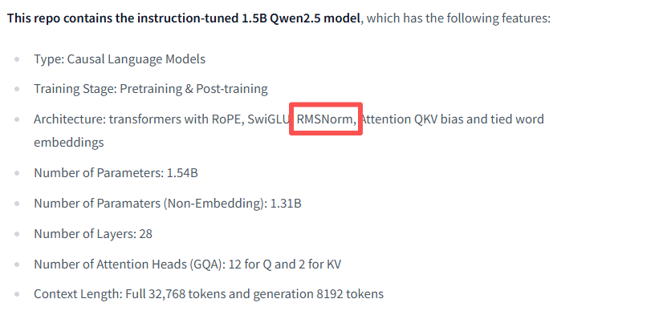

   **(B) 自注意力模块（Qwen2SdpaAttention）**

   ​	关键部分，也是很难理解的部分

   ```py
   (0-27): 28 x Qwen2DecoderLayer(
   (self_attn): Qwen2SdpaAttention(
     (q_proj): Linear(in_features=1536, out_features=1536, bias=True)
     (k_proj): Linear(in_features=1536, out_features=256, bias=True)
     (v_proj): Linear(in_features=1536, out_features=256, bias=True)
     (o_proj): Linear(in_features=1536, out_features=1536, bias=False)
     (rotary_emb): Qwen2RotaryEmbedding()  # 讲完
   )
   ```

   - 计算 Query / Key / Value：

     ```text
     # X_norm （B, T, 1536）
     Q = q_proj(X_norm)  -> shape (B, T, 1536)
     K = k_proj(X_norm)  -> shape (B, T, 256)
     V = v_proj(X_norm)  -> shape (B, T, 256)
     
     (q_proj): Linear(in_features=1536, out_features=1536, bias=True)
     (k_proj): Linear(in_features=1536, out_features=256, bias=True)  # LoRA思想
     (v_proj): Linear(in_features=1536, out_features=256, bias=True)
      
     Q的shape是（1536，1536）  X_norm的shape是(B，T，1536) 它们点乘的结果shape是（B，T，1536）
     K的shape是（1536，256）   X_norm的shape是(B，T，1536) 它们点乘的结果shape是（B，T，256）
     V的shape是（1536，256）   X_norm的shape是(B，T，1536) 它们点乘的结果shape是（B，T，256）
     ```

     注意这里的一个明显设计点：**Q 的维度是完整的 1536**，而 **K、V 降到 256**。
      这是一种工程选择，是为了**降低内存/计算开销**或实现某种低秩/分解 attention（具体实现细节取决框架），其实这里就有LoRA的思想，但总体思想仍然是通过 Q·K^T 得到注意力权重，再加权 V。

    - 应用 Rotary Embedding（RoPE）到 Query/Key：
      RoPE 给每个 token 一个带方向的位置信息，使得注意力能感知顺序（尤其对自回归生成很有效）。

   - 计算注意力分数（简化形式）：

     ```text
     scores = Q · K^T / sqrt(d_k)    # d_k 是 K 的维度 256
     attn = softmax(scores)          # 分头后 (B, 6, T, T)
     out_attn = attn · V             # (B, 6, T, 256)  --> 把6头进行合并，(B, T, 1536)
     ```

     然后 `out_attn` 会通过 `o_proj` 投影回 `d_model`：

     ```text
     attn_out = o_proj(out_attn)     # (B, T, 1536)
     ```

      **(o_proj): Linear(in_features=1536, out_features=1536, bias=False) 里面的输入维度是 1536 不是 256？**

     

     

     ```py
     # 假设 Q_raw: (B, T, 1536), K_raw: (B, T, 256), V_raw: (B, T, 256)
     B, T = x.shape[0], x.shape[1]
     Q = Q_raw.view(B, T, 12, 128).transpose(1, 2)  # (B,12,T,128)
     K = K_raw.view(B, T, 2, 128).transpose(1, 2)   # (B,2,T,128)
     V = V_raw.view(B, T, 2, 128).transpose(1, 2)   # (B,2,T,128)
     
     # group size
     group_size = 12 // 2  # 6
     
     # expand KV 到 12 个头（每个 KV 头重复 group_size 次）
     K_exp = K.repeat_interleave(group_size, dim=1)  # (B,12,T,128)
     V_exp = V.repeat_interleave(group_size, dim=1)  # (B,12,T,128)
     
     # 假设 attn_scores 已经计算并为 (B,12,T,T)
     attn_probs = torch.softmax(attn_scores, dim=-1)  # (B,12,T,T)
     
     # 注意 matmul 语义： (..., T, T) @ (..., T, d) -> (..., T, d)
     context = torch.matmul(attn_probs, V_exp)  # (B,12,T,128)
     
     # 合并 heads: (B,12,T,128) -> (B,T,1536)
     context = context.transpose(1, 2).reshape(B, T, 12 * 128)  # (B,T,1536)
     
     # 输出投影
     attn_out = o_proj(context)  # (B,T,1536)
     ```

     

    - **残差连接**：

     ```text
     X = X + attn_out # 因为 X和attn_out shape是一样的
     ```

   解释：`o_proj` 将注意力输出恢复到原始维度以便与残差相加。`bias=False` 表示不使用偏置，常见于效率/数值稳定性优化。

   也就是attn_out是X经过学习之后的结果，有可能学好，让损失函数下降，也有一定的概率学不好，让损失函数不变或者上升，学不好就直接 丢弃就好，也不会对结果有不好的影响，数值更稳定；

   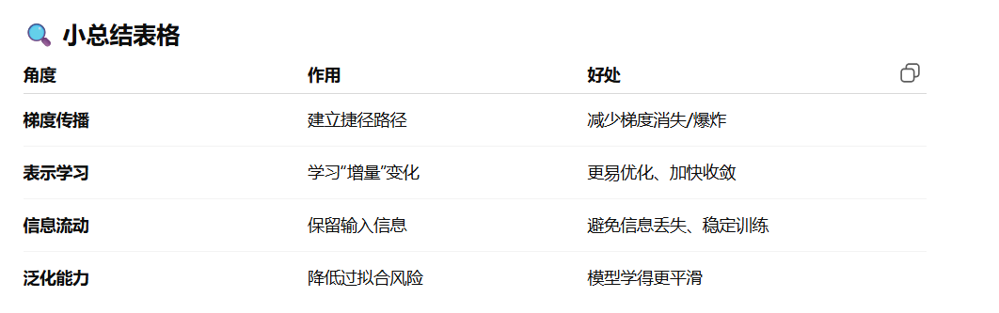

   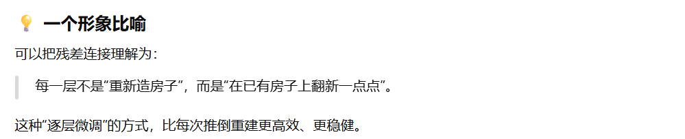

   **(C) 后注意力层归一化（post_attention_layernorm）**

   **跳到讲解归一化的章节**

   ```text
    X_norm2 = post_attention_layernorm(X)
   ```


### 2.8 前馈网络MLP

RNN  LSTM GRU  Tranformer Bert GPT2 （了解）**昨日黄花**

Qwen3  Deepseek R1（国内最强）--> 其他基本都是跟随


你们公司最近用的到开源大模型有哪些？

**模型是用新 不用旧 看清楚是否开源；**

```josn
(mlp): Qwen2MLP(
  (gate_proj): Linear(in_features=1536, out_features=8960, bias=False)  # 把维度扩大，增加表达能力
  (up_proj): Linear(in_features=1536, out_features=8960, bias=False)  # 把维度扩大
  (down_proj): Linear(in_features=8960, out_features=1536, bias=False)  # 还原
  (act_fn): SiLU()
)
```

**(D) MLP（前馈网络）**

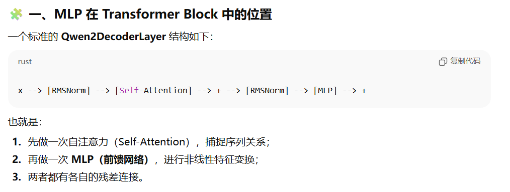

 MLP 使用了**门控架构（gated MLP）**，可视为 GLU/GEGLU 类似结构：

 - 先并行计算两个投影：

   ```text
    gate = gate_proj(X_norm2)  -> (B, T, 8960)
    up   = up_proj(X_norm2)    -> (B, T, 8960)
```

- 激活与门控：

   ```text
   activated = SiLU(gate) * up    # elementwise multiply
```

   （SiLU(gate) 作门控，控制 up 的流量）

 - 下投回原维度：

   ```text
   mlp_out = down_proj(activated)  # (B, T, 1536)
   ```

 - 再次做残差：

   ```text
   X = X + mlp_out
   ```

 MLP 的中间维 `8960` 比 `1536` 大很多（大约 5.84×），这是 Transformer 中常见的“扩展比”，用于提供更多的非线性表达能力。门控（gate_proj）能改善表达能力和训练稳定性。

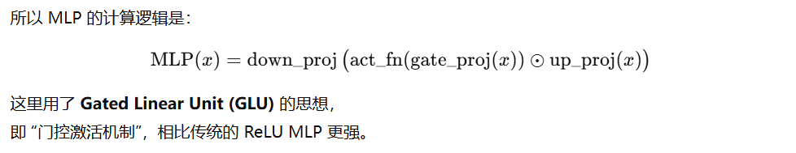

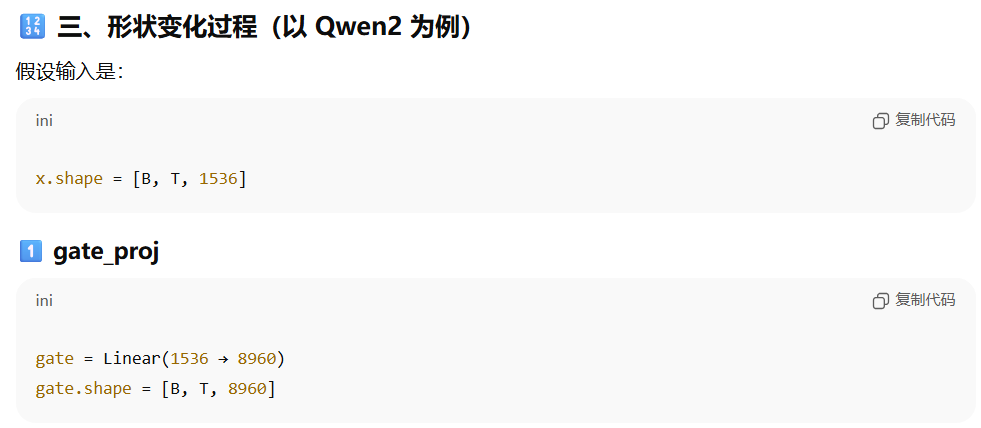

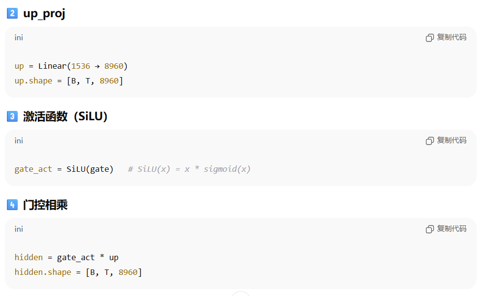

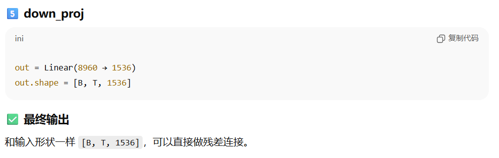

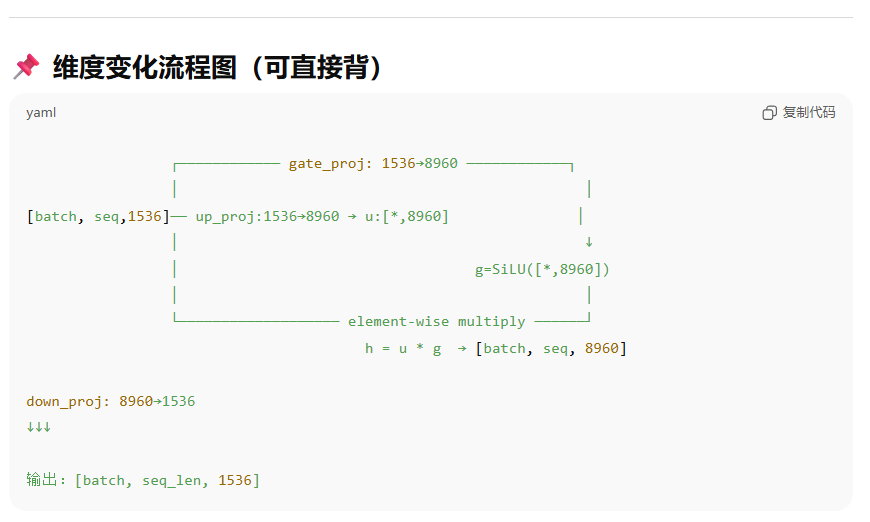

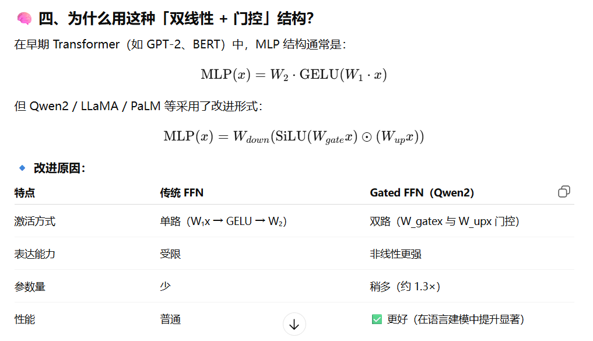


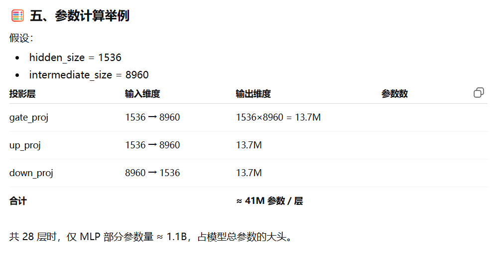

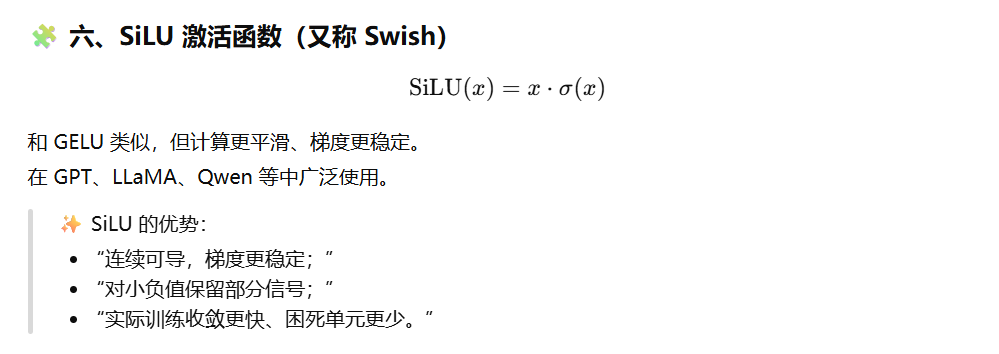

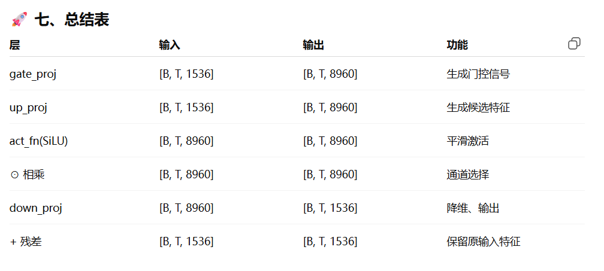


**提问1：这样设计的优势是什么？**

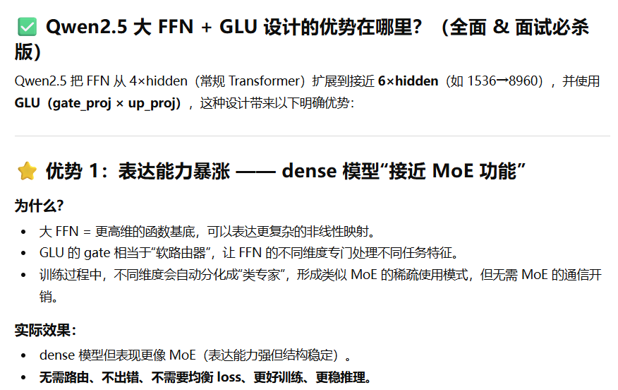

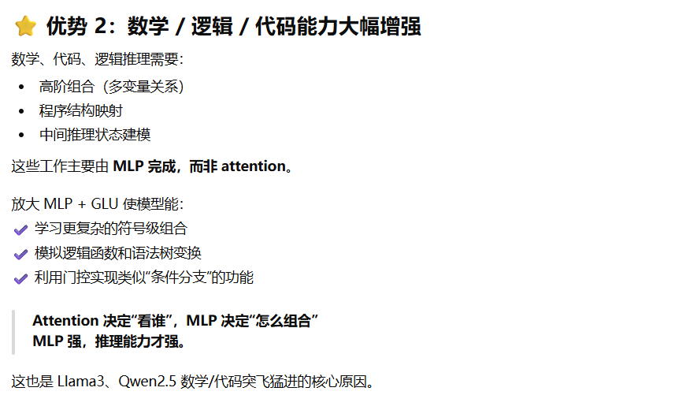

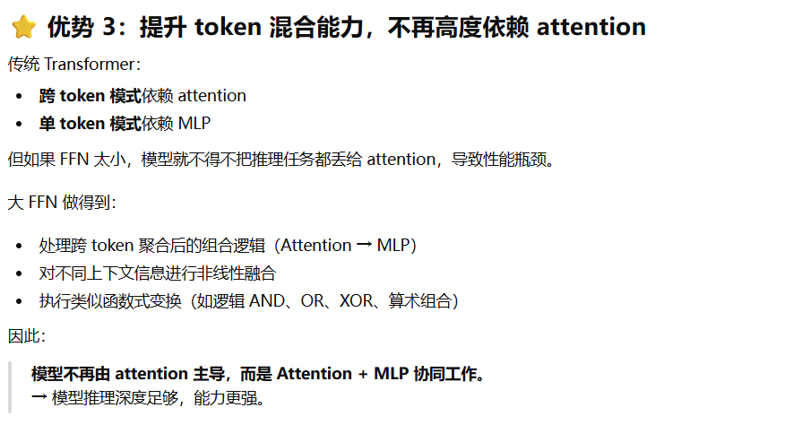

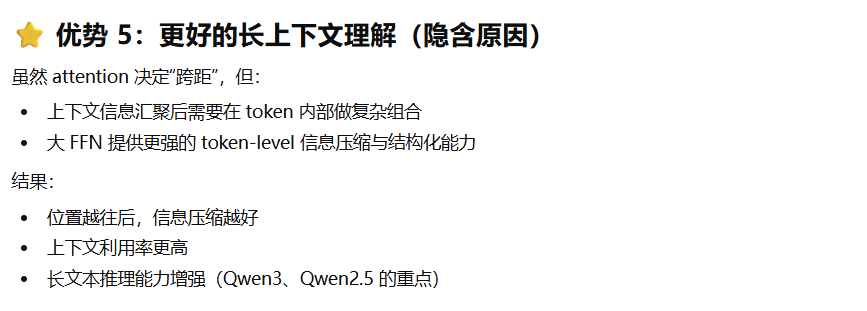

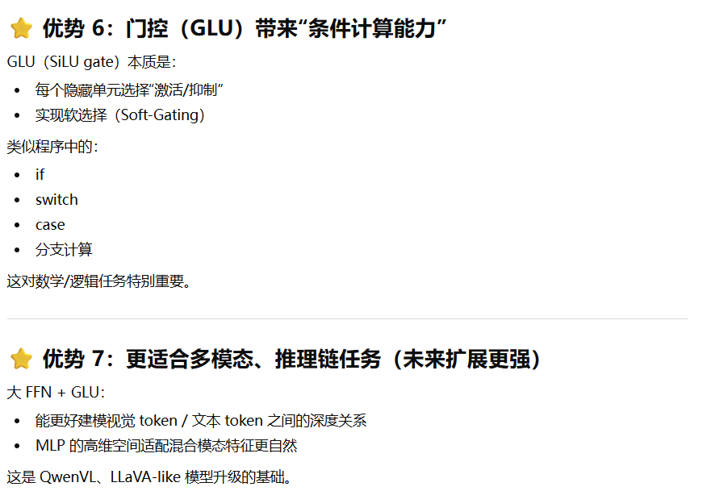

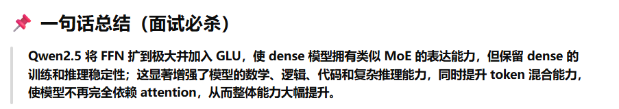

**跳到SiLU激活函数进行讲解**


**不用研究太深；**

**总结：**

```py
print(model)
# 模型整体架构
Qwen2ForCausalLM(
  (model): Qwen2Model(
    (embed_tokens): Embedding(151936, 1536)  # 讲完
    (layers): ModuleList(
      (0-27): 28 x Qwen2DecoderLayer(
        (self_attn): Qwen2SdpaAttention(
          (q_proj): Linear(in_features=1536, out_features=1536, bias=True)
          (k_proj): Linear(in_features=1536, out_features=256, bias=True)
          (v_proj): Linear(in_features=1536, out_features=256, bias=True)
          (o_proj): Linear(in_features=1536, out_features=1536, bias=False)
          (rotary_emb): Qwen2RotaryEmbedding()  # 讲完
        )
        (mlp): Qwen2MLP(
          (gate_proj): Linear(in_features=1536, out_features=8960, bias=False)
          (up_proj): Linear(in_features=1536, out_features=8960, bias=False)
          (down_proj): Linear(in_features=8960, out_features=1536, bias=False)
          (act_fn): SiLU()
        )
        (input_layernorm): Qwen2RMSNorm((1536,), eps=1e-06)
        (post_attention_layernorm): Qwen2RMSNorm((1536,), eps=1e-06)
      )
    )
    (norm): Qwen2RMSNorm((1536,), eps=1e-06)   
    (rotary_emb): Qwen2RotaryEmbedding()  # 讲完
  )
  (lm_head): Linear(in_features=1536, out_features=151936, bias=False)
)
```

### 2.9 语言模型输出类别层

- **语言建模头（lm_head）**

   ```text
   logits = lm_head(H)  # (B, T, vocab_size=151936)
   probs = softmax(logits)  # 每个位置上 vocab 的概率分布
   ```

   `lm_head` 将隐藏向量映射回词表大小得到每个 token 的得分（logits），用于计算交叉熵损失或采样生成下一个 token。

------

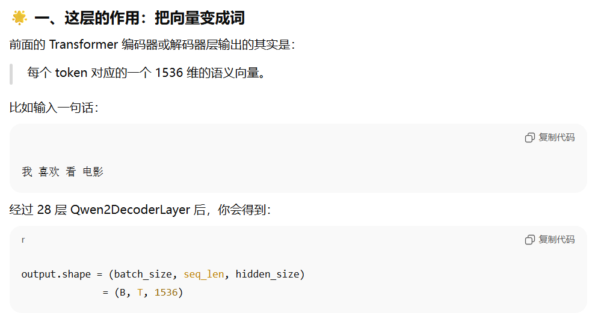

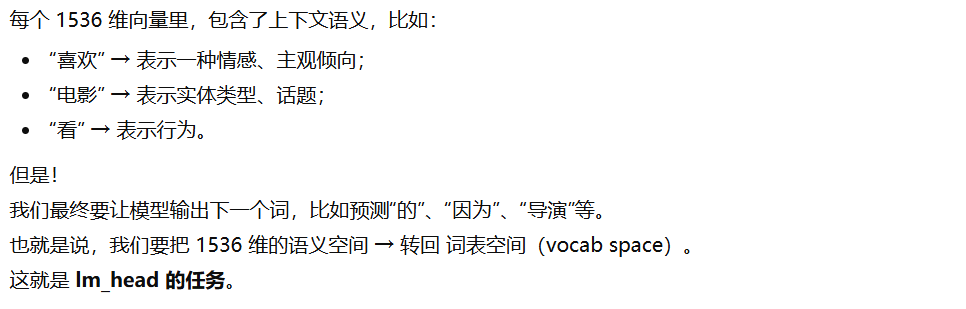

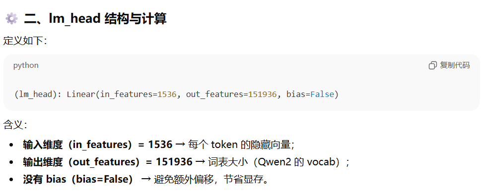

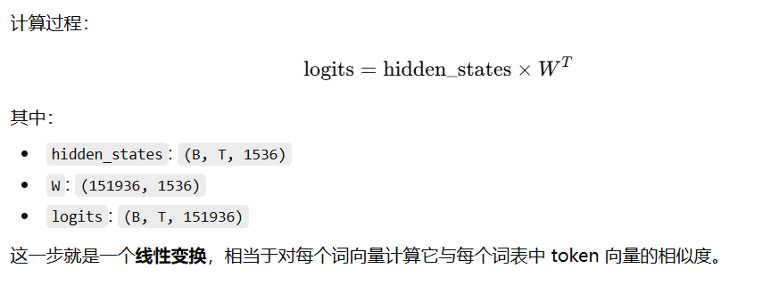

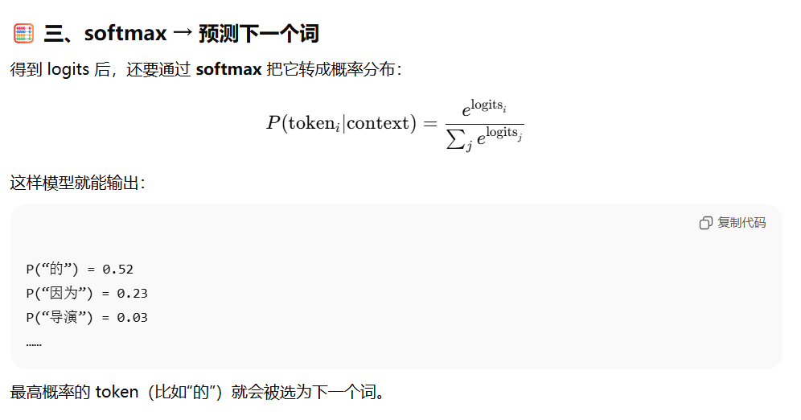

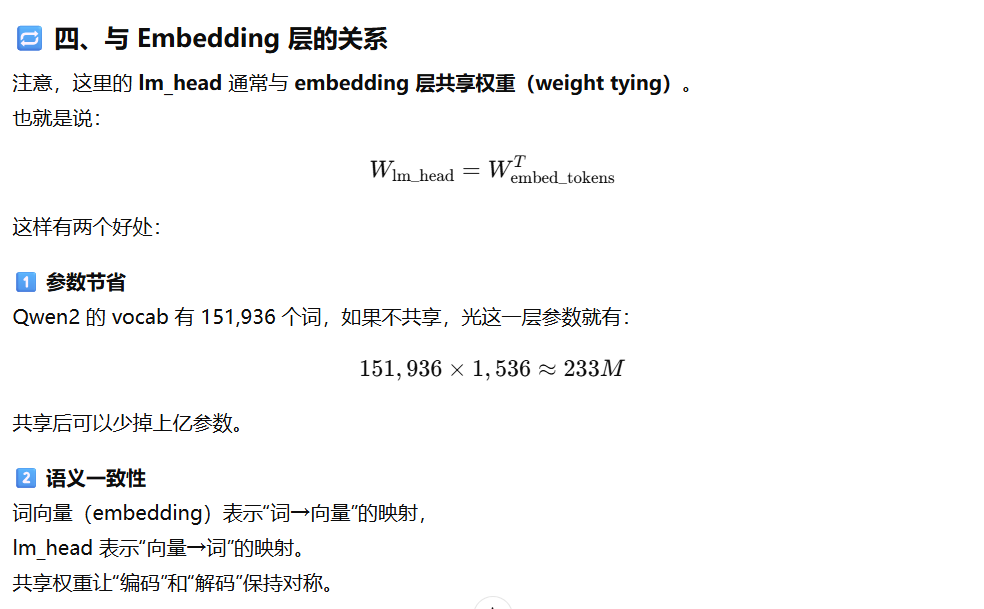

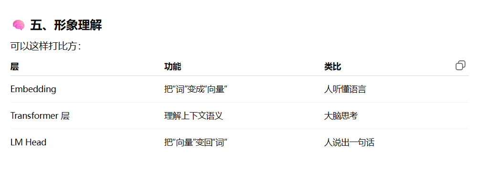

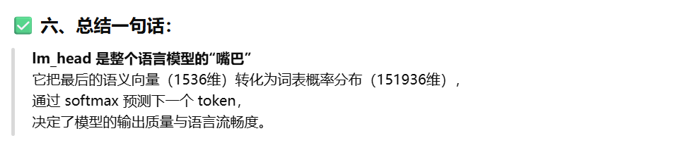

**注意重点：刑法大模型需要对最后一层进行修改，因为我们需要进行罪名预测，是一个分类，不是预测下一个词是什么。**

### 2.10 模型问题总结

设计上的若干要点与直观解释

1. **为什么 `k_proj` / `v_proj` 比 `q_proj` 小？**

- 可能为 **效率优化**：把 K/V 压缩到更小的维度，能显著节省注意力计算和内存（尤其是序列很长时，K^T 的存储/乘法成本很高）；
- 也可能是 **低秩注意力** 的一种实现：实际注意力矩阵通常是低秩的，压缩 K/V 不会大幅损失表现；
- 不同实现会把维度分给多个 head 或采用分组投影。关键点：注意力机制仍然能学习到有效的相似性，因为 Q 保持完整维度或通过投影方式与 K/V 匹配。

（注：具体实现细节需要看 Qwen2 的源码/实现，但从接口可以推断为一种空间/计算权衡。）

2. **RMSNorm 而不是 LayerNorm**

- RMSNorm 计算更简单，不依赖均值（只用二范数），在一些现代 Transformer 变体中能提升稳定性和速度。

3. Rotary Embeddings（RoPE）

- RoPE 能把位置信息编码到 query/key 的角度信息中，对自回归生成优秀，因为位置信息以旋转相对方式编码，对长序列 extrapolate 更好。

4. Gate + Up + Down（Gated MLP）

- 与标准 MLP (W1 → act → W2) 相比，门控 MLP 可以学到更灵活的“路由 / 筛选”机制，通常能提升表达能力与训练稳定性（类似 GEGLU / SwiGLU 的优势）。

5. `lm_head` bias=False

- 常见优化：不使用 bias 或把 `lm_head` 与 `embed_tokens` weight-tie（有时会 tie，有时不 tie）。从你给的结构看没有显式 tie，但词表大小匹配，可能在实现中选择不共享或隐藏权重共享逻辑。

------

模型用途（如何使用）

- **训练**：基于自回归目标（预测下一个 token），通常使用 cross-entropy。
- **推理 / 生成**：给定前缀，按 `probs = softmax(logits)` 进行 greedy/beam/sampling 策略生成文本。
- **微调**：在下游任务（指令微调、对话、特定领域语料）上继续训练。

------

一个非常简化的 forward 伪代码（帮助理解数据流）

```python
def forward(input_ids):            # input_ids: (B, T)
    x = embed_tokens(input_ids)    # (B, T, 1536)

    for layer in layers:
        x_norm = layer.input_layernorm(x)  # 归一化
        Q = layer.self_attn.q_proj(x_norm)    # (B, T, 1536)
        K = layer.self_attn.k_proj(x_norm)    # (B, T, 256)
        V = layer.self_attn.v_proj(x_norm)    # (B, T, 256)
        apply_rotary(Q, K)  # 添加位置信息
        attn_score = softmax(Q @ K.T / sqrt(dk))   # (B, T, T) or split heads  
        attn_out = layer.self_attn.o_proj(attn_score @ V)  # -> (B, T, 1536)
        # attn_score 是 （B，12，T，T）  而 V（B，T，256）
        x = x + attn_out

        x_norm2 = layer.post_attention_layernorm(x)
        gate = layer.mlp.gate_proj(x_norm2)   # (B, T, 8960)
        up   = layer.mlp.up_proj(x_norm2)     # (B, T, 8960)
        mlp_out = layer.mlp.down_proj(SiLU(gate) * up)  # (B, T, 1536)
        x = x + mlp_out

    h = final_norm(x)
    logits = lm_head(h)  # (B, T, vocab)
    return logits
```

------

调试、微调与推理提示（实战建议）

- **显存/速度优化**：注意 K/V 投影较小是节省显存的一种方式；推理时使用 kv-cache 可极大加速自回归生成。
- **量化/半精度**：常用于加速部署（如 fp16、int8）；保证对注意力和 RoPE 的兼容性。
- **学习率与微调**：使用较低学习率的参数组（比如 1e-5 ~ 5e-5），并采用线性 warmup + decay。
- **检查点大小**：vocab 和 lm_head 会显著影响模型 checkpoint 大小（vocab=151,936 很大）。

------

小结（要点回顾）

- `d_model = 1536`，`vocab ≈ 152k`：中等到大型模型规模。
- Attention 采用 Q 与较小 K/V 的设计，可能是低秩/高效attention设计。
- MLP 使用门控结构（gate × SiLU × up），中间维度很大（8960），以提升表达。
- 使用 RMSNorm 与 RoPE，是现代 Transformer 的常见、有效设计。
- 输出通过 `lm_head` 映射回词表，用于自回归语言建模 / 文本生成。


### 2.10 RMSNorm归一化

2019年被LAMMA和T5开始使用，成为了主流大模型的归一化方法。

[rms_normal归一化方法 - 知乎](https://zhuanlan.zhihu.com/p/1901584170184062240)


请问什么要归一化？

这个是理解 **Transformer（尤其是Qwen、LLaMA、ChatGLM等大模型）** 架构的关键之一。
 我们来 **深入讲清楚 RMSNorm 的原理、数学细节、作用机制，并横向对比 LayerNorm、BatchNorm 等其他归一化方法**。

------

🧠 一、归一化（Normalization）的目的

神经网络的训练常常会因为不同层、不同样本之间的特征分布差异太大，导致：

- 梯度爆炸 / 消失；
- 学习率调节困难；
- 模型收敛慢。（核心）

归一化层的目标就是：

> “让输入分布更稳定，从而让训练更快、更稳定”。

------

🧩 二、RMSNorm 的核心思想（Root Mean Square Normalization）

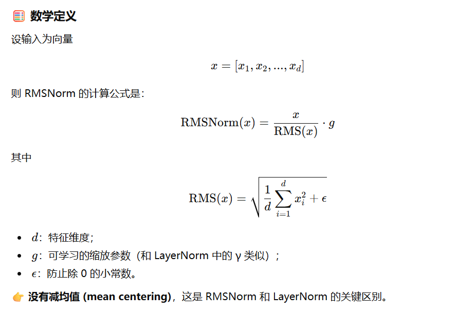

------

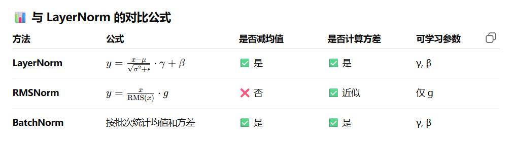

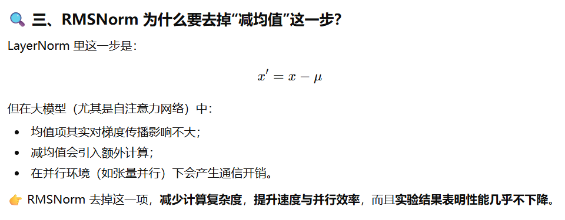

------

⚙️ 四、RMSNorm 的代码实现（PyTorch示例）

```python
import torch
import torch.nn as nn

class RMSNorm(nn.Module):
    def __init__(self, dim, eps=1e-8):
        super().__init__()
        self.eps = eps
        self.scale = nn.Parameter(torch.ones(dim))

    def forward(self, x):
        # x: (batch, seq_len, dim)
        norm_x = x * torch.rsqrt(torch.mean(x ** 2, dim=-1, keepdim=True) + self.eps)
        return norm_x * self.scale
```

示例输入输出形状：

```
x.shape = [B, T, D]
torch.mean(x ** 2, dim=-1, keepdim=True) → [B, T, 1]
输出: [B, T, D]
```

------

🔬 五、与其他归一化方法的横向对比

**技术换代非常快，以前的技术不用专研太深；**

| 特征         | **RMSNorm**                 | **LayerNorm** | **BatchNorm** | **InstanceNorm** | **GroupNorm** |
| ------------ | --------------------------- | ------------- | ------------- | ---------------- | ------------- |
| 是否依赖批次 | ❌ 否                        | ❌ 否          | ✅ 是          | ❌ 否             | ❌ 否          |
| 是否减均值   | ❌ 否                        | ✅ 是          | ✅ 是          | ✅ 是             | ✅ 是          |
| 是否计算方差 | ✅ 近似                      | ✅ 是          | ✅ 是          | ✅ 是             | ✅ 是          |
| 可学习参数   | 仅 scale                    | scale + bias  | scale + bias  | scale + bias     | scale + bias  |
| 计算复杂度   | 🚀 最低                      | 中等          | 高            | 中               | 中            |
| 并行友好性   | ✅ 最强                      | ✅ 较好        | ❌ 依赖batch   | ✅                | ✅             |
| 适用场景     | Transformer, LLM            | NLP, Vision   | CNN, ResNet   | Style Transfer   | Vision        |
| 代表模型     | GPT-3、LLaMA、Qwen、ChatGLM | BERT、T5、ViT | ResNet        | AdaIN            | EfficientNet  |

------

💡 六、为什么大模型更喜欢 RMSNorm？

大模型对速度要求非常高；越简单公式 往往越好

主要有三点原因：

1. **更高的并行效率**
   - 没有减均值操作，减少通信；
   - 对分布不敏感，适合张量并行训练。
2. **数值更稳定**
   - RMS（均方根）不会受偏移（mean shift）影响，也就是均值影响；
   - 对输入均值漂移更鲁棒。
3. **更轻量化**
   - 少一个偏置参数 β；
   - 计算代价更低（在数百亿参数模型中差异明显）。

> 💬 例如：
>  LLaMA、Qwen、ChatGLM、Mistral、Gemma 都使用 RMSNorm 替代 LayerNorm。
>  BERT / GPT-2 仍使用 LayerNorm。

------

🧠 七、直观理解图（可视化解释）

```
          ┌─────────────────────┐
Input x → │ RMSNorm(x)          │
          │  = x / sqrt(mean(x²))│
          │  × scale             │
          └─────────────────────┘
                 │
                 ▼
          输出：方向相同、模长归一化后的向量
```

- LayerNorm：同时调节“方向”和“中心”（减均值 + 缩放）
- RMSNorm：只调节“模长”（缩放），不动中心

------

✅ 八、总结一句话记忆

| 方法          | 一句话总结                                                   |
| ------------- | ------------------------------------------------------------ |
| **BatchNorm** | “按批标准化，适合CNN”                                        |
| **LayerNorm** | “按特征标准化，适合RNN/NLP”                                  |
| **RMSNorm**   | “更轻更稳的LayerNorm替代品，大模型标配”（2025年标配，以后不一定） |

------

```
───────────────────────────────────────────────
输入向量 x = [x₁, x₂, x₃, ..., x_d]
───────────────────────────────────────────────

【LayerNorm 归一化过程】
1️⃣ 计算均值 μ：
     μ = (x₁ + x₂ + ... + x_d) / d

2️⃣ 计算方差 σ²：
     σ² = (1/d) * Σ (xᵢ - μ)²

3️⃣ 归一化：
     x̂ᵢ = (xᵢ - μ) / √(σ² + ε)

4️⃣ 缩放与偏移：
     yᵢ = γ * x̂ᵢ + β

----------------------------------------------
特点：
✅ 消除均值影响（中心化）
✅ 输出分布均值≈0，方差≈1
⚠️ 计算略慢，需要两次 pass
───────────────────────────────────────────────


【RMSNorm 归一化过程】
1️⃣ 直接计算均方根：
     RMS = √( (1/d) * Σ xᵢ² + ε )

2️⃣ 归一化：
     x̂ᵢ = xᵢ / RMS

3️⃣ 缩放：
     yᵢ = γ * x̂ᵢ

----------------------------------------------
特点：
✅ 不减均值（保留原始中心）
✅ 只保证整体能量一致
✅ 计算更快、更稳定
───────────────────────────────────────────────

```


**越简单越高效；**

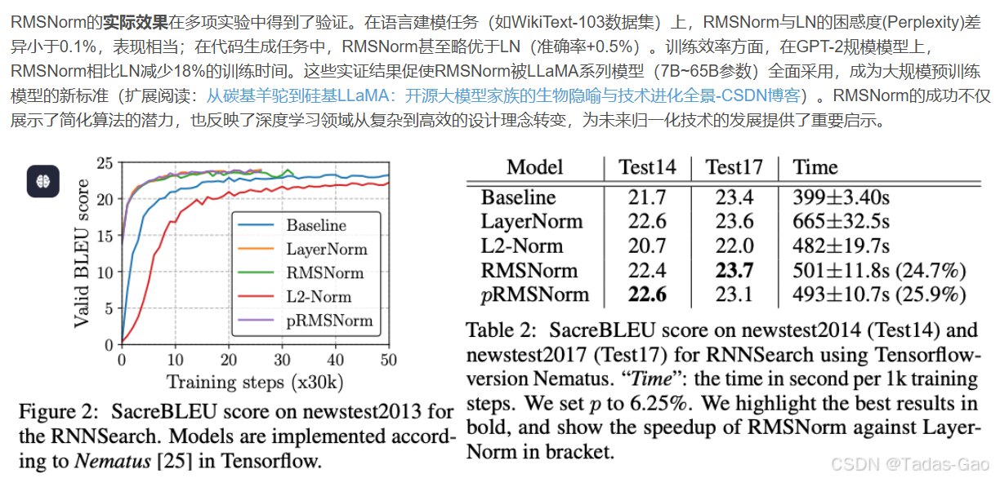

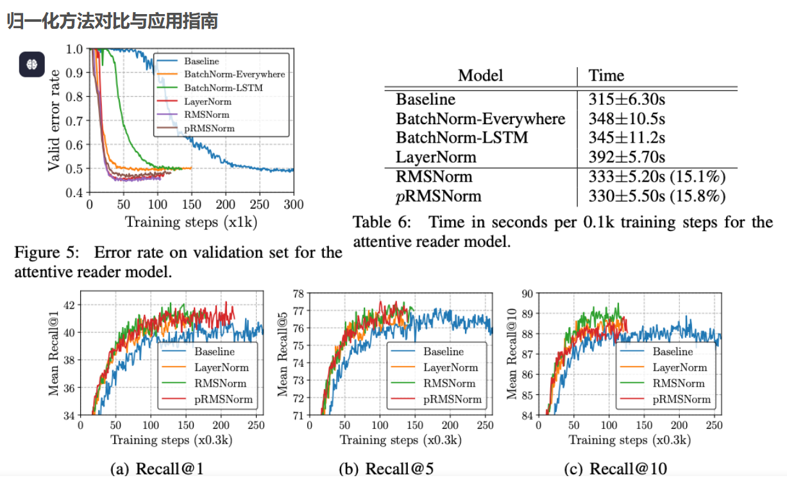

**提问1：为什么适合张量并行？（大模型）**

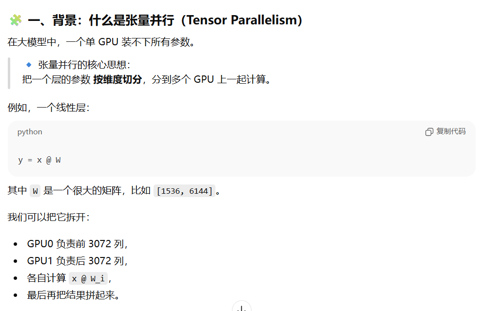

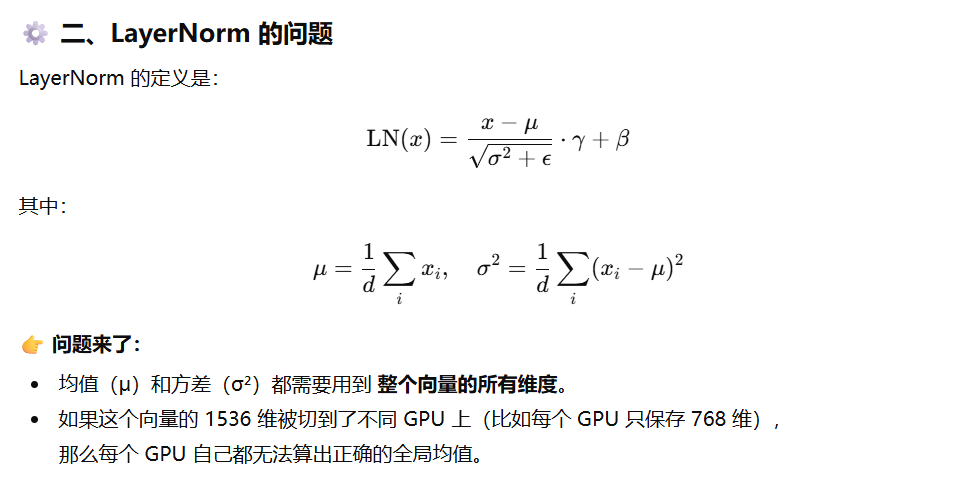

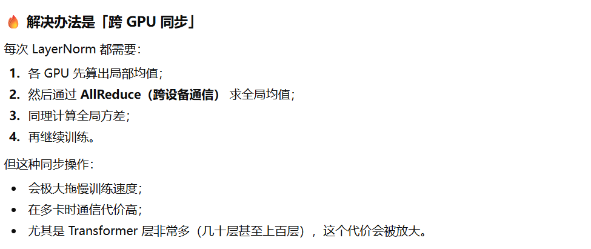

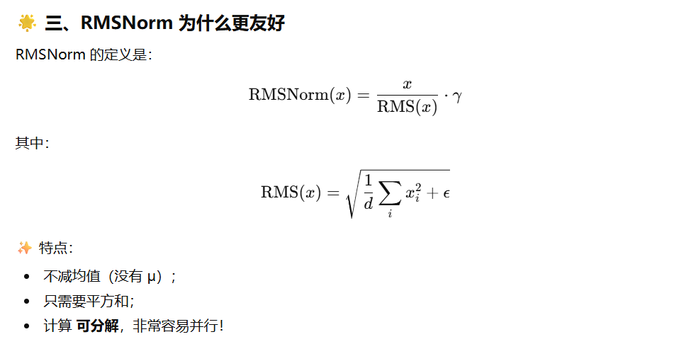

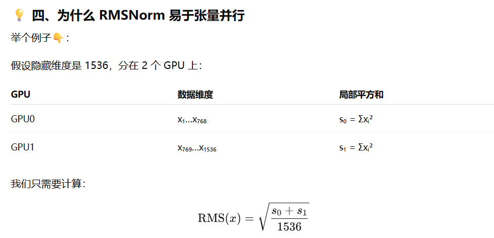

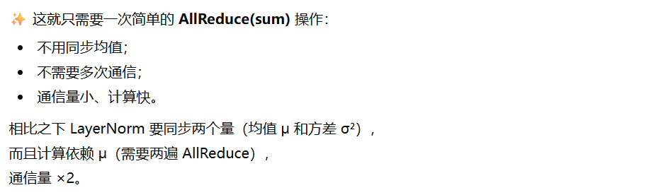

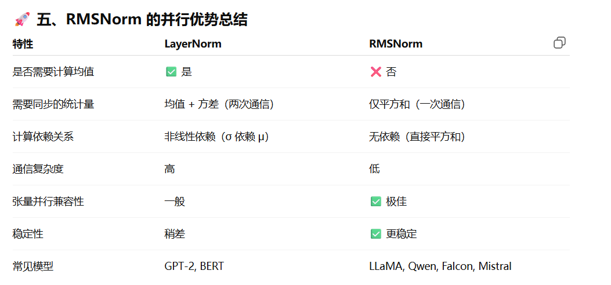

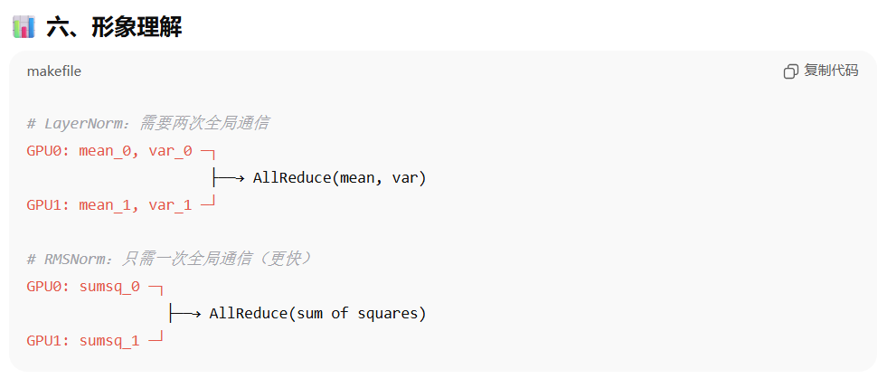

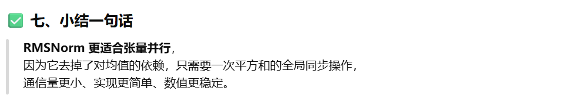

### 2.11 位置编码

[旋转位置编码（RoPE）、图像二维旋转位置编码 -CSDN博客](https://blog.csdn.net/qq_52511048/article/details/148852676)

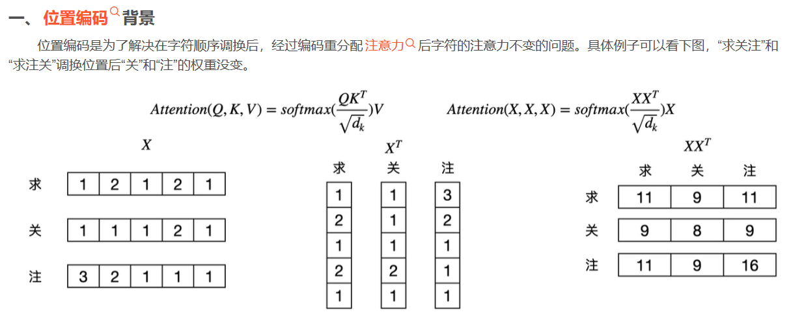

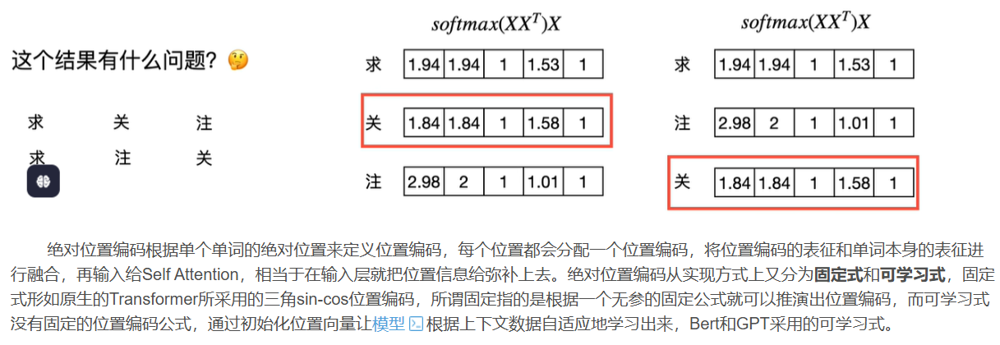

您问到了一个非常核心且精彩的Transformer机制问题！这句话确实有点绕，但让我用一个生动的比喻和具体例子来帮您彻底理解。

**核心问题：自注意力机制的“词袋”缺陷**

想象一下，我们有一个聪明的学生，但他有“脸盲症”，并且只能通过“听名字”来认识人。

我们给他两个句子让他理解：
1. **“猫追老鼠”**
2. **“老鼠追猫”**

对于这个学生来说：
- 他听到“猫”：哦，我知道，是一种动物。
- 他听到“老鼠”：哦，我也知道，是另一种动物。
- 他听到“追”：是一个动作。

**问题来了**：由于自注意力机制会让每个词都和其他所有词交互，在经过层层计算后，这个学生对“猫”和“老鼠”的最终理解，在两个句子中可能会变得非常相似，因为他只关注了“谁”和“什么动作”，但忽略了“谁对谁”做的这个关键的顺序信息。

**这就是自注意力机制的本质缺陷**：它本质上是**置换不变性（Permutation Invariance）**的。如果把输入序列的顺序完全打乱，只要词是一样的，经过多层自注意力计算后，每个词的最终表示会非常相似，因为它丢失了原始的顺序信息。

---

位置编码如何解决这个问题？

位置编码就像给每个词发一个**带有时间和座位号的演唱会门票**。

**没有位置编码时：**
- “猫” = 猫的概念
- “老鼠” = 老鼠的概念  
- “追” = 追的动作

**有了位置编码后：**
- “猫” + “位置1” = 在第一个位置的猫
- “追” + “位置2” = 在第二个位置的追
- “老鼠” + “位置3” = 在第三个位置的老鼠

现在，当我们把“猫追老鼠”变成“老鼠追猫”时：

**句子1：“猫追老鼠”**
- 位置1：猫
- 位置2：追  
- 位置3：老鼠

**句子2：“老鼠追猫”**
- 位置1：老鼠
- 位置2：追
- 位置3：猫

即使“猫”和“老鼠”这两个词本身没变，但它们的位置编码完全不同了！模型现在能清楚地知道：
- 在第一个句子中，是“位置1的猫”对“位置3的老鼠”执行“位置2的追”
- 在第二个句子中，是“位置1的老鼠”对“位置3的猫”执行“位置2的追”

---

技术层面的理解

位置编码通过两种主流方式实现：

#### **1. 正弦余弦位置编码**

也叫做**绝对位置编码**；最原始Transformer使用的就是这种

```python
# 类似这样，每个位置有独特的波形签名
PE(pos, 2i) = sin(pos / 10000^(2i/d_model))
PE(pos, 2i+1) = cos(pos / 10000^(2i+1/d_model))
```

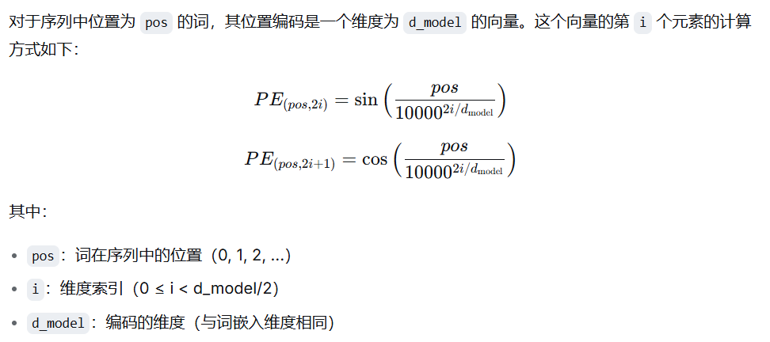

PE = position encoder的意思；这个案例里面 d_model = 1536

每一个位置都有一个d_model长度的位置向量与之对应，每个数值的意思是。

PE的维度 也应该是 (B, T, 1536)

```
z = embeddings + positional_encoding
     1536维度   +       1536（偶数）
```

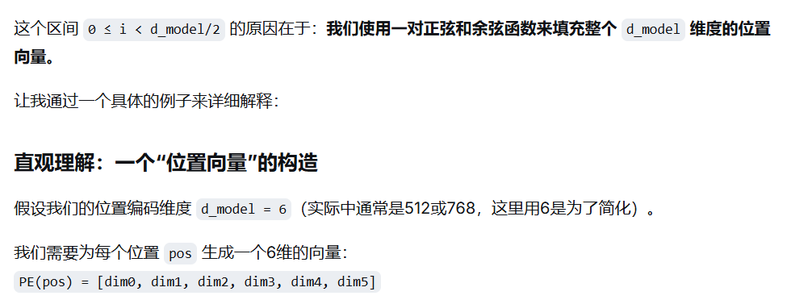


**提问1：什么是高频和低频，有什么意义吗？**

------

**🧠 一、先说「频率」是什么意思**

在位置编码里，位置 ( pos ) 是一个整数（第几个 token），
 而我们要把它映射成一个向量


------

> 

------


------

**🧩 四、一个形象的比喻**

想象你要描述你的位置。
 你可以用两种“频率”来表达：

| 频率 | 对应例子                            | 作用     |
| ---- | ----------------------------------- | -------- |
| 低频 | “我在北京”                          | 全局位置 |
| 高频 | “在北京市海淀区中关村某栋楼的第3层” | 局部细节 |

模型同时拥有这两种频率的信号，
 就能同时理解「大概位置」和「精确顺序」。

------

**🧮 五、数学直觉总结**

- 高频成分：周期短 → 对小位置差变化敏感；
- 低频成分：周期长 → 对大范围位置变化有稳定响应；
- 不同维度编码不同频率 → 相当于在 embedding 空间中形成「多尺度位置表示」。

这样：

> 模型只需通过线性组合这些不同频率，就能表示任意复杂的位置关系。

------

**🔬 六、RoPE 中的高低频思想（后续再讲）**

即便是现代的旋转位置编码（RoPE），
 它也继承了这一思想：
 RoPE 本质上就是在 embedding 空间的不同维度上，以不同角速度旋转。

角速度越大 → 高频（对近邻敏感）
 角速度越小 → 低频（对远距稳定）

所以：

```python
theta = 10000 ** (-2 * i / d)
```

这个 θ 控制的，就是每个维度的频率层级。

------

**✅ 总结一句话**

> Transformer 的位置编码用「高频 + 低频」信号，是为了让模型既能捕捉局部顺序，也能理解全局位置。不同频率对应不同尺度的顺序感，从而让注意力机制自然感知相对位置差。


提问：为啥要使用10000，而不是其他的数值？

提问2 位置编码为什么要同时使用 sin 和 cos？


#### 2 可学习的位置编码（不常用）

了解即可，比较耗费资源，不推荐使用

- 直接让模型学习每个位置的最佳表示；参数学习的

**关键效果**：位置编码确保即使两个句子包含完全相同的词，但由于词的位置不同，它们最终的向量表示也会完全不同，从而保留了至关重要的顺序信息。

**优点：**

1. **灵活性**：模型可以学习到最适合特定任务的位置表示，可能比固定的正弦余弦模式更优。
2. **简单性**：实现非常简单，只是一个嵌入层。

**缺点：**

1. **长度限制**：模型无法处理超过 Lmax*L*max 的序列。这是硬性限制。
2. **泛化性差**：对于训练数据中不常见的长距离依赖或相对位置模式，学习效果可能不佳。
3. **需要学习**：增加了模型的参数数量。

---

总结

所以您那句话可以这样理解：

> “位置编码是为了解决在字符顺序调换后，经过编码重分配注意力后字符的注意力不变的问题”

**翻译**：自注意力机制本身是“顺序盲”的，打乱词序后它可能给出相似的结果。位置编码通过给每个位置一个独特的“地址”，确保模型能区分“猫追老鼠”和“老鼠追猫”这种顺序敏感的情况。

这是一个极其巧妙的设计，让Transformer既能享受全局注意力的优势，又不会丢失序列数据中最关键的顺序信息！

#### 3 旋转位置编码

[旋转位置编码（RoPE）、图像二维旋转位置编码 -CSDN博客](https://blog.csdn.net/qq_52511048/article/details/148852676)


上面是代码的实现，这里不演示了；为了加快的计算，因为结果是一样。


#### 4 旋转位置编码和绝对位置编码


提问1：绝对位置编码不能得到相对位置信息吗? 那cos（a-b）不也是得到了吗？


**提问2：什么叫做长文本外推能力？**


**


### 2.12 SiLU激活函数

也叫做Swish激活函数，它是现代 Transformer（如 Qwen2、LLaMA、PaLM）中几乎标配的激活函数。


## 3 加载LoRA配置

```py
# LoRA配置
lora_config = LoraConfig(
    r=512,  # LoRA矩阵的秩
    lora_alpha=1024,  # LoRA缩放因子
    target_modules=["q_proj", "v_proj"],  # 要应用LoRA的模块
    lora_dropout=0.1,  # Dropout概率
    bias="none",  # 是否训练偏置
    task_type="CAUSAL_LM",  # 任务类型：因果语言模型
)
```

```
这段代码的主要目的是配置一个LoRA（Low-Rank Adaptation）模型，用于因果语言模型（Causal Language Model, CAUSAL_LM）的训练。以下是详细解析：  
总览
lora_config 是一个 LoraConfig 对象，用于定义LoRA模型的参数。LoRA是一种高效的微调方法，通过在预训练模型中添加低秩矩阵来实现参数的微调，从而减少训练所需的参数量和计算资源。  
详细逻辑
1 LoRA矩阵的秩 (r)  
r=512 表示LoRA矩阵的秩为512。秩越小，模型的参数量越少，但可能会影响模型的性能。秩越大，模型的参数量越多，但可以更好地捕捉模型的细微变化。
2 LoRA缩放因子 (lora_alpha)  
lora_alpha=1024 是LoRA的缩放因子。缩放因子用于调整LoRA矩阵对模型的影响。较大的缩放因子可以使LoRA矩阵对模型的影响更显著，有助于在微调过程中更快地调整模型。

3 目标模块 (target_modules)  
target_modules=["q_proj", "v_proj"] 指定了要应用LoRA的模块。在这个例子中，q_proj 和 v_proj 是目标模块，通常对应于模型中的查询（Query）和值（Value）投影层。这些模块是模型中关键的注意力机制部分，通过在这些模块上应用LoRA，可以更有效地微调模型。
4 Dropout概率 (lora_dropout)  
lora_dropout=0.1 表示在LoRA模块中应用的Dropout概率为0.1。Dropout是一种正则化技术，通过随机丢弃一部分神经元来防止过拟合。在这个上下文中，Dropout可以增加模型的鲁棒性。
5 偏置训练 (bias)  
bias="none" 表示不训练LoRA模块中的偏置项。LoRA的主要目的是通过低秩矩阵来微调模型，而不是通过训练偏置项来调整模型。设置为 "none" 可以减少训练的参数量，提高训练效率。

6 任务类型 (task_type)  
task_type="CAUSAL_LM" 指定了任务类型为因果语言模型。因果语言模型是一种生成模型，通常用于文本生成任务，如语言建模。LoRA配置中的任务类型决定了如何应用LoRA模块，以适应特定的任务需求。
7 总结
这段代码通过 LoraConfig 对象配置了一个LoRA模型，用于因果语言模型的微调。配置参数包括LoRA矩阵的秩、缩放因子、目标模块、Dropout概率、偏置训练和任务类型。这些参数的选择和设置对于模型的微调效果和训练效率至关重要。通过在关键的注意力机制模块上应用LoRA，可以有效地减少训练所需的参数量，同时保持模型的性能。
```

