# 刑法大模型3


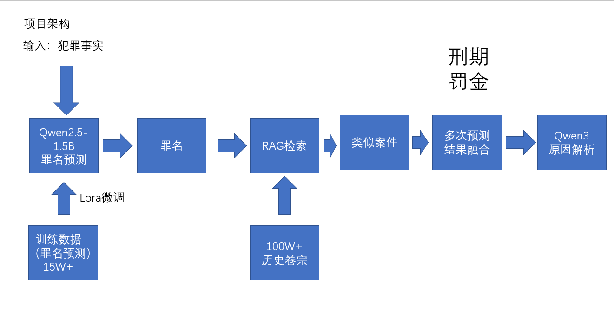


## 1 结构化输出

**json_output.py**

```py
# json_output.py
from langchain_core.output_parsers import JsonOutputParser
from pydantic import BaseModel, Field

# ------------------------
# 定义模型（结构化输出的目标格式）
# ------------------------

class Crime(BaseModel):
    罪名: list[str] = Field(
        description="案件中识别出的罪名列表，例如 ['故意伤害']。"
    )
    罚金: int = Field(
        description="判决中的罚金金额（单位：人民币，未判处罚金则为 0）。"
    )
    犯罪嫌疑人: list[str] = Field(
        description="涉及案件的犯罪嫌疑人姓名，例如 ['段某']。"
    )
    是否死刑: bool = Field(
        description="若判处死刑则为 True，否则为 False。"
    )
    有期徒刑: int = Field(
        description="判处的有期徒刑时长（单位：月）。若未判有期徒刑通常为 0。"
    )
    是否无期: bool = Field(
        description="若判处无期徒刑则为 True，否则为 False。"
    )

# ------------------------
# LangChain JsonOutputParser
# ------------------------


parser = JsonOutputParser(pydantic_object=Crime)
print(parser.get_format_instructions())
```

**输出结果：**

~~~josn
The output should be formatted as a JSON instance that conforms to the JSON schema below.

As an example, for the schema {"properties": {"foo": {"title": "Foo", "description": "a list of strings", "type": "array", "items": {"type": "string"}}}, "required": ["foo"]}
the object {"foo": ["bar", "baz"]} is a well-formatted instance of the schema. The object {"properties": {"foo": ["bar", "baz"]}} is not well-formatted.

Here is the output schema:对输出的数据进行说明
```
{
    "properties": {
        "罪名": {
            "description": "案件中识别出的罪名列表，例如 ['故意伤害']。",
            "items": {
                "type": "string"
            },
            "title": "罪名",
            "type": "array"
        },
        "罚金": {
            "description": "判决中的罚金金额（单位：人民币，未判处罚金则为 0）。",
            "title": "罚金",
            "type": "integer"
        },
        "犯罪嫌疑人": {
            "description": "涉及案件的犯罪嫌疑人姓名，例如 ['段某']。",
            "items": {
                "type": "string"
            },
            "title": "犯罪嫌疑人",
            "type": "array"
        },
        "是否死刑": {
            "description": "若判处死刑则为 True，否则为 False。",
            "title": "是否死刑",
            "type": "boolean"
        },
        "有期徒刑": {
            "description": "判处的有期徒刑时长（单位：月）。若未判有期徒刑通常为 0。",
            "title": "有期徒刑",
            "type": "integer"
        },
        "是否无期": {
            "description": "若判处无期徒刑则为 True，否则为 False。",
            "title": "是否无期",
            "type": "boolean"
        }
    },
    "required": [
        "罪名",
        "罚金",
        "犯罪嫌疑人",
        "是否死刑",
        "有期徒刑",
        "是否无期"
    ]
}
```
~~~

**代码解析：**

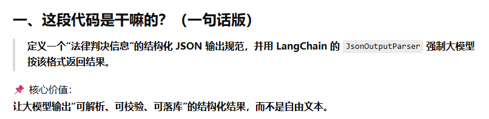

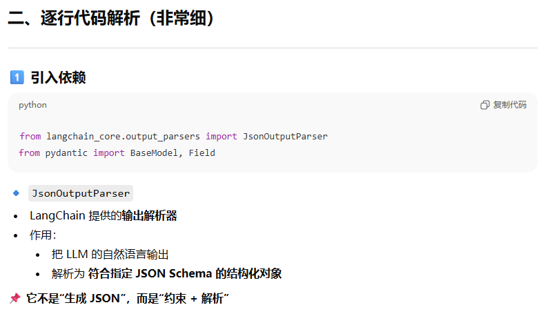

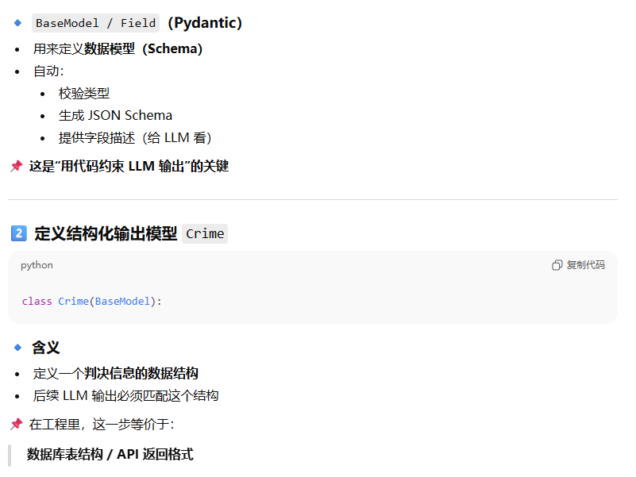

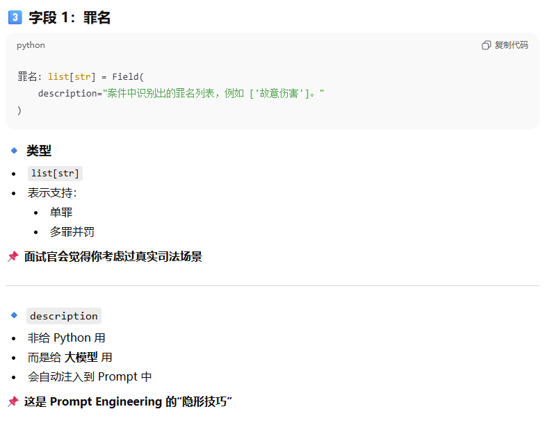

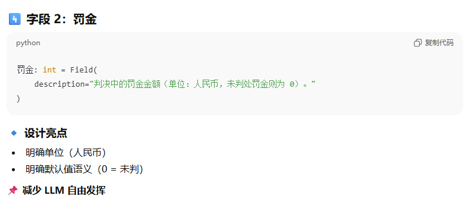

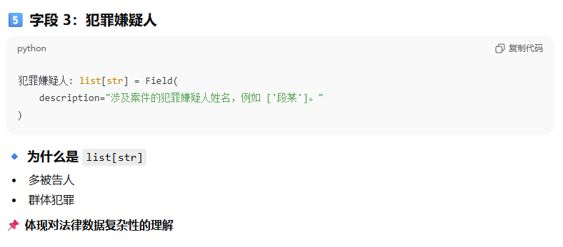

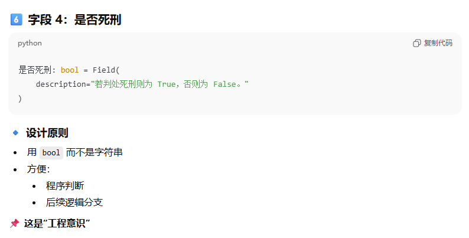

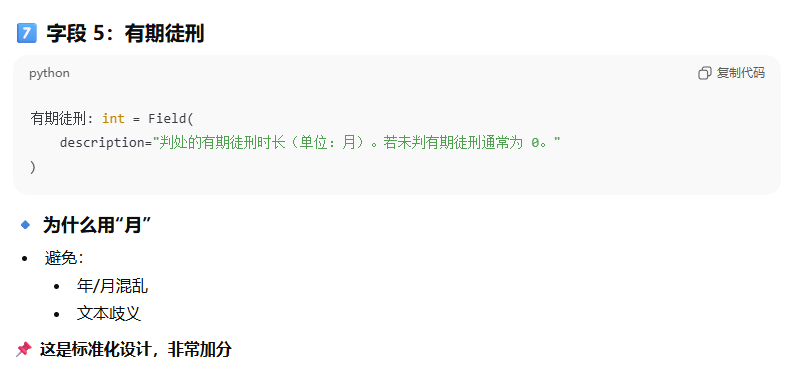

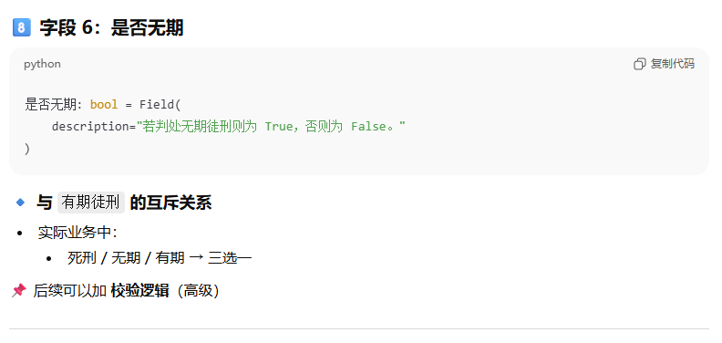

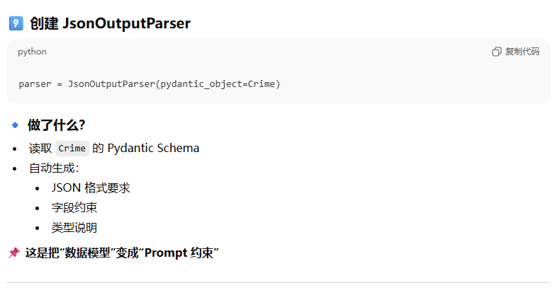

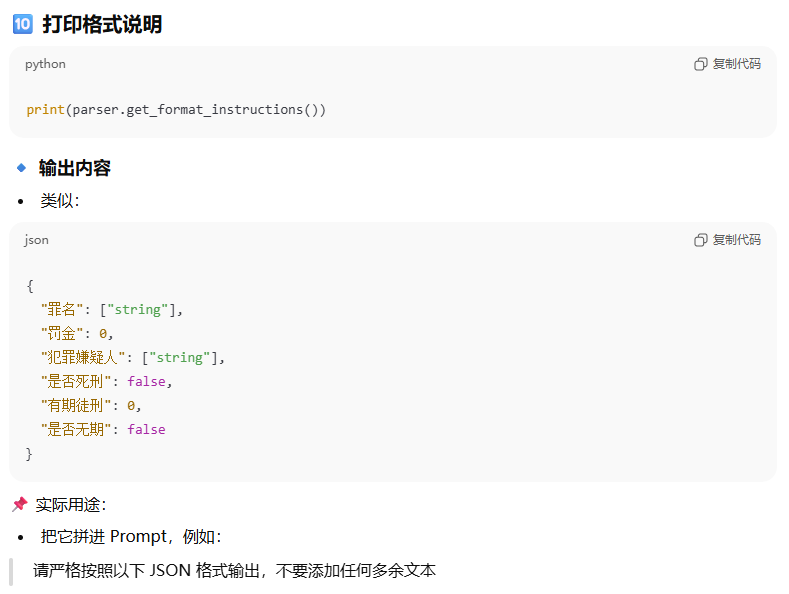

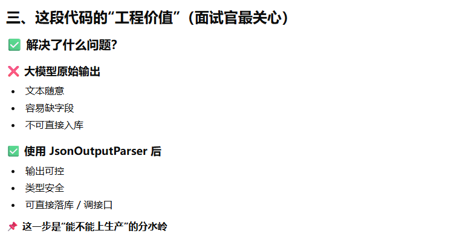

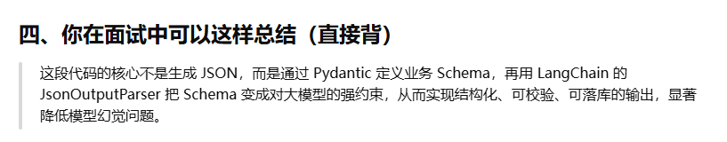


## 2 案件描述预测罪名、刑期

[大模型服务平台百炼控制台](https://bailian.console.aliyun.com/cn-beijing/?spm=a2c4g.11186623.0.0.32dc6323iFCpDR&tab=model#/api-key)

提前缴费

```py
# predict_refined.py
import os
import json
import pickle
import logging
from typing import Dict, Any, List
import dashscope
from pandas.core.interchange.from_dataframe import primitive_column_to_ndarray
from tqdm import tqdm
import faiss_compat
# 你的模块（确保这些模块路径正确）
from json_output import parser  # 假定 parser 是 StructuredOutputParser/JsonOutputParser 等
from predict_accusation import predict_accusation
from Embedding import CustomEmbeddings

# LangChain OutputFixingParser（部分版本可能在 langchain_core）
# 详细解释可以参考 问题1
try:
    # 在 jsonoutputparse 解析不了的时候进行解析结果
    from langchain.output_parsers import OutputFixingParser
except Exception:
    try:
        from langchain_core.output_parsers import OutputFixingParser
    except Exception:
        OutputFixingParser = None

# --------------- 日志 ---------------
logging.basicConfig(level=logging.INFO, format="%(asctime)s %(levelname)s %(message)s")
logger = logging.getLogger(__name__)

# 配置模型名称（可用环境变量覆盖）  设置缓解变量
os.environ.setdefault("LLM_MODEL", "qwen2.5-32b-instruct")
os.environ.setdefault("THINK_MODEL", "qwen3-30b-a3b")
# --------------- Dashscope 调用封装 ---------------
# 阿里云API
DASHSCOPE_API_KEY = os.getenv("DASHSCOPE_API_KEY")
print(DASHSCOPE_API_KEY)

class Criminal_Law_LLM(object):

     def __init__(self, ):
         self.db = self.load_db()
         self.embeddings = CustomEmbeddings()
         self.fix_parser = self.load_fix_parser()


     def load_db(self):
         # 加载向量数据库
         law_DB = r"..\law_db.pkl"
         if not os.path.exists(law_DB):
             logger.error("找不到 law_db 文件: %s", law_DB)

         try:
             with open(law_DB, "rb") as f:
                 # 加载向量数据库 94w数据
                 db = pickle.load(f)

             logger.info("向量数据库加载成功")
             return db
         except Exception as e:
             logger.exception("加载向量数据库失败：%s", e)


     def load_fix_parser(self):

         # 初始化 fix_parser（如果可用）  fixing 修理的意思  修复 进一步改变
         # 使用大模型去解析output  解析兜底工具
         # ctrl 上去，或参考问题1 解释为什么需要OutputFixingParser
         if OutputFixingParser is not None:
             try:

                 llm_wrapper = SimpleLLMWrapper(model_name=os.getenv("LLM_MODEL", "qwen2.5-32b-instruct"))
                 # 输出结果解析器  当内层 parser.parse() 失败时会用 llm_wrapper 来尝试“修正文档”为合法 JSON。
                 # 自动触发 llm_wrapper.__call__, 返回结果
                 # parser是jsonoutputparse的对象
                 fix_parser = OutputFixingParser.from_llm(parser=parser, llm=llm_wrapper)
                 logger.info("fix_parser 初始化成功（OutputFixingParser）。")
             except Exception as e:
                 logger.warning("OutputFixingParser 初始化失败，后续将直接使用 parser.parse: %s", e)
                 fix_parser = None
         else:
             logger.warning("环境中未找到 OutputFixingParser，后续将直接使用 parser.parse。")
             fix_parser = None
         return fix_parser

     def predict(self, text: str, num: int = 3):

         # 1) 罪名预测
         label, prob = predict_accusation(text)
         print("预测罪名：", label)

         # 2) 检索（若失败返回空列表）
         try:
             embeddings = CustomEmbeddings()
             query_vec = embeddings.embed_query(text)
             # 这里使用 similarity_search_by_vector 来接收向量并传入 filter
             # results = db.similarity_search_by_vector(query_vec, k=k, filter=filter_metadata)
             similar_docs = self.db.similarity_search_by_vector(query_vec, k=5, filter={"category": label})

             # 相似度检索
             # similar_docs = db.similarity_search(text, k=10, filter={"category": predict_label})[0:3]
             print("召回数量：", len(similar_docs))
             # docs_and_scores = db.similarity_search_with_score(
             #     text, k, filter=filter, fetch_k=fetch_k, **kwargs
             # )
             # return [doc for doc, _ in docs_and_scores]
         except Exception as e:
             logger.exception("从 db 里检索相似案例失败：%s", e)
             similar_docs = []

         case_list = self.parser_documents(similar_docs)
         # print("召回案例：")
         # print(case_list)

         all_result = []
         for i in range(num):
             # 构造 prompt（把 format_instructions 插入）
             try:
                 format_instr = parser.get_format_instructions() or ""
             except Exception:
                 format_instr = ""
             # print("输出格式：", format_instr)
             user_prompt = f"{case_list}\n\n请根据上述案例，对下面案件做出判决：\n\n{text}\n\n{format_instr}"

             # 统一通过 dashscope 获取文本响应，避免依赖特定 llm wrapper 的 invoke 方法
             messages = [
                 {"role": "system",
                  "content": "你是一个资深的法律顾问，回答请严格按照指定 JSON 格式输出，不要附加额外说明。"},
                 {"role": "user", "content": user_prompt}
             ]
             content = self.dashscope_call_get_content(messages=messages,
                                                  model=os.getenv("LLM_MODEL", "qwen2.5-32b-instruct"))
             # print("大模型响应结果：", content)
             # 解析响应（使用 fix_parser，如果为空或解析失败使用兜底）
             try:
                 if not content or not content.strip():
                     raise ValueError("LLM 返回内容为空")

                 # 使用 OutputFixingParser（如果可用），否则直接使用 parser.parse
                 if self.fix_parser is not None:
                     parsed = self.fix_parser.parse(content)
                 else:
                     parsed = parser.parse(content)

                 # 保证 parsed 是 dict
                 if not isinstance(parsed, dict):
                     logger.warning("parsed 不是 dict，尝试从字符串解析 JSON 子串...")
                     try:
                         parsed = json.loads(parsed)
                     except Exception:
                         # 最后兜底转成空结果
                         parsed = {}
             except Exception as e:
                 logger.exception("解析模型输出失败（第 %d 次尝试），使用兜底结果: %s", i + 1, e)
                 parsed = {"罪名": [label], "罚金": 0, "是否死刑": False, "是否无期": False, "有期徒刑": 0,
                           "犯罪嫌疑人": []}

             # print("大模型解析结果：", parsed)
             # 强制替换罪名为预测的罪名标签（保证字段存在）

             parsed["罪名"] = [label]
             all_result.append(parsed)

         result = self.merge_result(all_result)
         print(result)
         return result, case_list

     def parser_documents(self, documents: List[Any]) -> str:
         """把检索到的相似案例组织为 LLM prompt 上下文（简单拼接）。"""
         pieces = []
         for i, doc in enumerate(documents):
             text = getattr(doc, "page_content", "") or doc.get("page_content", "")
             # meta_result = ""
             try:
                 meta_result = doc.metadata.get("result", "")
             except Exception:
                 meta_result = doc.get("metadata", {}).get("result", "")
             pieces.append(f"案例{i + 1}: {text}判决结果：{meta_result}")
         return "\n\n".join(pieces)

     def dashscope_call_get_content(self, messages: List[Dict[str, str]], model: str) -> str:
         """
         统一用 dashscope Generation.call 发请求并安全返回字符串 content。
         返回字符串（如果失败返回空字符串）。
         """
         api_key = DASHSCOPE_API_KEY
         if not api_key:
             logger.error("环境变量 DASHSCOPE_API_KEY 未设置，dashscope 调用会失败。")
             return ""

         try:
             # 得到结果 使用大模型出messages 进行解析处理
             resp = dashscope.Generation.call(
                 api_key=api_key,
                 model=model,
                 messages=messages,
                 result_format="message",
                 stream=False,
                 enable_thinking=False
             )

             # 常见返回解析
             if isinstance(resp, dict):
                 out = resp.get("output", {})
                 choices = out.get("choices", [])
                 if choices and isinstance(choices, list):
                     content = choices[0].get("message", {}).get("content", "")
                     if content is None:
                         content = ""
                     return str(content)
                 # 回退打印整个 resp
                 return str(resp)
             else:
                 return str(resp)
         except Exception as e:
             logger.exception("dashscope 调用异常: %s", e)
             return ""

     def merge_result(self, all_result: List[Dict[str, Any]]) -> Dict[str, Any]:
         """
         对多次模型输出的刑期/罚金做平均并合并死刑/无期标志。
         返回一个标准化的字典，数值字段为 int。
         """
         if not all_result:
             return {"罪名": [], "罚金": 0, "是否死刑": False, "是否无期": False, "有期徒刑": 0, "犯罪嫌疑人": []}

         death = any(bool(r.get("是否死刑")) for r in all_result)
         imprisonment = any(bool(r.get("是否无期")) for r in all_result)

         months_list = []
         fines = []
         for r in all_result:
             if not r.get("是否死刑") and not r.get("是否无期"):
                 try:
                     months_list.append(float(r.get("有期徒刑", 0)))
                 except Exception:
                     pass
             try:
                 fines.append(float(r.get("罚金", 0)))
             except Exception:
                 pass

         avg_months = int(round(sum(months_list) / len(months_list))) if months_list else 0
         avg_fine = int(round(sum(fines) / len(fines))) if fines else 0

         merged = all_result[0].copy()
         merged["有期徒刑"] = avg_months
         merged["罚金"] = avg_fine
         merged["是否死刑"] = death
         merged["是否无期"] = imprisonment

         # 规范字段
         if "犯罪嫌疑人" not in merged:
             merged["犯罪嫌疑人"] = []
         if "罪名" not in merged:
             merged["罪名"] = []

         return merged

     # --------------- 工具函数 ---------------

     def accusation_json2str(self, data: Dict[str, Any]) -> str:
         """把判决 JSON 转为一句描述性的字符串（便于拼接给司法解释模型）。"""
         accusation_list = data.get("罪名", [])
         if not isinstance(accusation_list, list):
             accusation_list = [str(accusation_list)]
         result = "判决结果："
         result += "罪名:" + "，".join(accusation_list) + "，"
         result += "罚金:" + str(int(data.get("罚金", 0))) + "元，"
         suspects = data.get("犯罪嫌疑人", [])
         if not isinstance(suspects, list):
             suspects = [str(suspects)]
         result += "罪犯:" + "，".join(suspects) + "，"
         if data.get("是否死刑"):
             result += "刑期：死刑"
         elif data.get("是否无期"):
             result += "刑期：无期徒刑"
         else:
             # 保证整数并显示单位
             months = int(round(float(data.get("有期徒刑", 0))))
             result += f"刑期：有期徒刑 {months} 个月"
         return result

     # --------------- think (司法解释) ---------------
     def think(self, prompt: str, stream: bool = False) -> str:
         messages = [
             {"role": "system", "content": "你是一个资深的法律顾问"},
             {"role": "user", "content": prompt}
         ]
         return self.dashscope_call_get_content(messages=messages, model=os.getenv("THINK_MODEL", "qwen3-30b-a3b"))


# OutputFixingParser.from_llm 期望一个 LLM；我们这里使用一个 wrapper 函数通过 dashscope 调用
# LangChain 的某些版本接受 callable/llm 对象；若报错可以替换为 RunnableLambda 包装。
# 这里先尝试直接传入一个小 wrapper（符合部分版本的要求）
class SimpleLLMWrapper:

    def __init__(self, model_name):
        self.model = model_name

    def generate(self, messages, **kwargs):
        # 兼容 langchain 的部分接口：返回一个 dict 风格的结构
        # self.model == "qwen2.5-32b-instruct"
        content = self.dashscope_call_get_content(messages)
        return [{"text": content}]

    # 当类对象被当作函数调用的时候触发
    def __call__(self, prompt, **kwargs):
        # 某些版本会直接以文本 prompt 调用
        # 要传递提示词
        # # parsed = fix_parser.parse(content)
        messages = [{"role": "user", "content": prompt}]
        return self.generate(messages, **kwargs)

    def dashscope_call_get_content(messages: List[Dict[str, str]], model: str) -> str:
        """
        统一用 dashscope Generation.call 发请求并安全返回字符串 content。
        返回字符串（如果失败返回空字符串）。
        """
        api_key = DASHSCOPE_API_KEY
        if not api_key:
            logger.error("环境变量 DASHSCOPE_API_KEY 未设置，dashscope 调用会失败。")
            return ""

        try:
            # 得到结果 使用大模型出messages 进行解析处理
            resp = dashscope.Generation.call(
                api_key=api_key,
                model=model,
                messages=messages,
                result_format="message",
                stream=False,
                enable_thinking=False
            )
            # 常见返回解析
            if isinstance(resp, dict):
                out = resp.get("output", {})
                choices = out.get("choices", [])
                if choices and isinstance(choices, list):
                    content = choices[0].get("message", {}).get("content", "")
                    if content is None:
                        content = ""
                    return str(content)
                # 回退打印整个 resp
                return str(resp)
            else:
                return str(resp)
        except Exception as e:
            logger.exception("dashscope 调用异常: %s", e)
            return ""

if __name__ == '__main__':
    cll = Criminal_Law_LLM()

    # 示例输入（你可以替换成任意案情）
    text = (
        "四会市人民检察院指控：2015年1月24日20时许，被告人史某随身携带一把弹簧刀、催泪剂、六角匙等工具到达四会市大沙镇南江工业园伺机窃财。后史某从南江工业园永福一路50号旁边出租楼楼梯上到楼顶，发现大门敞开、灯光亮着的一出租屋内被害人谢某甲单独坐在餐桌前，手机放在桌上，便想上前拿其手机。后史某上前用左手捂住被害人谢某甲的嘴巴，右手持刀威胁谢某甲。后谢某甲挣开其捂嘴的手，大声呼救，史某怕被人抓获，便仓皇逃走，逃至阳台时，便被谢某甲、谢某乙和两名群众合力抓住。公诉机关据此认为，被告人史某无视国家法律，以非法占有为目的，入户抢劫，因意志以外的原因未得逞，其行为已触犯了《中华人民共和国刑法》××之规定，应当以抢劫罪（未遂）追究其刑事责任。被告人史某属于犯罪未遂，对于未遂犯，可以比照既遂犯从轻或者减轻处罚。被告人史某在刑罚执行完毕后，五年内再犯应当判处××以上刑法之罪的，属于累犯，依法应当从重处罚。并提供了物证、书证、现场勘查笔录、被害人陈述、证人证言、被告人供述等证据材料。"
        # "灵寿县人民检察院指控，2014年7月27日11时40分许，戎某某驾驶一辆小型普通客车，沿灵寿县三圣院中学至同下村村通道路由北向南行驶至与同下至义合庄村村通路十字平交路口处，与沿同下至义合庄村村通道路由西向东行驶黄某某驾驶的无牌照二轮摩托车相撞，造成黄某某受伤，经医院抢救无效死亡，两车不同程度损坏的重大交通事故。为支持上述事实向本院提供了如下证据：1、被告人的供述与辩解；2、证人证言；3、鉴定结论；4、道路交通事故认定书、居民死亡医学证明书、病理检验报告、归案说明；5、勘验、检查笔录等证据。公诉机关认为，被告人戎某某的行为触犯了《中华人民共和国刑法》××××之规定，犯罪事实清楚，证据确实充分，应当以××罪追究其刑事责任。提起诉讼，请依法判处。"
        # "富平县人民检察院指控，2016年6月11日18时许，在富平县某镇某村家中，被告人刘某因继任丈夫封某某给封某某之女封某入赘女婿用房一事，刘某、封某某两人发生冲突，后封某某离开并让封某锁上家中大门。在封某锁大门时，刘某用随身携带的折叠刀将封某腹部捅伤，致肝脏破裂。经渭南市公安司法鉴定中心鉴定，被害人封某所受损伤属重伤二级。为证实所指控的犯罪事实成立，公诉人当庭宣读，出示了受案登记表、诊断证明、出院病历、行政处罚决定书、证人证言、被害人陈述、被告人供述、鉴定意见、现场照片及勘验笔录等。据此认定被告人刘某之行为已构成××罪，要求依法判处。"
    )

    result_json, case_list = cll.predict(text, num=3)
    logger.info("相似案件：\n%s", case_list)
    result_str = cll.accusation_json2str(result_json)
    logger.info("判处结果：%s", result_str)

    # 请求司法解释（把判决结果拼上）
    explain_prompt = text + "\n\n" + result_str + "\n\n请根据判处结果，给出合理的司法解释。"
    explanation = cll.think(explain_prompt, stream=False)
    print("==== 司法解释 ====")
    print(explanation)

```


```py
# 11_predict.py
import os
import json
import pickle
import logging
from typing import Dict, Any, List
import dashscope
from pandas.core.interchange.from_dataframe import primitive_column_to_ndarray
from tqdm import tqdm
import faiss_compat
# 你的模块（确保这些模块路径正确）
from json_output import parser  # 假定 parser 是 StructuredOutputParser/JsonOutputParser 等
from predict_accusation import predict_accusation
from Embedding import CustomEmbeddings

# LangChain OutputFixingParser（部分版本可能在 langchain_core）
# 详细解释可以参考 问题1
try:
    from langchain.output_parsers import OutputFixingParser
except Exception:
    try:
        from langchain_core.output_parsers import OutputFixingParser
    except Exception:
        OutputFixingParser = None

# --------------- 日志 ---------------
logging.basicConfig(level=logging.INFO, format="%(asctime)s %(levelname)s %(message)s")
logger = logging.getLogger(__name__)

# 配置模型名称（可用环境变量覆盖）  设置缓解变量
os.environ.setdefault("LLM_MODEL", "qwen2.5-32b-instruct")
os.environ.setdefault("THINK_MODEL", "qwen3-30b-a3b")
# --------------- Dashscope 调用封装 ---------------
# 阿里云API
DASHSCOPE_API_KEY = os.getenv("DASHSCOPE_API_KEY")
print(DASHSCOPE_API_KEY)

class Criminal_Law_LLM(object):

     def __init__(self, ):
         self.db = self.load_db()
         self.embeddings = CustomEmbeddings()
         self.fix_parser = self.load_fix_parser()


     def load_db(self):
         # 加载向量数据库
         law_DB = r"..\law_db.pkl"
         if not os.path.exists(law_DB):
             logger.error("找不到 law_db 文件: %s", law_DB)

         try:
             with open(law_DB, "rb") as f:
                 # 加载向量数据库 94w数据
                 db = pickle.load(f)

             logger.info("向量数据库加载成功")
             return db
         except Exception as e:
             logger.exception("加载向量数据库失败：%s", e)


     def load_fix_parser(self):

         # 初始化 fix_parser（如果可用）  fixing 修理的意思  修复 进一步改变
         # 使用大模型去解析output  解析兜底工具
         # ctrl 上去，或参考问题1 解释为什么需要OutputFixingParser
         if OutputFixingParser is not None:
             try:

                 llm_wrapper = SimpleLLMWrapper(model_name=os.getenv("LLM_MODEL", "qwen2.5-32b-instruct"))
                 # 输出结果解析器  当内层 parser.parse() 失败时会用 llm_wrapper 来尝试“修正文档”为合法 JSON。
                 # 自动触发 llm_wrapper.__call__, 返回结果
                 # parser是jsonoutputparse的对象
                 fix_parser = OutputFixingParser.from_llm(parser=parser, llm=llm_wrapper)
                 logger.info("fix_parser 初始化成功（OutputFixingParser）。")
             except Exception as e:
                 logger.warning("OutputFixingParser 初始化失败，后续将直接使用 parser.parse: %s", e)
                 fix_parser = None
         else:
             logger.warning("环境中未找到 OutputFixingParser，后续将直接使用 parser.parse。")
             fix_parser = None
         return fix_parser

     def predict(self, text: str, num: int = 3):

         # 1) 罪名预测
         label, prob = predict_accusation(text)
         print("预测罪名：", label)

         # 2) 检索（若失败返回空列表）
         try:
             embeddings = CustomEmbeddings()
             query_vec = embeddings.embed_query(text)
             # 这里使用 similarity_search_by_vector 来接收向量并传入 filter
             # results = db.similarity_search_by_vector(query_vec, k=k, filter=filter_metadata)
             similar_docs = self.db.similarity_search_by_vector(query_vec, k=5, filter={"category": label})

             # 相似度检索
             # similar_docs = db.similarity_search(text, k=10, filter={"category": predict_label})[0:3]
             print("召回数量：", len(similar_docs))
             # docs_and_scores = db.similarity_search_with_score(
             #     text, k, filter=filter, fetch_k=fetch_k, **kwargs
             # )
             # return [doc for doc, _ in docs_and_scores]
         except Exception as e:
             logger.exception("从 db 里检索相似案例失败：%s", e)
             similar_docs = []

         case_list = self.parser_documents(similar_docs)
         # print("召回案例：")
         # print(case_list)


         all_result = []
         for i in range(num):
             # 构造 prompt（把 format_instructions 插入）
             try:
                 format_instr = parser.get_format_instructions() or ""
             except Exception:
                 format_instr = ""
             # print("输出格式：", format_instr)
             user_prompt = f"{case_list}\n\n请根据上述案例，对下面案件做出判决：\n\n{text}\n\n{format_instr}"

             # 统一通过 dashscope 获取文本响应，避免依赖特定 llm wrapper 的 invoke 方法
             messages = [
                 {"role": "system",
                  "content": "你是一个资深的法律顾问，回答请严格按照指定 JSON 格式输出，不要附加额外说明。"},
                 {"role": "user", "content": user_prompt}
             ]
             content = self.dashscope_call_get_content(messages=messages,
                                                  model=os.getenv("LLM_MODEL", "qwen2.5-32b-instruct"))
             # print("大模型响应结果：", content)
             # 解析响应（使用 fix_parser，如果为空或解析失败使用兜底）
             try:
                 if not content or not content.strip():
                     raise ValueError("LLM 返回内容为空")

                 # 使用 OutputFixingParser（如果可用），否则直接使用 parser.parse
                 if self.fix_parser is not None:
                     parsed = self.fix_parser.parse(content)
                 else:
                     parsed = parser.parse(content)

                 # 保证 parsed 是 dict
                 if not isinstance(parsed, dict):
                     logger.warning("parsed 不是 dict，尝试从字符串解析 JSON 子串...")
                     try:
                         parsed = json.loads(parsed)
                     except Exception:
                         # 最后兜底转成空结果
                         parsed = {}
             except Exception as e:
                 logger.exception("解析模型输出失败（第 %d 次尝试），使用兜底结果: %s", i + 1, e)
                 parsed = {"罪名": [label], "罚金": 0, "是否死刑": False, "是否无期": False, "有期徒刑": 0,
                           "犯罪嫌疑人": []}

             # print("大模型解析结果：", parsed)
             # 强制替换罪名为预测的罪名标签（保证字段存在）

             parsed["罪名"] = [label]
             all_result.append(parsed)

         result = self.merge_result(all_result)
         print(result)
         return result, case_list

     def parser_documents(self, documents: List[Any]) -> str:
         """把检索到的相似案例组织为 LLM prompt 上下文（简单拼接）。"""
         pieces = []
         for i, doc in enumerate(documents):
             text = getattr(doc, "page_content", "") or doc.get("page_content", "")
             # meta_result = ""
             try:
                 meta_result = doc.metadata.get("result", "")
             except Exception:
                 meta_result = doc.get("metadata", {}).get("result", "")
             pieces.append(f"案例{i + 1}: {text}判决结果：{meta_result}")
         return "\n\n".join(pieces)

     def dashscope_call_get_content(self, messages: List[Dict[str, str]], model: str) -> str:
         """
         统一用 dashscope Generation.call 发请求并安全返回字符串 content。
         返回字符串（如果失败返回空字符串）。
         """
         api_key = DASHSCOPE_API_KEY
         if not api_key:
             logger.error("环境变量 DASHSCOPE_API_KEY 未设置，dashscope 调用会失败。")
             return ""

         try:
             # 得到结果 使用大模型出messages 进行解析处理
             resp = dashscope.Generation.call(
                 api_key=api_key,
                 model=model,
                 messages=messages,
                 result_format="message",
                 stream=False,
                 enable_thinking=False
             )

             # 常见返回解析
             if isinstance(resp, dict):
                 out = resp.get("output", {})
                 choices = out.get("choices", [])
                 if choices and isinstance(choices, list):
                     content = choices[0].get("message", {}).get("content", "")
                     if content is None:
                         content = ""
                     return str(content)
                 # 回退打印整个 resp
                 return str(resp)
             else:
                 return str(resp)
         except Exception as e:
             logger.exception("dashscope 调用异常: %s", e)
             return ""

     def merge_result(self, all_result: List[Dict[str, Any]]) -> Dict[str, Any]:
         """
         对多次模型输出的刑期/罚金做平均并合并死刑/无期标志。
         返回一个标准化的字典，数值字段为 int。
         """
         if not all_result:
             return {"罪名": [], "罚金": 0, "是否死刑": False, "是否无期": False, "有期徒刑": 0, "犯罪嫌疑人": []}

         death = any(bool(r.get("是否死刑")) for r in all_result)
         imprisonment = any(bool(r.get("是否无期")) for r in all_result)

         months_list = []
         fines = []
         for r in all_result:
             if not r.get("是否死刑") and not r.get("是否无期"):
                 try:
                     months_list.append(float(r.get("有期徒刑", 0)))
                 except Exception:
                     pass
             try:
                 fines.append(float(r.get("罚金", 0)))
             except Exception:
                 pass

         avg_months = int(round(sum(months_list) / len(months_list))) if months_list else 0
         avg_fine = int(round(sum(fines) / len(fines))) if fines else 0

         merged = all_result[0].copy()
         merged["有期徒刑"] = avg_months
         merged["罚金"] = avg_fine
         merged["是否死刑"] = death
         merged["是否无期"] = imprisonment

         # 规范字段
         if "犯罪嫌疑人" not in merged:
             merged["犯罪嫌疑人"] = []
         if "罪名" not in merged:
             merged["罪名"] = []

         return merged

     # --------------- 工具函数 ---------------

     def accusation_json2str(self, data: Dict[str, Any]) -> str:
         """把判决 JSON 转为一句描述性的字符串（便于拼接给司法解释模型）。"""
         accusation_list = data.get("罪名", [])
         if not isinstance(accusation_list, list):
             accusation_list = [str(accusation_list)]
         result = "判决结果："
         result += "罪名:" + "，".join(accusation_list) + "，"
         result += "罚金:" + str(int(data.get("罚金", 0))) + "元，"
         suspects = data.get("犯罪嫌疑人", [])
         if not isinstance(suspects, list):
             suspects = [str(suspects)]
         result += "罪犯:" + "，".join(suspects) + "，"
         if data.get("是否死刑"):
             result += "刑期：死刑"
         elif data.get("是否无期"):
             result += "刑期：无期徒刑"
         else:
             # 保证整数并显示单位
             months = int(round(float(data.get("有期徒刑", 0))))
             result += f"刑期：有期徒刑 {months} 个月"
         return result

     # --------------- think (司法解释) ---------------
     def think(self, prompt: str, stream: bool = False) -> str:
         messages = [
             {"role": "system", "content": "你是一个资深的法律顾问"},
             {"role": "user", "content": prompt}
         ]
         return self.dashscope_call_get_content(messages=messages, model=os.getenv("THINK_MODEL", "qwen3-30b-a3b"))


# OutputFixingParser.from_llm 期望一个 LLM；我们这里使用一个 wrapper 函数通过 dashscope 调用
# LangChain 的某些版本接受 callable/llm 对象；若报错可以替换为 RunnableLambda 包装。
# 这里先尝试直接传入一个小 wrapper（符合部分版本的要求）
class SimpleLLMWrapper:

    def __init__(self, model_name):
        self.model = model_name

    def generate(self, messages, **kwargs):
        # 兼容 langchain 的部分接口：返回一个 dict 风格的结构
        # self.model == "qwen2.5-32b-instruct"
        content = self.dashscope_call_get_content(messages)
        return [{"text": content}]

    # 当类对象被当作函数调用的时候触发
    def __call__(self, prompt, **kwargs):
        # 某些版本会直接以文本 prompt 调用
        # 要传递提示词
        # # parsed = fix_parser.parse(content)
        messages = [{"role": "user", "content": prompt}]
        return self.generate(messages, **kwargs)

    def dashscope_call_get_content(messages: List[Dict[str, str]], model: str) -> str:
        """
        统一用 dashscope Generation.call 发请求并安全返回字符串 content。
        返回字符串（如果失败返回空字符串）。
        """
        api_key = DASHSCOPE_API_KEY
        if not api_key:
            logger.error("环境变量 DASHSCOPE_API_KEY 未设置，dashscope 调用会失败。")
            return ""

        try:
            # 得到结果 使用大模型出messages 进行解析处理
            resp = dashscope.Generation.call(
                api_key=api_key,
                model=model,
                messages=messages,
                result_format="message",
                stream=False,
                enable_thinking=False
            )
            # 常见返回解析
            if isinstance(resp, dict):
                out = resp.get("output", {})
                choices = out.get("choices", [])
                if choices and isinstance(choices, list):
                    content = choices[0].get("message", {}).get("content", "")
                    if content is None:
                        content = ""
                    return str(content)
                # 回退打印整个 resp
                return str(resp)
            else:
                return str(resp)
        except Exception as e:
            logger.exception("dashscope 调用异常: %s", e)
            return ""

if __name__ == '__main__':
    cll = Criminal_Law_LLM()

    # 示例输入（你可以替换成任意案情）
    text = (
        "四会市人民检察院指控：2015年1月24日20时许，被告人史某随身携带一把弹簧刀、催泪剂、六角匙等工具到达四会市大沙镇南江工业园伺机窃财。后史某从南江工业园永福一路50号旁边出租楼楼梯上到楼顶，发现大门敞开、灯光亮着的一出租屋内被害人谢某甲单独坐在餐桌前，手机放在桌上，便想上前拿其手机。后史某上前用左手捂住被害人谢某甲的嘴巴，右手持刀威胁谢某甲。后谢某甲挣开其捂嘴的手，大声呼救，史某怕被人抓获，便仓皇逃走，逃至阳台时，便被谢某甲、谢某乙和两名群众合力抓住。公诉机关据此认为，被告人史某无视国家法律，以非法占有为目的，入户抢劫，因意志以外的原因未得逞，其行为已触犯了《中华人民共和国刑法》××之规定，应当以抢劫罪（未遂）追究其刑事责任。被告人史某属于犯罪未遂，对于未遂犯，可以比照既遂犯从轻或者减轻处罚。被告人史某在刑罚执行完毕后，五年内再犯应当判处××以上刑法之罪的，属于累犯，依法应当从重处罚。并提供了物证、书证、现场勘查笔录、被害人陈述、证人证言、被告人供述等证据材料。"
        # "灵寿县人民检察院指控，2014年7月27日11时40分许，戎某某驾驶一辆小型普通客车，沿灵寿县三圣院中学至同下村村通道路由北向南行驶至与同下至义合庄村村通路十字平交路口处，与沿同下至义合庄村村通道路由西向东行驶黄某某驾驶的无牌照二轮摩托车相撞，造成黄某某受伤，经医院抢救无效死亡，两车不同程度损坏的重大交通事故。为支持上述事实向本院提供了如下证据：1、被告人的供述与辩解；2、证人证言；3、鉴定结论；4、道路交通事故认定书、居民死亡医学证明书、病理检验报告、归案说明；5、勘验、检查笔录等证据。公诉机关认为，被告人戎某某的行为触犯了《中华人民共和国刑法》××××之规定，犯罪事实清楚，证据确实充分，应当以××罪追究其刑事责任。提起诉讼，请依法判处。"
        # "富平县人民检察院指控，2016年6月11日18时许，在富平县某镇某村家中，被告人刘某因继任丈夫封某某给封某某之女封某入赘女婿用房一事，刘某、封某某两人发生冲突，后封某某离开并让封某锁上家中大门。在封某锁大门时，刘某用随身携带的折叠刀将封某腹部捅伤，致肝脏破裂。经渭南市公安司法鉴定中心鉴定，被害人封某所受损伤属重伤二级。为证实所指控的犯罪事实成立，公诉人当庭宣读，出示了受案登记表、诊断证明、出院病历、行政处罚决定书、证人证言、被害人陈述、被告人供述、鉴定意见、现场照片及勘验笔录等。据此认定被告人刘某之行为已构成××罪，要求依法判处。"
    )

    result_json, case_list = cll.predict(text, num=3)
    logger.info("相似案件：\n%s", case_list)
    result_str = cll.accusation_json2str(result_json)
    logger.info("判处结果：%s", result_str)

    # 请求司法解释（把判决结果拼上）
    explain_prompt = text + "\n\n" + result_str + "\n\n请根据判处结果，给出合理的司法解释。"
    explanation = cll.think(explain_prompt, stream=False)
    print("==== 司法解释 ====")
    print(explanation)


```


**执行结果：**

~~~txt
D:\python3.13\python.exe G:\BaiduNetdiskDownload\刑法大模型\law\law\predict_2.py 
[faiss_compat] mapped missing faiss.swigfaiss_avx512 -> faiss.swigfaiss_avx2
The output should be formatted as a JSON instance that conforms to the JSON schema below.

As an example, for the schema {"properties": {"foo": {"title": "Foo", "description": "a list of strings", "type": "array", "items": {"type": "string"}}}, "required": ["foo"]}
the object {"foo": ["bar", "baz"]} is a well-formatted instance of the schema. The object {"properties": {"foo": ["bar", "baz"]}} is not well-formatted.

Here is the output schema:
```
{"properties": {"罪名": {"description": "罪名", "items": {"type": "string"}, "title": "罪名", "type": "array"}, "罚金": {"description": "罚款金额", "title": "罚金", "type": "integer"}, "犯罪嫌疑人": {"description": "犯罪分子", "items": {"type": "string"}, "title": "犯罪嫌疑人", "type": "array"}, "是否死刑": {"description": "是否死刑", "title": "是否死刑", "type": "boolean"}, "有期徒刑": {"description": "刑期", "title": "有期徒刑", "type": "integer"}, "是否无期": {"description": "是否无期徒刑", "title": "是否无期", "type": "boolean"}}, "required": ["罪名", "罚金", "犯罪嫌疑人", "是否死刑", "有期徒刑", "是否无期"]}
```
Some weights of Qwen2ForSequenceClassification were not initialized from the model checkpoint at E:\code\qwen2.5-1.5B-Instruct and are newly initialized: ['score.weight']
You should probably TRAIN this model on a down-stream task to be able to use it for predictions and inference.
2025-12-08 13:17:42,294 INFO 向量数据库加载成功
2025-12-08 13:17:42,294 INFO fix_parser 初始化成功（OutputFixingParser）。
预测罪名： 妨害公务
2025-12-08 13:17:55,195 INFO 相似案件：
案例0: 公诉机关起诉书指控并审理经查明：2017年8月24日10时许，被告人刘某在本市丰台区木樨园长途客运站出站闸机处不配合检查工作，用随身携带的小推车冲撞民警、用雨伞击打民警头部，在民警及辅警对其进行控制时，对民警及辅警进行辱骂、抓挠、撕扯，造成民警张1某右前臂、双下肢多处挫伤，辅警龙某右上肢皮肤挫伤。经鉴定，张1某、龙某二人的损伤程度均为轻微伤。
公诉机关建议判处被告人刘某××至一年。被告人刘某对指控事实、罪名及量刑建议没有异议且签字具结，在开庭审理过程中亦无异议。

判决结果：判决结果：罪名:妨害公务，罚金:0元，罪犯:刘某，刑期：有期徒刑8个月

案例1: 北京市丰台区人民检察院起诉书指控并经审理查明：2014年7月27日0时许，被告人王×1在本市丰台区看丹南路看杨路口西北角的大排档酒后滋事，后民警巡逻至此上前进行劝阻，被告人王×1将民警杨×面部打伤，致面部软组织挫伤，经法医鉴定为轻微伤。被告人王×1于2014年7月27日被北京市公安局丰台分局看丹派出所抓获。
被告人王×1赔偿杨×经济损失共计人民币一万元，并已履行。
上述事实，被告人王×1在开庭审理过程中亦无异议，并有被告人王×1在公安机关的供述，证人杨×、王×2、周×证言及辨认笔录，证人李×、陈×证言，北京丰台医院诊断证明书，北京盛唐司法鉴定所法医临床学鉴定意见书，调解笔录及收条，被告人王×1的身份信息，公安机关出具的工作记录、破案报告及到案经过等证据证实，足以认定。

判决结果：判决结果：罪名:妨害公务，罚金:0元，罪犯:王×1，刑期：有期徒刑6个月

案例2: 北京市丰台区人民检察院起诉书指控并经本院审理查明：2016年2月15日凌晨3时10分许，被告人王×1酒后在本市丰台区靛厂路52号院西府兰亭3号楼1单元1202号房间前滋事，在民警赶到现场将其劝离时，王×1拒不配合民警工作，辱骂、抓挠、踢打民警，致民警石×颈前部局限性软组织损伤、辅警谷×右手小指远端骨折。经鉴定，辅警谷×伤情构成轻微伤。被告人王×1于2016年2月15日被北京市公安局丰台分局岳各庄派出所抓获。
上述事实，被告人王×1在开庭审理过程中亦无异议，并有被告人王×1在公安机关的供述，被害人石×、谷×陈述及辨认笔录，证人彭×、王×2证言及辨认笔录，证人董×、白×、杨×证言，北京电力医院诊断证明书，北京通达法正司法鉴定中心司法鉴定意见书，北京中正司法鉴定所司法鉴定意见书，北京市健宫医院诊断证明书，视听资料，北京京城保安服务有限公司军远分公司出具的证明，被告人王×1的身份信息，北京市公安局丰台分局岳各庄派出所出具的“110”接处警记录、破案报告及到案经过等证据证实，足以认定。
被告人王×1的辩护人的辩护意见为：被告人王×1此次犯罪系初犯、偶犯；主观恶性小；归案后如实供述自己所犯罪行，认罪态度较好；犯罪情节较轻，损害后果较小；综上，请求法院对被告人王×1从轻处罚，判处××刑或适用××。

判决结果：判决结果：罪名:妨害公务，罚金:0元，罪犯:王×1，刑期：有期徒刑7个月
2025-12-08 13:17:55,195 INFO 判处结果：判决结果：罪名:妨害公务，罚金:0元，罪犯:刘某，刑期：有期徒刑 8 个月
==== 司法解释 ====
根据你提供的案件信息，结合我国《刑法》及相关司法解释，对本案的判决结果（妨害公务罪，判处有期徒刑8个月）进行合理的司法解释如下：

---

### 一、案件事实认定

根据起诉书及庭审材料，被告人刘某在2017年8月24日于本市丰台区木樨园长途客运站出站闸机处，**不配合民警检查工作**，并采取了以下行为：

- **使用随身携带的小推车冲撞民警**
- **用雨伞击打民警头部**
- **在被控制过程中辱骂、抓挠、撕扯民警及辅警**

上述行为导致两名执法者（民警张1某、辅警龙某）受伤，经鉴定均为**轻微伤**。

---

### 二、法律定性：构成“妨害公务罪”

根据《中华人民共和国刑法》第277条的规定：

> **以暴力、威胁方法阻碍国家机关工作人员依法执行职务的，处三年以下有期徒刑、拘役、管制或者罚金。**

本案中，刘某的行为符合该条规定的构成要件：

1. **行为对象**：民警及辅警依法执行公务；
2. **行为方式**：使用暴力手段（推搡、击打、抓挠等）；
3. **主观故意**：明知是执法人员正在依法执行职务，仍以暴力方式予以阻碍。

因此，刘某的行为已构成**妨害公务罪**。

---

### 三、量刑分析

#### （一）法定刑幅度

根据《刑法》第277条，妨害公务罪的**法定刑为三年以下有期徒刑、拘役、管制或罚金**。

#### （二）量刑情节

1. **犯罪情节**：
   - 刘某使用工具（小推车、雨伞）实施暴力行为；
   - 对多名执法人员实施殴打、辱骂、撕扯；
   - 致使两名执法人员受轻微伤。

   上述行为表明其**暴力程度较高、社会危害性较大**，属于**较重情节**。

2. **认罪态度**：
   - 刘某对指控事实、罪名及量刑建议均无异议，并签字具结；
   - 在庭审中亦无异议，表示认罪认罚。

   根据《刑事诉讼法》第15条及《关于适用认罪认罚从宽制度的指导意见》，**认罪认罚可依法从宽处理**。

3. **其他酌定情节**：
   - 没有前科、系初犯；
   - 暴力行为未造成严重后果（仅轻微伤）；
   - 被告人悔罪态度较好。

#### （三）量刑建议与法院判决

公诉机关建议判处**××至一年**，法院最终判处**有期徒刑8个月**，属于**在法定刑范围内适当从轻处罚**。

---

### 四、司法解释要点总结

| 项目 | 内容 |
|------|------|
| **罪名** | 妨害公务罪 |
| **法律依据** | 《刑法》第277条 |
| **构成要件** | 以暴力、威胁方法阻碍国家机关工作人员依法执行职务 |
| **量刑情节** | 暴力手段、多人执法对象、轻微伤、认罪认罚 |
| **量刑结果** | 有期徒刑8个月（属中等偏上幅度） |
| **司法解释重点** | 犯罪行为的社会危害性、认罪态度、伤害后果、量刑平衡 |

---

### 五、结论

本案中，刘某的行为已构成妨害公务罪，且其行为具有一定的暴力性和对抗性，对正常执法秩序造成一定干扰。但鉴于其**认罪态度良好、无前科、未造成严重后果**，法院在法定刑幅度内对其作出**有期徒刑8个月**的判决，体现了**罪责刑相适应原则**和**宽严相济的刑事政策**。

此判决既维护了法律权威，也体现了对被告人的合理惩戒与教育挽救相结合的司法理念。

如需进一步分析具体司法解释条款或类似案例参考，也可继续提供相关信息。

Process finished with exit code 
~~~

**代码详细解析：** 	

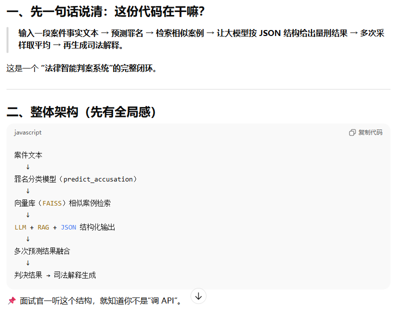

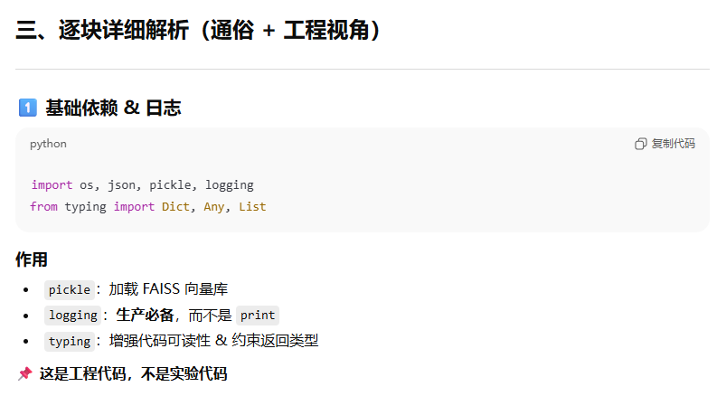

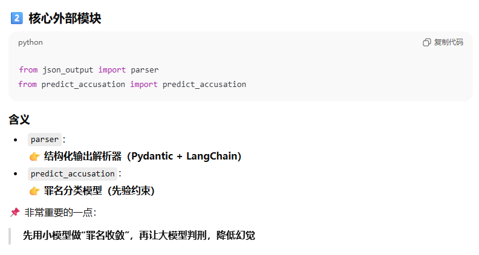

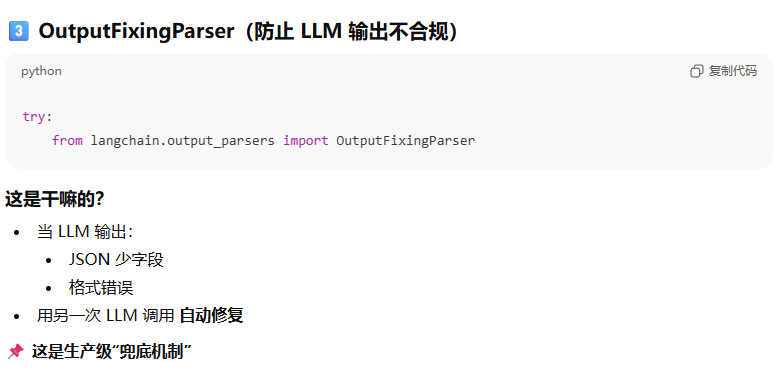

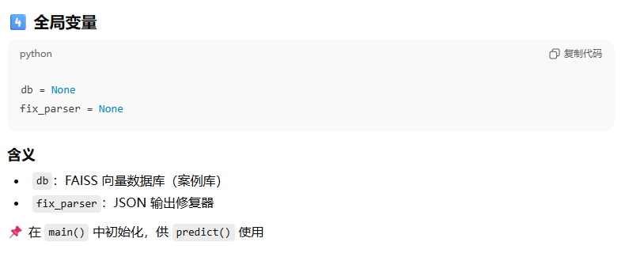

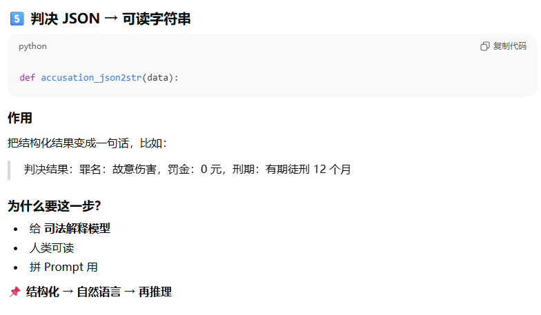

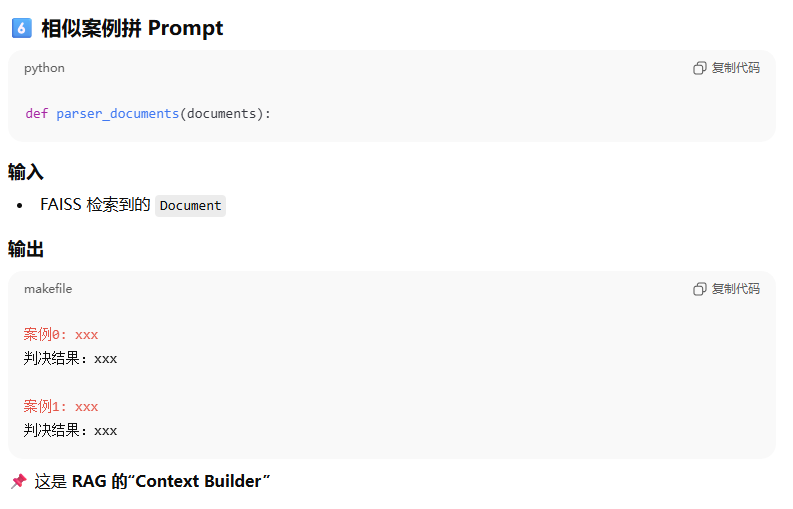

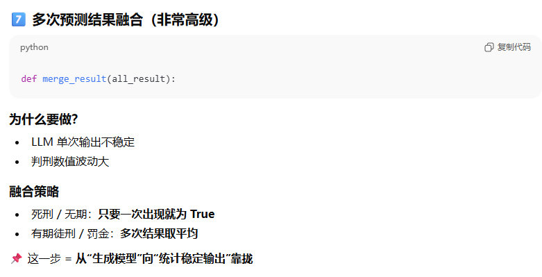

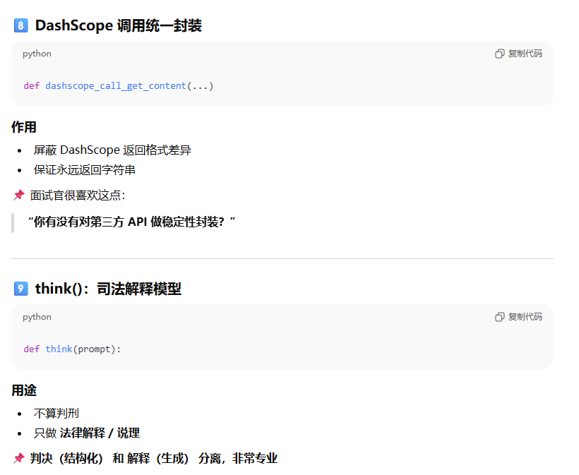

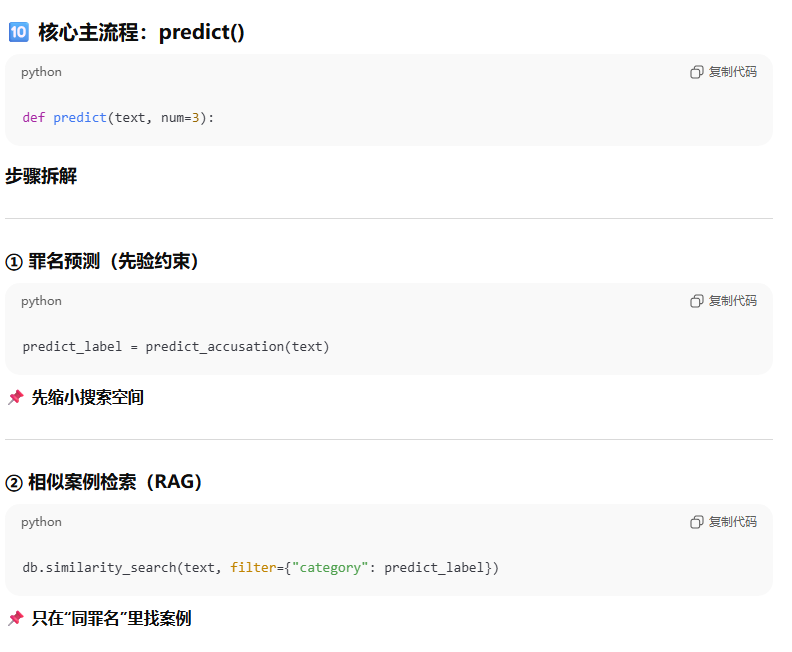

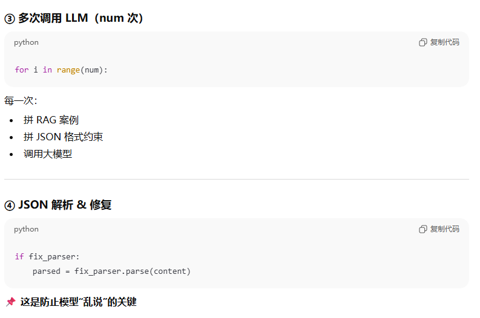

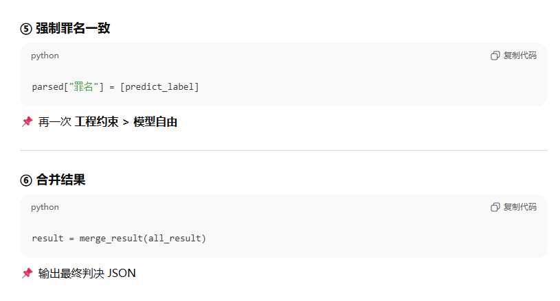

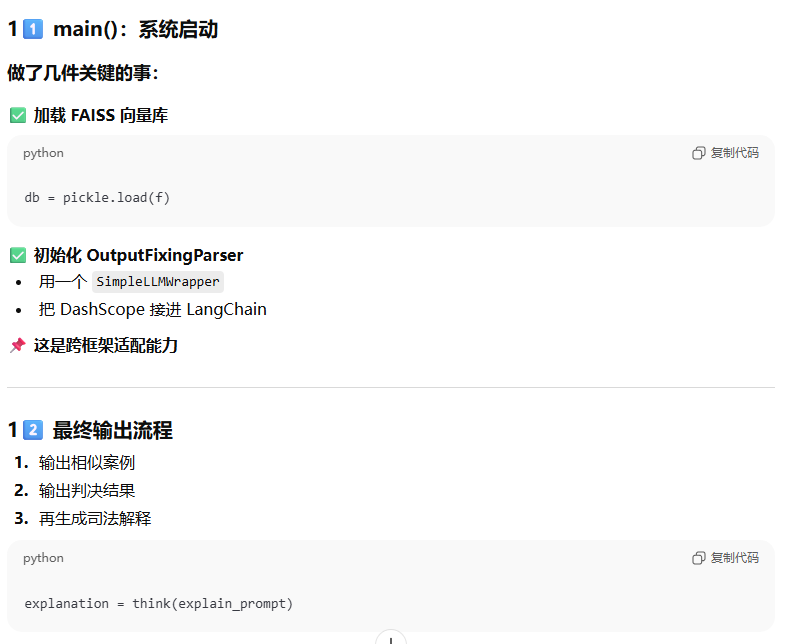

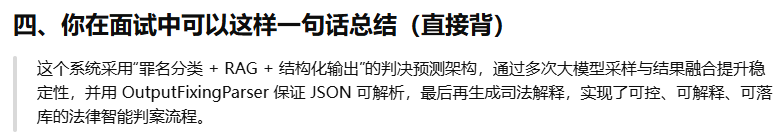

**main函数**

好，这一段 `main()` **正好是一个完整「法律 RAG + 结构化输出 + 司法解释」流水线的入口**。
我给你 **逐行 + 分模块 + 用“人话”解释**，不跳步，你拿去面试直接能讲。

------

一、函数整体是干嘛的？（先给你一张“脑图”）

一句话总结：

> **main() 做了 6 件事：**

1. 初始化全局对象（向量库、解析器）
2. 配置大模型名称
3. 加载法律案例向量数据库
4. 初始化「JSON 自动修复解析器」
5. 输入一个案件文本，预测判决结果
6. 基于判决结果，再让模型给司法解释

------

**二、逐行解析（从上到下）**

------

**1️⃣ 全局变量声明**

```python
global db, fix_parser
```

🧠 解释

- `db`：向量数据库（Faiss / Chroma / pickle 存的）
- `fix_parser`：**输出修复解析器（非常关键）**

为什么要 `global`？

- `predict()` 函数里要用
- `main()` 负责初始化
- 这是典型的 **“初始化 + 业务函数复用”结构**

📌 面试说法：

> 使用全局变量是为了避免重复加载向量库和解析器，减少启动成本。

------

2️⃣ 设置默认模型（环境变量）

```python
os.environ.setdefault("LLM_MODEL", "qwen2.5-32b-instruct")
os.environ.setdefault("THINK_MODEL", "qwen3-30b-a3b")
```

**🧠 解释**

- 如果系统 **已经设置了环境变量** → 不覆盖
- 如果 **没设置** → 用默认模型

两个模型的分工：

| 模型        | 作用                    |
| ----------- | ----------------------- |
| LLM_MODEL   | 判决预测（结构化 JSON） |
| THINK_MODEL | 司法解释（自由文本）    |

📌 面试说法：

> 将模型配置放到环境变量中，方便线上切换模型而无需改代码。

------

**3️⃣ 指定并检查向量数据库路径**

```python
law_DB = r"G:\BaiduNetdiskDownload\刑法大模型\law\law\tmp_2\law_db.pkl"
```

🧠 解释

- 这是一个 **pickle 序列化的向量数据库**
- 里面通常是：
  - 文本
  - embedding
  - metadata（罪名、判决结果等）

------

```python
if not os.path.exists(law_DB):
    logger.error("找不到 law_db 文件: %s", law_DB)
    return
```

🧠 解释

- 启动前做防御性检查
- 文件不存在直接退出，避免后续报一堆异常

📌 面试加分点：

> 提前失败（fail fast），比业务中途崩溃更友好。

------

**4️⃣ 加载向量数据库**

```python
with open(law_DB, "rb") as f:
    db = pickle.load(f)
```

🧠 解释

- 把磁盘上的向量数据库加载到内存

- `db` 后面会被用于：

  ```python
  db.similarity_search(...)
  ```

------

```python
logger.info("向量数据库加载成功")
```

🧠 解释

- 用日志而不是 print
- 方便线上排查

------

5️⃣ 初始化 OutputFixingParser（重点 ⭐⭐⭐）

先判断库是否存在

```python
if OutputFixingParser is not None:
```

🧠 为什么要判断？

- 不同 LangChain 版本：
  - 有的有
  - 有的没有
- 做兼容处理

------

**6️⃣ 定义一个 LLM 包装器（非常关键）**

```python
class SimpleLLMWrapper:
```

🧠 这个类是干嘛的？

一句话：

> **把 dashscope 的调用，伪装成 LangChain 认识的 LLM 接口**

------

构造函数

```python
def __init__(self, model_name):
    self.model = model_name
```

- 保存模型名（如 qwen2.5-32b）

------

generate 方法

```python
def generate(self, messages, **kwargs):
```

🧠 为什么要这个？

- LangChain 的 `OutputFixingParser` **期望 LLM 有 generate 方法**

```python
content = dashscope_call_get_content(messages, model=self.model)
return [{"text": content}]
```

- 调阿里 dashscope
- 把返回结果包装成 LangChain 能理解的格式

------

`__call__` 方法

```python
def __call__(self, prompt, **kwargs):
```

🧠 作用

- 某些 LangChain 版本会 **直接把 LLM 当函数调用**
- 这里是 **兼容兜底**

------

📌 面试高级说法：

> 通过 Adapter 模式，将第三方 LLM 接口适配到 LangChain 的解析器体系中。

------

**7️⃣ 创建 fix_parser**

```python
fix_parser = OutputFixingParser.from_llm(
    parser=parser,
    llm=llm_wrapper
)
```

🧠 这一步是全项目最值钱的地方

它解决什么问题？

> ❌ LLM 经常返回不合法 JSON
> ✅ OutputFixingParser 会自动：

1. 发现 JSON 不合法
2. 把“坏输出”喂给 LLM
3. 要求它修成合法 JSON
4. 再 parse 一次

📌 面试一句话秒杀：

> 通过 OutputFixingParser 显著提升结构化输出的稳定性，避免模型输出漂移。

------

8️⃣ 示例案件输入

```python
text = ("公诉机关起诉书指控并审理经查明：...")
```

🧠 解释

- 模拟真实裁判文书
- 非结构化长文本
- 后面会：
  - 罪名预测
  - 相似案例检索
  - 判决预测

------

**9️⃣ 调用预测主流程**

```python
result_json, case_list = predict(text, num=3)
```

🧠 解释

- `num=3`：让模型 **预测 3 次**
- 后面会取平均 / 投票

📌 面试说法：

> 通过多次采样 + 结果融合，降低大模型随机性。

------

**🔟 打印相似案例 & 判决结果**

```python
result_str = accusation_json2str(result_json)
```

🧠 解释

- 把结构化 JSON
- 转成「人能读懂的一句话」

例如：

> 判决结果：罪名：妨害公务罪，刑期：有期徒刑 6 个月

------

**1️⃣1️⃣ 请求司法解释（第二阶段推理）**

```python
explain_prompt = text + "\n\n" + result_str + "\n\n请根据判处结果，给出合理的司法解释。"
```

**🧠 解释**

- 输入：
  - 原始案情
  - 已预测的判决结果
- 输出：
  - 法律条文解释
  - 判罚合理性说明

📌 这是典型的 **Chain-of-Thought + RAG** 用法

------

**1️⃣2️⃣ 调用 think 模型**

```python
explanation = think(explain_prompt)
```

🧠 解释

- 用更大的模型（30B）
- 做自由文本推理
- 不要求 JSON

------

三、你在面试可以这样总结（直接背）

> 这个 main 函数实现了一个完整的司法 RAG 推理流程：
> 先加载法律案例向量库，通过罪名预测进行条件检索，再结合相似案例让大模型输出结构化判决结果，并通过 OutputFixingParser 自动修复不合法 JSON，最后基于判决结果调用推理模型生成司法解释，整体兼顾稳定性与可解释性。

------


**问题1：OutputFixingParser包是用来干嘛的？**

面试问你：项目遇到哪些难题？

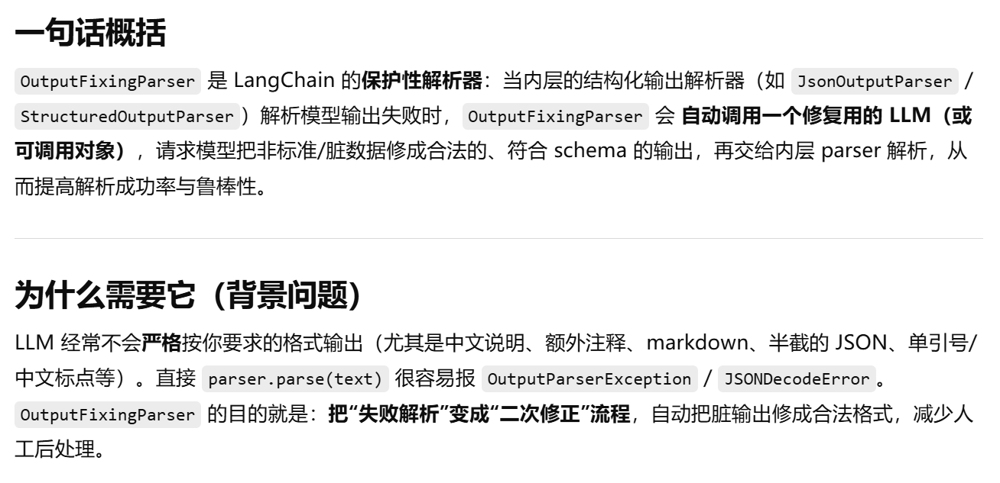

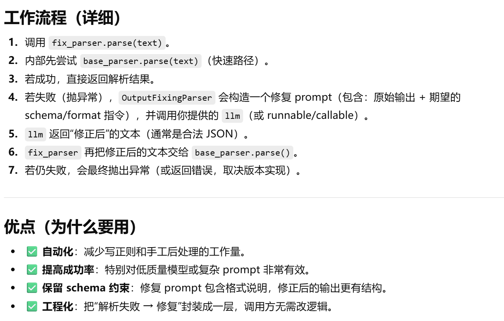


## 3 生成测试结果

```py
# 12_test.py
import tqdm, json
from predict_test  import *

if __name__ == '__main__':

    cll = Criminal_Law_LLM()
    # 读取测试集的数据
    TEST_DATA_PATH = r"..\data\test_data.jsonl"

    with open(TEST_DATA_PATH, "r+", encoding="utf-8") as f:
        lines = f.readlines()
    print("测试集数量：", len(lines))
    for line in tqdm(lines):
        line = json.loads(line)

        input = line['input']
        output = line["output"]
        result_json, case_list = cll.predict(input, num=3)

        # logger.info("相似案件：\n%s", case_list)
        result_str = cll.accusation_json2str(result_json)
        logger.info("标签结果：%s", output)
        logger.info("预测结果：%s", result_json)

        with open("test_result", "a+", encoding="utf-8") as f:
            f.write(str([output, result_json]) + "\n")
```

## 4 测试集评估模型

```py
# 13_model_evaluation.py
def get_month(data):
    if data["是否死刑"]:
        return 12 * 100
    if data["是否无期"]:
        return 12 * 50
    return data["有期徒刑"]


with open(r"..\test_result", encoding="utf-8") as f:
    lines = [eval(s.strip()) for s in f.readlines()]

std = 0.25
right_charge = 0
right_person = 0
right_fine = 0
right_time = 0
count = 0
for data in lines:
    try:
        label_output = data[0]
        predict_output = data[1]
        # print(label_output, predict_output)
        if label_output["罪名"][0] in predict_output["罪名"]:
            right_charge += 1
        if str(label_output["犯罪嫌疑人"]) == str(predict_output["犯罪嫌疑人"]):
            right_person += 1
        if predict_output["罚金"] >= (1 - std) * label_output["罚金"] and predict_output["罚金"] <= (1 + std) * label_output["罚金"]:
            right_fine += 1
        fact_time = get_month(label_output)
        predict_time = get_month(predict_output)

        if predict_time >= (1 - std) * fact_time and predict_time <= (1 + std) * fact_time:
            right_time += 1

        count += 1
    except:
        continue

print("罪名准确率", right_charge / count)
print("罪犯准确率", right_person / count)
print("罚金准确率", right_fine / count)
print("坐牢时间准确率", right_time / count)
```

```
罪名准确率 0.8830194231901118
罪犯准确率 0.5679811653914068
罚金准确率 0.5943201883460859
坐牢时间准确率 0.29193643319599766
```


