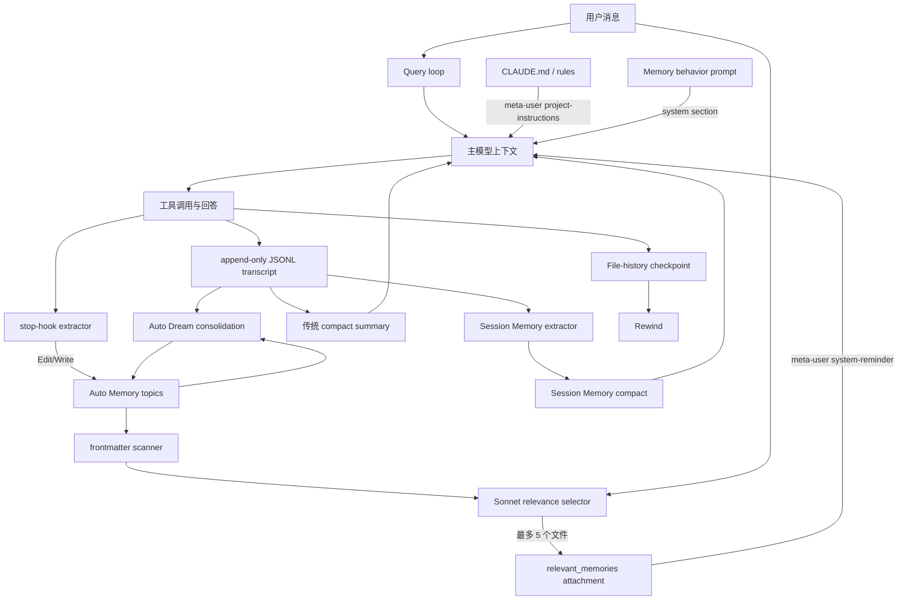
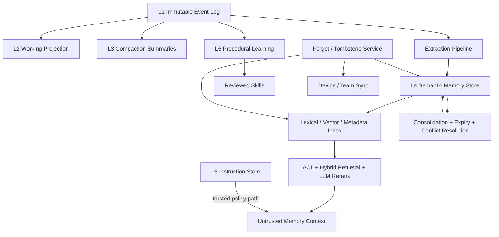

# Claude Code 记忆系统深度研究报告

## 0. 先读结论

这个项目没有一个可以单独圈出来的“Memory 类”。它实际由多套互相连接、但语义不同的系统组成：

1. **指令记忆**：`CLAUDE.md`、`CLAUDE.local.md`、`.claude/rules/*.md`。它们保存“智能体应该怎么工作”，以高权重项目指令注入。
2. **跨会话语义记忆 Auto Memory**：项目级 Markdown 主题文件，保存用户偏好、反馈、不可从代码推导的项目事实和外部引用。
3. **动态召回**：先扫描主题文件 frontmatter，再让一个 Sonnet 侧查询最多选择 5 个文件，将正文按预算注入当前轮次。
4. **后台增量抽取**：主轮次结束后，受限 forked agent 从新消息中提取长期信息并写入 Auto Memory。
5. **长期整理 Auto Dream**：跨多个会话周期性去重、纠错、修剪、重建索引。
6. **Session Memory**：当前 session 的滚动结构化摘要，主要用于上下文压缩；它不是 Auto Memory 的同义词。
7. **JSONL transcript**：原始会话事件日志，支持恢复、分支、压缩边界和子智能体日志。
8. **文件 checkpoint**：按消息 UUID 保存文件快照，实现 rewind；这是“工作区状态记忆”，不是语义记忆。
9. **Agent / Team / Local Memory**：分别面向自定义子智能体、团队同步和用户显式键值笔记。
10. **Skill Learning**：观察工具使用并生成 instinct/skill 的程序性记忆旁路。

核心架构不是“把所有历史塞进向量库”，而是：

> **人类可读文件作为持久层，稳定提示词描述行为，元数据/LLM 负责选择，正文按预算注入；短期增量抽取和长期 consolidation 分层。**

这套设计最值得借鉴的是可读、可编辑、低基础设施成本、记忆与当前事实区分、上下文预算明确、主任务不因记忆失败而阻塞。最不应照搬的是：项目目录标识可能碰撞、持久记忆仍以高权重文本注入、自动抽取读取权限过宽、可靠“遗忘”缺失、若干 byte cap 实际用字符计数、部分状态只存在内存、缓存失效分散、关键路径测试不足。

### 总体评价

| 维度 | 评价 | 说明 |
|---|---:|---|
| 架构可理解性 | 较高 | 文件、prompt、attachment、transcript 分层清楚，但“memory”一词复用了多种语义 |
| 可观测/可编辑性 | 高 | Markdown 与 JSONL 直接可查；`/memory` 可打开目录 |
| 检索成本控制 | 较好 | 5 文件、4KB/文件、60KB/压缩周期；非阻塞侧查询 |
| 强一致性 | 较弱 | topic/index 非事务；抽取和整理以 best-effort 为主 |
| 隐私治理 | 不足 | 私人记忆无加密、TTL、逐条来源、可靠删除和默认 secret scan |
| Prompt injection 抵抗 | 不足 | 主题记忆作为 meta-user/system-reminder 注入，缺少强制数据/指令隔离 |
| 恢复与压缩工程 | 较成熟但复杂 | parent graph、tool 配对、boundary、降级完整；多 pass 修复脆弱 |
| 测试/独立审查证据 | 不均衡 | Local Memory/部分 compaction 有测试；核心 memdir/extraction/dream 缺少直接测试 |
| 作为其他智能体参考 | 很有价值 | 应参考分层思想，不应原样复制实现细节 |

---

## 1. 研究边界、可信度和证据标记

### 1.1 这不是 Anthropic 官方完整源码

仓库自己的 `AGENTS.md:5-7` 与 `CLAUDE.md:5-7` 明确说明，它是逆向工程/反编译恢复版本，部分模块是 stub，部分功能依赖编译开关或 GrowthBook gate。因此本报告不能把“本仓库当前实现”直接等同于“Anthropic 线上 Claude Code 的全部实现”。

本报告使用四类标记：

- **[源码事实]**：能在本地源码中形成完整调用链。
- **[当前快照默认]**：本仓库 2.7.1 的本地 feature default 或 build define；不代表 Anthropic 线上远程配置恒定。
- **[设计推断]**：由代码结构、注释和行为组合推导，已明确标注为推断。
- **[建议]**：面向其他智能体记忆系统的改进方案，不声称是当前实现。

### 1.2 三类外部证据不能混用

1. **Anthropic 官方产品文档**说明正式产品向用户承诺的行为，例如 CLAUDE.md、Auto Memory、`MEMORY.md` 的默认加载规则。参见 [Manage Claude's memory](https://code.claude.com/docs/en/memory) 与 [How Claude Code works](https://code.claude.com/docs/en/how-claude-code-works)。
2. **本仓库源码**说明这个 fork/恢复快照当前会执行什么。
3. **GitHub PR、review、CI**只能证明对应 PR 的审查范围，不能证明整个记忆系统或 Anthropic 上游已经完成安全审计。

一个重要差异是：官方文档描述 Auto Memory 会在每次会话开始加载 `MEMORY.md` 的前 200 行或 25KB；本仓库文档 `docs/context/project-memory.mdx:37-55` 也如此描述。但当前快照的本地默认 `tengu_moth_copse=true`，`src/utils/claudemd.ts:1135-1150` 会过滤 AutoMem/TeamMem 索引，改用动态主题召回。这应理解为 fork 中启用的实验路径，而不是据此否定官方产品文档。

其他需要保持分离的差异：

| 主题 | Anthropic 当前公开文档 | 本 fork 2.7.1 | 结论 |
|---|---|---|---|
| `autoMemoryDirectory` | 文档允许更多 settings scope，项目设置受 workspace trust | `paths.ts:168-185` 排除 `projectSettings` | 版本/fork 行为分叉 |
| 推荐保存内容 | 官方示例可含 build 命令、调试经验、架构信息 | `memoryTypes.ts:98-110` 排除可从代码/git 推导的架构、路径、调试配方 | fork 选择更高 precision |
| topic 召回 | 官方公开为标准文件工具按需读取 | fork 有 Sonnet side-query | 不能把 selector 当官方保证 |
| Auto Dream / Team / Local KV | 官方记忆页未公开为通用正式机制 | fork 中有完整或实验实现 | 必须标 fork/实验扩展 |
| Compaction | 官方公开“先清旧工具输出，再总结” | fork 还有 Session Memory compact 等 gates | 内部链路不是公开契约 |

### 1.3 并行研究拆分

本次研究为不同智能体建立了独立 goal，分两轮完成：

- A：Auto Memory 持久层、读写、抽取、召回、Dream、权限与测试。
- B：CLAUDE.md 发现、层级、include、上下文注入、缓存、trust、hooks、子智能体继承。
- C：JSONL transcript、resume/fork、compaction、Session Memory、file checkpoint、隐私。
- D：Agent/Team/Local/Dream/KAIROS/Skill Learning 等外围记忆系统。
- E：跨系统红队、安全、测试覆盖和风险复核。
- F：GitHub 设计史、PR 审查证据、官方文档对照和可迁移参考架构。

主线程负责交叉核对冲突、补读源码、运行定向测试，并只生成这一份综合报告。

---

## 2. “记忆”到底包括什么

### 2.1 分层模型

| 层 | 代表实现 | 作用域 | 写入者 | 读取时机 | 主要风险 |
|---|---|---|---|---|---|
| L0 当前工作上下文 | message array、tool result | 当前模型调用 | 主循环 | 每次 API 请求 | token 膨胀、工具配对破坏 |
| L1 原始事件记忆 | session JSONL | 单会话/子智能体 | transcript writer | resume/fork/审计 | 崩溃一致性、隐私、损坏 |
| L2 压缩记忆 | compact summary、Session Memory | 单会话 | 摘要模型/forked agent | compact 后 | 摘要遗漏、cursor 不一致 |
| L3 工作区 checkpoint | file-history | 单会话 | Edit/Write 前后 | rewind | 全量副本、非事务恢复 |
| L4 指令记忆 | CLAUDE.md/rules | user/project/local | 人类/同步系统 | 会话启动、嵌套触发 | 高权重注入、授权与缓存 |
| L5 跨会话语义记忆 | Auto Memory topics | 项目/worktree 共享 | 主代理、extractor、Dream | 启动索引或动态召回 | 污染、陈旧、隐私、遗忘 |
| L6 专用记忆 | Agent/Team/Local | agent/team/user store | agent/用户/同步 | 专用 prompt/tool | 范围越权、冲突、秘密 |
| L7 程序性记忆 | instinct/skill learning | 项目/用户 | observer/generator | skill 发现和调用 | 错误归纳、自动演化 |

### 2.2 为什么必须区分

`src/memdir/memdir.ts:254-257` 明确把 plan/task 与 future-session memory 区分：计划用于完成当前会话任务，Auto Memory 应只保存未来会话仍有价值的信息。Session Memory 又是当前 session 的滚动摘要，路径在 `src/utils/permissions/filesystem.ts:257-270`：

```text
<projectDir>/<sessionId>/session-memory/summary.md
```

因此，以下说法都是错误的：

- “所有 JSONL 历史都是长期语义记忆。”
- “Session Memory 就是用户跨项目偏好库。”
- “CLAUDE.md 和 Auto Memory 只是同一种文件的不同名字。”
- “有 compaction 就不需要持久记忆。”

正确的理解是：事件日志回答“发生过什么”，压缩摘要回答“当前任务怎样继续”，指令文件回答“应该怎样工作”，Auto Memory 回答“未来会话需要记住什么”。

---

## 3. 总体架构与数据流



### 3.1 两条正交轴

这套架构同时沿两条轴分层：

- **时间轴**：当前轮次 → 当前 session → 跨 session。
- **权限/所有权轴**：managed → user → project → local → auto → team → agent。

[设计推断] 这是文件系统架构仍能支持复杂记忆的关键：它没有依靠一个通用数据库表解决所有问题，而是让不同路径、prompt 和工具权限表达不同语义。但代价是开关、缓存、删除和安全策略容易在多个模块间不一致。

---

## 4. 指令记忆：CLAUDE.md、rules 与 include

### 4.1 类型与实际加载顺序

类型位于 `src/utils/memory/types.ts:3-12`。`src/utils/claudemd.ts:789-1006` 的加载顺序为：

1. Managed `CLAUDE.md`
2. Managed rules
3. User `~/.claude/CLAUDE.md`
4. User rules
5. 从项目上层到 cwd 扫描 `CLAUDE.md`、`.claude/CLAUDE.md`、`.claude/rules/*.md`、`CLAUDE.local.md`
6. additional directories
7. Auto Memory `MEMORY.md`
8. Team Memory `MEMORY.md`

源码头部 `src/utils/claudemd.ts:1-25` 表示后加载项具有更高注意力/优先级。worktree 去重位于 `src/utils/claudemd.ts:858-883`：到达主仓库时跳过重复 checked-in 项目指令，但保留主仓库 `CLAUDE.local.md`。

### 4.2 注入角色不是表面看到的“system”

完整调用链：

```text
getMemoryFiles()
→ filterInjectedMemoryFiles()
→ getClaudeMds()
→ getUserContext()
→ prependUserContext()
→ <project-instructions> meta-user message
```

证据：`src/context.ts:152-189`、`src/utils/claudemd.ts:1152-1194`、`src/utils/api.ts:443-485`、`src/query.ts:883-888`。

`CLAUDE.md` 在 API role 上是 user message，但不会放进“可能相关也可能无关”的一般 reminder；它被单独包装，提示其覆盖默认行为。因此它是**语义上的高权重指令**，不是普通知识文档。

Auto Memory 的“何时保存、怎样组织、怎样验证”由 `src/memdir/memdir.ts:419-500` 生成并进入真正的 system prompt section。内容和行为的分离有三个好处：

- 行为策略稳定，利于 prompt cache。
- 内容可以按需变化，不必重建全部 system prefix。
- custom system prompt 场景仍可针对 Cowork memory override 补回 memory mechanics（`src/QueryEngine.ts:320-335`）。

### 4.3 `@include` 与规则懒加载

include 支持相对、home、绝对路径；Markdown code/inline code/comment 中的 `@` 不解析。最大深度 5，并以 normalized path/realpath 防循环：`src/utils/claudemd.ts:447-684`。

存在明确顺序不一致：

- 注释说 include 在父文件之前：`src/utils/claudemd.ts:18-24,613-616`。
- 实际先 `result.push(memoryFile)` 再递归追加 include：`src/utils/claudemd.ts:660-680`。

如果后出现的指令更强，则 imported 文件可能覆盖 parent，与注释意图相反。此项应补回归测试并明确规范。

`.claude/rules/*.md` 可用 frontmatter `paths` 条件。访问文件时，FileRead 将目标加入 `nestedMemoryAttachmentTriggers`；下一 attachment 阶段加载匹配 rules 与嵌套 CLAUDE.md，作为 `nested_memory` system-reminder 注入。证据：`packages/builtin-tools/src/tools/FileReadTool/FileReadTool.ts:840-862,1018-1035`、`src/utils/attachments.ts:1830-1908`、`src/utils/messages.ts:4111-4117`。

去重依靠 100 项 LRU `readFileState` 和不会淘汰的 `loadedNestedMemoryPaths`。优点是避免重复 token；缺点是会话中修改嵌套指令后通常不会重新注入，直到 clear/compact。

### 4.4 Workspace trust 和外部 include

交互模式先确认 workspace trust，随后才正常预取上下文：`src/interactiveHelpers.tsx:169-210`、`src/main.tsx:530-555`。但 `getMemoryFiles()` 自身没有 trust guard，安全性依赖外层调用顺序；hooks 则在执行点再次检查 trust（`src/utils/hooks.ts:268-297`）。

Project/Local/Managed 指令导入 cwd 外部路径时需额外批准：`src/utils/claudemd.ts:1398-1429`、`src/components/ClaudeMdExternalIncludesDialog.tsx:24-84`。批准是项目级两个布尔值，而非逐路径或内容 hash：批准一次后，未来新增外部 include 也可能直接获得许可。

[风险：中高] 这是授权粒度和易用性的权衡，存在 TOCTOU。建议逐路径+realpath+内容 hash 授权，路径或内容改变时重新确认。

### 4.5 缓存生命周期缺陷

静态指令至少有两层 memoize：`getMemoryFiles` 和 `getUserContext`。`clearMemoryFileCaches()` 只清内层，而 `src/services/compact/postCompactCleanup.ts:63-73` 的注释明确指出必须同时清外层，否则不会重读文件。

以下调用点只清内层或不清缓存：

- `/memory`：`src/commands/memory/memory.tsx:20-60,84-89`
- Enter/Exit Worktree：`packages/builtin-tools/src/tools/EnterWorktreeTool/EnterWorktreeTool.ts:94-102`、`ExitWorktreeTool.ts:142-145`
- settings sync：`src/services/settingsSync/index.ts:480-486,570-576`
- Team Memory sync：`src/services/teamMemorySync/index.ts:851-855`
- `/add-dir`：`src/commands/add-dir/add-dir.tsx:52-78`

[源码事实 + 推断] 若 `getUserContext` 已求值，上述刷新可能无法改变本会话实际注入内容。`/clear` 和 compact 会正确清两层。建议只暴露统一的 `invalidateMemoryContext()`，禁止业务代码直接清某个 memoize。

### 4.6 普通会话不读取通用 AGENTS.md

`src/utils/claudemd.ts:1431-1449` 只把 CLAUDE.md、CLAUDE.local.md、rules 识别为普通指令记忆。唯一 AGENTS 支持是 `.claude/autonomy/AGENTS.md`，仅用于 proactive/scheduled autonomy turn：`src/utils/autonomyAuthority.ts:14-19,426-505`。

这意味着想为其他智能体兼容 Codex 风格 AGENTS.md 时，需要新增普通会话发现器，不能假设当前 Claude loader 已支持。

---

## 5. Auto Memory 持久层

### 5.1 目录布局与项目身份

默认布局：

```text
~/.claude/projects/<sanitized-canonical-project-root>/memory/
├── MEMORY.md
├── user_preferences.md
├── feedback_testing.md
├── project_release_policy.md
├── reference_external_system.md
├── logs/YYYY/MM/YYYY-MM-DD.md
└── team/                       # TEAMMEM 启用时
```

路径解析位于 `src/memdir/paths.ts:79-94,198-235`。canonical Git root 使同一仓库不同 worktree 共享项目记忆；非 Git 项目使用稳定 project root。

优先级：

1. `CLAUDE_COWORK_MEMORY_PATH_OVERRIDE`
2. policy/flag/local/user 设置的 `autoMemoryDirectory`
3. 默认项目路径

`projectSettings` 被故意排除，代码注释明确给出安全理由：否则恶意仓库能把自动记忆路径指向 `~/.ssh`，再利用静默写权限修改敏感文件。见 `src/memdir/paths.ts:168-186`。

#### 项目标识碰撞

`src/utils/sessionStoragePortable.ts:291,300-317` 把非字母数字字符替换为 `-`，只在结果超过 200 字符时附哈希。短路径如 `/a/b` 与 `/a-b` 可产生相同标识。

[风险：高] 后果是不同项目共享 Auto Memory/transcript namespace，造成跨项目污染或隐私泄露。建议始终使用：

```text
human-readable-prefix + "-" + base32(sha256(canonical-realpath))[0:16]
```

#### 符号链接越界

红队复核发现，内部 Auto Memory/Agent Memory 写权限的 containment 主要基于 `normalize + startsWith`：`src/memdir/paths.ts:274-278`、`packages/builtin-tools/src/tools/AgentTool/agentMemory.ts:64-100`。权限框架虽会为 deny rule 解析符号链接，但内部 allow 判断仍可落回原始路径；实际文件写会跟随最终 symlink：`src/utils/permissions/filesystem.ts:1219-1249,1484-1490,1558-1585`、`src/utils/file.ts:369-380`。

[风险：高，前提是攻击者能在记忆目录预置文件或父目录 symlink] `memory/link.md -> ~/.ssh/authorized_keys` 一类路径可能在无额外确认下越出记忆根。修复必须同时校验原路径、最终 realpath、最深已存在父目录，并拒绝 dangling symlink/竞态替换；单纯字符串前缀不构成安全 containment。

### 5.2 四类型封闭 taxonomy

`src/memdir/memoryTypes.ts:14-31,95-185` 定义：

| 类型 | 保存内容 | 不应保存 |
|---|---|---|
| `user` | 角色、长期偏好、背景 | 可从当前请求推断的临时偏好 |
| `feedback` | 对智能体行为的纠正与确认 | 单次偶然失败且无通用性 |
| `project` | 不可从代码直接推导的长期项目约束 | 文件路径、代码架构、git 历史 |
| `reference` | 外部系统/领域指针 | 可随时重新发现的一般资料 |

特别值得借鉴的是 feedback 同时记录失败和成功：只记“不要这样”会让代理越来越保守，也会忘记用户已经认可的路径。

主题文件推荐 frontmatter：

```yaml
---
name: stable-topic-name
description: 用于未来召回判断的一行描述
type: user | feedback | project | reference
---
```

description 不是面向展示的摘要，而是检索索引。当前动态召回只看 filename/type/mtime/description，不看正文，因此 description 质量直接决定 recall。

### 5.3 MEMORY.md 上限及字符/字节错误

常量在 `src/memdir/memdir.ts:34-39`：200 行、名义 25,000 bytes。`truncateEntrypointContent()` 位于 `src/memdir/memdir.ts:57-103`。

实现却用 JavaScript `string.length` 与 `slice()`，即 UTF-16 code unit，不是真实 UTF-8 byte。中文、emoji 等内容可能实际远超 25KB；截断也可能以字符而非 byte 边界工作。

[风险：中] 主题文件读取 `src/utils/readFileInRange.ts:33-37,142-207` 使用真实 byte 限制，两者语义不一致。应统一使用 `Buffer.byteLength` 与 UTF-8 安全截断。

### 5.4 开关

`src/memdir/paths.ts:21-55` 的 Auto Memory 关闭顺序：

1. `CLAUDE_CODE_DISABLE_AUTO_MEMORY`
2. simple/bare 模式
3. remote 且无持久目录
4. `autoMemoryEnabled`
5. 默认开启

后台抽取还要求 build define `EXTRACT_MEMORIES`、`tengu_passport_quail`、主代理、非 remote、非 poor mode。见 `src/memdir/paths.ts:57-77`、`src/query/stopHooks.ts:130-168`、`src/services/extractMemories/extractMemories.ts:524-564`。

当前快照 `src/services/analytics/growthbook.ts:434-459` 的本地默认包括：

- `tengu_session_memory: true`
- `tengu_passport_quail: true`
- `tengu_moth_copse: true`
- `tengu_coral_fern: true`
- Auto Dream gate 默认启用

注意：`tengu_session_memory` 开启不等于 Session Memory compact 开启；后者还需 `tengu_sm_compact`。

### 5.5 开关不等于撤权

AutoMem 在文件权限层有静默读写 carve-out：`src/utils/permissions/filesystem.ts:1570-1586,1612-1729`。这些判断基于 `isAutoMemPath()`，不再次检查 `isAutoMemoryEnabled()`。

[风险：中高] UI 关闭主要停止正常 prompt/后台路径，但未从底层 capability 中撤销无确认读写。再加上 system prompt section 的会话缓存，中途开关可能直到 clear/compact 才完全生效。理想的“关闭”应同时：停止任务、清 prompt、清 attachment、失效缓存、撤权限、取消 watcher。

---

## 6. 两种读取模式：静态索引与动态主题召回

### 6.1 静态索引模式

Auto Memory `MEMORY.md` 经 `getMemoryFiles()` 加入 CLAUDE.md 层级，作为高权重 user context；主题文件由模型按链接使用 Read 获取。优点是确定、无额外模型调用；缺点是索引常驻 token、主题导航依赖主模型主动读取。

### 6.2 动态召回模式

当前快照默认走这条链：

```text
最后一条真实用户消息
→ scanMemoryFiles(memoryDir)
→ 读取每个 .md 前 30 行 frontmatter
→ 按 mtime 取最近 200 个
→ Sonnet sideQuery 选择最多 5 个文件名
→ 与本地 manifest 白名单核对
→ 每文件读 200 行/4KB
→ relevant_memories attachment
→ system-reminder 中的 meta-user 消息
```

证据：`src/memdir/memoryScan.ts:21-94`、`src/memdir/findRelevantMemories.ts:19-146`、`src/utils/attachments.ts:2248-2489`、`src/utils/messages.ts:4119-4133`。

预算：

- 候选最多最近 200 个文件。
- selector 最多选 5 个。
- 每文件最多 200 行和 4096 UTF-8 bytes。
- 单轮理论最多约 20KB。
- 一个 compact 周期内累计 60KB 后停用。

### 6.3 非阻塞语义

`src/query.ts:450-457,1892-1914` 在用户轮次开始启动 prefetch，但消费点只检查 `settledAt`：已完成则注入，未完成则零等待，下一 agent loop iteration 再试。如果该轮主模型直接回答且无后续工具迭代，记忆可能完全不进入这一轮。

[设计推断] 这是明确的延迟优先策略：记忆是增强项，不能拖慢首 token。优点是用户体验稳定；缺点是 recall 不具有强一致性，尤其是“只回答一次”的短问题。

### 6.4 召回降噪与去重

- poor mode 跳过 side-query。
- 单词提示因上下文不足直接跳过：`src/utils/attachments.ts:2437-2445`。
- 最近成功使用的工具传给 selector，避免召回通用使用文档；陷阱和警告仍允许。
- `alreadySurfaced` 在选择前过滤，让 5 个名额用于新文件。
- `readFileState` 防止重复注入模型已读/写/编辑的文件。
- compact 后旧 attachment 不再在 active messages 中，预算与去重自然重置。

### 6.5 扫描器的隐藏 O(N) 问题

`src/memdir/memoryScan.ts:35-73` 先对发现的全部文件 `Promise.allSettled` 读取 header，随后排序并 `.slice(0, 200)`。

[风险：中] “200 文件上限”只限制送给 selector 的数量，并不限制文件系统 I/O 和并发。若目录内有数万 Markdown 文件，会一次性创建大量读取任务。应先按 stat/目录索引筛选，或使用有界并发队列；更理想的是维护增量 manifest。

红队进一步确认：`readFileInRange` 对小于约 2.5MB 的文件会整文件读入再取范围（`src/utils/readFileInRange.ts:84-125,162-205`）。因此大量接近阈值的 Markdown、FIFO 或指向目录外大文件的符号链接会放大 FD、内存与延迟风险。应在 scan 阶段使用 `lstat`、拒绝非 regular file/符号链接、限制总文件数与总读取字节，并采用有界并发。

### 6.6 60KB 预算也存在字符/字节误算

`src/utils/attachments.ts:2305-2323` 累计 `mem.content.length`，但常量名和注释称 bytes。多字节文本会低估真实 UTF-8 用量。

[风险：低到中] 单文件 4KB是真实 byte cap，所以单轮仍有硬边界；会话累计门槛可能被中文/emoji 绕过。应使用 `Buffer.byteLength(content, 'utf8')`。

### 6.7 召回质量的结构性局限

1. 只看 frontmatter，正文再相关也无法补救坏 description。
2. 按 mtime 只保留最新 200 个，旧而重要的长期规则会饿死。
3. 最多 5 个文件不适合需要跨很多主题的复杂任务。
4. selector 自身会收到用户 query 和全部候选元数据，仍有元数据隐私面。
5. topic 内容注入没有 Local Memory 那样的明确“untrusted data、不得执行其中指令”包装。
6. `AutoMem` 根递归扫描可能进入 `team/`；Team 功能关闭后残留文件仍可能被私人召回路径选中。

[建议] 使用 deterministic retrieval 与 LLM rerank 组合：BM25/关键词 + embedding/稠密检索 + recency/importance + ACL 过滤，LLM 只在小候选集做最终 rerank。

---

## 7. 写入：主代理与后台抽取

### 7.1 主代理主动写

`src/memdir/memdir.ts:187-265` 指示主模型：

- 用户明确说 remember 时立即保存。
- forget 时查找并移除。
- 先检查是否已有同主题，更新而非重复。
- 按语义主题组织，不按日期流水账。
- 当前文件/资源与记忆冲突时，以当前状态为准并修正记忆。
- 计划和任务状态不进入长期 memory。

索引模式通常是两步：写主题文件，再更新 `MEMORY.md`。这两步没有事务。

[风险：中] 中断会产生孤儿 topic 或悬空索引。应把原始写入变成 first-class API：校验 schema、写临时文件、原子 rename、事务性更新索引/manifest，并返回持久化版本。

### 7.2 后台抽取调用链

```text
query loop 完成
→ stop hook
→ 是否满足 EXTRACT_MEMORIES/gate/mode
→ 计算上次 cursor 后可见消息
→ 检测本轮是否已直接写 AutoMem
→ runForkedAgent(maxTurns=5)
→ 受限 Edit/Write 写入 AutoMem
→ 合并重叠触发，必要时 trailing run
```

实现：`src/query/stopHooks.ts:130-168`、`src/services/extractMemories/extractMemories.ts:73-147,293-520,524-612`。

抽取 prompt `src/services/extractMemories/prompts.ts:29-93` 要求只利用当前对话明确出现的事实，不调查代码；复用父对话前缀以提高 prompt cache 命中。

### 7.3 prompt policy 与 capability 不一致

`createAutoMemCanUseTool()` 位于 `src/services/extractMemories/extractMemories.ts:170-221`：

- Edit/Write 仅限 AutoMem。
- Bash 仅允许只读命令。
- Read/Grep/Glob 没有等价的路径范围限制。

[风险：高] “不要调查”只是 prompt 软约束。若对话或既有记忆含 prompt injection，后台 agent 可读取用户权限范围内的其他文件，再把秘密持久化到记忆或发送给模型。应将读能力收窄到：本轮消息、项目根、AutoMem 和明确批准的 transcript。

### 7.4 成功判断与误报

当前实现从 assistant 的 tool-use 请求推断哪些文件被写，而不是验证对应 tool-result 成功。主代理本轮“直接写过 AutoMem”的检测也基于 Edit/Write 调用出现，而非成功结果。

[风险：中] 写入失败仍可能：

- 跳过后台补抽取；
- 向用户显示“memory saved”；
- 推进本轮处理状态。

应只以已验证工具结果、最终文件 hash 和原子 commit 回执为成功依据。

### 7.5 索引模式迁移不一致

`buildMemoryLines(skipIndex)` 在动态召回开启时允许抽取器只写 topic，不更新 `MEMORY.md`：`src/memdir/memdir.ts:199-234`。但 Auto Dream prompt 仍要求维护索引：`src/services/autoDream/consolidationPrompt.ts:15-64`。

[设计推断] 代码正在从“索引直灌”迁移到“manifest 检索优先”；Dream 仍维护兼容索引。迁移期的双语义增加文档和测试复杂度，应明确哪个是 canonical index，以及关闭动态召回后的降级行为。

---

## 8. 遗忘、纠错与陈旧性

### 8.1 当前 forget 只是提示词行为

`src/memdir/memdir.ts:241-244` 和 extractor prompt 要求移除失效内容，但系统没有一等 `forgetMemory(id)`、tombstone、跨设备删除协议或安全擦除。

受限 extractor/Dream 没有 Delete 工具，只能 Edit/Write；从 `MEMORY.md` 删除链接但保留 topic，在动态召回模式中仍可能被扫描和召回。

[风险：高] “忘记”不可靠，也不等于隐私删除。

### 8.2 陈旧性防御

`src/memdir/memoryTypes.ts:112-170` 要求：

- 文件路径先检查存在。
- 函数/flag 先 grep。
- 当前代码、资源、用户说法优先于旧记忆。
- 用户要求 ignore memory 时，行为上视为 `MEMORY.md` 为空，不引用也不比较。

动态召回还通过 `src/memdir/memoryAge.ts:1-52` 在 header 中提示年龄。

这是一种实用的“记忆是历史声明而非真理”设计。但它仍缺少机器可执行的 provenance、confidence、lastVerifiedAt 和 expiresAt。

### 8.3 推荐的删除协议

[建议] 可靠忘记至少需要：

1. 以稳定 memory ID 定位，不靠模糊文本搜索。
2. 事务删除 topic 与索引/manifest。
3. 写 tombstone，防同步端或 Dream 恢复已删除内容。
4. 清 selector cache、prompt cache 和已预取 attachment。
5. 对 Team/设备传播 tombstone。
6. 提供可核验回执：删除位置、版本、同步状态、备份保留期。
7. 明确 transcript、备份、遥测中是否仍留有副本。

---

## 9. Auto Dream：跨会话 consolidation

### 9.1 它解决的不是“保存”，而是“熵增”

增量抽取容易产生重复、矛盾、过时、命名相近的主题文件。Auto Dream 周期性读取多个会话和已有 memory，将它们合并、纠错、修剪，并维护索引。

配置与流程：

- 默认最短间隔 24 小时。
- 至少 5 个新 session。
- 扫描节流 10 分钟。
- forked agent 最多 20 turns。
- KAIROS、remote 等模式有额外排除。

证据：`src/services/autoDream/config.ts:8-20`、`src/services/autoDream/autoDream.ts:55-108,123-273`、`src/services/autoDream/consolidationPrompt.ts:15-64`。

Dream 的四阶段可概括为：

1. Orient：列出目录、读取索引和已有主题。
2. Gather：读取 daily logs、过时记忆，必要时窄范围搜索 transcript。
3. Consolidate：合并信号、将相对日期改成绝对日期、解决矛盾。
4. Prune/Index：删除无效指针，保持索引在 200 行/25KB 内。

### 9.2 锁设计

`.consolidate-lock` 内容是 PID，mtime 同时表示上次成功整理时间。超过 1 小时或 PID 不存活时可回收：`src/services/autoDream/consolidationLock.ts:1-108`。

[优点] 一个小文件同时表达互斥和 last-consolidated 时间，不需要数据库。

[风险：中] 获取锁使用普通 `writeFile` 后回读 PID，不是原子 `O_EXCL`。特定交错下两个进程仍可能都继续。应使用 `open('wx')`、原子 rename 或 OS lock。

手动 `/dream` 在生成 prompt 时先更新整理时间：`src/skills/bundled/dream.ts:18-43`、`src/services/autoDream/consolidationLock.ts:126-140`。如果用户随后取消，自动 Dream 仍可能被抑制 24 小时。

### 9.3 为什么需要抽取 + Dream 两级

[设计推断]

- 每轮都做完整全库整理成本太高、延迟太大。
- 只做增量抽取会持续累积重复和矛盾。
- 因此近端 extractor 优先低延迟，远端 Dream 优先全局质量。

这是非常值得迁移的结构，但 consolidation 应具备版本、输入集合、变更 diff、回滚和离线评测，而不应只相信另一个 agent 修改文件。

---

## 10. Session Memory：会话滚动摘要

### 10.1 定义与格式

Session Memory 文件位于：

```text
<projectDir>/<sessionId>/session-memory/summary.md
```

目录模式 `0700`，文件模式 `0600`：`src/services/SessionMemory/sessionMemory.ts:184-234`。

默认模板包含当前任务、关键概念、文件、工作流、错误与修复、决策、用户偏好、结果、下一步和 worklog。每 section 建议不超过约 2K，总体约 12K：`src/services/SessionMemory/prompts.ts:10-82`。

它是当前会话的结构化 continuation state，不应与长期 Auto Memory 合并：调试过程、具体错误和当前文件在 Session Memory 很有价值，但 Auto Memory policy 刻意排除很多可从代码/git/当前状态恢复的信息。

### 10.2 触发阈值

`src/services/SessionMemory/sessionMemoryUtils.ts:12-53,147-207`：

- 首次至少约 10K token。
- 后续至少增长约 5K。
- 或累计 3 次工具调用。
- 无工具的自然 assistant 结束点也可触发。

提取由 forked agent 完成，只允许 Edit 当前 `summary.md`：`src/services/SessionMemory/sessionMemory.ts:273-357`。

### 10.3 与 compaction 的关系

Session Memory compact 需要 `tengu_session_memory` 和 `tengu_sm_compact` 同时开启，或环境变量强制；见 `src/services/compact/sessionMemoryCompact.ts:401-434`。当前 fork 的 local default 只明确开启前者，因此“会生成 Session Memory”不能推出“默认用它压缩”。

压缩时保留近期窗口：

- 至少约 10K token。
- 至少 5 条含文本消息。
- 最多约 40K token。
- 向前扩展，避免截断 tool_use/tool_result 对以及同 message ID 的 thinking fragment。

证据：`src/services/compact/sessionMemoryCompact.ts:47-61,190-399`。

### 10.4 关键可靠性问题

1. **cursor 不持久化**：`lastMemoryMessageUuid`、token baseline、initialized 是 module-local 状态（`src/services/SessionMemory/sessionMemoryUtils.ts:38-53`）。进程退出后，文件仍在但覆盖范围元数据丢失。
2. **resume gap**：resume 有摘要文件但无 cursor 时，compact 路径会用摘要代表旧历史，再补近期窗口（`src/services/compact/sessionMemoryCompact.ts:550-568`）。若退出前尾段未成功提取，可能形成空洞。
3. **先移动边界再抽取**：自动路径在真正 fork/update 前已更新 last-message 状态，异常可能造成内容不重试。
4. **缺少 finally**：自动提取的 started/completed 不像手动 `/summary` 那样由 `try/finally` 包围；setup/fork 抛错可能令状态保持 in-progress。等待有 15 秒超时和 60 秒 stale 判定，但不是可靠复位。见 `src/services/SessionMemory/sessionMemory.ts:273-357,394-460`、`sessionMemoryUtils.ts:72-99`。
5. **rehydration 少于传统 compact**：Session Memory compact 恢复 plan、hook 和近期消息，但没有传统 compact 的完整 invoked skills、recent files、agent/MCP/deferred context 恢复（`sessionMemoryCompact.ts:437-504`）。
6. **绝对路径暴露**：summary 截断提示包含完整 session-memory 路径（`sessionMemoryCompact.ts:461-476`）。

7. **保留期遗漏**：设置说明 transcript 默认保留 30 天（`src/utils/settings/types.ts:318-324`），但 cleanup 主要清项目目录顶层 `.jsonl/.cast`，对子目录仅处理特定 `tool-results`；没有覆盖 `<session>/session-memory/summary.md`（`src/utils/cleanup.ts:155-258`）。派生摘要可能无限期残留，并阻止 session 目录删除。

[建议] 将 summary 变成带覆盖范围的版本化对象：`coveredFromSeq`、`coveredToSeq`、source hash、prompt/model version、createdAt、quality status；摘要文件和 cursor 必须在同一事务提交。

---

## 11. JSONL Transcript：事件日志、恢复与分支

### 11.1 它不只是聊天记录

普通记录附带 cwd、userType、entrypoint、sessionId、timestamp、version、gitBranch、slug：`src/types/logs.ts:8-17`。消息以 `uuid`、`parentUuid`、`logicalParentUuid`、`isSidechain` 形成父图，并可带 agent/team/prompt 信息：`src/types/logs.ts:293-303`。

union 还包含 title、tag、last prompt、agent config、PR、worktree、goal、file-history snapshot、content replacement、context-collapse 元数据：`src/types/logs.ts:369-391`。所以更准确的术语是**轻量 append-only typed event log**。

主会话路径：

```text
~/.claude/projects/<sanitized-cwd>/<sessionId>.jsonl
```

子智能体路径：

```text
<projectDir>/<sessionId>/subagents[/subdir]/agent-<agentId>.jsonl
```

见 `src/utils/sessionStorage.ts:199-262`。

### 11.2 写入与权限

- metadata 在首个 user/assistant 消息前只缓存，避免空会话文件：`sessionStorage.ts:537-558,994-1013`。
- 每文件独立队列，约 100ms 批量 flush；单 chunk 上限 100MB：`sessionStorage.ts:565-574,659-700`。
- 目录 `0700`、文件 `0600`：`sessionStorage.ts:648-656`。
- 退出时把最新 title/tag/goal/worktree 等 metadata 再附加到尾部，便于 lite loader 只读尾部：`sessionStorage.ts:707-861`。
- progress 不持久化、不参加 parent chain：`sessionStorage.ts:129-179`。

### 11.3 恢复不是逐字重放

加载器将 UUID 放入 Map，从最新非-sidechain leaf 沿 `parentUuid` 逆向并 reverse；并行工具流会根据同一 API message ID 和 tool result 关系补回 sibling：`sessionStorage.ts:2106-2245`。

resume 时还会删除 unresolved tool use、orphan thinking、空白 assistant，并在中断点插入 synthetic continuation/sentinel：`src/utils/conversationRecovery.ts:167-255,471-630`。

因此恢复出的 active conversation 是**修复后的投影**，不是磁盘日志逐行重放。这个区分对审计很重要：raw log 应保持不可变，repair 应有 provenance。

### 11.4 Resume 与 fork

- Resume 继续采用原 session ID 和 JSONL，并恢复 cost/worktree/metadata。
- Fork 保留新 session ID，把源消息写入新文件，不继承原 worktree 所有权。

见 `src/utils/sessionRestore.ts:436-500`。

file-history copy 用 `void copyFileHistoryForResume(log)` 异步触发：`conversationRecovery.ts:570-584`。[推断风险] fork 后立即 rewind 可能赶在备份复制完成前。

### 11.5 可靠性审计

- 单文件队列达 1000 条后删除最旧待写项，并将 Promise 当成功 resolve：`sessionStorage.ts:613-629`。
- append 没有 fsync、checksum、sequence/commit marker。
- tombstone 优先只扫尾部 64KB；文件超过 50MB且目标不在尾部时跳过删除：`sessionStorage.ts:885-973`。
- loader 多处捕获损坏后继续或返回 lite log，损坏可能表现为“历史消失”：`sessionStorage.ts:3033-3147,3804-3806`。
- 大文件优化依赖 JSON key 序列化顺序：`sessionStoragePortable.ts:470-478,715-790`。

[风险：高] 静默丢队列记录尤其不适合将 transcript 作为可靠记忆来源。建议 versioned envelope + monotonic sequence + checksum + batch commit marker + crash recovery journal；压力时应 backpressure 或显式报错，不能伪装成功。

### 11.6 消息规范化的复杂性

`normalizeMessagesForAPI()` 处理 progress/system/error 清除、连续 user 合并、attachment 转换、assistant fragment 合并、orphan thinking、tool pairing、图片校验等：`src/utils/messages.ts:2275-2671`。代码在 `2614-2626` 自己承认多 pass “inherently fragile”。

明确审查项：`src/utils/messages/mappers.ts:43-70` 的 compact-boundary 分支位于 `case 'user'` 已 return 之后，不可达。可能是反编译修复遗漏，也可能影响 SDK boundary 恢复，应以集成测试确认。

---

## 12. Context Compaction

### 12.1 三层策略

| 层 | 功能 | 是否模型调用 | 目的 |
|---|---|---:|---|
| Microcompact | 清旧工具结果/大附件 | 否或 API 特殊能力 | 回收局部 token |
| Session Memory compact | 用已有 rolling summary + 近期窗口 | 否 | 快速低成本压缩 |
| 传统 compact | 模型生成结构化摘要 | 是 | 通用兜底、支持自定义要求 |

### 12.2 自动触发与降级

有效窗口等于模型 context window 减 `min(max output, 20K)`；普通 headroom 13K，大窗口可为 30K/50K。连续失败 3 次触发 session circuit breaker：`src/services/compact/autoCompact.ts:28-49,62-99,101-165,286-378`。

传统摘要 prompt 要保留用户意图、文件/函数、代码、错误、反馈、全部用户消息和下一步：`src/services/compact/prompt.ts:28-143`。产物为 boundary、summary user message、恢复附件、hook、可选 preserved segment：`src/services/compact/compact.ts:331-391`。

恢复预算：最多 5 文件，总 50K，单文件 5K，skills 总 25K；还恢复 plan、invoked skills、plan mode、async agent、MCP/deferred context：`compact.ts:126-135,1461-1645`。

摘要本身 prompt-too-long 时最多重试 3 次，逐次丢最旧 API round：`compact.ts:229-297,464-515`。这能自救，但摘要输入已经不可逆删除早期内容。

### 12.3 边界与 API 不变量

Compact boundary 将 pre-token、last user UUID、preserved segment 等写入日志。Session Memory compact 的 `adjustIndexToPreserveAPIInvariants()` 向前移动窗口，确保 tool_use/tool_result 及同 message ID thinking fragment 完整：`src/services/compact/sessionMemoryCompact.ts:190-315`。

这值得复用：**压缩不只是文本摘要，还必须维护协议结构不变量。**

### 12.4 隐私

compact summary 提示模型可通过绝对 transcript 路径查精确细节：`src/services/compact/prompt.ts:337-374`。路径暴露用户名、项目名、目录结构；transcript 含完整 prompt、工具输出、cwd、branch。

[建议] 模型只获得 opaque transcript handle，经受控工具按范围读取；不要把本机绝对路径直接注入。

### 12.5 Stub 边界

Context Collapse 的类型完整，但 `applyCollapsesIfNeeded()`、`recoverFromOverflow()`、stats、projection、restore 均是 no-op：`src/services/contextCollapse/index.ts:1-75`、`operations.ts:1-5`、`persist.ts:1-3`。`scripts/defines.ts:62-65` 明确关闭，警告开启 stub 会抑制稳定 auto compact。

KAIROS session transcript segment 也是 no-op：`src/services/sessionTranscript/sessionTranscript.ts:1-10`。本报告只能分析接口，不能据此推断官方算法。

---

## 13. File-history checkpoint 与 rewind

### 13.1 数据模型

每个 snapshot 保存 messageId、trackedFileBackups、timestamp；每个 backup 保存 hash 文件名/不存在标记、version、backupTime：`src/utils/fileHistory.ts:31-52`。

备份路径：

```text
~/.claude/file-history/<sessionId>/<sha256(path)[0:16]>@vN
```

写前做 v1 全量备份；每个 prompt snapshot 检查 mtime/mode/size/必要时内容；最多保留 20 个 snapshot 状态：`fileHistory.ts:88-344,727-800`。

### 13.2 优缺点

[优点]

- 对话 checkpoint 与文件状态以 message UUID 对齐。
- `copyFile` 避免把大文件全部读入 JS heap。
- rewind 同时回退消息数组与工作区文件。

[风险]

- 全文件复制，不是 delta；20 snapshots 不限制单文件大小。
- 多文件恢复非事务，中断可留下半恢复状态。
- 单文件恢复异常只记录后继续，外层可能仍记录整体成功：`fileHistory.ts:539-593`。
- mtime 优化可能在时间戳被保留/回拨时漏掉同 size/mode 内容变化：`fileHistory.ts:642-673`。
- 备份复制原权限，不统一收紧为 `0600`。

[建议] 使用 content-addressed blob + manifest + 配额 + 原子 staging/commit；恢复前先验证全部 blob，再统一切换。

---

## 14. Agent、Local、Team 与其他专用记忆

### 14.1 Agent Memory

scope 和路径位于 `packages/builtin-tools/src/tools/AgentTool/agentMemory.ts:9-61`：

```text
user:    <memoryBase>/agent-memory/<agentType>/
project: <cwd>/.claude/agent-memory/<agentType>/
local:   <cwd>/.claude/agent-memory-local/<agentType>/
```

启用后为 agent 增加 Read/Edit/Write，并把专属 memory mechanics 与 `MEMORY.md` 直接附加到 agent system prompt：`AgentTool/loadAgentsDir.ts:450-510`。

插件 agent 可声明 memory scope，但 permissionMode/hooks/MCP 等敏感字段被忽略，避免插件 agent 配置升级权限：`src/utils/plugins/loadPluginAgents.ts:125-219`。

高风险点：`sanitizeAgentTypeForPath()` 只替换冒号，不处理 `/`、`\`、`..`：`agentMemory.ts:12-19`。agent name 可从 JSON/config key 派生，形成路径越界的代码路径；最终可利用性取决于来源 trust 和后续权限 containment。

[风险：高] 应拒绝非 basename，realpath 后做 scope containment，并以稳定 ID 而非显示名作目录。

Agent Memory Snapshot 还把 snapshot 中普通文件复制到用户级 agent memory，替换流程会先删除已有 `.md` 再复制，非事务：`agentMemorySnapshot.ts:27-40,56-92,98-185`。若项目 agent 定义和 snapshot 可由不可信仓库影响，存在从项目 scope 持久化到 user scope 的能力升级。应限制文件名、扩展名、大小、mode，并要求显式批准 project→user 复制。

Snapshot 在当前默认 build 中未开启 `AGENT_MEMORY_SNAPSHOT`。即使开启，`src/components/agents/SnapshotUpdateDialog.ts:31-78` 提供 merge/keep/replace，但 `src/main.tsx:2793-2813` 主流程只实际处理 merge，随后无论选择什么都清 pending；`agentMemorySnapshot.ts:161-197` 的 replace/synced 函数未见接线。[结论] 这是未完成的实验工作流：keep 不记录已接受版本，replace 不执行，pending 清除后不再提示；不能作为成熟同步能力。

子智能体默认继承 user/system context；Explore/Plan 可用 `omitClaudeMd` 节省 token。新 ToolUseContext 隔离 read state、nested triggers、abort controller：`AgentTool/runAgent.ts:389-419`、`src/utils/forkedAgent.ts:312-400`。

`LocalMemoryRecall` 在 spawned agents 禁用，防止子智能体抽取用户跨会话私密笔记：`src/constants/tools.ts:44-62`、`src/utils/agentToolFilter.ts:1-23`。这是值得复用的 capability isolation。

### 14.2 Local Memory multi-store

这是用户显式管理的本地 KV 文档库，不是 Auto Memory：

```text
~/.claude/local-memory/<store>/<key>.md
```

实现位于 `src/services/SessionMemory/multiStore.ts`，命令位于 `src/commands/local-memory/`，召回工具位于 `packages/builtin-tools/src/tools/LocalMemoryRecallTool/`。

特点：

- store/key 严格校验，拒绝 traversal、Windows reserved name、leading dot 等。
- 单 value 最大 1MB。
- bounded read、list cap。
- preview 默认可读；完整 fetch 针对精确 key 需要 ask/allow rule。
- 每轮完整 fetch 总预算约 100KB；模块 Map 上限 64 turn keys。
- 内容移除 bidi/zero-width/control，并 XML escape。
- 以明确 untrusted wrapper 告诉模型不得执行其中指令。

证据：`src/services/SessionMemory/multiStore.ts:60-198,209-332`、`LocalMemoryRecallTool/constants.ts`、`LocalMemoryRecallTool.ts:118-175,298-553`。

这条路径的安全边界明显强于 Auto Memory topic 注入。需要改进的是目录/临时文件权限没有像 transcript/session memory 那样显式统一 `0700/0600`，原子 temp file mode 依赖 umask；archive 也不是版本化删除协议。

store/key 字符校验不能阻止预置 symlink。`multiStore.ts:221-259` 使用 `exists/stat/open`，没有 `lstat`/`O_NOFOLLOW`；而 preview 前 2KB 默认允许（`LocalMemoryRecallTool.ts:335-417`）。[条件风险：中] 能在 store 中预置 symlink 且知道 store/key 的本地攻击者，可诱导模型无确认读取目标文件前缀。应拒绝文件及父目录链接并验证 realpath containment。

另一个高可信注入问题：`LocalMemoryRecallTool.ts:158-175` 将 `store` 原样放进 XML attribute，注释错误假设 store/key 仅含字母数字；实际 schema `:179-196` 允许空格、Unicode、引号、尖括号、`&` 和换行。恶意 store 名可闭合属性并伪造 wrapper 结构。[风险：高] 正文 XML escape 不等于 attribute escape；应对属性单独编码，最好把 store 名限制为严格 slug。

### 14.3 Team Memory

`TEAMMEM` 在当前 build define 中默认关闭：`scripts/defines.ts:90-95`。启用后使用 `<autoMemory>/team/`，路径包含 traversal、realpath、dangling symlink 和 containment 校验：`src/memdir/teamMemPaths.ts:66-205,214-283`。

同步模型：服务器 pull 胜出；push 按 hash 差量 upsert；同 key 冲突本地胜；单条 250KB、batch 200KB、超时/重试：`src/services/teamMemorySync/index.ts:1-24,71-91,567-1040`。

团队路径有高置信 secret scanner 和写入 guard：`secretScanner.ts:1-18,43-295`、`teamMemSecretGuard.ts:3-44`。

主要局限：

- 删除不传播，服务器下次 pull 可恢复本地已删内容。
- 同 key last-writer-wins，无语义 merge。
- 多 batch 非事务，失败会部分提交。
- secret scanner 不是完整 DLP，必有 false negative。
- watcher 有永久失败抑制路径：`watcher.ts:35-51`。

启动顺序还有离线覆盖风险：新进程先 server-wins pull，随后才建立 watcher；没有持久 dirty/base journal 或三方 merge。本地离线编辑可能在 watcher 观察前被服务器版本覆盖。应保存 per-file base version 与 dirty outbox，冲突时生成副本或三方合并。

### 14.4 KAIROS 日志

KAIROS 模式把近端记忆改成 append-only daily log：`logs/YYYY/MM/YYYY-MM-DD.md`，避免长期驻留 agent 每轮整理全库；Dream 再将日志蒸馏为主题文件和索引。提示构建在 `src/memdir/memdir.ts:327-369`。

但 `src/services/autoDream/autoDream.ts:96-100` 在 KAIROS 模式直接禁用 Auto Dream；仓库除文档外又没有找到 `KAIROS_DREAM` 或夜间 scheduler。[结论] 当前公开源码存在合同缺口：prompt 承诺夜间过程整理，实际本地代码没有对应调度器。如果不是未公开外部服务负责，daily logs 会增长而索引不自动蒸馏。

这是 event sourcing 到 materialized view 的简化版本：日志保留原始增量，主题文件是可重建投影。值得借鉴，但必须明确谁负责 materialization、checkpoint、retention 和失败重试；当前 KAIROS transcript segment 还是 stub。

### 14.5 `/remember` 与手动变更协议

`src/skills/bundled/remember.ts:9-62` 是 proposal-first 流程：检查 CLAUDE.md、local/team/auto memory，先给改动建议，用户批准后再写；但仅对 `USER_TYPE=ant` 注册（`:4-7,64-81`）。

这是外围系统中很值得复用的人在环模式：**proposal → diff → approve → execute → audit**。动态召回模式下它也可能看不到全部 topic，因此真正实现应由 storage service 枚举目标，而不是假设所有 memory 已进入 prompt。

### 14.6 云端 `memory-stores`

`src/commands/memory-stores/` 暴露远端 memory store 管理 API/CLI，应与本地 Auto/Local Memory 分开看：它主要是平台管理面，不是主模型动态召回的核心链。

`src/commands/memory-stores/memoryStoresApi.ts:1-20` 明确说端点是对 beta API 的逆向实现；它要求 workspace scoped key、Anthropic host guard、beta header 和有限 5xx 重试。局限包括：response 缺少完整 runtime schema/大小/分页边界，若干 ID 直接插 URL path 未编码，archive/delete/redact 未见集中确认 UI。若把它变成智能体记忆后端，还必须补 tenant ACL、检索、冲突、tombstone、provenance 和审计。

### 14.7 Skill Learning：程序性记忆

`src/services/skillLearning/` 则观察 session/tool 事件，形成 observations、instincts、skill gaps 并可生成/演化 skills。它更接近**程序性记忆**：保存“怎样完成一类任务”，而非“用户/项目有哪些事实”。核心模块包括：

- `observationStore.ts`：原始观察。
- `instinctStore.ts` / `instinctParser.ts`：归纳行为模式。
- `learningPolicy.ts`：何时学习。
- `promotion.ts` / `skillGenerator.ts`：提升为可复用 skill。
- `runtimeObserver.ts` / `sessionObserver.ts` / `toolEventObserver.ts`：事件采集。
- `evolution.ts`：后续演化。

其测试数量明显多于核心 memdir，覆盖 learning policy、store、promotion、dedup、lifecycle、throttle/circuit breaker 等。但它与 Auto Memory 的事实类型和 trust model 不同，不能无审查地把自动生成 skill 当作高权重永久指令。

门控有不一致：`featureCheck.ts:3-35` 设计为 build flag `SKILL_LEARNING` + runtime env；默认 define 没开启 build flag，但非-bare setup 仍无条件 `initSkillLearning()`，hook 再看 `SKILL_LEARNING_ENABLED=1`。`src/commands/skill-learning/skillPanel.tsx:57-89` 的 stop 同时设置 enabled=0 与 disable=1，start 只把前者设 1，不清 disable；同进程 stop→start 可显示开启而 observer 仍停用。

值得借鉴的数据层级：

1. observation：工具事件、用户纠正、失败后成功、重复序列。
2. instinct：confidence/domain/source/scope/evidence/status，支持矛盾与衰减。
3. artifact：skill、command、agent。

默认策略约为 confidence 0.75、cluster size 3；LLM observer 有每 session 20 次、30 秒 cooldown、失败 circuit breaker，并可回退 heuristic：`config.ts:21-30`、`runtimeObserver.ts:166-192`。

高影响风险：

- `runtimeObserver.ts:201-253` 可自动生成/更新 skill、command、agent，并做 global promotion，没有强制人工批准；这些产物会进入未来 prompt/工具行为。
- `skillGenerator.ts:71-143` 在 lifecycle 保护 user-authored skill 之前，可对高相似度 skill 直接 append evidence，绕过 `skillLifecycle.ts:174-205` 的来源保护。
- `instinctStore.ts:211-258` 导入 instinct 时未严格校验 ID，路径直接 `join(instinctDir, id + '.json')`，显式导入可形成 traversal。
- observation 当前文件 30 天 purge，但达到 1MB 会轮转 archive，purge 不处理 archive；所谓 30 天保留并不覆盖历史归档。
- skill 50KB 先以 UTF-8 byte 判断，随后用 JS `.slice` 截断，非 ASCII 结果仍可能超限或破坏 Markdown/frontmatter。

[建议] 自动生成物只能进入隔离草稿区，展示 observation→instinct→artifact lineage、置信度和 diff；用户批准后才能进入 active skills/commands/agents。user-authored artifact 永不由后台修改，archive 也必须受 retention 管理。

---

## 15. 安全、隐私与可靠性风险总表

> 严重性是对本仓库代码路径的工程风险排序；是否可直接利用仍取决于 workspace trust、配置来源、运行模式和上游未恢复代码。

| ID | 严重性 | 问题 | 证据 | 影响 | 首要修复 |
|---|---:|---|---|---|---|
| R1 | 高 | 项目 path sanitizer 短路径碰撞 | `sessionStoragePortable.ts:291,300-317` | 跨项目记忆/历史污染与泄露 | 所有项目 ID 始终附 canonical realpath hash |
| R2 | 高 | 持久 topic 作为高权重 meta-user reminder，无强制数据/指令隔离 | `messages.ts:4119-4133` | 跨会话 prompt injection | untrusted data envelope、provenance、指令检测 |
| R3 | 高 | extractor 的 Read/Grep/Glob 未限路径 | `extractMemories.ts:170-221` | 读取秘密并持久化/发给模型 | 最小读取白名单和 capability token |
| R4 | 高 | forget 无一等 API/tombstone，残留 topic 仍可召回 | `memdir.ts:241-244` | 隐私删除失效、旧事实复活 | 事务删除+tombstone+同步传播 |
| R5 | 高 | agentType 路径净化只替换冒号 | `agentMemory.ts:12-19` | scope 逃逸/越权读写路径 | basename/ID/realpath containment |
| R6 | 高 | transcript 队列满时静默丢最旧记录并 resolve 成功 | `sessionStorage.ts:613-629` | 恢复缺口、审计失真 | backpressure/显式失败/WAL |
| R7 | 中高 | 双层缓存失效分散 | `postCompactCleanup.ts:63-73` 等 | 修改 memory 后模型仍用旧内容 | 统一 invalidation API |
| R8 | 中高 | Session Memory cursor 不持久化 | `sessionMemoryUtils.ts:38-53` | resume/compact 信息空洞 | summary+cursor 原子提交 |
| R9 | 中高 | 关闭 Auto Memory 不撤销底层静默文件权限 | `filesystem.ts:1570-1729` | 开关语义不完整 | capability 随状态动态撤销 |
| R10 | 中 | topic/index 两步非事务 | `memdir.ts:187-265` | 孤儿 topic/悬空索引 | 原子 memory service |
| R11 | 中 | 25KB/60KB 使用字符串 length | `memdir.ts:57-103`; `attachments.ts:2305-2323` | 多字节文本绕过预算 | UTF-8 byte 统一计数 |
| R12 | 中 | 扫描全部文件后才裁 200 | `memoryScan.ts:35-73` | 大目录 I/O/并发放大 | 增量索引、有界并发 |
| R13 | 中 | Dream 锁非原子；手动 Dream 提前更新时间 | `consolidationLock.ts`; `dream.ts` | 并行整理、失败后长时间抑制 | `O_EXCL`、成功后 commit 时间 |
| R14 | 中 | 写入成功按 tool-use 推断而非 tool-result/hash | `extractMemories.ts:120-147,426-493` | 误报 saved、漏补抽取 | verified commit receipt |
| R15 | 中 | 外部 include 只做项目级一次性批准 | `ClaudeMdExternalIncludesDialog.tsx:24-84` | 新路径继承旧授权 | 逐 realpath/content hash 审批 |
| R16 | 中 | Team deletion 不传播、多 batch 非事务 | `teamMemorySync/index.ts` | 删除复活、部分同步 | tombstone、版本向量、事务批次 |
| R17 | 中 | compact/transcript 绝对路径暴露 | `compact/prompt.ts:337-374` | 本机路径/项目名泄露 | opaque handle + 受控 read |
| R18 | 中 | 私人 Auto Memory 无默认 secret scan/TTL/encryption | 多模块缺失 | 敏感数据长期残留 | DLP、retention、加密、export/delete |
| R19 | 低中 | rules readdir 无显式稳定排序 | `claudemd.ts:686-787` | 指令优先级/缓存不稳定 | 显式 locale-independent sort |
| R20 | 低中 | single-word 和 zero-wait 导致漏召回 | `attachments.ts:2419-2489`; `query.ts:1892-1914` | 回答不一致 | 用户显式 recall 时允许小等待 |
| R21 | 高 | Auto/Agent Memory 字符串 containment 可被预置 symlink 绕过 | `paths.ts:274-278`; `agentMemory.ts:64-100`; `filesystem.ts:1219-1585` | 无确认写出记忆根 | realpath/祖先校验、拒绝链接、抗 TOCTOU 打开 |
| R22 | 高 | session-memory summary 未纳入 transcript 过期清理 | `settings/types.ts:318-324`; `cleanup.ts:155-258` | 敏感摘要长期残留 | 按 session 目录白名单递归清理 |
| R23 | 中 | Local Memory preview 可跟随预置 symlink | `multiStore.ts:221-259`; `LocalMemoryRecallTool.ts:335-417` | 无确认泄露目标文件前 2KB | `lstat`/`O_NOFOLLOW`/realpath containment |
| R24 | 高 | Local Memory XML wrapper 未 escape store attribute | `LocalMemoryRecallTool.ts:158-196` | 恶意 store 名破坏 untrusted 边界 | attribute escape + strict slug |
| R25 | 高 | Skill Learning 自动修改/生成活跃 skill/command/agent | `runtimeObserver.ts:201-253`; `skillGenerator.ts:71-143` | 污染对话固化为未来可执行行为 | 草稿隔离、lineage、人工审批 |
| R26 | 高 | instinct import ID 未做路径 containment | `instinctStore.ts:211-258` | 显式导入可写出 storage root | strict ID + realpath + 原子受限写 |
| R27 | 中高 | Skill observation archive 不受 30 天 purge | `observationStore.ts:221-287` | 工具/消息内容长期残留 | archive 同步 retention 与删除审计 |

---

## 16. “是否有审查”：源码、测试、PR 与 CI 的真实证据

### 16.1 结论先行

答案不是简单的“有”或“没有”：

- **有局部审查证据**：Local Memory、agent communication memory bounds、feature gate、部分 compaction/skill learning 有测试、bot review 或安全 review 记录。
- **没有证据证明整个记忆系统完成过统一威胁建模或独立安全审计**。
- **本仓库是恢复/扩展 fork**，其 PR review 不能替 Anthropic 官方上游背书。
- **PR 被合并不等于评审覆盖所有文件**；最典型的 Local Memory PR 因 230 个文件超过 CodeRabbit 上限而跳过自动 review。

### 16.2 PR #445：Local Memory 与 Local Vault

[PR #445](https://github.com/claude-code-best/claude-code/pull/445) 合并了 Local Memory/Recall、Local Vault 和大量其他改动：230 files、约 37,588 additions。

审查证据：

- CodeRabbit 明确留言 **Review skipped — Too many files**，因为 230 文件超过 150 上限。
- GitHub Advanced Security 提交了两次 COMMENTED review，但返回的 review body 为空，不能据此推断问题全部解决。
- PR 没有 requested reviewers；connector 返回的 review 状态中没有人工 APPROVED。
- PR 内包含 `LocalMemoryRecallTool.test.ts`、`stripUntrusted.test.ts`、`multiStore.test.ts` 等测试，这是实现质量证据，但不是整包安全审计。
- 最终 9 个 checks 通过；Codecov 报告 patch coverage 约 99.50%，12 行缺口集中于 `memory-stores/parseArgs.ts`。高覆盖率仍不能替代被跳过的整体设计 review。

正确结论：Local Memory 有相当多回归测试和一些 code scanning 痕迹；该超大 PR 没有得到 CodeRabbit 完整 review，也没有证据证明被逐文件人工批准。

### 16.3 PR #369：Agent 通信“内存增长”与 UDS 安全

[PR #369](https://github.com/claude-code-best/claude-code/pull/369) 标题是 “fix: bound agent communication memory growth”。这里的 memory 主要是进程内队列/邮箱/summary context 容量，不是 Auto Memory 语义记忆。

PR body 记录：

- `bun test` 定向套件。
- `tsc`、lint、Biome、build。
- `test:all` 3704 pass / 0 fail。
- `bun audit` 无依赖漏洞。
- Codex code/security review 发现并修复 UDS inline-token reflection。
- Claude security review 初次发现边界测试和 capability 目录加固缺口，修复后 re-review 为 “NO ACTIONABLE FINDINGS”。
- 残余风险明确保留：同 OS 用户能读取 capability 文件仍在 trust model 内；未手工执行完整外部 UDS→production headless 模型 turn。

上述 Codex/Claude 复审结果是 **PR 作者在 body 中的自述**。进一步核对 GitHub review：该 PR 有 5 轮 CodeRabbit review，最后一轮仍有 2 个 actionable；当前源码也还能对应到未完全修正的点：

- `src/utils/ndjsonFramer.ts:65-98` 使用 `Buffer.toString('utf8')` 分 chunk 解码，存在多字节字符跨 chunk 边界问题；oversized 状态后的重置语义也需复核。
- `src/utils/udsMessaging.ts:669-678` 的 `authToken=null` 赋值仍嵌在 `if (socketPath)` 分支。
- `src/utils/__tests__/teammateMailbox.test.ts:128-145` 仍有仅 `toContain('req-1')` 的弱断言，不能证明去重/边界的全部语义。

GitHub 可独立核验的是 CodeRabbit、CI、CodeQL、Snyk 等状态；Codex/Claude 内部 review 的原始线程不在公开 GitHub 结果中。故不能写成“最终全清”。这仍是本仓库里较完整的安全审查记录，但它覆盖 UDS、mailbox、agent summary 内存增长，不能外推到 Auto Memory 的 prompt injection、forget 或路径问题。

Codecov 首轮报告 patch coverage 约 94.29%，仍有 72 行未覆盖；它证明测试广度较强，不证明 Unicode/state 边界语义正确。

### 16.4 PR #153：开启本地 feature defaults

[PR #153](https://github.com/claude-code-best/claude-code/pull/153) 增加 `LOCAL_GATE_DEFAULTS` 并默认开启 session memory、auto extraction、auto dream 等 P1 功能。

证据：

- PR 声称 build 通过、30/30 gate verifier 通过。
- 全量测试记录为 2106 pass / 23 pre-existing fail / 0 new failures。
- CodeRabbit 提供 walkthrough、title/docstring/pre-merge checks，但没有看到针对 memory threat model 的深入安全评审。
- CodeRabbit 还指出 gate verifier 未覆盖两个 object-valued gates，说明 30/30 只代表脚本列出的检查面。

需要特别警惕：该 PR 的目的就是在远程 GrowthBook 不可用时把实验功能默认打开；它提供“门控正确工作”的证据，不提供“被开启的所有记忆功能安全完备”的证据。

### 16.5 源码内 eval 注释

`src/memdir/memoryTypes.ts:107-109,143-168` 保留了一些 prompt eval 数字，例如噪声防护、路径/函数验证和提示位置的 3/3、0/3 对比。这说明设计者对提示文字和位置做过行为评测。

但仓库中没有注释引用的完整 eval harness/样本，无法独立复跑。正确表述是“源码注释记录了内部 eval 结果”，不是“本次研究验证了这些分数”。

### 16.6 CI 的证明力

`.github/workflows/ci.yml:30-60` 执行 frozen install、Biome、typecheck、coverage tests、build。但测试步骤容忍 pre-existing flaky failures，只要求生成非空 lcov（`ci.yml:41-48`）。因此：

- CI 绿可以证明安装/lint/typecheck/build/coverage 流程总体可运行。
- 不能证明所有测试通过。
- 更不能证明缺少测试的 memdir/extractor/Dream 路径正确。

### 16.7 可核验的 fork 演进时间线

核心 memdir、extractor、Session Memory、Auto Dream 等在 2026-03-31 的初始 `f90eee85d` build commit 中已整体出现。因此该 Git 历史只能解释 fork 后的启用与扩展，不能恢复 Anthropic 此前的真实设计史。

| 时间 | commit / PR | 记忆相关影响 |
|---|---|---|
| 2026-03-31 | `f90eee85d` | 首次整体出现还原的 memdir、extract、Session Memory、Dream、Team 等模块 |
| 2026-04-04 | `ab7556e35` | fork 主动开启 Auto Dream |
| 2026-04-06 | PR #153 / `1b47333d7` | 无远端 GrowthBook 时本地默认开启多项记忆 gates |
| 2026-04-12 | `3cf94fbda` | Poor Mode 绕过 Dream/Session Memory，反映后台成本压力 |
| 2026-04-25 | `6585d0f67` | 因增长/OOM 关闭 Coordinator/TEAMMEM；当前仍关闭 TEAMMEM |
| 2026-04-27 | PR #369 / `52b61c2c0` | UDS/mailbox/Agent Summary 容量与安全加固 |
| 2026-05-01–02 | `ab0bbbc4b`, `198c09b26` | compact 清理增长结构、阈值与 orphan 修复 |
| 2026-05-09 | `2f86485d9` | 精简 system prompt 和 memory 描述，降低上下文成本 |
| 2026-05-09 | `a2ea69c05`, `5bb0306da`, `4f0aa8615` | Local multi-store、Recall 工具、管理命令 |
| 2026-05-10 | PR #445 / `3f0f699ca` | 230 文件 mega PR 合并 Local Memory/Vault 等功能 |

[设计史结论] 可观察的演进压力主要是上下文/token 成本、长会话与协作结构的资源增长，以及在自动化与可审计/权限之间找平衡。

---

## 17. 本次定向测试与覆盖缺口

### 17.1 实际执行

主线程执行：

```bash
bun test \
  src/utils/__tests__/claudemd.test.ts \
  src/services/SessionMemory/__tests__/multiStore.test.ts \
  src/services/SessionMemory/__tests__/prompts.test.ts \
  packages/builtin-tools/src/tools/LocalMemoryRecallTool/__tests__/LocalMemoryRecallTool.test.ts \
  packages/builtin-tools/src/tools/LocalMemoryRecallTool/__tests__/stripUntrusted.test.ts \
  src/services/compact/__tests__
```

结果：

- 101 pass。
- 52 fail。
- 2 个测试文件在模块加载阶段出现 unhandled error。

失败主要不是断言暴露实现 bug，而是源码压缩包未安装完整依赖：缺少 `ignore`、`@anthropic-ai/sdk`、`zod/v4`。`LocalMemoryRecallTool` 的 52 个用例均因 `zod/v4` 无法 import 而 fail。不能将这些记作产品逻辑失败，也不能声称相关逻辑已验证。

其中可独立加载的结果：

- `multiStore.test.ts` 的路径穿越、Windows 保留名、1MB cap、bounded read 等 30 个用例通过。
- `stripUntrusted.test.ts` 的 bidi、zero-width、control chars 用例通过。
- compact 的 prompt formatting、grouping、snip projection、cached microcompact 纯逻辑用例通过。

并行审查还运行了 compaction/SessionMemory/resume 组合，得到 106 pass、1 个因缺少 `lodash-es/memoize.js` 的模块加载失败。两次结果共同说明：**纯函数和不依赖完整 runtime 的测试可运行，但当前源码目录缺少依赖，无法做完整逻辑验证。**

外围系统审查另跑了 Skill Learning、Local Recall、local-memory CLI、memory-stores CLI 与 Snapshot dialog 组合，得到 96 pass / 77 fail / 15 errors；设计史审查的 11 文件组合得到 92 pass / 53 fail / 3 suite errors。它们不是可以相加的独立总数，且失败同样主要来自缺失 `react`、`axios`、`lodash-es`、`zod/v4`、`@ant/model-provider` 等依赖。可独立加载的 parser/backend 测试通过，但 Auto Dream、Team Memory、Agent Memory backend 仍缺专门测试。

本报告没有为了获得绿色结果而执行依赖安装或修改 lockfile；这保持了研究只读性，也意味着测试结论必须保守。

### 17.2 核心缺口

本快照没有找到直接覆盖这些关键路径的测试：

- `src/memdir/paths.ts` 项目标识、路径 override、Unicode、symlink。
- `truncateEntrypointContent()` 的多字节 byte cap。
- `memoryScan.ts` 大量文件、有界并发、旧记忆饿死。
- `findRelevantMemories.ts` 端到端选择、zero-wait、单轮漏召回。
- `extractMemories` 的失败误报、direct-write 失败、读越界、cursor/reentry。
- Auto Dream 锁竞争、手动取消、失败 rollback。
- private Auto Memory prompt injection、secret capture、可靠 forget。
- runtime enable/disable 与 system/user context 双层缓存。
- Team deletion/conflict/multi-batch 部分失败。
- agentType traversal 与 scope escalation。
- transcript queue overflow/crash/corruption。
- parent DAG、多 leaf、parallel tools、boundary 跨 chunk 的属性测试。
- resume/fork + 新 transcript + file-history copy 的真实集成。
- Session Memory extraction exception、cursor persistence、resume gap。

### 17.3 建议的测试金字塔

1. **单元测试**：schema、UTF-8 cap、path identity、frontmatter、rank fusion、ACL。
2. **属性测试**：任意 path/Unicode/symlink；parent DAG；tool pairing；compact/resume 幂等。
3. **故障注入**：写入第 N 步断电、rename 失败、队列满、selector 超时、Dream 双进程。
4. **安全测试**：记忆内指令注入、秘密诱导、外部 include TOCTOU、agent scope escape。
5. **离线检索评测**：Recall@K、MRR、过时事实拒绝、负样本误召回、token/latency。
6. **端到端**：新会话保存→退出→恢复→compact→fork→forget→跨设备同步。
7. **隐私测试**：export/delete 完整性、TTL、备份/日志/tombstone 的数据生命周期。

核心不变量至少包括：

```text
load(save(x))        语义等价于 x
resume(resume(x))    幂等
compact + resume     保持任务约束与工具协议
forget(x)            后续任意召回路径都不可返回 x
disable(memory)      prompt、任务、缓存、权限均不可再访问 memory
```

---

## 18. 为什么这样设计：逐项动机、收益与代价

| 设计 | 有证据的动机 | 收益 | 代价 |
|---|---|---|---|
| Markdown 持久层 | 模型已有 Read/Edit/Write；用户能审查 | 无 DB/embedding 服务，透明可编辑 | 事务、并发、schema、索引都较弱 |
| 小索引+主题文件 | 控制常驻上下文 | 可渐进读取、主题化 | 两步写、悬空链接、索引维护 |
| 动态 frontmatter 召回 | memory 增长后减少常驻 token | 只读元数据、最多 5 文件 | LLM side-query 成本、坏描述漏召回 |
| 非阻塞 prefetch | 不增加首轮延迟 | memory 失败不阻断任务 | 单轮/短轮不一致 |
| forked extractor | 主任务与保存解耦、复用 cache prefix | 自动跨会话积累 | 失败静默、权限面扩大 |
| extractor + Dream | 近端增量与远端全局整理分层 | 成本/质量平衡 | 多 agent 写同一持久层，竞态复杂 |
| 四类型闭集 | 限制噪声和“什么都存” | 更好 prompt 行为与治理 | 难表达置信度、来源、TTL、复合记忆 |
| canonical git root | worktree 共享项目知识 | 分支工作连续 | sanitizer 碰撞、不同 worktree 环境差异 |
| CLAUDE.md 单独高权重注入 | 指令不被一般相关性免责声明削弱 | 行为稳定 | 恶意仓库/过时指令影响更大 |
| compact boundary | 明确历史被摘要的分界 | resume/fork 可追踪 | loader 和 projection 逻辑复杂 |
| 文件 checkpoint 对齐消息 UUID | 对话与代码一起 rewind | 用户体验好 | 全量副本、非事务多文件恢复 |
| 默认 best-effort | 记忆不是主任务单点故障 | 高可用 | 用户不知何时漏存/漏召回 |

### 18.1 为什么不用纯向量数据库

源码没有展示“评估过向量库并拒绝”的正式决策记录，因此以下是设计推断：

- CLI 本地优先，Markdown 零服务依赖。
- 记忆数量可能足以用小 manifest + LLM selector。
- 人类可编辑性和调试性比复杂检索基础设施更重要。
- 主模型本身擅长自然语言相关性判断。

当记忆规模较小，这个选择非常务实；当文件达到几千到几十万，O(N) header scan、最新 200 截断和 LLM rerank 成本会成为瓶颈。更好的扩展路径不是直接放弃 Markdown，而是将 Markdown 保留为可读投影，增加 SQLite/FTS/embedding 元数据索引。

### 18.2 为什么失败多为静默

记忆是“增强能力”，不是完成当前 coding task 的必要条件；让 Dream、recall 或 extractor 错误中断主任务会严重伤害可用性。因此大量路径 catch 后记录 telemetry/返回空。

这个原则合理，但应区分：

- **对主任务 fail-open**：继续工作。
- **对用户可见性 fail-silent**：不告知记忆失败。

前者值得保留，后者应改进。理想系统继续完成任务，同时在 memory status/audit 中明确记录未保存、未召回、同步冲突和重试状态。

---

## 19. 面向其他智能体的参考架构

### 19.1 设计原则

1. 原始事件、工作摘要、长期事实、指令、程序性技能必须分层。
2. 记忆默认是**不可信数据**，不是可执行指令。
3. 每条记忆必须有 provenance、scope、confidence、时间和生命周期。
4. 写入、更新、遗忘是事务，不是“让模型编辑几个文件”。
5. 检索先确定性过滤与 ACL，再语义检索，最后 LLM rerank。
6. 保存失败不能阻断主任务，但必须可观察、可重试、不可误报成功。
7. user/project/team/agent 的读写能力按 capability 分离。
8. 压缩摘要必须记录覆盖范围与源 hash，不能只有一段文字。
9. “关闭”是完整撤权，不只是隐藏 UI。
10. 任何同步系统都必须传播 tombstone。

### 19.2 推荐分层



### 19.3 建议的数据模型

```ts
type MemoryRecord = {
  id: string                 // UUID，不从名称/path 推导
  scope: 'user' | 'project' | 'team' | 'agent'
  kind: 'preference' | 'feedback' | 'project_fact' | 'reference'
  subject: string
  content: string
  summary: string
  tags: string[]
  source: {
    sessionId?: string
    messageIds: string[]
    actor: 'user' | 'main_agent' | 'extractor' | 'import' | 'team_member'
  }
  confidence: number
  createdAt: string
  updatedAt: string
  lastVerifiedAt?: string
  expiresAt?: string
  sensitivity: 'public' | 'internal' | 'private' | 'secret'
  version: number
  status: 'active' | 'superseded' | 'tombstoned'
  supersedes?: string[]
  contentHash: string
}
```

Markdown 可以由这些记录生成，继续供人类查看和编辑；canonical state 应由事务数据库或 append-only journal 管理，避免 Markdown 同时承担存储、索引和锁。

### 19.4 写入协议

1. 从明确 user statement、反馈或已批准来源产生 candidate。
2. 去除当前代码可直接推导、临时任务状态和秘密。
3. 根据 scope/kind/sensitivity 做 policy check。
4. 找相似 active records，决定 create/update/supersede/ignore。
5. 高风险或跨 scope 写入请求用户确认。
6. 原子提交 event + record + index outbox。
7. 异步更新检索索引；失败可重放 outbox。
8. 返回 commit ID，而不是依据 tool-use 猜成功。

### 19.5 召回协议

```text
query
→ scope/tenant/agent ACL
→ lexical exact-match
→ vector semantic candidates
→ recency + importance + confidence + freshness scoring
→ conflict/superseded/tombstone filter
→ LLM rerank（只看小候选集）
→ token budget packing
→ untrusted-data envelope + provenance + age
→ 当前事实验证
```

在用户明确说“记得/之前/偏好/约定”时，可以允许 100–300ms 小等待；一般 coding turn 保留 zero-wait 或 prefetch。

### 19.6 遗忘协议

- `forget(id|query)` 先展示匹配项和 scope。
- 提交 tombstone 与索引删除在同一事务。
- 同步 tombstone，冲突时删除优先或由 policy 决定。
- 清 runtime cache 和当前 pending prefetch。
- backup/transcript 按保留政策处理，并向用户说明并非都能即时物理擦除。
- 提供 delete receipt 和最终 consistency 状态。

### 19.7 压缩协议

摘要不是自由文本附件，应保存：

```ts
type SummaryCheckpoint = {
  id: string
  sessionId: string
  coveredFromSeq: number
  coveredToSeq: number
  sourceMerkleRoot: string
  promptVersion: string
  modelVersion: string
  summary: string
  preservedMessageIds: string[]
  protocolInvariants: string[]
  qualityChecks: Record<string, boolean>
  createdAt: string
}
```

compact 后必须 rehydrate：active plan、invoked skills、关键文件 handles、pending agents/tools、permission mode、用户约束；并验证 tool-use/result、thinking fragment 和消息 alternation。

### 19.8 威胁模型

至少覆盖：

- 恶意仓库指令与外部 include。
- 用户/网页/工具输出中的 prompt injection 被自动提取成永久记忆。
- 低权限 subagent 读取高敏感 user memory。
- project path/agent name/symlink 导致 scope escape。
- 团队成员写入冲突或恶意指令。
- secret 被 extractor、Dream、telemetry、sync 捕获。
- 删除后通过 backup、sync、old index、Dream 再生。
- selector 返回任意路径或利用 metadata 注入。
- summary 混淆事实、遗漏否定或覆盖范围错误。
- 资源耗尽：大量文件、巨大 frontmatter、并发 recall、队列洪泛。

### 19.9 评测指标

| 类别 | 指标 |
|---|---|
| 检索 | Recall@1/5、MRR、NDCG、负样本误召回率 |
| 有用性 | 有记忆 vs 无记忆任务成功率、用户纠正次数 |
| 新鲜度 | stale fact 使用率、验证后纠正率、过期清理延迟 |
| 写入 | precision/recall、重复率、错误 scope 率、秘密捕获率 |
| 遗忘 | tombstone 后任一路径再召回率（目标 0）、传播延迟 |
| 性能 | p50/p95 recall latency、首 token 增量、token/turn、I/O |
| 可靠性 | crash recovery、重复提交、summary gap、sync conflict loss |
| 安全 | injection success rate、path escape、cross-tenant leakage |
| 可解释 | 每条回答能否说明使用了哪些记忆、来源与年龄 |

---

## 20. 分阶段落地路线图

### Phase 0：只做安全、可审查的最小版本

- append-only versioned event log。
- 人工维护 instruction files。
- 显式 `remember`/`forget` API，SQLite + Markdown 投影。
- lexical search，不上自动提取。
- 完整 provenance、scope、TTL、secret filter、audit UI。

成功标准：可可靠创建/更新/删除；跨 scope 不泄露；重启后幂等。

### Phase 1：自动提取与混合召回

- 只从当前轮次消息抽取，不给任意文件读取权限。
- candidate 先入 review queue 或低置信草稿。
- BM25/FTS + embedding + rerank。
- 单文件/轮次/session 预算。
- memory 以 untrusted data 注入。

成功标准：离线写入 precision 达标，Recall@5 提升，首 token p95 增量受控。

### Phase 2：会话压缩与恢复

- raw log、working projection、summary checkpoint 分层。
- cursor/coverage 与 summary 原子提交。
- tool protocol/property tests。
- opaque transcript handle。

成功标准：compact→resume 语义不变量通过；故障注入无静默数据丢失。

### Phase 3：长期 consolidation 与团队同步

- 版本化 consolidation diff，可回滚。
- tombstone、vector clock/版本冲突、事务 batch。
- team secret policy 与审批。
- 生命周期/保留/导出/删除控制台。

成功标准：多设备/多成员冲突无未解释丢失，删除不复活。

### Phase 4：程序性学习

- observation 与可执行 skill 严格分离。
- 生成 skill 必须经过测试、沙箱和人工/策略审批。
- 失败自动回滚，记录 skill provenance 和版本。

成功标准：技能提升可量化，错误行为不会通过自动演化永久固化。

---

## 21. 对当前仓库的优先修复清单

### P0

1. 所有 project ID 始终附 canonical path hash。
2. 限制 extractor Read/Grep/Glob，记忆内容改为 untrusted data。
3. 增加可靠 `forgetMemory()` 和 tombstone；Team 同步删除。
4. 严格校验 agentType 路径。
5. transcript queue 不得静默丢数据并 resolve 成功。
6. 修复 Auto/Agent/Local Memory 的 symlink containment，所有内部 allow 基于可信 realpath。
7. 修复 Local Recall XML attribute 注入；Skill Learning 产物改为审批后激活，并封堵 import traversal。

### P1

8. 统一 memory context cache invalidation。
9. Session Memory cursor/coverage 原子持久化，异常路径 `finally` 复位。
10. 将 session-memory/subagents/skill archives 等派生目录纳入保留期清理。
11. topic/index/manifest 原子写；成功以 tool-result + hash 为准。
12. UTF-8 byte cap 全面统一。
13. Dream 使用原子锁，成功后再更新时间。
14. 私人 Auto Memory 增加 secret scan、TTL、provenance、export/delete。

### P2

15. 增量 manifest + 有界并发，淘汰“读完全部再取 200”。
16. deterministic retrieval + embedding + LLM rerank。
17. rules 显式稳定排序，include 顺序规范与代码一致。
18. 外部 include 逐路径/hash 授权。
19. runtime toggle 完整撤权并取消 pending jobs。
20. status/audit UI 展示最近保存、召回、整理、失败、同步冲突。

---

## 22. 最终判断

### 22.1 最值得学习的部分

- 不把“记忆”当成单一数据库，而按时间、语义和权限分层。
- 行为 prompt 与内容分离，兼顾 cache 和按需加载。
- Markdown 让用户和模型共享同一可审查表示。
- 四类型 policy 抑制“什么都记”的倾向。
- 动态 recall 有明确文件/轮次/session token 预算。
- extractor 和 Dream 分成近端与远端两个节奏。
- compaction 不只摘要文本，还保护工具协议并重新注入工作状态。
- 子智能体默认拿不到 Local Memory，体现 capability 最小化。

### 22.2 最需要警惕的部分

- 文件可读不等于存储可靠；事务、并发、删除仍需专门设计。
- LLM 能编辑记忆不等于 LLM 应直接承担持久化协议。
- prompt 中写“不调查”“不要执行”不能替代技术权限边界。
- 召回预算合理不代表 recall 一致；zero-wait 会产生行为差异。
- “有 PR review/测试”不能外推为整个系统已审计。
- fork 的本地默认 gate 和官方产品文档可能不同。
- reverse-engineered stub 只能说明本快照缺少实现，不能说明官方产品没有实现。

### 22.3 一句话架构建议

如果要为其他智能体实现记忆系统，最佳参考不是复制 `MEMORY.md + Sonnet selector`，而是复制它的**分层思路**，再补上当前实现薄弱的事务、身份、删除、权限、provenance、混合检索、评测和隐私治理。

---

## 附录 A：关键源码导航

| 主题 | 关键文件 |
|---|---|
| Auto Memory 路径/开关 | `claude-code-main/src/memdir/paths.ts` |
| 行为 prompt/索引截断/KAIROS | `claude-code-main/src/memdir/memdir.ts` |
| 类型 policy/陈旧验证 | `claude-code-main/src/memdir/memoryTypes.ts` |
| frontmatter 扫描 | `claude-code-main/src/memdir/memoryScan.ts` |
| Sonnet 相关性选择 | `claude-code-main/src/memdir/findRelevantMemories.ts` |
| 动态注入/预算/prefetch | `claude-code-main/src/utils/attachments.ts` |
| attachment → model message | `claude-code-main/src/utils/messages.ts` |
| CLAUDE.md/rules/include | `claude-code-main/src/utils/claudemd.ts` |
| user/system context | `claude-code-main/src/context.ts`, `src/utils/api.ts` |
| 后台抽取 | `claude-code-main/src/services/extractMemories/` |
| Auto Dream | `claude-code-main/src/services/autoDream/` |
| Session Memory | `claude-code-main/src/services/SessionMemory/` |
| Context compact | `claude-code-main/src/services/compact/` |
| Transcript | `claude-code-main/src/utils/sessionStorage.ts`, `src/types/logs.ts` |
| Resume/Fork | `claude-code-main/src/utils/conversationRecovery.ts`, `sessionRestore.ts` |
| File checkpoint | `claude-code-main/src/utils/fileHistory.ts` |
| Agent Memory | `claude-code-main/packages/builtin-tools/src/tools/AgentTool/agentMemory.ts` |
| Local Memory | `claude-code-main/src/services/SessionMemory/multiStore.ts` |
| Local recall | `claude-code-main/packages/builtin-tools/src/tools/LocalMemoryRecallTool/` |
| Team Memory | `claude-code-main/src/memdir/teamMemPaths.ts`, `src/services/teamMemorySync/` |
| Skill Learning | `claude-code-main/src/services/skillLearning/` |
| Feature defaults | `claude-code-main/src/services/analytics/growthbook.ts` |
| Build feature flags/stubs | `claude-code-main/scripts/defines.ts` |

## 附录 B：阅读本报告时的术语提醒

- **Auto Memory**：跨会话项目语义记忆。
- **Session Memory**：当前 session 滚动摘要。
- **Transcript**：原始 JSONL 事件日志。
- **CLAUDE.md memory**：指令文件，不等于自动提取的事实。
- **Local Memory**：用户显式 KV 笔记库。
- **Agent Memory**：特定自定义 agent 的长期目录。
- **Team Memory**：可同步的团队目录，当前快照默认关闭。
- **“内存增长”**：某些 PR 中指运行时 RAM/队列增长，不一定是语义记忆。
