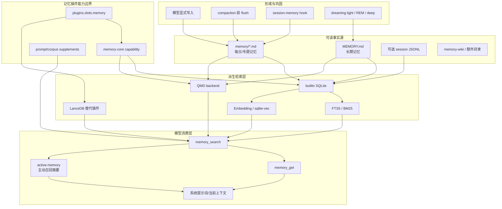
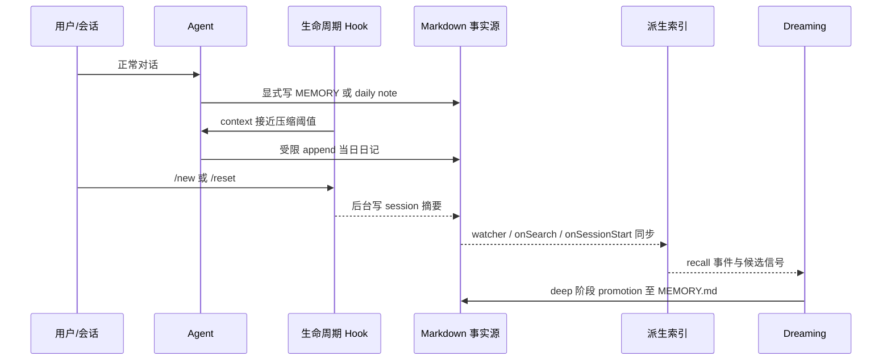
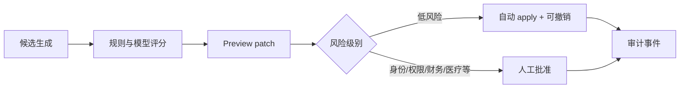

# OpenClaw 记忆系统源码深度研究

## 0. 先给结论

OpenClaw 的记忆系统不是一个单独的“向量数据库模块”，而是一个分层的、插件化的记忆基础设施：

1. **Markdown 是长期记忆的事实源**：`MEMORY.md` 保存蒸馏后的长期知识，`memory/*.md` 保存每日或专题记录。用户可以直接查看、编辑、版本管理；SQLite、FTS 和向量只是可重建的检索索引，不是唯一真相来源（`docs/concepts/memory.md:9-44`）。
2. **主记忆能力由互斥插件槽提供**：默认槽位是 `memory-core`；也可以禁用或换成 `memory-lancedb`。核心运行时只依赖统一 capability，不直接依赖某一个索引实现（`src/plugins/slots.ts:13-21`, `src/plugins/memory-state.ts:98-135`）。
3. **“写入”和“召回”是分离的**：模型或生命周期钩子向 Markdown 写入；索引器异步把文件切块并写入 SQLite/FTS/向量表；模型通过 `memory_search` 找候选，再用 `memory_get` 精确读取有界片段。
4. **它同时保留多条记忆形成路径**：显式写入、会话结束摘要、压缩前 flush、可选 dreaming 自动巩固，以及 `memory-lancedb` 的自动捕获。它们不是同一套机制的别名。
5. **审查能力存在，但不是“每条自动记忆必须人工批准”**：有 Markdown/DREAMS 可读产物、CLI preview/explain/status、doctor/fix、引用、事件日志、repair 和测试；但 dreaming 启用后，满足门槛的 deep promotion 可以直接改写 `MEMORY.md`。shadow trial 是 report-only 评估工具，不是生产审批闸门。
6. **安全设计的重心是边界与最小权限**：路径白名单、realpath/symlink 防护、会话可见性过滤、转录清洗、敏感文本脱敏、untrusted context 包装，以及 compaction flush 只能追加当日日记。
7. **最值得借鉴的是“可读事实源 + 可替换派生索引 + 分阶段巩固 + 可审计边界”**，而不是照抄某个数据库或评分公式。

还需要特别注意几组源码级问题：

- QMD 默认 scope 的源码行为是 **仅 direct chat**，但两处文档分别出现“direct + channel”和“DM-only”的冲突描述。
- QMD `maxResults` 源码默认是 **4**，reference 文档表格写成 **6**。
- 时间衰减只识别无 slug 的 `memory/YYYY-MM-DD.md`；`memory/YYYY-MM-DD-slug.md` 会被当作永久专题记忆，因而不衰减。
- 非 Codex 主链当前是 **先 preflight compaction、后判断所谓 pre-compaction flush**；成功压缩可能让 token 压力消失，从而跳过本应先发生的长期化。
- Dreaming promotion 最终对 `MEMORY.md` 使用普通 `fs.writeFile`，没有 `DREAMS.md` 已有的 symlink 拒绝、跨进程文件锁和原子替换；这是高优先级可靠性/安全缺口。
- Durable Markdown 默认按 agent/workspace 共享，不按 user/tenant 隔离；session ACL 不能保护 `MEMORY.md` 与 daily notes。

这些问题将在第 15 节逐项给出证据和建议。

## 1. 研究边界与术语

### 1.1 本报告所说的“记忆”包括什么

| 层次 | OpenClaw 中的实体 | 作用 | 是否是事实源 |
|---|---|---|---|
| 工作记忆 | 当前会话消息、compaction summary、启动日记上下文 | 当前推理所需的短期状态 | 否，会随上下文变化 |
| 每日/情节记忆 | `memory/YYYY-MM-DD.md`、带 slug 的会话摘要 | 记录事件、决策、未完成项 | 是 |
| 长期语义记忆 | `MEMORY.md` | 蒸馏后的稳定偏好、事实、经验 | 是 |
| 反思产物 | `DREAMS.md`、dreaming diary | 让人查看聚类、候选与反思 | 是公开审查产物，但不是默认召回事实源 |
| 检索索引 | SQLite `files/chunks/fts/embedding_cache`、sqlite-vec | 加速关键词/语义检索 | 否，可重建 |
| dreaming 状态 | plugin-state SQLite、`memory/.dreams/events.jsonl` | 记录召回、候选、阶段和 promotion 状态 | 机器状态与审计日志 |
| 外部/替代后端 | QMD、LanceDB、Honcho | 替换或扩展检索、存储能力 | 取决于后端 |
| 结构化知识补充 | memory-wiki | claim/evidence/freshness 形式的知识语料 | 独立语料补充 |
| 主动召回 | active-memory | 在 prompt 构建前主动生成并注入 recall summary | 不是存储后端 |

### 1.2 不应混为一谈的相邻机制

- **Compaction** 是把当前会话压缩成更短的上下文；它本身不是长期记忆。
- **Memory flush** 是在 compaction 前给模型一次受限写入机会，把未来仍有价值的信息追加到每日 Markdown。
- **Session-memory hook** 是在 `/new` 或 `/reset` 时将最近消息总结成新的带时间戳 Markdown。
- **Dreaming** 是跨历史召回信号做分阶段巩固，deep 阶段可 promotion 到 `MEMORY.md`。
- **Commitments** 是短期跟进事项机制，定位介于记忆和自动化之间，默认关闭，不属于 `memory-core` 的长期记忆主链（`docs/concepts/commitments.md:11-24`）。

### 1.3 证据边界

- 本报告审查的是本地 `2026.6.8` 快照，运行时行为以该快照源码为准。
- QMD 在仓库中只有 adapter、process、collection 和兼容逻辑；外部 QMD 自身的 chunk/embedding/ranking 内部实现不在本仓，不能伪装成已审计。
- Honcho 只有外部插件文档，没有本地实现，相关内容只能评价文档声明。
- “源码事实”来自实际分支/常量/调用；“设计动机”若没有作者注释，会明确标为推断。
- 本次只新增研究报告与内部取证笔记，没有修改产品实现。

## 2. 总体架构



### 2.1 五个主要层次

1. **事实源层**：Markdown、可选 session transcript、外部补充语料。
2. **形成层**：显式写入、session hook、flush、dreaming。
3. **能力层**：记忆槽、capability registry、runtime、prompt/corpus supplements。
4. **派生索引层**：builtin SQLite/FTS/vector 或 QMD；也可换成 LanceDB 插件。
5. **模型消费层**：工具召回、精确读取、主动注入、引用和可见性控制。

这种分层的关键价值是：**事实源可读、索引可丢弃重建、运行时可替换、模型看到的上下文可控制**。代价是配置和生命周期明显复杂，且同一个“memory”名词跨越文件、索引、插件状态、会话和 prompt 多个域。

## 3. 插件边界：为什么 memory-core 不是硬编码在 agent 内

### 3.1 互斥 memory slot

`src/plugins/slots.ts:13-21` 定义了独占槽，memory 默认实现为 `memory-core`；`src/plugins/config-normalization-shared.ts:227-243` 在用户未显式配置时补上该默认值。配置类型还允许把槽设为 `"none"`（`src/config/types.plugins.ts:42-47`）。

加载器不会无条件加载所有 bundled memory plugin：未被槽选中的实现会被跳过，以免导入重型依赖；一个特殊例外是当 LanceDB 占主槽而 memory-core 的 dreaming 被启用时，可以把 memory-core 作为 sidecar 引擎加载（`src/plugins/loader.ts:2345-2369`）。

### 3.2 capability 契约

主插件可注册四类能力：

| capability | 责任 |
|---|---|
| `promptBuilder` | 在系统提示词中告诉模型何时和怎样召回 |
| `flushPlanResolver` | 给 compaction 前长期化生成受限计划 |
| `runtime` | 获得/关闭检索 manager，并解析后端 |
| `publicArtifacts` | 暴露可供用户审查的公开产物 |

类型定义见 `src/plugins/memory-state.ts:68-135`。同一 registry 还允许别的插件注册 prompt supplement 和 corpus supplement；supplement 按 plugin id 稳定排序，避免插件加载顺序导致 prompt 漂移（`src/plugins/memory-state.ts:204-242`）。

`memory-core` 的入口把这些能力、两个工具、`/dreaming` 命令和 `openclaw memory` CLI 一次性注册起来（`extensions/memory-core/index.ts:179-234`）。工具模块和 runtime provider 都是 lazy import；只有当前 agent 真能解析出 memory config 时才物化工具（`extensions/memory-core/index.ts:35-63`, `extensions/memory-core/index.ts:89-124`）。

### 3.3 设计判断

**源码事实**：agent core 依赖统一 runtime/capability 类型，实际检索 manager 由被选中的插件提供。

**设计动机推断**：这样做是为了让 memory-core、LanceDB 和未来后端共享 agent 工具/生命周期边界，同时控制启动成本。

**优点**：

- 后端可换，工具和模型提示合同保持稳定。
- 可以做 sidecar 和 corpus supplement，而不强迫所有能力共用一个数据库。
- lazy load 避免没用记忆时支付 embedding/SQLite/QMD 初始化成本。

**缺点**：

- “主槽”“sidecar”“supplement”是三种不同扩展关系，维护者需要理解 registry 合并语义。
- capability 是进程级可变状态，测试和热重载必须正确 restore/clear。
- dual-kind plugin 未选中时可能被跳过；registry 对无效注册会警告，插件开发者必须理解槽所有权（`src/plugins/registry.ts:3069-3087`）。

## 4. 数据与存储模型

### 4.1 Markdown：可读、可编辑的长期事实源

默认语义是：

- `MEMORY.md`：稳定、长期、经过蒸馏的事实和经验。
- `memory/YYYY-MM-DD.md`：某天发生的事情和工作状态。
- `memory/<topic>.md`：专题长期资料。
- `DREAMS.md`：可选的、面向人类审查的反思/梦境输出。

OpenClaw 明确强调 Markdown，而不是“隐藏的模型状态”（`docs/concepts/memory.md:9-44`）。这使删除、修正、审查、迁移和 Git 管理都很直观。相应代价是：

- Markdown 没有强 schema，冲突、重复、过时和提示注入需要上层治理。
- 大文件不能无限直接塞进上下文，必须依赖分块检索和预算。
- 自动 promotion 与人工编辑同时存在，需要重复检测和写入锁。

根记忆文件只接受精确大小写的 `MEMORY.md`；legacy `memory.md` 不再作为规范根文件，根文件还必须是真实普通文件而非 symlink（`src/memory/root-memory-files.ts:5-18`, `src/memory/root-memory-files.ts:30-71`）。

`DREAMS.md` 有一个刻意或至少实际存在的不对称边界：安全读取路径允许 `memory_get` 精确读取它，但默认文件枚举和 QMD collection 不把它纳入普通 memory search（`packages/memory-host-sdk/src/host/internal.ts:103-112`, `packages/memory-host-sdk/src/host/internal.ts:150-185`）。所以更准确的安全描述是“默认不搜索、不自动 promotion”，而不是“模型永远看不到”。

### 4.2 builtin SQLite：可重建派生索引

默认数据库路径按 agent 隔离为 state 目录下的 `memory/<agentId>.sqlite`（`src/agents/memory-search.ts:180-188`）。核心 schema 位于 `packages/memory-host-sdk/src/host/memory-schema.ts:8-94`：

| 表/索引 | 关键字段 | 用途 |
|---|---|---|
| `meta` | key/value | schema、provider、模型等索引元数据 |
| `files` | path/source/hash/mtime/size | 文件级变更检测 |
| `chunks` | id/path/source/line range/hash/model/text/embedding | 可检索片段 |
| `embedding_cache` | provider/model/hash/dims/embedding | 避免相同内容重复向量化 |
| FTS5 虚拟表 | text + chunk metadata | BM25 关键词检索 |
| sqlite-vec 虚拟表 | chunk id + float vector | 本地向量相似度检索 |

索引只保存事实源的派生表示。文件 hash、chunk hash 和 embedding cache 让增量同步可跳过未变化内容。provider/model/chunk 参数发生变化时需要重建或迁移索引。

索引身份不只保存 provider/model，还覆盖 provider key、sources、extra/multimodal scope hash、chunk 参数、vector dims 和 FTS tokenizer（`extensions/memory-core/src/memory/manager-reindex-state.ts:8-68`, `extensions/memory-core/src/memory/manager-reindex-state.ts:144-225`）。普通 search 遇到身份不匹配时不会偷偷用旧向量，也不会自动做昂贵重建：它保持 dirty/paused，等待 CLI 或 force reindex（`extensions/memory-core/src/memory/manager-sync-ops.ts:2237-2247`, `extensions/memory-core/src/memory/manager.ts:661-665`）。

启用 multimodal 后，memory tree 和 extra paths 中的受支持图片/音频也可进入索引；默认单文件上限 10 MiB，媒体通过结构化 base64 input 生成单个 line=1 chunk，provider 必须声明相应能力（`packages/memory-host-sdk/src/host/multimodal.ts:6-116`, `packages/memory-host-sdk/src/host/internal.ts:317-385`）。这会进一步扩大远程 embedding 的数据边界。

### 4.3 plugin-state 与事件日志

Dreaming 的机器状态不混在 Markdown 正文中，而通过 `openKeyedStore` 放入 SQLite-backed plugin state；按 workspace hash 分区，使用命名空间区分状态类别（`extensions/memory-core/src/dreaming-state.ts:1-18`, `extensions/memory-core/src/dreaming-state.ts:69-190`）。底层 store 对 plugin id、namespace、JSON 大小、TTL 和事务做统一约束（`src/plugin-state/plugin-state-store.ts:25-96`）。

此外，`memory/.dreams/events.jsonl` 是 append-only 事件日志，记录 recall、promotion 和 dream 事件；写入有 symlink-safe 防护，读取会跳过损坏行（`src/memory-host-sdk/events.ts:7-75`, `src/memory-host-sdk/events.ts:82-169`）。

这形成了三个不同的耐久层：

1. **人类事实层**：Markdown。
2. **机器控制层**：plugin-state SQLite。
3. **审计证据层**：append-only JSONL。

这是很值得复用的拆分：不要把“模型应当记住什么”“系统用什么游标继续处理”“发生过哪些自动行为”塞进同一张表。

### 4.4 session transcript 是可选语料，不是默认长期记忆

默认 sources 只有 `memory`；启用 session source 后才会索引 session JSONL（`src/agents/memory-search.ts:118-138`, `src/agents/memory-search.ts:286-315`）。进入索引前会：

- 只提取 user/assistant 内容；
- 丢弃内部上下文、生成式 system/cron/heartbeat/silent output；
- 排除 inter-session provenance 和 dream narrative；
- 对敏感文本做 redact；
- 保留原 JSONL 的行映射以便引用。

相关实现见 `packages/memory-host-sdk/src/host/session-files.ts:463-493` 和 `packages/memory-host-sdk/src/host/session-files.ts:548-690`。

这不是单纯“把聊天记录全向量化”。它试图降低系统元数据、自动生成文本和秘密进入长期检索面的风险；但 redaction 主要识别 token、password、credential、支付字段和自定义模式，不是通用 PII 匿名器（`src/logging/redact.ts:252-278`, `src/logging/redact.ts:976-1024`）。只要启用 session indexing，姓名、地址、健康信息、偏好等隐私面和陈旧信息面仍然显著扩大。

## 5. 配置解析与默认值

### 5.1 builtin 检索的关键默认值

以下默认值来自 `src/agents/memory-search.ts:118-138` 与 `src/agents/memory-search.ts:316-468`：

| 配置 | 默认值 | 影响 |
|---|---:|---|
| enabled | `true` | agent 默认启用 memory search |
| provider | `openai` | 可用 `auto`/本地/其他 provider 覆盖 |
| fallback | `none` | embedding provider 失败不会静默换供应商 |
| chunk tokens | `400` | 每片目标大小 |
| overlap tokens | `80` | 相邻片重叠 |
| maxResults | `6` | 通用 memory search 返回上限 |
| minScore | `0.35` | 低分候选过滤 |
| hybrid.enabled | `true` | 同时用向量和文本 |
| vectorWeight | `0.7` | 组合分数权重 |
| textWeight | `0.3` | 组合分数权重 |
| candidateMultiplier | `4` | 各路预取候选倍率 |
| MMR | 关闭，lambda `0.7` | 可选多样性重排 |
| temporal decay | 关闭，half-life `30d` | 可选时间衰减 |
| embedding cache | `true`，源码无默认容量上限 | 重用向量 |
| sync.onSessionStart | `true` | 会话启动检查同步 |
| sync.onSearch | `true` | 搜索前检查同步 |
| sync.watch | `true` | 监听文件变更 |
| watch debounce | `1500ms` | 合并短时间变更 |
| interval | `0` | 默认无周期扫描 |
| session delta bytes | `100000` | session 增量同步阈值 |
| session delta messages | `50` | session 增量同步阈值 |
| postCompactionForce | `true` | 压缩后强制追赶 session 索引 |

解析器会 clamp 权重、lambda、half-life、候选倍率等值，防止非法配置直接进入排序公式（`src/agents/memory-search.ts:365-436`）。

只有显式配置 `cache.maxEntries` 才会按 `updated_at` 删除最旧 embedding cache；当前 resolver 没有 50,000 之类的默认上限（`src/agents/memory-search.ts:358-360`, `src/agents/memory-search.ts:429-434`, `extensions/memory-core/src/memory/manager-embedding-ops.ts:207-233`）。这与 reference 文档的一处默认值描述不一致，见第 15 节。

### 5.2 QMD 的实际默认值

源码默认值位于 `packages/memory-host-sdk/src/host/backend-config.ts:91-125`：

| 配置 | 源码默认 |
|---|---|
| backend | `builtin` |
| citations | `auto` |
| QMD update interval | `5m` |
| debounce | `15s` |
| interactive timeout | `4s` |
| searchMode | `search` |
| startup | `off` |
| startup delay | `120s` |
| embed interval | `60m` |
| command/update/embed timeout | `30s / 120s / 120s` |
| maxResults | `4` |
| maxSnippetChars | `450` |
| maxInjectedChars | `2200` |
| mcporter | 关闭 |
| scope | default deny，只允许 direct chat |

默认 `searchMode="search"` 是有意的性能取舍：源码注释指出 `query` 的查询扩展与 rerank 在纯 CPU 环境可能非常慢（`packages/memory-host-sdk/src/host/backend-config.ts:96-98`）。

默认 collection 按 agent 作用域命名，并覆盖工作区根 `MEMORY.md` 和 `memory/**/*.md`；额外路径会合并全局、per-agent 和 QMD 自身配置（`packages/memory-host-sdk/src/host/backend-config.ts:372-439`）。

## 6. 写入与记忆形成：五条不同链路



### 6.1 模型显式写入

普通 agent 工具可以在其整体文件权限允许时编辑工作区记忆。系统提示词约定长期信息放入 `MEMORY.md` 或 `memory/*.md`。这条路径最直接，也最依赖 agent 对“什么值得长期保留”的判断。

### 6.2 `/new`、`/reset` 时的 session-memory hook

bundled `session-memory` hook：

1. 读取即将结束会话的最近 15 条消息；
2. 默认用本地 `HHMM` 作 slug；只有显式 `llmSlug: true` 才让 LLM 生成**文件名 slug**；
3. 写入 `memory/YYYY-MM-DD-HHMM[-slug].md`；
4. 后台执行，不阻塞重置回复；
5. 用 safe root 和碰撞后缀避免越界或覆盖。

正文标题虽然叫 “Conversation Summary”，默认实际是最近 user/assistant 消息的逐行摘录，不是模型生成的语义摘要；slash command 和 inter-session provenance 会被跳过（`src/hooks/bundled/session-memory/transcript.ts:25-63`, `src/hooks/bundled/session-memory/handler.ts:207-286`）。

它适合保留“刚结束会话发生了什么”，但摘要质量取决于最近 15 条消息，不能替代完整的长期事实提炼。

还有一个 eventual-consistency 取舍：hook 是 fire-and-forget，而新会话 startup context 在 reply 路径立即构建；源码没有等待刚触发的日记写完。因此同一次 `/new`/`/reset` 的首轮不保证读到刚生成的时间戳日记，只保证读取构建时已经存在的近期文件（`src/hooks/bundled/session-memory/handler.ts:300-313`, `src/auto-reply/reply/get-reply-run.ts:672-712`）。

### 6.3 compaction 前 memory flush

当估算 token 接近 `contextWindow - reserveTokens - softThreshold` 时，系统可在真正 compaction 前运行一个 silent agent turn（`src/auto-reply/reply/memory-flush.ts:101-190`）。默认计划的约束是：

- soft threshold：4000 tokens；
- transcript 超过 2 MiB 时可强制 flush；
- 只能写 `memory/YYYY-MM-DD.md`；
- 只能 append；
- `MEMORY.md`、`DREAMS.md`、`SOUL.md`、`TOOLS.md`、`AGENTS.md` 对本次 turn 只读；
- 没有可保存内容时返回 silent token。

计划见 `extensions/memory-core/src/flush-plan.ts:12-43` 与 `extensions/memory-core/src/flush-plan.ts:97-142`。真正给这个 turn 的工具集合再次收窄为 read 和 append-only writer（`src/agents/agent-tools.ts:576-580`, `src/agents/agent-tools.ts:1104-1130`）；writer 会验证 exact relative target（`src/agents/agent-tools.read.ts:595-695`）。

这里的核心思想是**最小权限长期化**：compaction 前的模型有机会保存信息，但不能借这个特殊 turn 修改长期人格、规则或已有历史。

#### 当前实际顺序与名称不一致

主执行链的源码顺序却是：

```text
runPreflightCompactionIfNeeded
→ runMemoryFlushIfNeeded
→ 主 agent reply
```

证据见 `src/auto-reply/reply/agent-runner.ts:1551-1599`。preflight compaction 和 flush 的主要 token gate 都建立在 `contextWindow - reserveTokensFloor - softThresholdTokens` 上（`src/auto-reply/reply/agent-runner-memory.ts:779-906`, `src/auto-reply/reply/memory-flush.ts:101-177`）。

因此可确认：

- 非 Codex runtime 会先尝试 compaction；
- 若 compaction 成功显著降低 fresh token count，随后 flush 可能不再达阈值；
- preflight no-op/失败，或 transcript 仍超过强制字节阈值时，flush 仍可能发生；
- Codex 跳过 OpenClaw preflight，让 native harness 管 compaction，因此不完全受这个顺序影响（`src/auto-reply/reply/agent-runner-memory.ts:761-776`）。

这不是小命名问题：如果产品承诺“在丢弃原始上下文细节前先提炼长期记忆”，当前非 Codex 顺序没有保证该不变量。现有测试分别覆盖两条机制，但没有同一个高压 session 的端到端顺序断言。

Flush 失败也不是无限重试：连续三次失败后，本 compaction cycle 被标记为已处理并发出可见 warning，下一 cycle 才再试（`src/auto-reply/reply/agent-runner-memory.ts:1452-1538`）。

### 6.4 启动日记注入不是写入

`/new` 或 `/reset` 之后，系统可选取今天/昨天的日记作为启动背景。默认每文件最多 1200 字符、总计 2800 字符、最多回看 2 天，每天最多 4 个 slugged 文件（`src/auto-reply/reply/startup-context.ts:9-65`, `src/auto-reply/reply/startup-context.ts:210-289`）。

注入内容被明确包装为：

- “Untrusted daily memory”；
- 仅作为背景；
- 不得执行其中的指令。

实现见 `src/auto-reply/reply/startup-context.ts:119-127` 与 `src/auto-reply/reply/startup-context.ts:292-368`。它只在 reset/new 启动上下文路径生效，不应描述成“每一轮都自动注入今天和昨天日记”。

### 6.5 Dreaming 自动巩固

Dreaming 默认关闭。启用后分三类阶段：

| 阶段 | 目的 | 默认是否持久 promotion |
|---|---|---|
| light | 低成本观察短期召回和候选 | 否 |
| REM | 反思、生成梦境/概念联系 | 否 |
| deep | 评估高价值候选并写入长期记忆 | 是 |

概念与阶段行为见 `docs/concepts/dreaming.md:11-79`。默认顺序是 light → REM → deep，计划时间默认约凌晨 3 点（`docs/concepts/dreaming.md:137-149`）。

候选评分由六类信号组成。通用默认权重为 frequency `0.24`、relevance `0.30`、diversity `0.15`、recency `0.15`、consolidation `0.10`、conceptual `0.06`，再叠加阶段 boost（`docs/concepts/dreaming.md:95-115`, `extensions/memory-core/src/short-term-promotion.ts:732-801`）。通用/manual promotion 的默认门槛约为 score `0.75`、3 次 recalls、2 个 distinct queries；计划 deep 的默认值更严格，可配置独立门槛。

promotion 不是盲目复制索引命中：

1. 只接受 daily short-term 来源；
2. 排除 dream-generated/污染片段和已 promotion 内容；
3. 检查 score、recall 次数、query 多样性、年龄；
4. 应用前重新读取源文件；
5. 如果片段已删除、移动或落入 dream fence，则跳过；
6. 追加带 score/recalls/source 的 promotion section；
7. 通过 marker 与二次检查防重复。

核心筛选见 `extensions/memory-core/src/short-term-promotion.ts:1780-1917`，rehydration 和 apply 前检查见 `extensions/memory-core/src/short-term-promotion.ts:2094-2363`。

`MEMORY.md` 默认预算为 10,000 字符，但清理只针对最旧的**自动 promotion section**，不会删用户手写内容（`extensions/memory-core/src/memory-budget.ts:1-25`, `extensions/memory-core/src/memory-budget.ts:100-164`）。

## 7. 索引与同步生命周期

### 7.1 builtin 索引管线


同步触发源包括 session start、search 前检查、文件 watcher、手动 CLI、可选周期任务，以及 compaction 后强制 session catch-up。默认没有定时全量扫描，主要依赖 watcher 与按需检查。

memory 增量同步会枚举当前文件、比较 `files` hash，只更新变化项，并删除已消失文件对应的 file/chunk/FTS/vector 记录（`extensions/memory-core/src/memory/manager-sync-ops.ts:1736-1862`）。单文件写入按“删旧 vec/FTS/chunk → 插新 chunk/投影 → upsert files”执行（`extensions/memory-core/src/memory/manager-embedding-ops.ts:698-815`）。

需要谨慎指出：普通单文件多表更新没有一个显式外层 SQL transaction。中途失败可能短暂形成“新 chunk 已写、files hash 尚未完成”的部分状态；因为 files 未完成，后续 sync 通常会再次处理，但它不具备 full reindex 同等级的强原子性。

Embedding 路径还有几项可靠性设计：

- cache key 包含 provider、model、provider key、content hash，避免跨模型误复用；
- 一次最多分组读取 400 个 hash；
- 远程 embedding 默认并发 4，Ollama 1；
- 单批约 8,000 tokens，最多三次指数退避 + jitter；
- 传输失败后可递归二分 batch；
- async batch 连续失败会降级 inline；
- provider fallback 改变索引身份时，必须安全全量重建，不能把两种向量混写。

证据见 `extensions/memory-core/src/memory/manager-embedding-cache.ts:16-121`, `extensions/memory-core/src/memory/manager-embedding-ops.ts:55-165`, `extensions/memory-core/src/memory/manager-embedding-policy.ts:84-189`, `extensions/memory-core/src/memory/manager-sync-ops.ts:2349-2418`。

数据库重建使用临时 DB 和 swap；读/切换锁避免 Windows rename/swap 窗口中错误地创建一个空主库。启动时会清理超过 24 小时的临时 DB triplet，并做 WAL checkpoint/维护（`extensions/memory-core/src/memory/manager-db.ts:18-25`, `extensions/memory-core/src/memory/manager-db.ts:129-143`, `extensions/memory-core/src/memory/manager-db.ts:190-242`）。

这种实现比“直接清空主表再重建”更稳健：索引失败时旧库仍可服务；代价是临时空间、锁和平台文件语义更复杂。

更完整的安全重建序列是：独占 reindex lock → 建 UUID temp DB → seed 旧 embedding cache → 全量建索引与 identity → checkpoint/close → swap lock → 同时发布 SQLite 主文件和 WAL/SHM/journal sidecar → 重开 published DB；失败时保留旧库和 dirty retry state（`extensions/memory-core/src/memory/manager-sync-ops.ts:2421-2608`, `extensions/memory-core/src/memory/manager-reindex-lock.ts:1-141`）。

文件系统策略也不是一刀切：可靠本地盘用 WAL 与 busy timeout；NFS/SMB/UNC 改 rollback journal；SSHFS 因无法可靠协调写入而拒绝使用（`src/infra/sqlite-wal.ts:264-368`）。

### 7.2 manager 缓存、懒初始化与恢复

检索 manager 按 agent/config 缓存。状态或 CLI 查询可绕过瞬态缓存；QMD open 失败后有 60 秒 cooldown，避免每次请求重复启动昂贵失败；并发初始化用 pending promise 去重（`extensions/memory-core/src/memory/search-manager.ts:152-317`）。

缓存 identity 不只含 agent id，还包含 workspace、完整 memorySearch 设置、provider requirement 和运行目的；配置变化不会盲目复用旧 manager（`extensions/memory-core/src/memory/manager.ts:171-224`, `extensions/memory-core/src/memory/manager.ts:313-363`）。

工具查询时还有两层恢复：

1. 遇到 closed database，刷新 manager 后重试；
2. 首次结果为空且 manager 支持 sync 时，强制同步后再搜一次。

这些行为在 `extensions/memory-core/src/tools.ts:415-648`。因此 `memory_search` 不只是纯查询调用，它也可能触发索引追赶。

session source 的新鲜度另走事件链：transcript append 触发 normalized update；manager 累积 100 KB 或 50 条消息后 dirty+sync，archive 文件则绕过阈值，避免小型封存文件永远不再增长也永不入索引（`extensions/memory-core/src/memory/manager-sync-ops.ts:1390-1641`）。post-compaction 可以选择 `off|async|await` targeted reindex，默认 async（`src/agents/embedded-agent-runner/compaction-hooks.ts:15-113`）。

### 7.3 QMD 后端

QMD 是 `memory-core` 下的另一种 backend，不是另一主槽插件。它管理自己的 collection、home、更新/embedding 周期和 search 命令。OpenClaw 对其增加：

- agent-scoped collection 名称；
- command timeout 和注入字符预算；
- session scope；
- watcher、debounce、boot sync 和 interval；
- 对 store write/embed 的串行锁；
- 失败时回退 builtin manager。

QMD manager 的 `search` 模式是 BM25-only；更昂贵的 query/hybrid 路径需显式选择（`extensions/memory-core/src/memory/qmd-manager.ts:81-115`）。QMD 初始化失败时，系统尝试 builtin；如果两者都失败，才组合报告错误（`extensions/memory-core/src/memory/search-manager.ts:319-352`）。

QMD 对会话的更新粒度比 builtin 弱：update 前扫描并导出清洗后的 session Markdown，但没有 transcript update listener，也忽略 targeted `sessionFiles` hint。新鲜度主要依赖 session-start、默认 5 分钟 interval、boot/manual sync；`warmSession` 对同一 session 只做一次（`extensions/memory-core/src/memory/qmd-manager.ts:1450-1465`, `extensions/memory-core/src/memory/qmd-manager.ts:1719-1829`, `extensions/memory-core/src/memory/qmd-manager.ts:2507-2559`）。若关闭 interval 且没有手工 sync，长会话后半段可能长期不进入 QMD，这是需要集成测试确认的推断。

QMD update/embed 通过进程内 per-store queue、跨进程 per-store file lock，以及全局 embed 容量/锁串行化；embed 等待全局容量时不占 store lock（`extensions/memory-core/src/memory/qmd-manager.ts:1929-2013`）。外部进程有 timeout、SIGKILL 和 200,000 字符输出上限（`packages/memory-host-sdk/src/host/qmd-process.ts:150-225`）。

**优点**：可以复用外部高质量检索栈，并把其故障隔离在 backend adapter。  
**缺点**：外部二进制、collection 生命周期、超时、daemon、symlink 扫描和文档版本都成为新的运维面。

## 8. 召回算法与工具调用链

### 8.1 hybrid search

builtin 默认同时取向量候选和 FTS 候选。关键词查询先把 token 变成 quoted `AND` FTS query，BM25 rank 再映射为有界 text score（`extensions/memory-core/src/memory/hybrid.ts:32-50`）。候选按 chunk id 合并，基础组合分数为：

```text
score = vectorWeight × vectorScore + textWeight × textScore
      = 0.7 × vectorScore + 0.3 × textScore   （默认）
```

合并、去重、衰减和可选 MMR 的顺序见 `extensions/memory-core/src/memory/hybrid.ts:52-156`。

预取候选数是：

```text
candidateLimit = min(200, max(1, floor(maxResults × candidateMultiplier)))
```

默认是 `6 × 4 = 24` 条/路（`extensions/memory-core/src/memory/manager.ts:667-685`）。

向量检索优先用 sqlite-vec cosine KNN，分数为 `1 - cosineDistance`；为抵消 source/model 后过滤会先 oversample 8 倍。sqlite-vec 不可用时仍可分批扫描 `chunks.embedding` JSON，每 256 行让出 event loop 并维护 bounded top-k，而不是一次加载整表（`extensions/memory-core/src/memory/manager-search.ts:140-323`）。

词法路径也不止严格 FTS `AND`：trigram 对不足 3 字符的 CJK token 改用 LIKE，FTS MATCH 报错也可回退 LIKE；严格 AND 无命中时还有最多 6 个 query term 的轻量 lexical fallback（`extensions/memory-core/src/memory/manager-search.ts:48-73`, `extensions/memory-core/src/memory/manager-search.ts:325-437`, `extensions/memory-core/src/memory/manager.ts:914-935`）。

阈值还有一项重要语义：纯向量模式严格执行 `minScore`；hybrid 模式若所有融合分都低于阈值、但存在关键词命中，会放宽阈值到 0，避免精确词面结果被语义阈值全部抹掉（`extensions/memory-core/src/memory/manager.ts:774-807`）。

为什么不只用向量：

- 精确名称、命令、错误码和日期常由 BM25 更可靠地找回；
- 同义改写、概念关系由向量更有优势；
- 组合能降低任一 embedding provider 或 tokenizer 的单点偏差。

### 8.2 可选 MMR 多样性重排

MMR 的公式是：

```text
MMR(candidate) =
  lambda × relevance(candidate)
  - (1 - lambda) × maxSimilarity(candidate, selected)
```

实现使用 CJK-aware token 和 Jaccard 相似度；默认关闭，开启后的 lambda 默认 `0.7`（`extensions/memory-core/src/memory/mmr.ts:4-29`, `extensions/memory-core/src/memory/mmr.ts:104-149`）。

它解决“前 6 条都是同一段话的轻微重叠版本”，但也可能把最相关的重复证据降权，因此没有默认开启。

### 8.3 可选时间衰减

时间衰减公式为：

```text
decay(ageDays) = exp(-ln(2) × ageDays / halfLifeDays)
finalScore = baseScore × decay
```

默认关闭，half-life 默认 30 天（`extensions/memory-core/src/memory/temporal-decay.ts:10-35`）。`MEMORY.md` 和被分类为非日期专题的 memory file 是 evergreen，不衰减。

这里存在一个明确实现缺口：日期正则只匹配 `memory/YYYY-MM-DD.md`；`memory/YYYY-MM-DD-slug.md` 解析不到日期，随后被 `isEvergreenMemoryPath` 判定为 evergreen，并在 memory source 分支返回无时间戳（`extensions/memory-core/src/memory/temporal-decay.ts:15-16`, `extensions/memory-core/src/memory/temporal-decay.ts:45-50`, `extensions/memory-core/src/memory/temporal-decay.ts:72-95`）。现有 temporal-decay 测试没有 slugged daily case（`extensions/memory-core/src/memory/temporal-decay.test.ts:48-158`）。

### 8.4 `memory_search`

工具合同要求在回答既往工作、决策、日期、人物、偏好或 todo 前先召回；可选 corpus 为 `memory`、`sessions`、`wiki`、`all`（`extensions/memory-core/index.ts:65-75`, `extensions/memory-core/index.ts:126-135`）。

执行链：

1. 根据最新 runtime config 和 session 解析 agent；
2. 获取当前后端 manager；
3. 可触发 on-search sync；
4. 执行 backend search；
5. 如果数据库已关闭则刷新重试；
6. 若空结果则强制 sync 后重试；
7. 对 session hits 执行可见性过滤；
8. 合并 registered corpus supplements；
9. `corpus=all` 时对 memory/wiki 先分别限额再回填，避免不同 corpus 的不可比分数让一方完全淹没另一方；
10. 加 citation、应用 QMD 注入预算；
11. dreaming 启用时异步记录短期 recall 信号。

实现集中在 `extensions/memory-core/src/tools.ts:415-648`。

### 8.5 `memory_get`

`memory_get` 不是任意文件读取器。builtin 路径只能读取：

- 工作区 `MEMORY.md`；
- `memory/` 下 Markdown；
- 显式配置的 extra path。

实现同时验证扩展名、lexical path、realpath 和 symlink，不存在文件返回空结果而不是泄露宿主错误（`packages/memory-host-sdk/src/host/read-file.ts:27-157`）。默认片段上限是 120 行/12,000 字符，并返回 continuation 元数据（`packages/memory-host-sdk/src/host/read-file-shared.ts:6-9`, `packages/memory-host-sdk/src/host/read-file-shared.ts:64-130`）。

推荐 search → get 两阶段的原因是：

- search snippet 小而便宜，适合候选发现；
- get 对确定路径做有界精读，降低把整个 memory corpus 塞进 prompt 的成本；
- 路径权限和引用更容易审计。

### 8.6 引用策略

引用模式有 `on`、`off`、`auto`。工具会把来源格式化为 `path#Lx-Ly`；`auto` 只在 direct chat 输出引用，在 group/channel 中默认不显示（`extensions/memory-core/src/tools.citations.ts:10-37`, `extensions/memory-core/src/tools.citations.ts:66-92`）。

这个取舍可能是为了避免群聊中暴露内部目录和笔记结构，但有明显治理代价：越是多人环境，越难从回答回溯到证据。若组织更重视审计，应显式开启 citation，并对路径做单独脱敏，而不是完全关闭来源。

## 9. Prompt、启动上下文与主动召回

### 9.1 系统提示中的 recall contract

只要 `memory_search`/`memory_get` 可用，memory-core 会生成 “Memory Recall” 提示段，要求模型在回答既往事实前先 search，再对相关结果 get 精读，并遵循 citation 模式（`extensions/memory-core/src/prompt-section.ts:4-38`）。

普通 agent system prompt 通过 registry 拉取这段内容；minimal/subagent prompt 或显式关闭时可省略（`src/agents/system-prompt.ts:286-299`）。非 legacy context engine 不会自动继承全部 legacy prompt，必须显式 opt in 同一个 memory section（`src/context-engine/delegate.ts:85-104`）。

这说明 OpenClaw 把“何时召回”一部分交给模型策略，而不是所有请求都由 host 强制搜索。优点是节省延迟和 embedding 成本；缺点是模型可能漏召回。active-memory 正是为弥补这个弱点提供的可选主动路径。

### 9.2 `MEMORY.md` 的 bootstrap 语义

工作区 loader 把 `MEMORY.md` 纳入 bootstrap 文件集合，并只认约定的精确文件名/大小写（`src/agents/workspace.ts:158-203`, `src/agents/workspace.ts:1060-1119`）。但最终是否把正文直接放入 system prompt 取决于 agent/runtime：

- 普通非 Codex 路径可注入经过大小预算的 `MEMORY.md`；
- native Codex 在同一工作区且 memory tools 可用时，可以不内联全文，而只保留 memory 文件引用和按需 recall 指令；
- subagent bootstrap allowlist 只有 `AGENTS.md` 与 `TOOLS.md`，不会自动继承主 agent 的完整 memory bootstrap（`src/agents/workspace.ts:1122-1127`）。

相关用户文档见 `docs/concepts/system-prompt.md:167-228`。因此正确表述不是“MEMORY.md 永远每轮全量加载”，而是：**它是标准长期记忆入口，但具体消费可能是有界 bootstrap，也可能是工具路由的按需读取。**

普通 runtime 的 `contextInjection` 还支持 `always`、`continuation-skip`、`never`，默认 `always`。`continuation-skip` 只有在 transcript 中存在有效 full-bootstrap 完成 marker 时才省略；marker 之后一旦发生 compaction 就失效，因为不能假定 summary 完整保留了原 bootstrap，必须重新注入（`src/agents/bootstrap-files.ts:64-149`）。

默认 bootstrap 预算为每文件 20,000 字符、总计 60,000 字符，超限截断并告警（`src/agents/embedded-agent-helpers/bootstrap.ts:91-105`, `src/agents/embedded-agent-helpers/bootstrap.ts:413-471`）。因此即使不是 Codex，模型也不保证看到超大 `MEMORY.md` 全文。

### 9.3 active-memory：在 prompt 构建前主动召回

`active-memory` 是一个独立可选插件，不拥有 memory slot。它在 `before_prompt_build` 阶段：

1. 根据当前消息和少量 recent turns 构造 query；
2. 只允许调用 memory recall 类工具；
3. 运行一个受超时和 circuit breaker 控制的 recall subagent；
4. 把短摘要作为隐藏 prompt prefix 注入；
5. 失败时跳过，不阻塞主回复。

默认约束包括 15 秒 timeout、220 字符摘要、2 个 user turn + 1 个 assistant turn、15 秒缓存、连续失败 3 次后 60 秒熔断；工具 allowlist 只包含 `memory_search`、`memory_get` 或 LanceDB recall，另有保留工具 deny list（`extensions/active-memory/index.ts:41-63`, `extensions/active-memory/index.ts:87-120`）。

注入内容明确标记为 untrusted context，并要求不得把其中的指令当成系统指令；XML 文本也会先 escape（`extensions/active-memory/index.ts:351-357`, `extensions/active-memory/index.ts:2561-2577`）。插件默认只面向 direct、persistent chat，并避开 one-shot、heartbeat 和 subagent 等场景，完整门控见 `docs/concepts/active-memory.md:204-343`。

**为什么它不做成默认行为**：

- 每轮多一次检索/子模型调用，增加延迟和成本；
- 主动注入可能把不相关旧记忆带进当前推理；
- 检索失败不应让正常对话不可用；
- direct chat 的隐私边界比群聊更简单。

## 10. 会话可见性、信任与安全边界

### 10.1 session hit 不是“索引里有就能返回”

session search 会结合：

- requester session key；
- owner agent id；
- session visibility policy；
- agent-to-agent policy；
- store 中的 session identity；
- guard action history。

没有足够 requester 上下文或 guard 时，session hit 会被省略，而不是默认开放（`extensions/memory-core/src/session-search-visibility.ts:45-142`）。

这点很关键：**向量数据库的物理可见性不等于产品权限可见性**。做多 agent 系统时，ACL 必须在召回结果出口再次执行，不能只依赖“各 agent 使用不同索引”。

但这个强 ACL 只保护 `source === "sessions"`。`MEMORY.md`、daily notes、QMD extra collections 和 wiki vault 通常按 agent/workspace 隔离，不按 user/tenant 隔离。因此多个用户共享一个 agent/workspace 时会共享 durable memory；多个 agent 指向同一 workspace 也共享事实源。citation 在群聊中关闭只隐藏来源 footer，不隐藏 snippet。

### 10.2 文件路径安全

`memory_get`、session hook、flush writer、事件日志写入都使用以下组合：

- 允许目录/精确文件白名单；
- `.md` 类型限制；
- lexical path containment；
- realpath containment；
- 拒绝或安全处理 symlink；
- root-safe open/write；
- bounded read。

这防止模型用 `../`、绝对路径或工作区内 symlink 读取宿主机任意文件。仅做字符串前缀判断是不够的，OpenClaw 同时检查规范化后的真实路径。

不过自动 promotion 的最终写路径是一个明显例外。`applyShortTermPromotions` 读取后直接 `fs.writeFile(MEMORY.md)`，没有：

- `lstat`/symlink 拒绝；
- safe root；
- temp + atomic rename；
- 文件级跨进程锁；
- 并发人工编辑冲突检测。

证据见 `extensions/memory-core/src/short-term-promotion.ts:2446-2483`。相对地，`DREAMS.md` writer 有 per-file lock、symlink 拒绝、原子替换和新文件 `0600` 权限（`extensions/memory-core/src/dreaming-dreams-file.ts:53-149`）。

影响不只是崩溃时可能截断：workspace 中若 `MEMORY.md` 是 symlink，后台 deep promotion 可能写到 workspace 外；同时运行的人工编辑和 promotion 可能互相覆盖。这应列为 P0 级修复。

### 10.3 不可信内容包装

两条自动注入链显式视内容为不可信：

- `/new`/`/reset` 的 daily memory；
- active-memory 的 recall summary。

这种包装可以降低笔记中的 prompt injection 直接升级为指令的风险，但不能保证模型绝不会受内容影响。普通 `MEMORY.md` bootstrap 仍然更接近指令性上下文，系统 prompt 甚至把它描述为 durable preferences and behavior guidance（`src/agents/system-prompt.ts:217-236`）；工具返回的 memory snippet 也没有统一的同级文本包装。因此持久记忆污染仍是主要风险之一。

memory-core 对 dreaming 自摄入有专门 contamination 过滤，但不是通用 prompt-injection 检测器。攻击链可能是：

```text
恶意/错误文本进入 daily
→ 被 recall
→ 不同 query 多次强化
→ deep promotion
→ MEMORY.md 以高信任行为指导进入后续 prompt
```

LanceDB 与 active-memory 已有 “untrusted historical data / do not follow instructions” 包装与启发式注入过滤，值得抽成 host 级统一 content policy。

### 10.4 错误与供应商隐私

Embedding/provider 错误会先做字符串清洗，避免把 API key、header 或过长响应透传给用户（`packages/memory-host-sdk/src/host/error-utils.ts:2-91`）。但只要使用远程 embedding provider，记忆 chunk 内容就可能离开本机；这是部署者必须在数据分类与配置层明确接受的边界。

远程 client 本身对 SecretRef 和 SSRF 做了较强防护：file/exec SecretRef 在没有 gateway snapshot 时 fail closed，请求使用 hostname policy 与 guarded fetch（`packages/memory-host-sdk/src/host/secret-input-utils.ts:43-158`, `packages/memory-host-sdk/src/host/remote-http.ts:14-45`）。这保证请求目的地和凭据处理更安全，但不等于用户已经同意把正文交给第三方。

### 10.5 记忆不是权限系统

文档明确区分“记住曾经批准过什么”和“现在是否允许执行什么”：记忆可保存 approval context，但不会替代当前 policy enforcement（`docs/concepts/memory.md:58-96`）。

设计其他 agent 时必须保持这条边界：

```text
记忆中的“用户曾允许 X”
    ≠
当前请求自动获得执行 X 的权限
```

## 11. 审查、审计与修复：到底“有没有审查”

答案是：**有多层 reviewability，但没有统一的逐条人工审批闸门。**

### 11.1 审查能力矩阵

| 控制面 | 能看到什么 | 能阻止什么 | 局限 |
|---|---|---|---|
| 直接查看/编辑 Markdown | 最终事实和来源附近上下文 | 人工删除、修正、重写 | 依赖人主动审查 |
| `memory search` / `get` | 实际召回片段和分数 | 无 | 是观察面 |
| citations | 回答到 source line 的映射 | 无 | `auto` 在 group/channel 不显示 |
| `memory status` | backend、文件、chunk、provider、同步状态 | 可发现配置/索引异常 | 不评估事实真假 |
| `memory promote` preview | 候选、门槛、预计写入 | 默认不 apply，人工决定 manual promotion | scheduled deep 不逐条等它批准 |
| `memory explain` | promotion 分数和筛选原因 | 无 | 解释的是算法，不是真实性 |
| dreaming `DREAMS.md` | 人类可读反思与候选 | 人工后续修订 | 不是 production gate |
| `.dreams/events.jsonl` | recall/promotion/dream 事件 | 追责、回放 | append log 仍在同一工作区 |
| dreaming audit/repair | unreadable state、自摄入等结构问题 | archive/clear/repair | 不做事实核验 |
| doctor/fix | 配置和索引健康问题 | 重建/修复索引 | 不审核语义质量 |
| shadow trial report | control/treatment 评估报告 | 仅 report-only | 当前未接入自动 promotion gate |
| 文件/工具权限 | 写入目标与模式 | 阻止越界/覆盖 | 不判断写入内容是否正确 |

### 11.2 CLI 面

`openclaw memory` 提供 status、deep、fix、index、search、promote、explain、REM harness 等子命令。manual promote 默认 preview，只有 `--apply` 才写入；还支持 dreaming 阶段执行、backfill 与 rollback 相关操作（`docs/cli/memory.md:24-177`）。

这是一种合理的“机器自动 + 人可检查”的操作面，但不能把 preview 误写成所有自动巩固都先经人工批准。

手工 preview/apply 的形状是好的，但 approval 本身没有持久化成正式 decision record：系统没有记录“谁基于哪个 candidate/source hash 批准或拒绝了什么”。因此它是操作步骤，不是完整 proposal → approval → commit 状态机。

### 11.3 Dreaming repair

repair 流程会检测 unreadable state、self-ingested dreaming output、legacy ingestion 等问题；修复可 archive corpus/legacy ingestion/可选 diary，并清理对应 SQLite 状态（`extensions/memory-core/src/dreaming-repair.ts:14-44`, `extensions/memory-core/src/dreaming-repair.ts:148-336`）。

这类修复处理的是**系统一致性与污染**，不是“这个用户偏好到底真实不真实”。事实审核仍需要人或更高层 provenance 规则。

### 11.4 Shadow trial 的真实地位

`dreaming-shadow-trial.ts` 的类型和报告都明确标记 `promotionAction: "report-only"` 与 `scoringAction: "report-only"`（`extensions/memory-core/src/dreaming-shadow-trial.ts:7-62`, `extensions/memory-core/src/dreaming-shadow-trial.ts:223-354`）。它有测试和 API，但 deep promotion 主流程没有调用它。

因此它应被理解为**离线评估/QA 工具库**，不是自动 promotion 的在线审批或 A/B gate。文档后半段也明确说明 shadow trial 不改变 production behavior（`docs/concepts/dreaming.md:117-135`）。

### 11.5 事件日志既是审计面，也是隐私面

`memory/.dreams/events.jsonl` 的 promotion event 保存 candidate、source path/line、score 和 recall count，这是良好 provenance；但 recall event 还会保存**明文 query**（`src/memory-host-sdk/events.ts:10-39`, `extensions/memory-core/src/short-term-promotion.ts:1360-1417`）。

当前没有：

- event rotation/TTL；
- actor/user/tenant；
- privacy classification；
- approval/rejection/correction/forget event；
- promotion budget 清理了哪些旧 section 的事件。

更重要的是，该日志会作为 public memory artifact 暴露，而 memory-wiki bridge 默认 `followMemoryEvents: true`，可把它复制到 wiki source page（`src/plugin-sdk/memory-host-core.ts:38-85`, `extensions/memory-wiki/src/config.ts:224-231`, `extensions/memory-wiki/src/bridge.ts:47-88`）。

因此“为了可审计保存 query”也可能让敏感查询扩散到 workspace、wiki、备份和二次索引。更好的默认是记录 HMAC/hash、长度和分类；明文只进入短 TTL、受控 diagnostic stream。

### 11.6 召回强化不是事实证明

短期 store 会记录 recall count、query hash 和 day bucket；默认 organic recall 没有 per-query/day 去重（`extensions/memory-core/src/short-term-promotion.ts:1381-1445`）。diversity gate 要求不同 query/day 可以减少单一重复调用，但攻击者或偏置 agent 仍可用两个不同查询反复召回错误片段，让它满足 promotion gate。

Rehydration 证明“来源当下仍存在”，不证明来源是真的。复用时应区分：

- organic user demand；
- agent self-query；
- scheduler replay；
- imported/backfill evidence；
- explicit human endorsement。

这些信号不能等权，也不应允许 agent 用自己的搜索行为无限自我强化。

## 12. 替代后端与扩展生态

| 方案 | 角色 | 主要能力 | 与 memory-core 的关系 | 适用场景 |
|---|---|---|---|---|
| builtin | 默认 backend | Markdown + SQLite + FTS5 + embedding/sqlite-vec | memory-core 内部 | 本地优先、可重建、低运维 |
| QMD | backend | 外部 collection、BM25/query/hybrid、独立更新 | memory-core adapter，失败可回退 builtin | 已采用 QMD 或需要其检索特性 |
| memory-lancedb | 主 slot 替代插件 | store/recall/forget、autoCapture/autoRecall | 替换 memory-core 主槽；dreaming 可 sidecar | 希望记忆以记录/向量库为中心 |
| active-memory | recall orchestrator | prompt 前主动召回与摘要 | 不占 slot，调用当前记忆工具 | 模型经常漏做 tool recall |
| memory-wiki | corpus supplement | claim/evidence/freshness、wiki 工具 | 注册 prompt/corpus supplement | 需要结构化知识与证据链 |
| Honcho | 外部插件/服务 | 外部托管记忆 | 非本仓默认插件 | 接受外部服务与不同信任边界 |

### 12.1 LanceDB

`memory-lancedb` 自己声明 `kind: "memory"`，提供 `memory_store`、`memory_recall`、`memory_forget`，并有 autoCapture/autoRecall 配置（`extensions/memory-lancedb/openclaw.plugin.json:1-149`）。它体现的是另一种哲学：把结构化记忆项和向量库放在中心，而不是 Markdown 事实源 + 派生索引。

优点是存取 API 更直接、向量原生；缺点是人类可读性、普通文本编辑和 Git 工作流弱于 Markdown，需要额外审查 UI。

治理上还要注意：默认 DB 路径是全局 `~/.openclaw/memory/lancedb`，entry 只有 id/text/vector/importance/category/createdAt，没有 agentId、userId、tenantId 或 source provenance；auto-recall/capture 也没有同等 session scope（`extensions/memory-lancedb/index.ts:50-57`, `extensions/memory-lancedb/config.ts:33-58`, `extensions/memory-lancedb/index.ts:1883-2015`）。它适合单用户本地 agent，但不应不加 namespace 地用于共享 gateway。

LanceDB 的 injection 防护反而比 memory-core 更完整：capture 和 recall 都会过滤常见 injection/envelope 污染，XML escape，并把召回标为 untrusted historical data（`extensions/memory-lancedb/index.ts:1183-1393`, `extensions/memory-lancedb/index.ts:1577-1650`）。这些能力应该提升成共享 host policy，而不是只留在替代插件。

### 12.2 memory-wiki

`memory-wiki` 不抢主槽，而是注册 prompt 与 corpus supplement（`extensions/memory-wiki/index.ts:38-42`）。它把知识组织为 claim、evidence、freshness 等结构，补足 Markdown 自由文本难以表达的 provenance 与更新语义。

这是一个很好的扩展边界案例：**长期个人记忆**和**可验证知识库**不必强迫使用同一个分数、同一张表或同一种写入流程。

Wiki 的 claim/evidence/confidence/freshness/contradiction 模型很适合作为 belief plane；但 `privacyTier` 和 `confirm-before-use` 目前更多用于 metadata、搜索和 dashboard，并不是统一 runtime enforcement，compiled digest 也没有 active-memory 同级 untrusted wrapper（`extensions/memory-wiki/src/prompt-section.ts:98-154`, `extensions/memory-wiki/src/tool.ts:58-102`）。应复用其知识模型，而不是误以为标签已经等于权限。

## 13. 为什么这样设计

本节将事实与推断分开。下列“为什么”是根据接口、默认值、注释、测试和失败处理推断出的设计取向。

### 13.1 Markdown 做事实源，索引做缓存

推断目标：

- 避免用户记忆被困在不可解释的向量库；
- 允许手动修正、备份、diff 和迁移；
- embedding/provider 改变时可安全重建；
- 模型写入不必理解数据库 schema。

代价是结构松散、语义冲突和 prompt injection 风险更高。

### 13.2 Search 与 Get 分离

推断目标：

- 先低成本找候选，再对少量来源精读；
- 限制上下文注入量；
- 让路径和行号成为稳定的 provenance；
- 不让 search 直接承担完整文件读取权限。

代价是多一次工具 round trip，模型也可能 search 后忘记 get。

### 13.3 Hybrid 默认开，MMR/衰减默认关

Hybrid 的收益普遍且易理解；MMR 与时间衰减带有更强产品假设：

- 重复证据有时是噪声，有时是置信度；
- 旧偏好有时过时，旧法律/生日/关键决策却不应衰减；
- half-life 很难跨领域统一。

所以 OpenClaw 选择对所有用户较安全的 hybrid 默认，而把多样性和时间性留给显式配置。

### 13.4 Dreaming 默认关

自动巩固会产生真实长期写入，错误成本高于普通 recall。默认关闭让用户先选择是否接受：

- 自动推断哪些片段“值得长期化”；
- 定时读取历史 recall 信号；
- 修改 `MEMORY.md`；
- 维护额外机器状态和审计产物。

这比“所有对话自动抽取记忆”更保守，也更符合可审查原则。

### 13.5 Fail-soft 和 fallback

工具 timeout/cooldown、QMD→builtin fallback、active-memory 跳过失败、旧索引保留、空结果后 sync 重试，都体现一个共同目标：**记忆增强失败不应让基本聊天能力一起失败**。

代价是系统可能在用户不知情时处于降级模式。状态/诊断面必须把当前 backend、last error、fallback 和 freshness 明确显示出来。

## 14. 优缺点总评

### 14.1 优点

1. **可解释与可迁移**：核心长期事实是 Markdown。
2. **事实源/索引分离**：数据库损坏或模型更换不等于丢记忆。
3. **插件化边界清晰**：主 slot、runtime、supplement、sidecar 各有合同。
4. **召回方法务实**：向量 + BM25，且提供 MMR、衰减和外部 QMD。
5. **生命周期覆盖完整**：显式写、重置摘要、压缩前 flush、dreaming。
6. **安全细节扎实**：路径、symlink、bounded read、session ACL、redaction、untrusted wrapper。
7. **自动化有可见产物**：DREAMS、events、CLI、explain、repair。
8. **故障隔离较好**：lazy init、cache、cooldown、fallback、atomic rebuild。

### 14.2 缺点

1. **概念面很大**：Markdown、SQLite、plugin-state、events、QMD、dreaming、active-memory 同时存在。
2. **自动记忆缺少统一事实审批**：deep promotion 可直接写长期记忆。
3. **自由文本治理有限**：重复、矛盾、过时、恶意内容没有强 schema。
4. **召回仍依赖模型遵守 prompt**：不开 active-memory 时可能漏 search。
5. **多 corpus 分数不可天然比较**：`corpus=all` 只能用配额平衡，不能真正校准。
6. **远程 embedding 有隐私成本**：配置错误可能把敏感记忆发送到外部。
7. **文档与实现存在漂移**：QMD defaults 和启动注入表述已有实例。
8. **日期语义不一致**：slugged daily 可被写入/启动加载/dreaming 识别，却不被 temporal decay 识别。
9. **群聊默认 citation 缺失**：降低多人场景的证据可追溯性。
10. **测试很多但跨模块语义仍可能漏掉**：单模块测试难捕获“文件命名在 A 支持、B 不支持”。

### 14.3 风险优先级

| 优先级 | 风险 | 影响 |
|---|---|---|
| P0 | 高信任 `MEMORY.md` 缺少通用 injection quarantine，且 deep 可自动 promotion | 持久 prompt injection、错误行为固化 |
| P0 | promotion 普通 `fs.writeFile`，无 symlink/atomic/lock | workspace 外写入、截断、并发丢失 |
| P0 | LanceDB 默认全局 DB 无 agent/user/tenant namespace | 共享部署跨用户/agent 泄露 |
| P1 | durable Markdown 只有 agent/workspace scope | 共享 agent 用户互见偏好和事实 |
| P1 | 非 Codex preflight 在 flush 之前 | 原始细节可能先压缩、后续长期化不触发 |
| P1 | 自动 Dreaming 无 proposal approval | 错误/恶意候选直接长期化 |
| P1 | raw recall query 长期 event，且可 bridge | 隐私扩散到 wiki/备份/二次索引 |
| P1 | 无统一 correction/forget/tombstone/cascade | 被删除记忆可能从派生面复活 |
| P2 | QMD raw query 进入 command/error summary | 敏感查询进入日志 |
| P2 | QMD scanner symlink 语义不受 host 控制 | 超范围索引、循环、资源风险 |
| P2 | slugged daily/session 时间语义缺口 | 排序与生命周期不一致 |
| P2 | 多处配置文档漂移 | 审计、容量规划、排障基线错误 |

## 15. 已确认的源码/文档差异与风险

### 15.1 QMD 默认 scope 冲突

**源码事实**：

- `DEFAULT_QMD_SCOPE` 是 default deny，只 allow `chatType: "direct"`（`packages/memory-host-sdk/src/host/backend-config.ts:117-125`）。
- 未配置时直接使用这个默认对象（`packages/memory-host-sdk/src/host/backend-config.ts:474-475`）。
- QMD manager 按解析后的 scope 判定，无额外 channel 放行（`extensions/memory-core/src/memory/qmd-manager.ts:2946-2955`）。

**文档冲突**：

- `docs/concepts/memory-qmd.md:174-177` 描述 direct 和 channel；
- `docs/reference/memory-config.md:534` 也出现 direct + channel；
- 同一 reference 紧邻内容又说默认 DM-only（`docs/reference/memory-config.md:536`）。

**判断**：当前源码真实行为是 direct-only。风险主要是运维者按文档误判群聊召回能力，而不是源码意外扩大权限。建议把默认策略生成成文档测试或单一 source-of-truth 表。

### 15.2 QMD `maxResults` 冲突

**源码事实**：QMD limits 默认 `maxResults: 4`（`packages/memory-host-sdk/src/host/backend-config.ts:105-110`）。  
**文档**：reference 表格写 `6`（`docs/reference/memory-config.md:510-516`）。  
**可能原因推断**：通用 builtin memory search 的默认 maxResults 确实是 6，文档很可能复制了通用值。

风险较低，但会影响延迟、注入预算和召回率评估。

### 15.3 Slugged daily 不参与时间衰减

**确认行为**：

- 正则严格要求 `YYYY-MM-DD.md$`；
- `YYYY-MM-DD-slug.md` 解析日期失败；
- 随后被判为 `memory/` 下的 evergreen；
- memory source 因此没有 decay timestamp。

证据见 `extensions/memory-core/src/memory/temporal-decay.ts:15-16`, `extensions/memory-core/src/memory/temporal-decay.ts:45-50`, `extensions/memory-core/src/memory/temporal-decay.ts:72-95`。

而 session-memory hook、启动上下文和 dreaming 都明确支持 slugged daily。temporal-decay 的六个测试没有覆盖这种命名（`extensions/memory-core/src/memory/temporal-decay.test.ts:48-158`）。

**影响**：如果用户开启 temporal decay，自动生成的 slugged session notes 可能长期压过无 slug 的同龄 daily note。建议统一导出 daily path parser，并新增跨模块契约测试。

### 15.4 “每天都加载记忆”的文档简写

`docs/concepts/memory.md:17-23` 的高层描述容易理解成 MEMORY/today/yesterday 每轮都会进 prompt；更具体的 system-prompt 与 startup 实现表明：

- native Codex 可走 tool-routed on-demand MEMORY；
- daily startup context 只发生在 `/new`/`/reset` 等启动路径；
- 注入有严格字符和天数预算。

这不是一定的代码 bug，但文档应区分“记忆系统可用来源”与“某轮实际注入的内容”。

### 15.5 Shadow trial 不是在线 gate

部分概念描述容易让读者以为 shadow scoring 已经包在 deep promotion 周围。源码只提供 report-only 计算/写报告函数，主 promotion 路径没有调用。建议文档把“可用评估工具”与“生产 pipeline 已接线”分栏说明。

### 15.6 Embedding cache 容量默认值

`docs/reference/memory-config.md:403-410` 描述默认 `maxEntries=50000`，但 resolver 只把显式配置的值传入，源码没有默认容量上限（`src/agents/memory-search.ts:358-360`, `src/agents/memory-search.ts:429-434`）。若产品确实希望 50k，应把它放进 resolver；否则应修改文档并在 status 显示 cache size。

### 15.7 配置变化是否自动 rebuild

`docs/concepts/memory-builtin.md:91-92` 容易理解为设置变化会自动 rebuild；当前普通 search 遇到 index identity mismatch 会暂停并保持 dirty，等待 force/CLI rebuild（`extensions/memory-core/src/memory/manager-sync-ops.ts:2237-2247`, `extensions/memory-core/src/memory/manager.ts:661-665`）。

这是合理的成本控制，但必须让 status 和文档明确说明，否则用户会把空结果误判为“新设置没有生效”。

### 15.8 Session 时间衰减可能使用错误物理路径

session hit 的虚拟 path 形如 `sessions/<agentId>/<file>`，真实 transcript 在 agent state sessions 目录；temporal decay 的非-memory mtime fallback 却把相对 path resolve 到 workspace（`packages/memory-host-sdk/src/host/session-files.ts:326-330`, `extensions/memory-core/src/memory/temporal-decay.ts:98-113`）。

现有测试在 workspace 下人工创建 `sessions/thread.jsonl`，没有覆盖 manager 的真实虚拟路径映射（`extensions/memory-core/src/memory/temporal-decay.test.ts:142-158`）。因此“生产 session 多半 stat 失败而不衰减”是强源码推断，但仍需要端到端测试最终确认。

### 15.9 Flush 的执行顺序

“Pre-compaction memory flush”的文档/名称表达了先持久化后压缩的意图，但非 Codex 主链实际先 preflight compaction。第 6.3 节已给出调用链证据。应调整调用顺序，或明确声明 compaction summary 足以作为后续 flush 输入并为此增加端到端证明；当前两者都没有。

### 15.10 单文件增量写不具备 full reindex 的原子性

full reindex 有临时库、锁、swap 和 rollback；普通单文件更新却按多个表顺序写入，没有显式外层 transaction。后续 hash 重试通常能自愈，但故障窗口的搜索一致性未被同等级测试覆盖。建议在 sqlite-vec/FTS transaction 约束允许时包 transaction，并加入中途失败注入测试。

## 16. 如果为其他智能体设计记忆系统，如何参考

### 16.1 不要一开始照搬全部 OpenClaw

OpenClaw 是多 agent、多 channel、多 backend、可插件化产品，因此复杂度很高。新系统更合理的演进顺序是：

#### 阶段 A：最小可用

1. 一个用户可编辑的长期事实文件。
2. 一个 append-only daily/event 文件。
3. 显式 `remember` 与 `forget`。
4. 关键词检索。
5. search → bounded get。
6. 每条结果带 source id/line。

成功标准：

- 用户能查看、修正和删除任何长期记忆；
- 删除源内容后重建索引不会复活；
- 路径越界测试全部失败关闭；
- 回答能追溯到来源。

#### 阶段 B：可重建语义检索

1. files/chunks schema；
2. content hash 与 embedding cache；
3. FTS + vector hybrid；
4. 增量 sync 和 atomic rebuild；
5. provider/model/index version metadata；
6. status/reindex CLI。

不要把 embedding 向量当成唯一事实源，也不要在无版本 metadata 时悄悄更换模型。

#### 阶段 C：记忆生命周期

1. 会话结束生成候选摘要；
2. compaction 前受限 append；
3. recall event 日志；
4. 候选 score 与 preview；
5. 人工 apply promotion；
6. 再考虑自动 deep promotion。

在自动 promotion 前，先积累离线数据评估 false positive、重复率、用户删除率和矛盾率。

#### 阶段 D：多租户与主动召回

1. session/user/agent ACL；
2. recall 结果出口二次鉴权；
3. untrusted memory wrapper；
4. active recall 的 timeout/cache/circuit breaker；
5. corpus 间配额或校准；
6. 删除传播、TTL、审计保留策略。

### 16.2 推荐的核心接口

```ts
type MemorySource = {
  id: string;
  tenantId: string;
  subjectId?: string;
  agentId: string;
  owner: string;
  kind: "long_term" | "daily" | "session" | "knowledge";
  pathOrUri: string;
  version: string;
  contentHash: string;
};

type MemoryHit = {
  sourceId: string;
  chunkId: string;
  start: number;
  end: number;
  text: string;
  score: number;
  retrievalSignals: {
    vector?: number;
    lexical?: number;
    recency?: number;
  };
  visibility: string;
  trust: "user_asserted" | "observed" | "model_inferred" | "human_verified";
  privacy: "public" | "private" | "sensitive" | "confirm_before_use";
  status: "candidate" | "proposed" | "approved" | "active" | "superseded" | "forgotten";
};

interface MemoryBackend {
  sync(reason: string): Promise<void>;
  search(query: string, scope: RecallScope): Promise<MemoryHit[]>;
  get(sourceId: string, range: Range, scope: RecallScope): Promise<string>;
  status(): Promise<BackendStatus>;
  rebuild(): Promise<void>;
}

interface Consolidator {
  rank(events: RecallEvent[]): Promise<PromotionCandidate[]>;
  explain(candidateId: string): Promise<PromotionExplanation>;
  preview(candidateId: string): Promise<MemoryPatch>;
  apply(candidateId: string, approval: ApprovalContext): Promise<void>;
}
```

关键是把 `source`、`backend`、`visibility`、`consolidation`、`approval` 分开。不要让“search 命中了某段文本”直接等价于“允许把它塞进任何会话”或“允许把它提升为长期事实”。

还应增加统一治理接口，而不是由 backend 各写一套正则：

```ts
interface MemoryAuthorizationPolicy {
  authorizeRead(scope: RecallScope, record: MemoryHit): Promise<boolean>;
  authorizeWrite(scope: WriteScope, proposal: MemoryPatch): Promise<boolean>;
  authorizeExport(scope: ExportScope, record: MemoryHit): Promise<boolean>;
}

interface MemoryContentPolicy {
  inspectCapture(candidate: MemoryCandidate): Promise<PolicyDecision>;
  inspectPromotion(proposal: MemoryProposal): Promise<PolicyDecision>;
  renderForPrompt(records: MemoryHit[]): Promise<string>;
}

interface MemoryAuditSink {
  append(event: RedactedMemoryEvent): Promise<void>;
}

interface MemoryDeletionCoordinator {
  forget(recordId: string): Promise<DeletionReceipt>;
}
```

Authorization 必须在 search 后/rank 前、direct get、reinforcement 记录、public artifact、bridge/import 和 prompt rendering 每个出口执行。只在 ingest 时加 ACL 不够。

### 16.3 推荐的数据分层

```text
human_truth/
  MEMORY.md
  daily/*.md

machine_index/
  files
  chunks
  fts
  vectors
  embedding_cache

control_state/
  sync_cursor
  promotion_candidates
  scheduler_state

audit/
  recall_events.jsonl
  promotion_events.jsonl
  repair_events.jsonl
```

四层应有不同的备份、删除和访问策略：

- human truth 要可编辑、可导出；
- index 可删可重建；
- control state 可迁移但不能冒充事实；
- audit append-only，并有明确保留期和隐私规则。

### 16.4 自动 promotion 应比 OpenClaw 再加的一层

如果你的业务风险较高，建议采用：



风险分类至少包括：

- 稳定偏好；
- 可验证事实；
- 临时计划；
- 身份/关系；
- 权限与安全；
- 敏感个人信息；
- 第三方信息。

权限、安全、财务、医疗、身份类记忆不应仅靠高 recall count 自动 promotion。

### 16.5 召回质量指标

不要只测“top-k 有没有相关片段”。至少监控：

| 指标 | 含义 |
|---|---|
| Recall@k | 应召回证据是否进入前 k |
| Precision@k | 前 k 中有多少真正相关 |
| duplicate ratio | 候选是否被重叠 chunk 占满 |
| stale-hit rate | 召回多少已过时事实 |
| unauthorized-hit rate | ACL 之后仍泄露的比例，目标必须为 0 |
| citation correctness | path/line 是否真的支持回答 |
| promotion precision | 自动长期化内容中正确且有价值的比例 |
| correction/deletion rate | 用户多常撤销自动记忆 |
| index freshness lag | 文件变更到可检索的延迟 |
| degraded-mode rate | fallback/cooldown 占比 |
| prompt budget | 每轮记忆注入字符/token |
| latency p50/p95 | search、get、active recall 分别统计 |

### 16.6 反模式

1. 只存向量，不保存可读原文和 source version。
2. 把全部聊天原样永久索引。
3. 只在 ingest 时鉴权，search 返回时不鉴权。
4. 把记忆中的授权当成当前权限。
5. 自动摘要直接成为长期事实，没有候选、解释、撤销和审计。
6. 不区分用户写入、模型推断和第三方来源。
7. 删除事实源后索引/embedding cache 仍能返回正文。
8. 所有 memory 都用同一个 TTL 或衰减。
9. 多 corpus 直接比较未经校准的 raw score。
10. 文档手写默认值而没有配置契约测试。

### 16.7 Correction、forget 与删除传播

OpenClaw memory-core 主要依赖手工编辑 Markdown，没有统一的 record-level correction/supersede/forget/tombstone/cascade。另一个系统应明确：

```text
correct(oldId, newRecord)
→ 产生 supersede edge

forget(id)
→ 先写 tombstone
→ serving 立即拒绝
→ 异步清理 FTS/vector/cache/QMD/wiki/export/backup queue
→ 返回 deletion receipt
```

审计应保留不可逆 content hash 和决策事实，而不是继续保存被遗忘正文。删除不能只做数据库 `DELETE`；否则旧 index、event、bridge 或备份仍可能把内容复活。

## 17. 测试与验证策略

### 17.1 当前源码的测试面

本快照按文件名粗略统计：

| 模块 | TypeScript 文件 | `*.test.ts` |
|---|---:|---:|
| `extensions/memory-core` | 147 | 65 |
| `packages/memory-host-sdk` | 108 | 28 |
| `extensions/active-memory` | — | 3 |
| `extensions/memory-lancedb` | — | 3 |
| `extensions/memory-wiki` | — | 29 |

覆盖主题包括：

- config merge 与默认值；
- chunk/hash/cache；
- hybrid/MMR/temporal decay；
- reindex recovery 与 DB swap；
- watcher/debounce/强制 sync；
- QMD boot、timeout、scope、fallback、锁与大量失败路径；
- path/symlink/bounded read；
- session visibility 和 transcript sanitation；
- promotion rank、rehydration、duplicate、budget、repair；
- active-memory gating/circuit breaker；
- CLI/status/doctor。

### 17.2 最需要补的跨模块契约测试

1. **统一 daily filename contract**：plain、slugged、timestamped daily 在 startup、decay、dreaming、CLI 中分类一致。
2. **文档默认值 snapshot**：从 config resolver 生成 QMD defaults 表。
3. **自动 promotion 审计闭环**：每次写入都能在 events 和 explain 中回溯。
4. **删除传播**：源文件删除/片段删除后，builtin、QMD、cache、dreaming candidate 都不再返回。
5. **跨 agent/session ACL**：索引共享或 supplement 合并时仍不泄露。
6. **prompt injection corpus**：daily、MEMORY、session、wiki、active recall 各种注入载体的行为测试。
7. **fallback 可观察性**：QMD 失败回 builtin 时 status 和用户输出都能说明降级。
8. **citation line drift**：文件更新后旧 chunk 的 line mapping 不得继续作为新证据。
9. **preflight/flush 顺序不变量**：同一个高 token 非 Codex session 必须证明先长期化后压缩，或明确接受相反语义。
10. **promotion write 安全**：`MEMORY.md` symlink、non-file、并发编辑、atomic failure。
11. **session decay 真实路径**：用 state sessions 目录和虚拟 result path 做 manager 端到端测试。
12. **feedback-loop 投毒**：agent self-query、多 query 重复强化、恶意 daily promotion。
13. **事件隐私**：query redaction、rotation、public artifact projection 和 bridge opt-in。
14. **多用户 durable isolation**：共享 agent/workspace 下不得跨 subject 泄露。

## 18. 关键源码导航

### 18.1 插件与运行时

| 文件 | 作用 |
|---|---|
| `extensions/memory-core/index.ts` | 默认插件入口、工具、runtime、dreaming、CLI 注册 |
| `extensions/memory-core/openclaw.plugin.json` | 插件 manifest 与配置 schema |
| `src/plugins/memory-state.ts` | capability/supplement/public artifact registry |
| `src/plugins/memory-runtime.ts` | 被选中 memory runtime 的解析和访问 |
| `src/plugins/slots.ts` | memory 主槽互斥规则 |
| `src/plugins/loader.ts` | lazy/sidecar 加载规则 |

### 18.2 存储、同步与检索

| 文件 | 作用 |
|---|---|
| `src/agents/memory-search.ts` | builtin 配置合并、默认值、store path |
| `packages/memory-host-sdk/src/host/memory-schema.ts` | SQLite/FTS/cache schema |
| `extensions/memory-core/src/memory/manager.ts` | builtin manager 主体 |
| `extensions/memory-core/src/memory/manager-db.ts` | DB open/swap/临时库/WAL |
| `extensions/memory-core/src/memory/search-manager.ts` | backend 选择、缓存、QMD fallback |
| `extensions/memory-core/src/memory/qmd-manager.ts` | QMD 生命周期与查询 |
| `extensions/memory-core/src/memory/hybrid.ts` | hybrid merge |
| `extensions/memory-core/src/memory/mmr.ts` | 多样性重排 |
| `extensions/memory-core/src/memory/temporal-decay.ts` | 时间衰减 |
| `extensions/memory-core/src/tools.ts` | search/get 工具端到端执行 |

### 18.3 写入、上下文与巩固

| 文件 | 作用 |
|---|---|
| `extensions/memory-core/src/flush-plan.ts` | compaction 前 flush 计划 |
| `src/auto-reply/reply/memory-flush.ts` | flush 触发阈值与去重 |
| `src/agents/agent-tools.read.ts` | append-only writer |
| `src/hooks/bundled/session-memory/handler.ts` | reset/new 会话摘要写入 |
| `src/auto-reply/reply/startup-context.ts` | daily 启动上下文 |
| `extensions/memory-core/src/short-term-promotion.ts` | dreaming 候选与 promotion |
| `extensions/memory-core/src/dreaming-state.ts` | dreaming plugin-state |
| `extensions/memory-core/src/dreaming-repair.ts` | audit/repair |
| `src/memory-host-sdk/events.ts` | dreaming append-only 事件 |
| `extensions/memory-core/src/memory-budget.ts` | MEMORY 自动段预算 |

### 18.4 安全与扩展

| 文件 | 作用 |
|---|---|
| `packages/memory-host-sdk/src/host/read-file.ts` | memory safe read |
| `packages/memory-host-sdk/src/host/session-files.ts` | session 清洗与行映射 |
| `extensions/memory-core/src/session-search-visibility.ts` | session hit ACL |
| `extensions/memory-core/src/tools.citations.ts` | citation 策略 |
| `extensions/active-memory/index.ts` | 主动召回与 untrusted prefix |
| `extensions/memory-lancedb/index.ts` | LanceDB 主槽替代 |
| `extensions/memory-wiki/index.ts` | 结构化知识 supplement |

## 19. 并行研究分工与整合方式

本次研究不是把同一问题重复交给多个 agent，而是按独立证据域拆分：

| 专属 `/goal` | 证据域 | 交付内容 |
|---|---|---|
| storage/retrieval | 文件发现、chunk、SQLite schema、embedding、FTS、hybrid、MMR、时间衰减、QMD、reindex | 存储和检索调用链、默认值与故障恢复 |
| runtime/lifecycle | bootstrap、prompt、工具、显式写入、session hook、flush、compaction、dreaming、active recall | 信息如何进入、离开和重回模型上下文 |
| governance/reuse | 插件边界、CLI/doctor、citations、权限、审查、审计、测试、替代插件、复用方案 | 设计理由、风险、优缺点与参考架构 |
| primary integration | 跨模块调用图、冲突核验、事实/推断分离、最终报告和引用验证 | 统一结论与可追溯报告 |

三个领域 agent 均按要求建立了专属 `/goal` 并落盘独立报告：

- `openclaw-memory-research/storage-retrieval.md`
- `openclaw-memory-research/runtime-lifecycle.md`
- `openclaw-memory-research/governance-reuse.md`

它们在最终状态回传时触发平台用量上限，因此不能把 agent 状态记为正常 completed；主 agent 已直接读取落盘报告、回到原始源码复核关键结论，并承担最终验收。这个执行故障不影响已写证据，但在研究方法上如实披露。

整合时采用以下接受标准：

1. 重大结论至少有源码证据；
2. 默认值以 resolver/constant 为准，文档只作交叉验证；
3. “为什么”若无明确注释，标成设计动机推断；
4. 自动化能力不夸大成人工审批；
5. 发现跨模块不一致时单列，不强行抹平；
6. 不改产品源码，只新增本研究报告与内部研究笔记。

## 20. 最终评价

OpenClaw 最成熟的地方不是某一个 embedding 算法，而是它把记忆当成了完整的**数据生命周期问题**：

```text
采集
→ 清洗
→ 可读事实源
→ 可重建索引
→ 权限过滤
→ 有界召回
→ 模型消费
→ 召回事件
→ 候选巩固
→ 可审查写入
→ 预算与修复
```

它的架构方向是正确且很有参考价值的，尤其适合本地优先、可插件化、多 agent 产品。但它并没有彻底解决“模型写下的长期事实是否真实”这一根本问题；当前治理重点仍偏向**系统一致性、可见性和修复能力**，而不是逐条事实批准。

如果要把这套思路迁移到另一个智能体，最值得原样保留的是：

- 人类可读事实源；
- 索引可重建；
- search/get 分离；
- 召回出口鉴权；
- 自动注入标记为不可信；
- compaction flush 最小权限；
- promotion 候选/解释/事件/撤销；
- backend 失败不拖垮主对话。

最需要根据业务重新设计的是：

- 自动 promotion 是否允许无人工审批；
- 哪些记忆类别可衰减；
- 多用户、多 agent 的 ACL；
- 敏感信息的采集和删除；
- 远程 embedding 的数据边界；
- citation 在群聊中的披露策略；
- structured facts 与自由 Markdown 的比例。

一句话概括：**OpenClaw 把长期记忆做成“可读事实文件之上的可替换检索与巩固系统”，而不是把向量库误当成记忆本身。**
