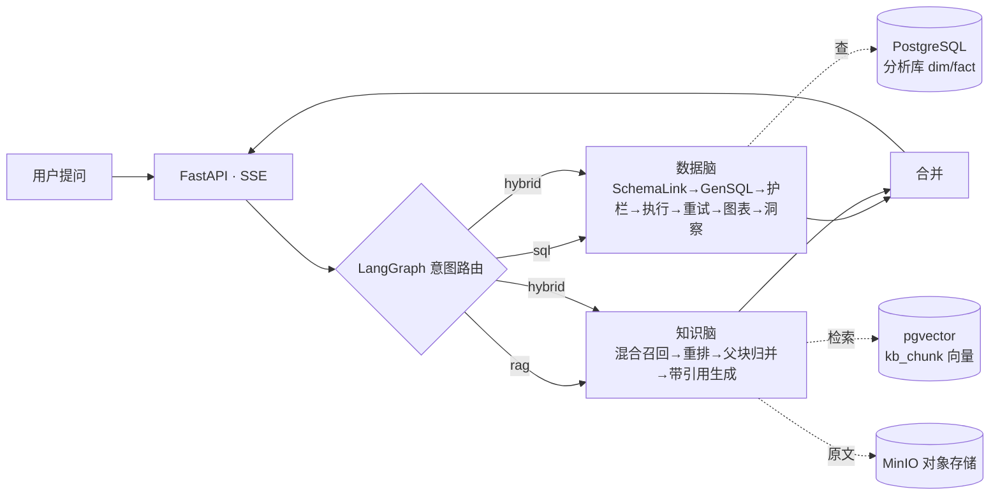

# 车市镜 · 新能源汽车市场情报 Agent（EV-MarketLens）

> 一个对话式的「市场情报」Agent：用大白话提问，系统自动判断意图——要**数据**就查库出图、要**解读**就读知识库带引用作答，由 **LangGraph** 编排双脑协同。

把「找数据、做分析、读报告」合并进一个对话框。面向新能源汽车行业，**通用双脑引擎 + 可插拔领域包**（换行业=换一个领域包）。

---

## ✨ 核心能力

**🧠 数据脑（Text2SQL）** —— 结构化分析
- 自然语言 → SQL：Schema Linking → 生成 → `sqlglot` 安全护栏（只放行 SELECT）→ 只读执行 → **自校验重试**（错误回喂修正）→ 耗尽友好降级。
- 出图不靠 LLM 拍脑袋：规则引擎产出**图表描述符**（默认图型 + 可选图型 + 维度/度量），前端据此自建图、**可切柱状/折线/饼/横条且带图例**，切换纯前端重绘。
- 数据分析结果只给「图表 + 一句话结论/归因」，**不展示 SQL / 数据表**。

**📚 知识脑（RAG）** —— 非结构化问答
- 文档入库：解析（PyMuPDF/pdfplumber，预留 MinerU）→ **结构感知 + 父子分块**（子块检索、父块回填，受 BGE 512 token 约束）→ BGE-large-zh 向量化 → pgvector（HNSW）。
- 在线检索：query 指令前缀 → **混合召回（向量 + 全文，RRF 融合）** → bge-reranker 重排 → **父块归并（四情形：去重/相邻合并/预算裁剪/冲突并列）** → 带引用生成。
- **防幻觉**：无召回/低分明确说「未找到依据」，引用可点回原文（文档·章节·页码）。

**🕹️ Agent 编排（LangGraph）**
- 意图路由（规则前置 + LLM 兜底）：`sql / rag / hybrid / clarify`。
- 支持 **重试环**（SQL 自校验）、**澄清挂起**、**双脑并行**（hybrid 同时跑两脑再合并）、全程 `trace` 可观测。

**🔐 产品工程**
- JWT 登录鉴权 + **多租户隔离**（会话/知识库按 `user_id` 隔离）；历史会话可还原（含图表/引用）。
- FastAPI + **SSE 流式**（展示 Agent 思考过程）；Vue3 + ECharts 产品级前端。
- 评测：RAGAS（RAG）+ 执行结果比对（Text2SQL）+ 意图混淆矩阵 + DeepEval 接 CI。

---

## 🏗️ 架构



---

## 🧰 技术栈

| 层 | 选型 |
|---|---|
| 编排 | LangGraph + LangChain |
| 对话 LLM | DeepSeek-V4（OpenAI 兼容，可切换） |
| Embedding / Rerank | BGE-large-zh（本地 1024 维） / bge-reranker |
| 后端 | FastAPI + SSE + SQLAlchemy |
| 前端 | Vue 3 + Vite + ECharts |
| 数据库 | PostgreSQL + pgvector（本地 demo 用 SQLite） |
| 存储 / 队列 | MinIO（原始文件） + Redis + Celery（异步入库） |
| 采集 / 解析 | Scrapling（爬取） + PyMuPDF/pdfplumber（解析，预留 MinerU） |
| 安全 | sqlglot AST 护栏 + JWT + bcrypt |
| 评测 | RAGAS + DeepEval(CI) + Great Expectations |
| 部署 | 单台云 VPS · Docker + docker-compose + Caddy(HTTPS) |

---

## 📁 目录结构

```
bi-agent-starter/
├── app/            后端：双脑 + 编排 + API
│   ├── graph.py        LangGraph 双脑编排（意图路由/重试环/并行/trace）
│   ├── text2sql.py     数据脑：生成 SQL + 自校验重试
│   ├── sql_guard.py    SQL 安全护栏（sqlglot，仅 SELECT）
│   ├── charts.py       图表描述符（规则引擎，非 LLM）
│   ├── rag/            知识脑：parse/chunk/embed/store/retrieve（父子分块+混合召回+归并）
│   ├── auth.py         登录鉴权（JWT + bcrypt）
│   ├── kb.py           知识库 API（上传/列表/删除/问答）
│   └── main.py         FastAPI 入口（/api/ask SSE + 历史 + 鉴权）
├── frontend/       前端：Vue3 + ECharts（双脑分渲 / 图型切换 / 引用溯源 / 历史会话）
├── data/           采集 / 清洗 / 语料构建脚本 + E2E demo
├── sql/            数据库 schema（分析库 schema.sql + 应用层 schema_app.sql）
├── eval/           评测：RAGAS / Text2SQL / 意图，含数据集与报告
├── tests/          pytest 单测（采集/清洗/Text2SQL/RAG/Agent/接口）
├── deploy/         部署：Dockerfile/compose/Caddy/备份/DEPLOY.md
├── docs/           文档：PRD（数据 + Agent）+ 工作记录 + 流程图
└── PROJECT-MEMORY/ 项目记忆（团队上下文，工具无关）
```

---

## 🚀 快速开始

### 0. 换电脑 / 克隆后必读
- **仓库已附数据**：`bi_demo.db`（8072 条销量，数据脑开箱可用）、`data/raw`（原始爬取）、`data/rag_corpus`（RAG 语料）都随仓库——clone 下来数据就全，无需重爬。
- **密钥要自己填**（绝不入库）：`cp .env.example .env` 后填 `LLM_API_KEY`（DeepSeek）等；生产参照 `.env.prod.example`。
- **模型不在仓库**（BGE-large-zh + bge-reranker 共 ~5.6GB，过大）：首次跑 RAG 会自动从 HuggingFace/ModelScope 下载到 `models/`（或手动放）；**仅用数据脑（Text2SQL）不需要模型**。
- **RAG 向量库不在仓库**（在 PostgreSQL 容器里）：起 `deploy/docker-compose.dev.yml` 后跑 `python data/rag_build_kb.py`，用仓库里的语料重新灌库即可。
- `node_modules` 不入库：`cd frontend && npm install`。

### 1. 环境
```bash
python -m venv .venv && source .venv/bin/activate   # Windows: .venv\Scripts\activate
pip install -r requirements.txt
cp .env.example .env        # 填入 LLM_API_KEY（DeepSeek）
```

### 2. 准备分析数据（数据脑）
```bash
python data/crawl_sales.py   # 采集懂车帝销量榜（增量、幂等）
python data/clean_load.py    # 清洗 → 拆 6 表 → 入库（默认 SQLite bi_demo.db）
```
> 采集与清洗逻辑详见 `docs/prd`（PRD-1）。

### 3. 起服务（数据脑，零 Docker）
```bash
# 终端1：后端
uvicorn app.main:app --port 8000
# 终端2：前端
cd frontend && npm install && npm run dev
```
浏览器打开 `http://localhost:5173`，登录后问「2025年纯电销量Top10」→ 看流式思考过程 + 可切换图表 + 结论归因。

### 4.（可选）完整双脑含 RAG
RAG 需要 PostgreSQL+pgvector / MinIO / Redis：
```bash
docker compose -f deploy/docker-compose.dev.yml up -d   # 起基础设施
python data/rag_build_kb.py                              # 构建知识库（解析→父子分块→向量化）
```

### 5. 部署上线
见 [`deploy/DEPLOY.md`](deploy/DEPLOY.md)：Docker + Caddy 自动 HTTPS + 定时采集 + 备份。

---

## 📊 数据与规模（已验证）
- **分析库**：409 车系 × 29 个月（2024-01~2026-04）× 纯电/插混/增程 = **8072 条真实销量事实**（数据源：懂车帝公开榜单）。
- **知识库**：51 文档 / 757 切片（乘联会行业文章 + 车系口碑 + 多页研报）。

## 📈 评测
评测集与报告见 [`eval/`](eval/)：Text2SQL 执行准确率、RAGAS（context precision/recall、faithfulness、answer relevancy）、意图路由混淆矩阵。

## 📚 文档
- 需求文档：`docs/prd/`（PRD-1 数据获取与处理、PRD-2 Agent 构建与整体项目）
- 开发工作记录：`docs/工作记录/`（后端/前端/测试/运维，含逐步实现与流程图）

## ⚠️ 安全
分析库走只读账号；`sql_guard.py` 仅放行单条 SELECT；知识库检索按 `user_id` 行级隔离；密钥只放 `.env`（已 gitignore）。
