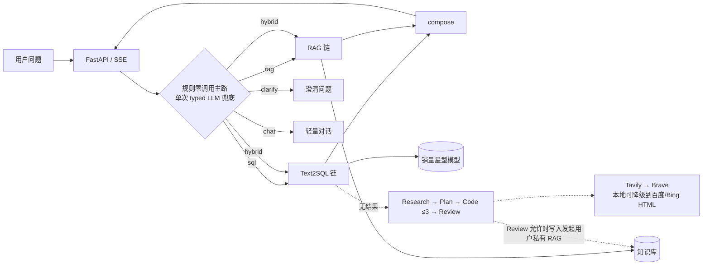

# EV-MarketLens（车市镜）

> 面向新能源汽车市场情报的对话式 Agent：同一个问题入口，自动选择 Text2SQL、RAG 或双路并行，返回可追溯的数据结论、图表和文档引用。

车市镜不是“套壳聊天机器人”，也不是只展示固定指标的 BI 看板。它把意图识别、结构化查询、非结构化检索、失败重试、缺数采集和 SSE 流式交互组织成一条可观测的 Agent 工作流。

## 仓库与 Demo 状态

- [`Gloria668866/ev-market-lens`](https://github.com/Gloria668866/ev-market-lens) 是唯一权威代码仓库。
- `Gloria668866/study_code/车市镜` 只作为只读镜像，不在镜像仓库独立开发。
- 当前版本已支持本地完整演示；生产 Compose、HTTPS、备份和初始化脚本已经配置。
- 尚未在一台全新云服务器和全新数据卷上完成端到端验收，因此暂不宣称“生产环境已验证”，也暂无公开在线 Demo。

## 核心能力

| 能力 | 当前实现 |
|---|---|
| 13 节点 Agent 图 | LangGraph 编排 `sql / rag / hybrid / clarify / chat` 五类意图，包含重试环、并行 fan-out 和 deferred join |
| Text2SQL | Schema 快照/规模化筛表 → SQL 生成 → sqlglot AST 安全护栏 → 执行 → 结构与语义校验 → 图表描述符 |
| RAG | 结构感知父子分块 → 双路召回 → RRF → BGE reranker → 证据门控 → 父块归并 → typed 带引用回答 |
| 缺数采集 | 空结果触发异步 `Research → Plan → Code × 最多 3 并行 → Review`；过程可查询、结果按用户隔离 |
| 研究搜索 | 白名单 `search_web` 按 `Tavily → Brave → Baidu HTML → Bing HTML` 降级；生产至少配置一个官方 API |
| 多轮与记忆 | 代词/省略型追问继承上下文；完整新问题重置实体；后台提取安全的会话摘要和偏好 |
| 产品工程 | JWT 多租户、原子日配额、共享有界问答容量、短 DB Session、SSE、管理员指标、Docker Compose、Caddy HTTPS |

## 架构


```mermaid
flowchart LR
    U["用户问题"] --> API["FastAPI / SSE"]
    API --> NLU{"规则零调用主路<br/>单次 typed LLM 兜底"}
    NLU -->|sql| SQL["Text2SQL 链"]
    NLU -->|rag| RAG["RAG 链"]
    NLU -->|hybrid| SQL
    NLU -->|hybrid| RAG
    NLU -->|clarify| Q["澄清问题"]
    NLU -->|chat| CHAT["轻量对话"]
    SQL --> COMPOSE["compose"]
    RAG --> COMPOSE
    COMPOSE --> API
    SQL --> BI[("销量星型模型")]
    RAG --> KB[("知识库")]
    SQL -.->|无结果| PIPE["Research → Plan → Code ≤3 → Review"]
    PIPE -.-> SEARCH["Tavily → Brave<br/>本地可降级到百度/Bing HTML"]
    PIPE -.->|Review 允许时写入发起用户私有 RAG| KB
```

LangGraph 中共有 13 个节点：

```text
intent_router / clarify / chitchat
schema_link / gen_sql / exec_sql / fix_sql / verify_sql / chart / insight
rag_retrieve / rag_answer / compose
```

一次请求的主调用链：

```text
sql     : schema_link → gen_sql → exec_sql ↔ fix_sql → verify_sql → chart → insight → compose
rag     : rag_retrieve → rag_answer → compose
hybrid  : [schema_link 分支 ∥ rag_retrieve 分支] → compose(defer=True)
clarify : clarify → END
chat    : chitchat → END
```

## 关键工程设计

### Text2SQL

1. 当前六表小 schema 复用 300 秒 TTL 的完整快照；表数超过阈值后，Schema Linking 才按表语义、列名和实体信号筛选。
2. `sqlglot` 解析 AST，只允许单条只读查询并自动限制返回规模。
3. 执行失败会带错误信息重试，最多两次。
4. 确定性结构护栏检查 Top-N、时间、能源类型、聚合和排名变化等高价值约束；不满足时 **fail-closed**，不把可执行但语义错误的 SQL 出图。
5. 可选 LLM 语义校验器补充判断；校验器自身异常时 **fail-open**，避免第二次模型调用拖垮已通过结构检查的请求。
6. 图表规则引擎输出：

```json
{
  "default_type": "bar",
  "applicable_types": ["bar", "hbar", "line"],
  "dimension": "series_name",
  "measures": ["volume"],
  "title": "销量对比"
}
```

前端基于同一份 rows 本地切换图型，不重新请求模型。

### RAG

1. 文档按标题、段落和表格结构切成检索子块与上下文父块。
2. BGE 向量召回和 jieba 关键词召回分别取候选，再用 RRF 融合。
3. BGE reranker 对候选重排；reranker 不可用时，证据必须同时获得向量和关键词双路支持，否则拒答。
4. 先对 Top child 做证据充足性门控；通过后才回填父块，做同父去重、相邻合并、预算裁剪和冲突并列。
5. 生成 JSON 经 Pydantic 校验，答案中的 `[来源 N]` 必须与 `used_sources` 一致；引用返回 `source_no / doc_id / page_no / chunk_id`。
6. 子块持久化 embedding 模型版本与维度。旧/错版本向量不会混入当前向量空间，但仍可走关键词降级；可用 `data/reindex_embeddings.py` 重建。

本地与生产使用同一检索语义，但存储和执行方式不同：

| 环境 | RAG 存储与执行 |
|---|---|
| 本地演示 | SQLite + numpy 暴力向量检索，文档同步入库，适合小语料 |
| 生产配置 | PostgreSQL + pgvector、MinIO 原文、Redis + Celery 异步入库 |

当前 `PARSER_BACKEND=lite`，使用轻量 PDF/文本解析。MinerU 只保留为未来可插拔后端，尚未接入。

### 缺数链路的边界

结构化查询无结果且知识库也没有足够证据时，系统创建后台采集任务：

```text
Research → Plan → Code agents（最多 3 个并行）→ Review
```

Code Agent 只调用预定义采集工具，不执行其自行生成的代码。通用网页搜索按
`Tavily → Brave → Baidu HTML → Bing HTML` 降级，统一返回
`title / url / snippet`；API key 只通过请求头发送，错误只暴露安全错误码。
本地允许在没有官方 key 时尝试 HTML 搜索，但生产 `/ready` 要求至少配置
`TAVILY_API_KEY` 或 `BRAVE_SEARCH_API_KEY`，不能把易受页面变化影响的 HTML
抓取当作稳定上线能力。

只有 Review 返回 `should_write_to_rag=true` 的内容才写入**任务发起用户的私有 RAG**。当前版本：

- 不直接回写 `fact_sales_rank` 等销量事实表；
- 不自动重新执行最初的 SQL；
- 不把某位用户采集到的内容暴露给其他用户。

因此它是“异步研究补充”，不是无人值守的事实库自动修复。

## 可复现评测

| 评测 | 当前证据 | 诚实边界 |
|---|---|---|
| Text2SQL | 固定 60 题执行结果等价回归集 60/60；首轮与重试明细以提交报告为准 | 固定集通过不等于未知问法 100% 泛化 |
| 意图路由 | 110 条五分类固定回归集 110/110；固定集全部命中确定性规则，0 次 LLM 调用；延迟分位以提交报告为准 | 这是常见路由防回归，不是线上泛化率；该集合未衡量新问题的 LLM 兜底准确率 |
| RAG | 本地 SQLite + numpy 确定性评测：13/13 正样本严格通过，claim 来源有效率、归并上下文支持率、关键锚点支持率均为 100%；7/7 负样本拒答 | 未验证最终生成答案 faithfulness/correctness，也未验证生产 PG 检索 |
| 数据质量 | 表结构、非空、枚举、唯一键、外键等确定性断言 | 以当前 `eval/reports/data_quality.json` 为准 |

评测脚本位于 [`eval/`](eval/)。自动化测试数量不在 README 固定写死，以实际命令和 CI 报告为准。

```bash
python -m pytest tests/ -m "not integration" -q
python eval/text2sql_eval.py --check-gold
python eval/intent_eval.py
python eval/rag_eval.py
npm --prefix frontend run build
```

## 快速启动

### Windows

```powershell
py -3.12 -m venv .venv
.\.venv\Scripts\python.exe -m pip install -r requirements.txt
Copy-Item .env.example .env
# 填写 .env，并将 BGE embedding/reranker 权重放入 models/
npm --prefix frontend install
powershell -ExecutionPolicy Bypass -File .\scripts\start-dev.ps1
```

默认地址：

- 前端：`http://127.0.0.1:5173`
- 后端：`http://127.0.0.1:8001`
- 深度健康检查：`http://127.0.0.1:8001/health?deep=true`

停止由脚本启动的进程：

```powershell
powershell -ExecutionPolicy Bypass -File .\scripts\stop-dev.ps1
```

### 初始化演示数据

零网络快速体验使用合成样例：

```bash
python seed_real.py
python data/build_local_kb.py
```

`seed_real.py` 只保证 schema 和查询链路可演示，其中数值是确定性合成数据，不能作为市场结论或简历中的真实业务数据。

真实销量数据使用公开 JSON API：

```bash
python data/crawl_sales.py
python data/clean_load.py
```

采集脚本只使用 Python 标准库 HTTP，默认补齐缺失的“月份 × 能源类型”分区、强制刷新最近两个完整月，并对输出去重和原子替换。它还校验源站 `sells_rank_month`，拒绝把未发布月份的静默回退数据写成新月份。

截至 2026-07-29，本地真实公开快照覆盖 `202401–202606`，共有 8402 条销量事实；2026-05 为 337 条、2026-06 为 331 条。源站对 2026-07 请求仍声明最新发布月为 `202606`，因此 7 月保持 0 条而不是伪造数据。生产任务每月 8、15 日 03:00 重试。

## 部署

生产配置与操作步骤见 [`deploy/DEPLOY.md`](deploy/DEPLOY.md)。部署时必须至少配置
`TAVILY_API_KEY` 或 `BRAVE_SEARCH_API_KEY`，否则生产 `/ready` 会返回 503。
`APP_ENV=production` 时公开注册默认关闭（`ALLOW_PUBLIC_REGISTRATION=false`），问答接口默认按账号限制为 UTC 自然日 30 次（`DAILY_QUESTION_LIMIT=30`），并以 `ASK_MAX_CONCURRENCY=2` 限制每个 API 进程的模型并发。问题一旦被系统接受就原子占用额度；断连/模型失败不退额度，也不伪造 assistant 消息。只有确实需要公开注册时才显式开启，并应按模型预算调整门禁。

在对外展示前，必须在目标云服务器的全新数据卷上完成一次管理员建号、登录门禁、配额、采集、Text2SQL、RAG 上传/检索、任务队列、重启恢复、HTTPS 和备份恢复验收。

## 已知限制

- 当前公开 RAG 评测只有 13 条正样本和 7 条负样本，运行在本地 SQLite + numpy 后端，适合检索、证据覆盖和拒答防回归，不足以支持“生成答案准确”或“生产 PG 已验证”结论。
- 本地 numpy 检索面向小语料；大语料应使用生产 pgvector 链路。
- Embedding 与 reranker 权重不入 Git；deep health 会实际推理并核对活动向量血缘。本地已重建为 64/64 compatible，生产 PG 仍需 fresh-volume 验收。
- 无官方 Web Search key 时只提供开发态 HTML 降级，不能作为生产可用性证明。
- 长期记忆是关键词召回，不是向量记忆系统。
- 云端 fresh-volume 端到端验收尚未完成。

## 进一步阅读

- [技术设计与面试口径](docs/technical-design.md)
- [端到端流程图](docs/diagrams/end-to-end-flow.mmd)
- [RAG 流程图](docs/diagrams/rag-pipeline.mmd)
- [采集刷新图](docs/diagrams/crawler-refresh-flow.mmd)
- [生产部署图](docs/diagrams/production-deployment.mmd)
- [项目记忆](PROJECT-MEMORY/README.md)
- [生产部署](deploy/DEPLOY.md)

## License

MIT
