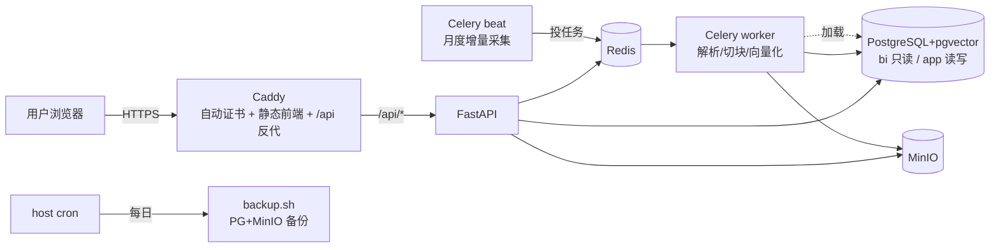

# 车市镜 · 生产部署手册（从空服务器到域名 HTTPS 可访问）

> 目标：一台干净 **4核8G Ubuntu 22.04** → 照本文跑命令 → `https://你的域名` 能打开、能登录、能问数出图、能上传文档问答。
> 全栈一条命令拉起：Caddy(HTTPS) + FastAPI + Celery(worker+beat) + PostgreSQL(pgvector) + Redis + MinIO。

---

## 0. 服务器 / 域名选型（国内可用，两条路）

| 路线 | 服务器 | 域名/备案 | 说明 |
|---|---|---|---|
| **A. 香港/境外（推荐起步，免备案）** | 阿里云/腾讯云**香港轻量** 4C8G、或 Vultr/DigitalOcean 东京/新加坡 | 域名**无需 ICP 备案**，解析即用 | 最快上线；大陆访问延迟略高但可接受。HTTPS 直接签 |
| **B. 大陆（延迟低，需备案）** | 阿里云/腾讯云**大陆** ECS 4C8G | 域名**必须 ICP 备案**（约 1-2 周）+ 公安备案 | 大陆访问快、合规；但 80/443 对外必须备案后才可用 |

- **本项目定位个人作品/演示** → 走 **A（香港免备案）** 最省事。
- 配置：**4核8G 起步**（BGE-large-zh 1.3GB + reranker 常驻吃内存；PARSER_BACKEND=lite 不上 MinerU，4C8G 够）。磁盘 ≥40G（镜像 + 模型 2.8G + 数据 + 备份）。
- 安全组放行：**22(SSH)、80、443**；**不要**对公网开放 5432/6379/9000/9001（仅容器内网用）。

---

## 1. 装 Docker（Ubuntu）
```bash
curl -fsSL https://get.docker.com | sh
sudo usermod -aG docker $USER && newgrp docker     # 免 sudo
docker compose version                              # 自带 compose v2
sudo apt-get update && sudo apt-get install -y make git
```

## 2. 拉代码
```bash
sudo mkdir -p /opt/carmirror && sudo chown $USER /opt/carmirror
git clone <你的仓库地址> /opt/carmirror && cd /opt/carmirror
```

## 3. 配置密钥（最关键，别用默认值上线）
```bash
cp .env.prod.example .env.prod
# 生成强随机串填进去：
openssl rand -hex 32      # → JWT_SECRET
openssl rand -hex 16      # → 各 DB / Redis / MinIO 口令（每个不同）
vim .env.prod             # 逐项填：DOMAIN / CORS_ALLOW_ORIGINS / LLM_API_KEY / 各口令
```
**.env.prod 必改清单**：`DOMAIN`、`CORS_ALLOW_ORIGINS`(=https://你的域名)、`LLM_API_KEY`、
`JWT_SECRET`、`POSTGRES_SUPER_PASSWORD`、`APP_DB_PASSWORD`、`BI_READONLY_PASSWORD`、`REDIS_PASSWORD`、
`MINIO_ROOT_PASSWORD`（同步改 `MINIO_SECRET_KEY`），以及把 `DATABASE_URL`/`APP_DATABASE_URL`/`RAG_DATABASE_URL`/
`REDIS_URL`/`CELERY_*`/`ANALYSIS_PG_URL` 里的占位口令换成同一套真值。

## 4. 解析域名
到域名服务商把 `DOMAIN` 的 **A 记录**指向服务器公网 IP；`dig +short 你的域名` 能解析到本机再继续（Caddy 签证书要求域名已解析、80/443 可达）。

## 5. 下模型权重（一次性，约 2.8GB）
```bash
make models          # 从 ModelScope 下 BGE-large-zh + bge-reranker 到 ./models（挂进容器 /models）
```

## 6. 构建并拉起全栈
```bash
make build           # 构建后端(含 torch)+前端镜像（首次较久）
make up              # 拉起；postgres 首启自动建库(bi/app)+角色+表(initdb)+pgvector
make ps              # 等所有服务 healthy（约 1 分钟）
```
此时 Caddy 已为 `DOMAIN` 自动申请 Let's Encrypt 证书。`make health` 应返回 healthy。

## 7. 导入分析数据（8072 行销量 → PG bi）
分析库（Text2SQL 查的 dim_*/fact_*）需要灌数据。两种取数方式任选：
```bash
# 方式①把开发机已采的原始数据拷过来（推荐，最快）：
#   开发机: scp -r data/raw  user@服务器:/opt/carmirror/data/
# 方式②直接在服务器现采（用 scrapling 专用环境，见 PROJECT-MEMORY/03）

# 然后清洗加载进 PG bi（读 data/raw，UPSERT 进 PostgreSQL）：
python3 -m venv .venv && . .venv/bin/activate && pip install -r requirements.txt   # 仅为跑加载脚本
make load-analysis   # → PG bi: dim_brand/dim_series/dim_date/fact_*（约 8072 行）
```
> RAG 知识库（口碑/乘联会/研报）入库：把 `data/rag_corpus`、`data/rag_samples/seed` 拷到服务器后，
> `python data/rag_build_kb.py`（走 worker 同款依赖，灌进 PG app 的 kb_chunk）。可选，先上线 Text2SQL 也行。

## 8. 建账号
```bash
make register u=admin p=你的强密码 n=管理员
# 等价 curl：curl -X POST https://你的域名/api/auth/register -H 'Content-Type: application/json' -d '{"username":"admin","password":"..."}'
```

## 9. 验收（对应 DoD）
浏览器开 `https://你的域名`：
1. 证书有效（🔒）、能打开前端；
2. 注册/登录进主界面；
3. 问「2025年纯电销量前5的车系」→ 出**图表**（数据脑）；
4. 上传一份 PDF/MD → 状态 parsing→ready → 问其内容 → 出**带引用**的答案（知识脑）；
5. 未登录访问 `/api/ask` → 401。

## 10. 定时采集 + 备份
- **定时采集**：`beat` 容器已自动按月（每月 1 号 03:00）触发增量采集并加载进 PG（`cron.monthly_sales_refresh`），无需手动。看日志：`make logs s=beat` / `make logs s=worker`。
- **备份**（PG + MinIO，本地轮转 14 天）：挂 host cron 每天 02:30：
  ```bash
  crontab -e
  30 2 * * * cd /opt/carmirror && bash deploy/backup/backup.sh >> /var/log/carmirror-backup.log 2>&1
  ```
  手动备份：`make backup`。**强烈建议**再把 `./backups` 同步到异地对象存储（如另一个云的 OSS）。

## 11. 备份恢复（演练过才算数）
```bash
make restore db=bi  f=backups/pg_bi_YYYYMMDD_HHMMSS.sql.gz
make restore db=app f=backups/pg_app_YYYYMMDD_HHMMSS.sql.gz
# MinIO 反向同步见 restore.sh 末尾提示
```

## 12. 回滚 / 升级
```bash
# 升级：拉新代码 → 重建 → 滚动重启（数据卷不动）
git pull && make build && cd deploy && docker compose --env-file ../.env.prod -f docker-compose.prod.yml up -d
# 回滚到上一个版本：
git checkout <上个稳定 tag/commit> && make build && make up
# 只回滚某服务：docker compose ... up -d --no-deps --force-recreate api
```
> 数据在命名卷（pgdata/miniodata/redisdata）+ ./models + ./backups，`make down` 不删卷；**`down -v` 才清空**（慎用）。

## 13. 常见问题
- **证书签不下来**：确认域名 A 记录已生效、安全组放行 80/443、`DOMAIN` 填对。看 `make logs s=caddy`。
- **api 起不来**：`make logs s=api`；多为 `.env.prod` 口令不一致（连接串里的口令必须与 PG/Redis 容器初始化口令一致）。
- **worker OOM**：4C8G 下别同时跑多个重任务；`--concurrency` 已设 2；确认没误开 MinerU（`PARSER_BACKEND=lite`）。
- **改了 PG 口令但容器已初始化**：initdb 只在数据卷为空时跑；改口令需 `down -v` 重置（清数据）或手动 `ALTER ROLE`。

---

## 架构（生产）

