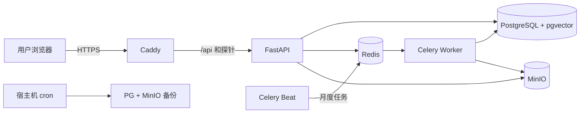

# 车市镜 · 单机生产部署手册

目标：把一台新的 Ubuntu 22.04 服务器部署成可通过域名 HTTPS 访问的秋招演示站，
包含 Caddy、FastAPI、Celery worker/beat、PostgreSQL + pgvector、Redis 与 MinIO。

> **当前验证边界**
>
> 仓库已有本地测试、镜像与编排配置，但截至本文更新时，尚未在一台全新云服务器、
> 全新 Docker volume 上完整执行并留存端到端验收记录。因此本文是可执行 runbook，
> 不是“云端已验收”的声明。上线后必须完成第 10 节并记录域名、commit、时间与结果。

## 1. 服务器选择

个人作品优先使用已有的**阿里云香港服务器**：域名无需 ICP 备案，解析后即可申请
HTTPS 证书。大陆节点延迟更低，但 80/443 对外服务前需要备案。

| 配置 | 适用范围 | 并发配置 |
|---|---|---|
| **2C8G（最低演示目标，待实机压测）** | 单人/低并发秋招演示 | `API_WORKERS=1`、`CELERY_CONCURRENCY=1`、`ASK_MAX_CONCURRENCY=2`，建议 2GB swap |
| **4C8G（推荐起步，仍需压测）** | 多位面试官短时访问 | 可在压测后调为 `2/2` |

磁盘建议至少 40GB。BGE 与 reranker 权重约 2.8GB；`PARSER_BACKEND=lite`，
不要在这台演示机上同时运行 MinerU。安全组只放行 22、80、443，不要把
5432、6379、9000、9001 暴露到公网。

2C8G 建议先创建 2GB swap：

```bash
sudo fallocate -l 2G /swapfile
sudo chmod 600 /swapfile
sudo mkswap /swapfile
sudo swapon /swapfile
grep -q '^/swapfile ' /etc/fstab || \
  echo '/swapfile none swap sw 0 0' | sudo tee -a /etc/fstab
free -h
```

swap 是 OOM 缓冲，不代表机器能承受高并发。演示前仍应做一次真实问答预热。

## 2. 安装基础软件并拉取代码

```bash
curl -fsSL https://get.docker.com | sh
sudo usermod -aG docker "$USER"
newgrp docker
sudo apt-get update
sudo apt-get install -y git make python3-venv
docker compose version

sudo mkdir -p /opt/carmirror
sudo chown "$USER":"$USER" /opt/carmirror
git clone <你的公开仓库地址> /opt/carmirror
cd /opt/carmirror
git rev-parse HEAD
```

部署记录中保存最后一条 commit SHA，之后才能准确回滚和复现。

## 3. 配置生产环境

```bash
cd /opt/carmirror
cp .env.prod.example .env.prod
openssl rand -hex 32   # JWT_SECRET
openssl rand -hex 16   # 为 PG、Redis、MinIO 分别生成不同口令
vim .env.prod
```

至少逐项确认：

```dotenv
APP_ENV=production
DOMAIN=你的域名
CORS_ALLOW_ORIGINS=https://你的域名

# 默认示例：阿里云百炼 Qwen 的 OpenAI 兼容接口
LLM_BASE_URL=https://dashscope.aliyuncs.com/compatible-mode/v1
LLM_MODEL=qwen-plus
LLM_API_KEY=你的真实密钥

# 无数据研究任务的稳定搜索入口；至少配置一个，Tavily 优先。
TAVILY_API_KEY=你的_Tavily_key
# BRAVE_SEARCH_API_KEY=你的_Brave_key
SEARCH_API_TIMEOUT_SECONDS=8
TAVILY_SEARCH_DEPTH=basic

ADMIN_USERNAME=admin
ADMIN_PASSWORD=不重复使用的强密码
RAG_BACKEND=pg

# 此值相对于 deploy/docker-compose.prod.yml，实际指向仓库根的 models/
MODELS_DIR=../models
API_WORKERS=1
CELERY_CONCURRENCY=1
PIPELINE_MAX_PARALLEL=2
ASK_MAX_CONCURRENCY=2
```

LLM 客户端采用 OpenAI 兼容协议，默认示例是 Qwen；需要换成 DeepSeek 或其他
兼容 provider 时，应成组替换 `LLM_BASE_URL`、`LLM_MODEL` 与 `LLM_API_KEY`，
不要把某个 provider 的地址和另一个 provider 的模型名混用。

Web Search 官方链路按 `Tavily → Brave` 降级，认证信息只放请求头。两个 key 都未
配置时，本地开发仍可尝试 Baidu/Bing HTML，但生产 `/ready` 会返回 503，并在
`services.web_search` 中显示 `html_fallback_only`；这类 HTML 抓取不能当作稳定
上线能力。Tavily 使用 `POST /search`，Brave 使用 Web Search GET 接口，超时由
`SEARCH_API_TIMEOUT_SECONDS` 统一限制。

同时替换：

- `JWT_SECRET`；
- `POSTGRES_SUPER_PASSWORD`、`APP_DB_PASSWORD`、`BI_READONLY_PASSWORD`；
- 所有 PG 连接串中的对应密码；
- `REDIS_PASSWORD` 及三个 Redis/Celery URL；
- `MINIO_ROOT_PASSWORD` 与同值的 `MINIO_SECRET_KEY`。

`APP_ENV=production` 下，应用会拒绝默认 `ADMIN_PASSWORD=admin123` 启动。
`.env.prod` 已被 gitignore，禁止提交、截图或发到公开聊天。

## 4. 域名解析

在域名控制台添加 A 记录到服务器公网 IP，确认解析生效：

```bash
dig +short 你的域名
```

返回本机公网 IP，且安全组已放行 80/443 后再启动 Caddy。

## 5. 下载并校验模型

`.env.prod` 中的 `MODELS_DIR=../models` 是从 `deploy/` 编排文件解析的路径。
下载脚本从仓库根运行，因此当前明确覆盖为 `./models`：

```bash
cd /opt/carmirror
bash deploy/download_models.sh
test -s models/bge-large-zh-v1.5/model.safetensors
test -s models/bge-reranker-base/model.safetensors
du -sh models
```

后续 `/ready?deep=true` 会真实执行一次 embedding 与 reranker 推理；只检查文件存在
不足以排除截断或损坏。

## 6. 构建并启动

```bash
cd /opt/carmirror
mkdir -p data/raw
test -w data/raw
make build
make up
make ps
make logs s=api
```

`make up` 会先运行一次性 `migrate` 服务，再启动 API/worker。它会对旧 PostgreSQL
数据卷幂等增加新字段，解决 `docker-entrypoint-initdb.d` 只在空卷执行的问题。
升级已有部署时可先显式检查：

```bash
make migrate-app
```

仓库跟踪 `data/raw/.gitkeep`，`make up` 也会在启动 Docker 前创建绑定挂载目录；
`test -w` 必须成功。不要让 Docker 在目录不存在时替你创建 root-owned 的
`data/raw`，否则后续采集和 `scp` 可能因权限失败。

PostgreSQL 首次创建 volume 时才会执行 `deploy/postgres/initdb`。修改初始化口令后，
已有 volume 不会自动重建角色；不要为了改密码随意执行 `down -v`。

## 7. 导入首批真实销量数据

销量主链路请求懂车帝公开 JSON API，使用 Python 标准库 HTTP，**不要求
Scrapling 或浏览器**。`data/crawl_sales.py` 默认：

- 补齐从 2024-01 到上一个完整月的缺失分区；
- 刷新最近 2 个完整月；
- 按业务键去重；
- 成功后原子替换 JSONL，重复运行幂等；
- 某分区临时返回空数据时保留旧快照。
- 校验响应 `sells_rank_month`；源站用旧月静默回退未来月份时拒绝写入。

两种初始取数方式任选其一。

### 方式 A：开发机采集，再上传 raw（推荐）

在开发机仓库根目录：

```bash
python data/crawl_sales.py
scp -r data/raw <user>@<server>:/opt/carmirror/data/
```

### 方式 B：服务器直接采集

```bash
cd /opt/carmirror
python3 data/crawl_sales.py
```

两种方式完成后都执行：

```bash
cd /opt/carmirror
python3 -m venv .venv
.venv/bin/pip install "psycopg[binary]>=3.1"
make load-analysis
```

不要只看脚本退出码；还要在验收时实际查询“最新月份销量前 5”，确认 API 返回非空
且数据库中的最大月份与原始文件一致。之后 Beat 每月 8 日和 15 日 03:00 自动执行
“增量采集 → 幂等加载”，详见 `deploy/scheduling/README.md`。

截至 2026-07-29 的开发快照为 2024-01 至 2026-06、8402 条销量事实；
2026-07 尚未发布。不能把源站回退的 6 月记录标成 7 月。

## 8. 导入 RAG 公共种子

API、PG、MinIO 与模型 ready 后，在 **deploy 目录**执行当前受支持的种子脚本：

```bash
cd /opt/carmirror/deploy
docker compose --env-file ../.env.prod -f docker-compose.prod.yml \
  exec api python data/build_pg_kb.py
```

脚本把仓库内 8 篇公开种子语料写入 PostgreSQL/pgvector；同名语料重跑会 supersede
旧版本。不要再使用历史的 `data/rag_build_kb.py`。导入成功仍不等于问答正确，
第 10 节必须用至少一条知识问题检查引用与拒答。

如果升级了 embedding 模型版本，或 migration 报告存在 legacy/mismatched 向量，
执行：

```bash
make reindex-embeddings
make health
```

重建只更新可再生向量与其版本/维度血缘，不重新解析或删除原文。维度发生变化时还
需要维护窗口修改 PG `vector(N)` 列与 HNSW 索引，不能直接在线切换。

## 9. 公开前部署门禁

管理员由 `ADMIN_USERNAME` / `ADMIN_PASSWORD` 在首次启动时自动创建，无需通过
公开注册接口再建一个同名账号。

生产默认 `ALLOW_PUBLIC_REGISTRATION=false`，匿名注册会返回 403；问答接口还会
按应用库中的用户消息记录执行 `DAILY_QUESTION_LIMIT=30` 的 UTC 自然日账号配额。
若要让招聘方自助创建账号，必须显式改成
`ALLOW_PUBLIC_REGISTRATION=true`，并根据预算收紧每日次数。

这两项能覆盖受控作品演示，但不等于完整的公网计费防护：当前 0.5 秒调用间隔仍是
进程内限制，也没有每 IP、邀请码、token 账单或网关级限流。不要在社交平台广泛
公开可注册的付费模型入口；长期公开前应至少再加反向代理限速与费用告警。

## 10. 真实验收清单

在一台**全新 volume** 的服务器上逐项执行并保存结果；任何一项失败都不能标注
“生产已部署”：

1. `make ps`：postgres、redis、minio、api、worker、beat、caddy 均处于预期状态；
2. `curl -fsS "https://你的域名/health"`：基础探针可访问；
3. `curl -fsS "https://你的域名/ready?deep=true"`：HTTP 200，`ready=true`、
   `status=healthy`，analysis/app DB、pgvector、MinIO、Redis、embedding、
   reranker 和官方 Web Search 配置全部正常，`model_probe=inference`；
4. 浏览器证书有效，前端刷新不会 404，管理员能登录；
5. 问“最新完整月份纯电销量前 5 的车系”：
   返回非空表格和图表，月份、数量可回查 PG；
6. 问种子语料中的知识问题：答案带可点击引用，引用内容能支持结论；
7. 问种子语料完全未覆盖的问题：应明确证据不足，不编造答案；
8. 上传一份测试 PDF/MD：状态从 `parsing` 到 `ready`，随后仅上传者可检索；
9. 未登录访问 `/api/ask` 返回 401；用户 A 不能读取用户 B 的会话或文档；
10. 默认配置下匿名 `POST /api/auth/register` 被拒绝，而演示账号仍能登录；若显式
    开启注册，则验证第 31 次当日提问被配额门禁拒绝；
11. 观察 `make logs s=worker` 与 `make logs s=beat`，确认无循环报错；
12. 重启服务器，确认 Docker 服务、数据卷、域名 HTTPS 与深度 ready 自动恢复；
13. 执行一次备份与恢复演练，不能只确认备份文件存在。

建议把验收结果记录为：

```text
deployment: PASS/FAIL
commit: <sha>
server: Alibaba Cloud HK, <spec>
fresh_volumes: yes/no
tested_at: <Asia/Shanghai timestamp>
deep_ready: PASS/FAIL
sql_chart: PASS/FAIL
rag_citation: PASS/FAIL
rag_abstention: PASS/FAIL
isolation: PASS/FAIL
restart_recovery: PASS/FAIL
backup_restore: PASS/FAIL
```

## 11. 日常运维

```bash
make ps
make health
make logs s=api
make logs s=worker
make logs s=beat
make backup
```

宿主机每天 02:30 备份：

```cron
30 2 * * * cd /opt/carmirror && bash deploy/backup/backup.sh >> /var/log/carmirror-backup.log 2>&1
```

备份应再同步到异地对象存储，并实际演练：

```bash
make restore db=bi  f=backups/pg_bi_YYYYMMDD_HHMMSS.sql.gz
make restore db=app f=backups/pg_app_YYYYMMDD_HHMMSS.sql.gz
```

## 12. 升级与回滚

```bash
cd /opt/carmirror
git pull --ff-only
make build
cd deploy
docker compose --env-file ../.env.prod -f docker-compose.prod.yml up -d
```

回滚前先看迁移是否兼容，随后检出已验收的 tag/commit 并重建。数据在命名 volume、
模型目录与备份目录中；`make down` 不删 volume，`docker compose down -v` 会清空
持久化数据，除非明确执行灾难恢复，否则不要运行。

## 13. 常见故障

- **证书签发失败**：核对 A 记录、公网 IP、安全组 80/443 和 `DOMAIN`。
- **API 启动失败**：检查 `.env.prod` 内连接串密码是否与容器初始化密码一致；
  `APP_ENV=production` 下默认管理员密码也会触发 fail-fast。
- **`ready?deep=true` 模型失败**：检查 `MODELS_DIR=../models` 的挂载和两个
  `model.safetensors`，损坏文件应重新下载，不能只创建同名空目录。
- **2C8G OOM**：保持 API/worker 并发 `1/1`、`PARSER_BACKEND=lite`，检查 swap，
  避免在问答期间同时重建全部向量。
- **销量为空**：先直接运行 `python3 data/crawl_sales.py` 看网络/API错误，再确认
  `data/raw/sales_rank_raw.jsonl` 非空，最后重跑 `make load-analysis`。
- **RAG 无结果**：确认 `RAG_BACKEND=pg`，运行种子脚本并查看 API/worker 日志，
  再用 `/ready?deep=true` 排除模型与 pgvector 故障。

## 生产拓扑


```mermaid
flowchart LR
  U[用户浏览器] -->|HTTPS| C[Caddy]
  C -->|/api 和探针| A[FastAPI]
  A --> PG[(PostgreSQL + pgvector)]
  A --> R[(Redis)]
  A --> M[(MinIO)]
  B[Celery Beat] -->|月度任务| R
  R --> W[Celery Worker]
  W --> PG
  W --> M
  H[宿主机 cron] --> BK[PG + MinIO 备份]
```
