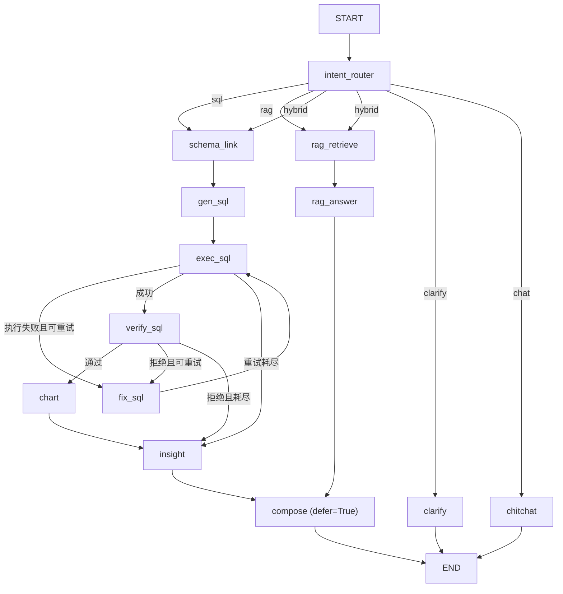
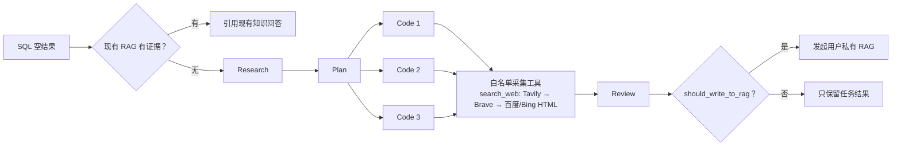

# EV-MarketLens 技术设计与面试口径

> 本文描述当前代码，而不是最初 PRD。代码行为、公开 README 和本文不一致时，应先核对实现，再同时更新三者。

## 1. 系统定位

车市镜是新能源汽车市场情报对话式 Agent。它解决两类数据问题：

- 结构化事实：销量、排名、价格、品牌/车系维度，交给 Text2SQL；
- 非结构化证据：政策、报告、技术路线和用户上传资料，交给 RAG。

系统还支持混合问题、信息不足时澄清和普通对话，共五类意图：

```text
sql / rag / hybrid / clarify / chat
```

`Gloria668866/ev-market-lens` 是唯一权威仓库，`study_code/车市镜` 只是只读镜像。

### 权威图索引

所有图均保存为可审查、可重新渲染的 Mermaid 源文件：

- [端到端问答与空结果链路](diagrams/end-to-end-flow.mmd)
- [系统架构](diagrams/system-architecture.mmd)
- [13 节点 Agent 图](diagrams/agent-graph.mmd)
- [Text2SQL 重试时序](diagrams/text2sql-retry-sequence.mmd)
- [RAG 入库与检索](diagrams/rag-pipeline.mmd)
- [数据与知识双链路](diagrams/data-and-knowledge-overview.mmd)
- [销量采集与刷新](diagrams/crawler-refresh-flow.mmd)
- [ETL](diagrams/etl-flow.mmd)
- [分析星型模型](diagrams/analytics-star-schema.mmd)
- [应用与 RAG 存储模型](diagrams/application-rag-storage.mmd)
- [生产部署拓扑](diagrams/production-deployment.mmd)

## 2. 13 节点 LangGraph



13 个节点为：

1. `intent_router`
2. `clarify`
3. `chitchat`
4. `schema_link`
5. `gen_sql`
6. `exec_sql`
7. `fix_sql`
8. `verify_sql`
9. `chart`
10. `insight`
11. `rag_retrieve`
12. `rag_answer`
13. `compose`

### 为什么使用 LangGraph

- State 让每个节点的输入、输出和 trace 可显式检查；
- 条件边表达执行失败/语义失败后的重试环；
- `hybrid` 同时 fan-out 到 SQL 与 RAG 分支；
- `compose(defer=True)` 等待长度不同的分支完成，只合并一次；
- 澄清是对话级的新请求，不是图内 `interrupt/resume`，因此当前不引入 checkpointer。

## 3. NLU：零调用规则主路 + 单次结构化模型兜底

主 `classify()` 链路不是“分类一次、实体抽取再调用一次”。真实顺序为：

1. 本地扫描品牌、车系、时间、指标、能源类型；
2. 只对纯寒暄走零调用快速通道，“你好比亚迪”不会被当作纯聊天；
3. 高确定性业务规则直接给出 `sql / rag / hybrid / clarify`，不调用模型；
4. 其余问题最多调用一次 LLM，同时返回意图、置信度、实体与规范化问题；
5. Pydantic 严格校验数组类型、实体字符串、意图枚举和置信度范围，非法 JSON fail-closed；
6. 本地与模型实体按字段去重合并，再做置信度门控、槽位完整性和数据源边界纠偏。

Few-shot BGE 只在进入模型兜底路径时惰性加载；模型或向量不可用时不影响规则主路。多轮上下文只在代词或省略型追问中继承。一个信息完整的新问题会重置活跃实体；SQL 审核还会阻止当前问题未提及的历史品牌条件泄漏到新查询。

2026-07-29 实跑 110 条五分类固定回归集为 110/110（100.0%）。修复三轮模型漂移后，这个固定集已全部命中确定性规则：0/110 次模型调用，端到端路由延迟分位记录在提交报告中。集合中仍有 7 条与配置里的 few-shot 文本完全相同，但本次路径没有加载 few-shot 或调用模型。这个结果只证明常见表达的路由回归稳定，不是独立留出集、线上泛化率，也没有衡量新问题的 LLM 兜底准确率；最终以 [`eval/reports/intent.json`](../eval/reports/intent.json) 为准。

## 4. Text2SQL

### 4.1 链路

```text
Schema Linking
  → LLM 生成 SQL
  → sqlglot AST 安全护栏
  → 只读执行
  → 确定性结构校验
  → 可选 LLM 语义校验
  → 图表描述符
  → 洞察
```

当前分析库只有六张表，默认阈值也是六张，因此小 schema 直接复用一次 introspection 生成的完整快照；只有表数量增长到阈值以上时，才根据中文表语义、列名与实体信号筛选相关表。Schema、品牌和车系目录均使用 300 秒 TTL 缓存，可显式失效；一次 Schema Linking 只执行一次 introspection。品牌/车系目录单次最多读取 5000 项，避免默认 200 行截断。

### 4.2 安全与规模限制

- 通过 `sqlglot` 解析并遍历 AST，不依赖关键词正则；
- 只允许单条查询，写操作、危险节点和无法解析的 SQL 一律拒绝；
- 缺少 LIMIT 时自动限制结果规模；
- 生产 PostgreSQL 使用只读角色和 `default_transaction_read_only=on` 形成第二层防线；
- 本地 SQLite 连接本身不是数据库级只读，主要依赖 AST 护栏，不能把生产约束外推到本地。

安全解析遵循 **fail-closed**：无法证明安全就不执行。

### 4.3 执行重试

执行错误会和原问题、失败 SQL 一起回传给修复节点，再重新执行。最多重试两次；耗尽后向用户返回可解释的降级结果，不展示错误 SQL 的图表。

### 4.4 “能跑但答错”的双层校验

`verify_sql` 不是单纯再问一次 LLM：

1. **确定性结构护栏**检查 Top-N、排序方向、累计/趋势聚合、能源类型、时间范围、品牌/车系范围和排名变化等高价值约束。发现冲突时 fail-closed，并在重试耗尽后仍不放行。
2. **LLM 语义校验器**只做补充判断。它自身超时或报错时 fail-open，因为前面的安全与结构校验已通过，不能让一个辅助模型调用成为系统单点故障。

这两个 “fail” 针对不同风险，面试时不能混为一谈。

### 4.5 图表协议

后端不生成固定 ECharts option，而是返回稳定描述符：

```json
{
  "default_type": "line",
  "applicable_types": ["line", "bar"],
  "dimension": "ym",
  "measures": ["volume"],
  "title": "月度销量趋势"
}
```

字段合同固定为 `default_type / applicable_types / dimension / measures / title`。前端持有 rows，可在适用图型间本地重绘。

### 4.6 日期口径

`dim_date.date_id` 使用 `YYYYMM` 整数，例如 `202505`，不是顺序自增 ID。历史上曾因把它误解为 `1..N` 导致 Gold SQL 空结果；当前 schema、prompt、ETL 和评测集均统一为 `YYYYMM`。

## 5. RAG

### 5.1 离线入库

```text
文件
  → PARSER_BACKEND=lite
  → 标题/段落/表格结构解析
  → 父块与检索子块
  → BGE embedding
  → 文档、chunk、向量持久化
```

- 子块约 250–300 token，用于精准检索；
- 父块约 800–1000 token，用于保留生成上下文；
- 表格尽量整体保留；
- `heading_path` 参与 embedding，但引用展示保留原文结构；
- 当前解析后端是 `lite`。MinerU 仅是接口预留，尚未接入，不能写成已完成能力。

### 5.2 在线检索

```text
query
  ├─ BGE vector recall
  └─ jieba keyword recall
        ↓
      RRF(k=60)
        ↓
      BGE reranker
        ↓
      证据门控
        ↓
      父块归并
        ↓
      带引用生成 / 拒答
```

父块归并处理四种情况：

- 同父命中：去重并保留最高分；
- 相邻父块：合并连续窗口并去重叠；
- 不同父块互补：按分数和 token 预算选取；
- 信息冲突：保留不同来源和时间口径，显式并列，不擅自求平均。

### 5.3 Reranker 降级

正常路径使用 BGE reranker。若 reranker 未加载，不能直接把 RRF 分当成同等可信的相关性分数。降级路径要求关键证据同时获得向量召回和关键词召回支持；双路证据不足就拒答。

### 5.4 证据门控与引用

证据门在父块归并和生成之前检查 Top child。通过后才取回父块并调用生成模型；不通过时返回“未找到足够依据”，避免用相似品牌或相邻主题内容强答。

最终生成 JSON 使用 Pydantic 校验 `answer / used_sources / has_answer`。答案中的 `[来源 N]` 集合必须与 `used_sources` 完全一致，编号合法且去重，否则 fail-closed 拒答。通过时引用携带 `source_no / doc_id / page_no / chunk_id / heading_path`，因此前端引用卡可以反查具体论断对应的来源。

### 5.5 向量空间血缘

每个有向量的可检索子块记录 `embedding_model_version` 和 `embedding_dim`。向量召回只读取与当前模型版本、维度和 BLOB 长度兼容的行；旧版本或无血缘向量仍可参加关键词召回，但不会混入错误向量空间。

- 旧 SQLite 文件启动时幂等增加血缘列；
- 旧 PostgreSQL 数据卷在 API 启动前执行幂等 SQL migration；
- `data/reindex_embeddings.py` 只重算缺失/旧版本/错维度向量，不重新解析原文；
- `/ready` 报告 compatible/legacy/mismatched/missing；只有 `missing=legacy=mismatched=0`
  且 `compatible=retrievable` 才通过。本地还校验向量 BLOB 长度，PG 还校验列维度等于
  当前 `EMBED_DIM`。

2026-07-29 已对本地活动子块执行一次真实重建：64/64 compatible，legacy/mismatched/missing 均为 0。

### 5.6 本地与生产实现

| 维度 | 本地演示 | 生产配置 |
|---|---|---|
| 元数据/文本 | SQLite | PostgreSQL |
| 向量检索 | numpy 暴力检索 | pgvector |
| 原文 | 本地文件 | MinIO |
| 入库 | 同步 | Redis + Celery 异步 |
| 目标规模 | 小语料、零 Docker 调试 | 多用户、持久化任务 |

两套实现应保持相同的分块、混合召回、rerank、归并和证据门控语义。

## 6. 查询无数据后的异步采集

当 SQL 返回空结果时，系统先查询现有 RAG。仍无充分证据才创建异步任务：



- `Plan` 生成可并行的采集项；
- `Code` 阶段最多三个并行实例；
- Code Agent 只通过 function calling 调用白名单工具，不执行其生成的任意代码；
- `search_web` 统一输出 `title / url / snippet`，官方链按 Tavily → Brave 降级；
- 官方搜索都不可用时，本地可尝试百度/Bing HTML；生产至少一个官方 key 才通过 `/ready`；
- 搜索 key 只通过请求头发送，provider 失败仅保留安全错误码，不进入任务结果或日志正文；
- 生产任务进入 Redis/Celery；本地无队列时使用单 worker，并以
  `PIPELINE_LOCAL_MAX_INFLIGHT` 限制运行中与等待中任务总数，满载快速拒绝；
- Review 通过的结果写入发起用户私有知识库。

当前链路**不**：

- 回写销量星型模型；
- 自动重跑原始 SQL；
- 将私有采集结果升级为全局公共事实。

若未来要形成闭环，必须增加来源可信度、结构化抽取、数据质量门禁、人工/规则审核和幂等事实写入，不能直接把网页文本当事实表。

## 7. 数据采集与 ETL

当前结构化数据主源是懂车帝公开销量 JSON API。`data/crawl_sales.py` 使用 Python 标准库 HTTP：

- 默认补齐从起始月到上一个完整月的缺失分区；
- 每次强制刷新最近两个完整月；
- 以“月份 × 能源类型 × 车系”幂等合并；
- 原子替换输出，避免中断产生半文件；
- `data/clean_load.py` 负责清洗并写入星型模型。

源站会对尚未发布的月份静默返回最近已发布月。采集器因此把响应
`data.sells_rank_month` 作为数据合同：请求月份晚于真实发布月份时整分区拒绝写入，
而不是把旧月记录重新标成新月。生产 Celery Beat 在每月 8 日和 15 日 03:00
重试，降低月初未发布的概率。

截至 2026-07-29，本地真实公开数据快照为：

- 覆盖 `202401–202606`，销量事实 8402 条；
- `202605` 337 条，`202606` 331 条；
- `202607` 0 条。源站对 7 月请求返回的 331 行仍声明最新月为 `202606`，
  已被 guard 正确拒绝，不能把它写成 7 月数据。

`seed_real.py` 是零网络、确定性的合成样例，只用于验证 schema、查询和前端链路；其中数值不是市场事实。

## 8. 长期记忆与多租户

- Episode 只从用户消息提取安全摘要，不保存模型生成的数字结论；
- Profile 只保留品牌、指标、车型和输出风格等白名单偏好；
- 记忆、异步研究和交互问答分别使用有界执行容量，数据库唯一约束防止重复写；
- 用户文档、会话、消息、任务状态和自动采集结果都按 `user_id` 隔离；
- `APP_ENV=production` 时公开注册默认关闭，只有显式设置 `ALLOW_PUBLIC_REGISTRATION=true` 才开放；
- `/api/ask`、`/api/ask_sync` 与 `/api/kb/ask` 共用每 API 进程
  `ASK_MAX_CONCURRENCY` 容量门禁，满载在模型调用和配额占用前返回 503；
- 系统接受问题时就原子占用 UTC 自然日配额并持久化 user message，生产模板默认
  `DAILY_QUESTION_LIMIT=30`。断连或上游失败仍计入已接受额度，但不伪造 assistant message；
- PostgreSQL 通过用户行锁保证跨进程“计数 + 写入”一致，本地 SQLite 只保证单进程条带锁语义；
- 敏感内容过滤或记忆提取失败时不阻塞主问答链路。

## 9. SSE 与可观测性

`/api/ask` 通过 POST-SSE 输出命名事件。核心事件包括：

```text
stage / intent / sql / rows / chart / collection / insight / citation / done / error
```

每个 LangGraph 节点向 state trace 写入节点名、关键决策、SQL、重试和降级原因。trace 用于调试和评测，不应把内部敏感 prompt 或密钥直接推给前端。

流式问答、同步调试问答、知识库问答和最长 15 分钟的任务进度 SSE 都不会在模型/流生命周期持有应用库 Session；鉴权、配额预占和结果落库分别使用短 Session。

`/api/admin/metrics` 只对管理员开放，返回当前 API 进程的 LLM 调用数、错误数、token、p50/p95/p99 和按配置单价估算的成本。该指标重启清零，且多进程不聚合，不能冒充 Prometheus 式全局监控。

## 10. 评测设计与边界

| 类型 | 方法 | 当前口径 |
|---|---|---|
| Text2SQL | 执行结果集等价比较 | 固定 60 题回归集 60/60；首轮与重试明细见提交报告 |
| Intent | 110 条五分类固定回归集、混淆矩阵、per-class P/R/F1、调用与延迟统计 | 当前 110/110；固定集 0 次 LLM 调用、零调用率 100%，延迟分位见提交报告；不覆盖新问题的 LLM 兜底泛化 |
| RAG | 检索、rerank、证据门控、父块归并、人工原子 claim 支持与负样本拒答 | 本地 SQLite + numpy：13/13 正样本严格通过；claim 来源、归并上下文、关键锚点支持率均为 100%；7/7 负样本拒答 |
| Data quality | 表行数、非空、枚举、唯一键、外键等断言 | 以当前报告为准 |
| Tests | pytest 与前端 build | 不在文档硬编码测试数量 |

当前 RAG 报告只证明“小样本中目标证据能召回、原子 claim 在指定来源和归并上下文中有支持，且无证据问题能拒答”。评测运行在本地 SQLite + numpy 后端，没有运行答案生成 faithfulness/correctness judge，也没有验证生产 PostgreSQL + pgvector，不能写成 RAG 最终答案质量或生产准确率。

评测脚本是项目内的确定性/自定义实现，不宣称直接使用当前代码并未调用的第三方评测框架。

## 11. 生产拓扑与当前状态

生产配置包含：

```text
Caddy (HTTPS + frontend)
  → FastAPI
  → migrate (API/worker 启动前幂等迁移)
  → PostgreSQL + pgvector
  → Redis
  → Celery worker / beat
  → MinIO
  → Tavily / Brave Web Search API
```

`migrate` 在 PostgreSQL 健康后执行幂等应用/RAG schema 迁移；API 与 worker
等待其成功完成后才启动。PostgreSQL、Redis、MinIO 和 Caddy 使用 named volumes；BGE/reranker 权重与
`data/raw` 使用宿主机 bind mount。Caddy 只对外暴露 80/443，并提供备份/恢复脚本。
旧应用库卷会在 API/worker 启动前先运行幂等 migration。`PARSER_BACKEND=lite`
是当前生产默认值。生产环境还默认关闭公开注册，并以账号日配额和每进程并发上限
限制公开 Demo 的模型成本；无数据研究还要求至少配置 Tavily 或 Brave 的一个官方
搜索 key，否则 `/ready` 返回 503。管理员应先创建演示账号，再按需要决定是否开放注册。

截至 2026-07-29，部署配置和操作文档已经完成，但尚未在真实云服务器的**全新数据卷**上跑完注册、数据初始化、Text2SQL、RAG 上传/检索、异步任务、重启恢复、HTTPS 和备份恢复全链路。2C8G 只是最低演示目标，建议 4C8G 起步；两者都仍需真实云端压测。因此正确表述是“具备生产化部署配置”，不是“已生产验证”。

## 12. 关键故障复盘

| 问题 | 根因 | 修复与经验 |
|---|---|---|
| SQL 可执行但语义错 | 仅依赖数据库执行成功 | 增加确定性结构护栏和可选 LLM 校验；执行成功不等于回答正确 |
| 日期查询空结果 | 错把 `date_id` 当顺序 ID | 全链路统一为 `YYYYMM`，评测数据也属于代码资产 |
| Reranker 损坏仍强答 | 直接沿用融合分数 | 降级时要求向量/关键词双路证据，不具备证据就拒答 |
| 新问题继承旧品牌 | 对所有后续消息无差别继承实体 | 只对代词/省略追问继承，并在 SQL 审核阻止历史条件泄漏 |
| 图表协议漂移 | 后端/前端各自猜字段 | 固定为 `default_type/applicable_types/dimension/measures/title` |
| 文档承诺 MinerU | 设计目标被误写成现状 | 当前明确 `lite`，未实现能力必须写成 backlog |
| 无数据请求阻塞 | 在请求线程运行重型 pipeline | 改为可靠队列或有界后台任务，SSE/任务 API 回传进度 |
| 公开 Demo 被滥用 | 注册和模型调用没有生产门禁 | 生产默认关闭公开注册，并按账号执行 UTC 日配额 |
| 未发布月份被伪装成新数据 | 源站对未来月份静默回退最近月份 | 校验 `sells_rank_month`，未发布分区拒绝写入并保留旧快照 |
| 断连/并发绕过配额 | 完成后才记 user message，且每请求新建线程 | 接受时原子预占；三个问答入口共享有界容量，断连仍计入额度 |
| 向量模型升级后静默混空间 | chunk 没有模型版本与维度血缘 | 入库打标、检索筛版本、旧库迁移、可重建向量与 readiness 门禁 |

## 13. 面试时应主动说明的边界

- 60/60 是固定回归集，不代表开放域泛化 100%；
- RAG 固定集用于本地检索/证据覆盖防回归，不等于生成答案或生产 PG 准确率；
- 无数据采集写私有 RAG，不会无审核修改销量事实；
- MinerU 未接入，生产使用 lite parser；
- 当前有生产化配置，但云端 fresh-volume E2E 尚待完成。

这些边界不会削弱项目，反而能证明对评测有效性、数据治理和生产风险有清醒判断。
