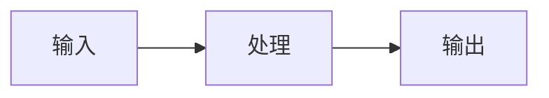

# <工单号> <一句话标题>

- 负责人：
- 日期：YYYY-MM-DD
- 关联工单：T?（见开发任务拆解书）
- 状态：进行中 / 已完成

## 1. 做了什么
（一句话概括 + 涉及的文件/函数。例：实现 app/text2sql.py 的自校验重试。）

## 2. 为什么这么做
（设计取舍：为什么选这个方案，为什么不用别的。新人看了能懂动机。）

## 3. 怎么运行 / 怎么验证
```bash
# 能复制粘贴的命令 + 预期结果
```

## 4. 输入 → 输出
（什么数据/参数进去，什么出来。给个真实例子。）

## 5. 关键实现说明
（贴关键代码片段并解释；专有名词第一次出现解释一句。）

## 6. 流程图（必要时）


## 7. 踩过的坑
（报错 + 解决办法，省得别人重踩。）

## 8. 待办 / 遗留
（没做完的、依赖别人的、TODO。）
