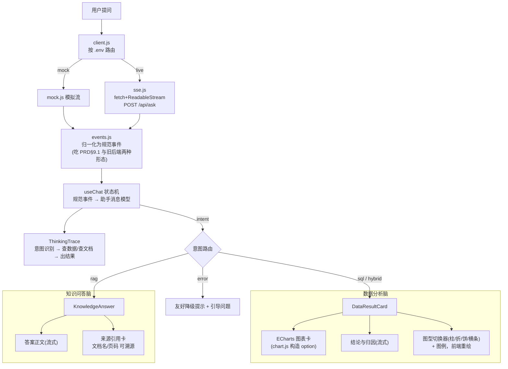

# 前端门面：车市镜对话式 BI Agent 产品级前端

- 负责人：前端
- 日期：2026-05-22
- 关联工单：PRD-2 §9（前端与交互）、§9.1（SSE 事件协议）、§10（接口）；里程碑 M3「编排成型：…+SSE 前端」
- 状态：已完成（mock 链路全通；后端 live 链路已预留并做协议兼容）

> 目标：把「车市镜」的产品门面按真实产品标准做出来——空状态有产品定位与示例问题引导；
> 双脑结果分开渲染（数据分析=图表卡（可切图型）+一句话结论/归因，知识问答=答案+来源引用卡）；
> 流式展示 Agent 思考过程（意图→查数据/查文档→出结果）；左侧会话历史+知识库入口、专业克制的数据产品视觉。
> 后端未就绪先用本地 mock 把界面调通，后端上线改一个 .env 开关即连真接口。
> 本文详细到新人能 `npm run dev` 跑起来。

---

## 1. 做了什么

一句话：在仓库 `frontend/` 新建一个 Vue 3 + Vite + ECharts 单页应用，按 PRD-2 §9.1 的 SSE 事件协议
做「双脑分流渲染 + 流式思考过程」，并用本地 mock 把整条交互链路跑通。

涉及文件（全部新建，`frontend/`）：

| 文件 | 作用 |
|---|---|
| `package.json` / `vite.config.js` / `index.html` | 工程骨架；固定 5173 端口；`@`→`src` |
| `.env` / `.env.example` | API 基址与数据源开关（`VITE_API_BASE` / `VITE_DATA_SOURCE`），为上线预留 |
| `src/styles/tokens.css` / `global.css` | 设计令牌与全局样式（见 §5.5 设计语言「情报台」） |
| `src/components/LogoMark.vue` | 品牌标志：镜头光圈 + 内嵌上升销量柱线（可扫描动效），贯穿侧栏/顶栏/空状态/助手头像 |
| `src/api/config.js` | 从 `.env` 读运行期配置，集中所有 endpoint |
| `src/api/events.js` | **SSE 事件归一化**：把 PRD §9.1 与当前后端两种形态都收敛成「规范事件」 |
| `src/api/sse.js` | **原生 POST-SSE**：fetch + ReadableStream 解析 `text/event-stream` |
| `src/api/mock.js` | 本地 mock：按 §9.1 节奏吐规范事件（SQL 流 / RAG 流） |
| `src/api/client.js` | 统一入口，按 `.env` 把请求路由到 mock 或真后端 |
| `src/utils/chart.js` | chart 负载 → ECharts option（兼容完整 option 与 `{chart_type,x,y}` 选图建议） |
| `src/composables/useChat.js` | **对话状态机**：规范事件流 → 助手消息模型 + 思考阶段 + 会话历史 |
| `src/components/*.vue` | Sidebar / TopBar / EmptyState / MessageList / UserMessage / AssistantMessage / ThinkingTrace / DataResultCard / KnowledgeAnswer / ChartCard / Composer / KnowledgeBaseModal / LoginView |
| `src/App.vue` / `main.js` | 布局装配（左栏 + 主区 + 顶栏 + 知识库弹窗） |
| `README.md` | 前端快速开始 |
| `.smoke/smoke.py` | Playwright 冒烟脚本（验收用，截图产物已 gitignore） |

验收实测（Playwright 跑 mock，2026-05-22）：

```
SQL: canvas=True trace=True intent_sql=True sql_visible=True   # 图表/思考过程/意图标签/可展开SQL 都在
RAG: citations=3 intent_rag=True                                # 3 张引用卡 + 知识问答意图
KB modal docs=3                                                 # 知识库弹窗文档列表
CONSOLE ERRORS: none                                            # 无控制台报错
npm run build → ✓ built（597 模块，无编译错误）
```

---

## 2. 为什么这么做（关键设计取舍）

### 2.1 为什么前端做协议归一化层（`events.js`）？

PRD-2 §9.1 定义了权威协议（`intent/sql/rows/chart/insight/citation/done/error`），
但**当前后端 `app/main.py` 的实现与之有出入**（历史骨架版）：

| 维度 | PRD §9.1（权威） | 当前后端实现 |
|---|---|---|
| 意图事件名 | `intent` | `meta` |
| rows 列字段 | `columns` | `cols` |
| sql 负载 | `{"sql":"…"}` | 原始 SQL 字符串 |
| insight 负载 | `{"delta":"…"}` | 原始 token 字符串 |
| done 负载 | `{"msg_id":…}` | `"[DONE]"` |
| chart 负载 | 完整 ECharts option | 选图建议 `{chart_type,x,y,reason}` |

**取舍：以 PRD §9.1 为目标契约，但前端做一层「两种形态都吃」的归一化。**
这样无论后端按哪套推、将来怎么收敛，前端组件层只认「规范事件」，一行不用改。
风险前置——后端对齐 §9.1 是迟早的事，但不该阻塞前端，也不该让前端在组件里到处写 if。

> 📌 已知会给后端：建议后端逐步对齐 §9.1（尤其 `chart` 直接产出完整 ECharts option，
> 减少前端造图职责）。在此之前两边都能跑。

### 2.2 为什么是 fetch + ReadableStream，而不是原生 `EventSource`？

PRD 技术栈写「原生 EventSource」，但 **`window.EventSource` 只支持 GET**，
而 `/api/ask` 是 **POST（带 JSON body）**。所以用 `fetch` + `ReadableStream` 自己解析
`text/event-stream`——这是 POST-SSE 的标准做法，且**不引入任何第三方 SSE 库**（仍是「原生」精神）。
`sse.js` 自己处理事件分帧（`\n\n` 分隔、`event:`/`data:` 多行、心跳注释行）。

### 2.3 为什么 chart 既能吃「完整 option」又能吃「选图建议」？

PRD §8 让后端产出完整 ECharts option；当前后端只给 `{chart_type,x,y}` 建议。
`utils/chart.js` 先判断负载形态：含 `series/xAxis` → 直接套主题渲染；含 `chart_type` → 据
`rows` 在前端构造 option（柱/折线/饼，类别>12 自动转横向 Top-N 条形）。
**铁律（PRD §8.3）**：图表只渲染查询返回的真实数据，前端绝不编造数据点——构造 option 时
数值全部来自 `rows`，前端只决定「怎么画」。

### 2.4 为什么用 mock 先行 + 一个 `.env` 开关切真后端？

后端 live 前先把交互/视觉/流式体验调到位（PRD「先连 mock 通，后端就绪后连真接口也通」）。
`client.js` 按 `VITE_DATA_SOURCE` 路由 mock↔live，mock 的回调签名与真 transport 完全一致
（都吐规范事件），所以**切换不动任何 UI 代码**。

### 2.5 为什么把对话逻辑收进 `useChat` 状态机？

双脑分流的判断、思考阶段推进、流式拼接、会话历史，都是「随事件演进的状态」。
集中到一个 composable 里，组件只做渲染，便于测试与后续接 `/api/history` 多轮上下文。

---

## 3. 怎么运行 / 怎么验证

```bash
# 前置：Node ≥ 18（本机 v24）
cd frontend
cp .env.example .env      # 默认 VITE_DATA_SOURCE=mock
npm install
npm run dev               # 打开 http://localhost:5173
```

**预期**：
1. 首屏空状态：产品名「车市镜 · 新能源车市情报」+ 一句话定位 + 4 个示例问题卡。
2. 点「2025年纯电销量Top10」→ 依次出现 思考过程（意图识别→查询数据库→生成图表与结论）
   → ECharts 柱状图卡 → 结论与归因 → 可展开「查看 SQL / 查看数据表」。
3. 点「这份行研报告怎么看渗透率」→ 思考过程（检索知识库）→ 流式答案 → 3 张来源引用卡（文档名/页码）。
4. 左下「知识库」→ 弹窗列出文档与上传入口（上传为上线预留）。

**连真后端**：起后端 `python -m uvicorn app.main:app --port 8000`，把 `.env` 改 `VITE_DATA_SOURCE=live`，重启 dev server。

**冒烟自测（可选，需 Playwright）**：
```bash
python frontend/.smoke/smoke.py   # 跑 mock 链路并截图，输出各项断言结果
```

---

## 4. 输入 → 输出

**输入**：用户在输入框提问，例如 `2025年纯电销量Top10`。前端 `POST /api/ask {question}`，
后端按 §9.1 流式推事件。

**输出**：SSE 事件被 `events.js` 归一化为规范事件，`useChat` 据此装配助手消息并实时渲染。
一个数据分析类问答的事件序列（mock 实测）：

```
intent  {intent:"sql", confidence:0.94}        → 思考过程显示意图标签「数据分析·94%」
sql     SELECT s.series_name, SUM(f.volume) …  → 折叠区「查看 SQL」
rows    {columns:[车系,2025累计销量], rows:[…]} → 阶段推进到「生成图表与结论」
chart   {chart_type:"bar", x:车系, y:…}         → 前端据 rows 构造柱状图渲染
insight "2025 年纯电销量 Top10 中…"（逐 token） → 结论与归因区流式显示，带光标
done    {msg_id:…}                              → 收尾，思考过程全打勾
```

知识问答类则是 `intent(rag) → insight(逐字答案) → citation(引用列表) → done`，渲染成「答案 + 引用卡」。

---

## 5. 关键实现说明

### 5.1 SSE 事件归一化（`src/api/events.js`）

把两种后端形态都收敛成规范事件，组件层无感知：

```js
case 'rows': {                         // PRD 用 columns，旧后端用 cols —— 都接
  const o = (d && typeof d === 'object') ? d : {}
  return { type: 'rows', columns: o.columns || o.cols || [], rows: o.rows || [] }
}
case 'insight': {                      // PRD 用 {delta}，旧后端推裸字符串 —— 都接
  let delta = (d && typeof d === 'object') ? (d.delta ?? d.text ?? '') : String(d ?? '')
  return { type: 'insight', delta }
}
```

### 5.2 原生 POST-SSE 分帧（`src/api/sse.js`）

```js
const reader = resp.body.getReader()
let buffer = ''
while (true) {
  const { value, done } = await reader.read()
  if (done) break
  buffer += decoder.decode(value, { stream: true })
  let sep
  while ((sep = buffer.search(/\r?\n\r?\n/)) !== -1) {   // 事件以空行分隔
    dispatchChunk(buffer.slice(0, sep), onEvent)
    buffer = buffer.slice(sep + (buffer[sep] === '\r' ? 4 : 2))
  }
}
```
> 名词：**SSE（Server-Sent Events）**= 服务端单向流式推事件，`text/event-stream`，每个事件由
> `event:`/`data:` 行组成、空行结束。

### 5.3 双脑分流（`src/components/AssistantMessage.vue`）

```vue
<KnowledgeAnswer v-else-if="isKnowledge" :msg="msg" :streaming="streaming" />  <!-- 知识脑 -->
<DataResultCard  v-else-if="hasResult"   :msg="msg" :streaming="streaming" />  <!-- 数据脑 -->
```
`isKnowledge = msg.intent === 'rag'`。数据脑卡 = **图表（可切图型）+ 一句话结论/归因**（蓝色语义）；
知识脑 = 答案正文 + 来源引用卡（青绿语义、可点击溯源）。

**图表交互（`DataResultCard.vue` + `utils/chart.js`）**：
- 卡片只保留「图表 + 结论」，不再有「查看 SQL / 查看数据表」折叠区。
- 消费后端 chart **描述符**（`app/charts.py` 规则引擎，2026-05-22 改造）：
  `{default_type, applicable_types:[bar/hbar/line/pie/table], dimension:列名, measures:[列名…], title}`。
  `normalizeChartSpec()` 归一（兼容旧 `{chart_type,x,y}` 与完整 option），`measures` 多列→**多系列 + 图例**；
  `default_type='table'`（无数值列）→不出图、只显示结论。
- 右上角分段切换器：图型集合来自后端 `applicable_types`（柱状/折线/饼/横向条形），**默认用 `default_type`**；
  点切换 **用同一份 `columns/rows` 在前端 `buildOptionByType()` 直接重绘，不重新请求后端**。
- 所有图型都开 `legend`：折线/柱状显示系列名（度量列名），饼图显示各类别名（多则滚动分页）。

### 5.4 思考过程阶段推进（`useChat.js`）

意图到达即建三段阶段；`rows`/首个 `insight` 到达时把「查询数据库」打勾、推进到「生成图表与结论」；
流结束（`onClose`）把所有 `active` 阶段打勾。让用户**看见 Agent 在替我干活**。

---

### 5.5 设计语言：「车市镜 · 情报台」

视觉不是套通用聊天框，而是按「新能源车市情报终端」做了一套有品牌识别度的设计系统（`tokens.css`）：

- **品牌符号**：把「镜」做成**镜头光圈 + 内嵌上升销量柱线**（车市数据透过镜头被看清），`LogoMark.vue`，
  带细微扫描/光圈动效，贯穿侧栏、顶栏、空状态 hero、助手头像（思考中时开启扫描）。
- **配色**：暖纸画布（`--paper #f3f1ea`）+ 深墨蓝权威色（`--ink-900 #0b1f3a`）+ 翡翠绿新能源能量色
  （`--jade-600 #0e9f6e`）+ 少量琥珀点缀。**双脑语义色**：数据脑=墨蓝、知识脑=翡翠（图表渐变、引用卡、意图标签都按此区分）。
- **字体**：`Fraunces`（编辑感衬线，用于品牌字标/大标题/大数字）+ `Manrope`（UI 正文）+ `IBM Plex Mono`
  （SQL/标签/页码）。经 `index.html` 的 Google Fonts `<link>` 加载，断网时优雅回退到系统衬线/黑体。
- **质感**：画布叠极淡径向辉光、卡片彩色顶边 + 分层投影、载入错落淡入、思考过程做成竖向「扫描」步进器、
  图表用翡翠→墨蓝渐变柱 + `万` 量级数字格式化。
- 遵循 `prefers-reduced-motion`：用户系统关动效时自动降级。

> 改主题只动 `tokens.css` 的 CSS 变量即可整体换肤，组件不用动。

## 6. 流程图：SSE 事件 → 双脑分流渲染



---

## 7. 踩过的坑

1. **原生 `EventSource` 不能 POST**：它只支持 GET，而 `/api/ask` 是 POST。
   改用 `fetch` + `ReadableStream` 手写 SSE 分帧（无第三方库），是 POST-SSE 的标准解法。
2. **后端实际协议 ≠ PRD §9.1**：`app/main.py` 用 `meta`/`cols`/裸字符串/`[DONE]`，`chart` 还是选图建议而非完整 option。
   解决：`events.js` 归一化 + `chart.js` 双形态构图，前端两套都能跑；已记录建议后端对齐 §9.1。
3. **CORS**：跨域调用必须后端放行 `http://localhost:5173`。`app/main.py` 已 `CORSMiddleware(allow_origins=["*"])`，OK；
   上线收紧 origin 时记得保留前端域名。
4. **Playwright 在 Python 3.14 段错误**：sync API 依赖 greenlet，在本机 3.14 下 `new_page` 直接 segfault。
   解决：冒烟脚本改用 `async_playwright`（异步 API 不走 greenlet），正常通过。
5. **ECharts 打包体积告警（~650KB）**：按需 `echarts/core` + 用到的图表/组件已减一部分；
   告警不影响运行，后续可按需 `manualChunks` 拆分。

---

## 8. 待办 / 遗留

- **后端协议对齐**：建议后端按 PRD §9.1 收敛事件名/字段，并让 `chart` 直接产出完整 ECharts option（前端已兼容，对齐后更干净）。
- **hybrid 意图**：当前按 sql 渲染；待后端支持混合任务后，在 `AssistantMessage` 增加「图表+引用」并排版式。
- **知识库上传 / 历史会话持久化**：`/api/kb/upload`、`/api/history` 接口就绪后接入（弹窗与左栏已留位）。
- **登录/鉴权**：✅ 前端登录模块已做、且已对齐后端实测接口、live 联调通过（见 §9）。
- **citation 溯源跳转**：现为 `alert` 占位，后端有文档查看器后跳转并定位页码。
- **字体上线优化**：现 Fraunces/Manrope/IBM Plex Mono 走 Google Fonts CDN，生产建议自托管（`@fontsource/*` 或下载子集化），避免 CDN 不稳/隐私问题；断网已有系统字体回退。
- 代码提交按团队规范，等统一配好 GitLab 后再 push。

---

## 9. 登录模块（前端）+ 后端对齐契约（2026-05-22 增补）

按「前端·登录模块任务」做了完整登录/注册，并把会话历史按用户隔离。**mock 模式纯前端自洽可离线 demo，接后端只换 `.env`。**

### 9.1 已实现（前端）
- **登录 / 注册页** `LoginView.vue`：参考 nint 数据平台的「深色品牌 hero + 简洁表单」分屏布局，套车市镜品牌
  （左：墨蓝 hero + 数据背书 + 新能源渗透率可视化插画；右：登录/注册表单 + 一键演示账号）。
- **token 存取**：登录成功把 `access_token` 存 `localStorage`（`cheshijing.token`），退出清掉（`api/auth.js`）。
- **全局带鉴权头**：所有受保护请求统一加 `Authorization: Bearer <token>`——SSE（`sse.js` 的 fetch）、`ask_sync`、`/api/kb/list` 都已注入。
- **路由守卫**：`App.vue` 中 `isAuthed` 为假 → 渲染 `LoginView`，**没 token 进不了主界面**（SPA 单页守卫，未引入 vue-router）。
- **顶部用户区**：`TopBar` 右上显示当前昵称 + 下拉「退出登录」；左侧栏底部同步显示当前用户。
- **数据隔离**：会话历史按 `用户id` 分桶持久化到 `localStorage`（`cheshijing.conv.<userId>`）。`useChat` 监听登录用户变化，
  登录/切换账号即载入各自会话、退出清空。**实测：A 建会话 → 退出 → B 登录看到 0 条 → A 重登恢复（Playwright `auth.py` 验收 PASS，无控制台报错）。**

### 9.2 SSE 带 token 的「坑」怎么解的
原生 `EventSource` 不能自定义请求头，没法带 `Authorization`。本项目 SSE **本就走 `fetch + ReadableStream`（方案B）**，
所以直接在 fetch 的 headers 里加 `Authorization` 即可——**无需** `/api/ask?token=` 查询参数那套（方案A）。上线即用方案B。

### 9.3 与后端实测对齐（后端已实现，2026-05-22）
后端同期已落地鉴权（`app/auth.py`/`security.py`/`models.py`/`database.py`，独立读写库 `app.db`）。
前端 `api/auth.js` 的 live 分支已**按后端实测契约**对齐，并起真后端联调通过：

| 接口 | 实测返回 | 前端处理 |
|---|---|---|
| `POST /api/auth/register` | `{user:{id,username,nickname,...}}`（**不发 token**） | 注册成功后**自动再调 login** 拿 token |
| `POST /api/auth/login` | `{access_token, token_type, user}` | 存 token + user |
| `GET /api/auth/me` | `{user}` | （备用，按需校验 token） |
| 错误体 | `{detail:"..."}`（非 `message`；detail 可能是数组） | 错误解析读 `detail` |
| `/api/ask`·`/api/ask_sync`·`/api/kb/list`·`/api/history` | 需 Bearer，否则 401；按 `user_id` 隔离 | 所有请求（含 SSE fetch）带 `Authorization` |
| `GET /api/kb/list` | `{documents:[{id,filename,status,created_at}]}` | KB 弹窗归一字段渲染 |

**实测验收**（起 `uvicorn:8000` + `vite:5173`，`.env` live）：
- curl：未带 token 调 `/api/ask_sync`→**401**；register→`{user}`、login→`{access_token,...}`、重名→**409**、错密码→**401 {detail}**。
- 真浏览器（Playwright）：在登录页注册新账号 → 自动登录 → 进入主界面、顶栏显示昵称、`localStorage` 存到**后端签发的真实 JWT**、无控制台报错。

**续接会话**：后端在 `meta`/`done` 事件回带 `conversation_id`，前端记到会话上，下一轮 `ask` 带回（`conversation_id`），
使一个前端会话映射到同一后端会话（`events.js`/`client.js`/`useChat.js`）。

**仍待后端**：`/api/history` 只给会话列表、暂无「取某会话全部消息」的接口，故前端历史侧栏暂用 localStorage 富副本（含图表/引用）渲染；
待后端补「会话详情(消息列表)」接口后可改为服务端恢复。知识库上传（`/api/kb/upload` + RAG 解析）后端 T5/T9 接入后开放。
