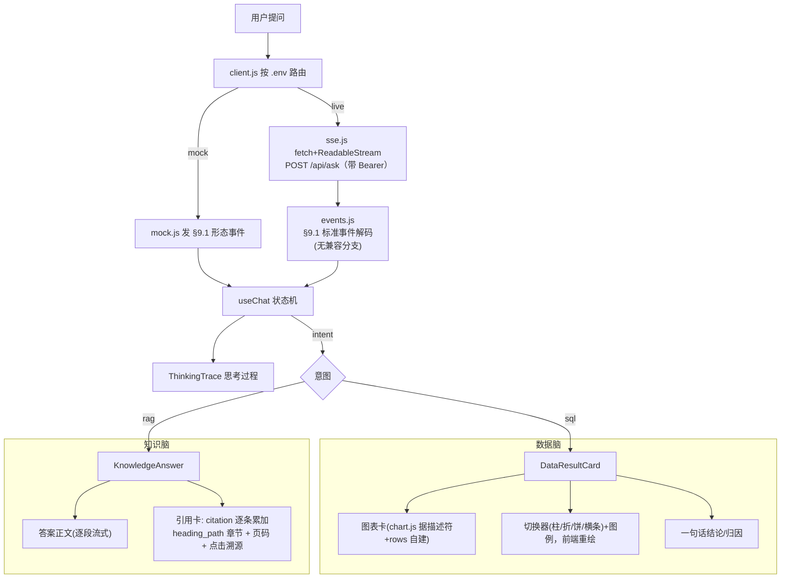
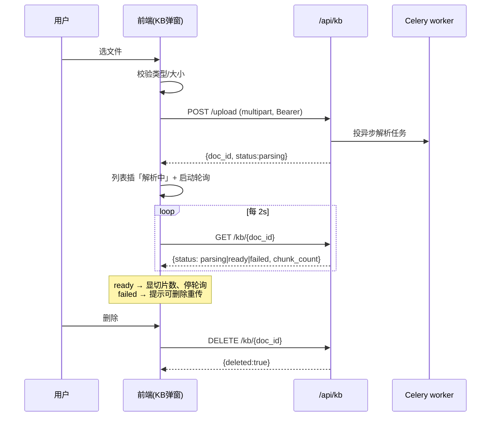

# 前端：知识库交互 + 引用溯源 + 历史会话还原 + 撤 SSE 兼容层

- 负责人：前端
- 日期：2026-05-25
- 关联工单：PRD-2 §9（前端与交互）、§9.1（SSE 事件协议）、§10（接口）、§5.5（RAG 引用结构）、§19.10
- 承接：后端⑤已把 SSE 对齐 §9.1、补好 `/api/kb/*` 与 `/api/history`（见 `docs/工作记录/后端/2026-05-25-SSE协议对齐与接口清单.md`）
- 状态：已完成（mock 冒烟全过；live 分支按后端实测契约对接，联调待起全栈后端）

> 这篇接着 `2026-05-22-前端门面.md`。门面那篇把双脑分流、流式思考、视觉系统、登录都做好了；
> 本篇补齐**知识库的真上传/管理**、**引用的章节级溯源**、**历史会话从服务端还原**，
> 并**撤掉了当初为兼容旧后端而写的 SSE 归一化层**（后端现已对齐 §9.1）。
> 详细到新人能照着跑。

---

## 1. 做了什么

四件事，对应任务四点：

| # | 做了什么 | 涉及文件 |
|---|---|---|
| 1 | **知识库**：上传（选文件→`/api/kb/upload`→轮询状态显进度）+ 文档列表 + 删除，全部按当前用户隔离 | 新 `src/api/kb.js`、重写 `src/components/KnowledgeBaseModal.vue`、`src/api/config.js` |
| 2 | **引用溯源**：知识问答引用卡展示 `heading_path`（章节）+ 页码，点击就地展开「出处定位」 | `src/components/KnowledgeAnswer.vue` |
| 3 | **历史会话还原**：`/api/history` 列会话、点开 `/api/history/{id}` 还原**含图表/引用**的对话 | 新 `src/api/history.js`、`src/composables/useChat.js` |
| 4 | **撤 SSE 兼容层**：组件直接吃 §9.1 标准事件，不再「两种形态都吃」 | 重写 `src/api/events.js`、`src/api/mock.js`、`useChat.js` |

数据分析卡（图表+切换器+图例、不展示 SQL/数据表）是上一篇做的，本次确认仍正常（冒烟覆盖）。

---

## 2. 为什么这么做（关键取舍）

### 2.1 为什么现在能撤 SSE 兼容层？
上一篇里后端实现与 PRD §9.1 有出入（`meta`/`cols`/裸字符串/`[DONE]`/`chart` 旧格式），前端写了一层
「两种形态都吃」的 `events.js` 兜着。**后端⑤已全部对齐 §9.1**，兼容分支就成了无用的负担——留着反而让
人以为协议还不稳。所以删掉所有兼容分支，`events.js` 只剩「原始 SSE 帧 → 规范事件」这一层薄解码。

> 「兼容层」撤掉 ≠ 把 `events.js` 删了。原始 SSE 帧（`event:`/`data:` 多行文本）总得有人解析成 JS 对象、
> 贴上 `type`。撤的是**容忍旧后端的那些 if 分支**，不是这层解码本身。

### 2.2 为什么 citation 要「逐条累加」而不是「整包替换」？
后端 `/api/ask` 是 **一条 citation 一个 SSE 事件**逐条推（`for c in citations: yield {"event":"citation","data": c}`）。
旧前端把 `citation` 当成 `{citations:[...]}` 整包、用 `msg.citations = ev.citations` 替换——**接后端会只剩最后一条**。
改成：`events.js` 把每个事件解码成单条 `{type:'citation', citation}`，`useChat` 用 `push` 累加。mock 也改成逐条推，和后端一致。

### 2.3 为什么历史会话要分 mock / live 两套？
- **live**：后端 `Message.result_meta` 已存了图表描述符/列行/引用，`/api/history/{id}` 能完整吐回。
  所以列表用 `/api/history`，点开某会话才 `/api/history/{id}` **懒加载**还原——省流量、和服务端是单一事实源。
- **mock**：没有后端，沿用上一篇的 localStorage「富副本」（按 userId 分桶）做离线 demo。

一个 `IS_MOCK` 开关在 `useChat` 里分流，组件无感。

### 2.4 为什么上传是「轮询」而不是等接口返回结果？
后端上传是「轻返回 + 重后台」：`/api/kb/upload` 只建档（status=`parsing`）+ 投 Celery 异步解析，立即返回 `doc_id`。
解析/切块/向量化在 worker 跑，耗时不定。所以前端**乐观插入一条「解析中」**，再每 2s 轮询 `GET /api/kb/{id}`
直到 `ready`/`failed`，期间显进度。这是异步任务的标准前端做法（不阻塞、可看进度）。

---

## 3. 怎么运行 / 怎么验证

### 3.1 mock 跑（离线，验前端逻辑）
```bash
cd frontend
# 临时用 mock 覆盖（.env.local 优先级高于 .env、且被 gitignore，测完删）
echo "VITE_DATA_SOURCE=mock" > .env.local
npm install
npm run dev            # 默认 5173，被占则自动用 5174
# 浏览器打开 → 点「⚡ 一键体验（演示账号）」登录 → 试 SQL/RAG/知识库/历史
rm .env.local          # 测完删，恢复 .env 的 live
```

### 3.2 live 跑（连真后端，真验收）
```bash
# 后端须以 PG 启动（kb_document.user_id 外键指 PG users）
APP_DATABASE_URL=postgresql+psycopg://...  python -m uvicorn app.main:app --port 8000
# 前端 .env 保持 VITE_DATA_SOURCE=live
npm run dev
```

### 3.3 冒烟自测（Playwright，mock）
```bash
# 需先按 3.1 起 mock dev server
SMOKE_URL=http://localhost:5174 python frontend/.smoke/smoke.py
```
实测输出（2026-05-25，mock）：
```
AUTH: guard_blocks=True demo_login_ok=True
SQL : canvas=True no_sql=True no_table=True switch_btns=4 switched=True intent_sql=True
RAG : cites=3 heading_path=True trace_box=True intent_rag=True
HIST: restored_chart=True (convs=2)
KB  : parsing_seen=True uploaded=True deleted=True (docs 2->3->2)
CONSOLE ERRORS: none
```
`npm run build` → `✓ built`（604 模块，仅打包体积告警，不影响运行）。

---

## 4. 输入 → 输出

### 4.1 知识库上传
- **输入**：用户选一个 `.pdf/.html/.md/.txt`（≤20MB）。
- **过程**：前端校验类型/大小 → `POST /api/kb/upload`（multipart，带 Bearer）→ 拿 `{doc_id, status:'parsing'}` →
  列表插一条「解析中」→ 每 2s `GET /api/kb/{doc_id}` → `ready` 时显示切片数。
- **输出**：文档进入该用户知识库，问答即可被检索引用。

### 4.2 知识问答引用（§9.1 RAG 流）
```
intent  {intent:"rag"}                                  → 思考过程「检索知识库」
insight {delta:"…"}（逐段）                              → 答案正文流式
citation {doc_id,page_no,chunk_id,heading_path,title}   → 逐条推；前端累加成引用卡
citation {…}
done    {msg_id, conversation_id, has_answer}
```
引用卡渲染：`title` + `heading_path`（拆成层级 chip）+ `P{page_no}`；点卡片就地展开「出处定位」。

### 4.3 历史会话还原（live）
- **输入**：点左栏某历史会话。
- **过程**：`GET /api/history/{id}` → `{messages:[{role,content,intent,chart,columns,rows,citations}]}` →
  `buildMsgFromHistory` 逐条还原成前端消息模型（assistant 的 `chart`→`chartPayload`、`content`→`insight`）。
- **输出**：数据脑会话重绘**同样的图表**（图型切换器照常可用）、知识脑会话还原**引用卡**——无需重跑 Agent。

---

## 5. 关键实现说明

### 5.1 `events.js`：§9.1 标准事件解码（已无兼容分支）
```js
case 'rows':     return { type:'rows', columns:o.columns||[], rows:o.rows||[] }
case 'insight':  return { type:'insight', delta:o.delta ?? '' }
case 'citation': return { type:'citation', citation:o }   // 后端逐条推，单条解码
case 'done':     return { type:'done', msgId:o.msg_id, conversationId:o.conversation_id, hasAnswer:o.has_answer }
```
`sql` 解码成 `{sql_text}` 但**前端不展示**（仅审计），只用于把思考过程推进到「查询数据库」。

### 5.2 `useChat.js`：citation 累加 + 历史懒加载
```js
case 'citation': if (ev.citation) msg.citations.push(ev.citation); break   // 累加，别替换

function selectConversation(id) {
  activeId.value = id
  const conv = conversations.find(c => c.id === id)
  if (!conv || conv.loaded || conv.serverConvId == null) return   // mock 本地副本已 loaded
  getConversation(conv.serverConvId).then(detail => {             // live 懒加载还原
    conv.messages.splice(0, conv.messages.length, ...detail.messages.map(buildMsgFromHistory))
  }).finally(() => { conv.loaded = true })
}
```

### 5.3 `kb.js`：上传轮询
组件对每个 `parsing` 文档 `startPoll(docId)`，`setInterval` 2s 调 `getDocStatus`，`ready`/`failed` 即 `clearInterval`；
组件 `onUnmounted` 清掉所有定时器（防泄漏）。`validateFile` 在前端先挡掉类型/大小不合规的，省一次往返。

---

## 6. 流程图

### 6.1 SSE §9.1 → 双脑渲染（撤兼容层后）


### 6.2 知识库上传 → 解析进度（轮询时序）


---

## 7. 踩过的坑

1. **citation 整包 vs 逐条**：后端一条引用一个事件，旧前端按 `{citations:[...]}` 整包替换会**只剩最后一条**。
   改成单条解码 + `push` 累加，mock 同步改成逐条推（保持和后端一致，避免 mock/live 行为分叉）。
2. **登录守卫挡住老冒烟脚本**：上一篇加了登录守卫后，首屏是登录页，老 `smoke.py` 一上来找 `.ex-card` 会失败。
   新脚本先点「⚡ 一键体验」demo 登录再测。
3. **5173 被占**：本机别的项目占了 5173，Vite 自动跳 5174。`smoke.py` 改成读 `SMOKE_URL` 环境变量，不写死端口。
4. **删除确认框**：`confirm()` 弹原生对话框，Playwright 默认 dismiss（=取消删除）。冒烟里挂 `page.on("dialog", d.accept())`。
5. **multipart 别手设 Content-Type**：`fetch` 传 `FormData` 时不要手动设 `Content-Type`，否则缺 boundary；让浏览器自动带。
6. **上传走 API 时后端要 PG**：`kb_document.user_id` 外键指 PG `users`，app 须以 `APP_DATABASE_URL=PG` 启动，
   否则登录用户落在别的库、外键过不去（后端⑤已注明）。

---

## 8. 待办 / 遗留

- **live 全栈联调**：本篇 mock 冒烟全过、live 分支按后端实测契约写好；待起全栈后端（PG+Redis+Celery+MinIO）后跑一遍真链路。
- **citation 跳转原文**：现为「就地展开出处定位」（章节+页码）。后端有文档查看器/原文片段接口后，可升级为跳转并高亮定位。
- **字体自托管**：沿用上一篇遗留（Google Fonts CDN → 生产建议自托管）。
- 代码按团队规范提交，等统一配好 GitLab 后再 push。
