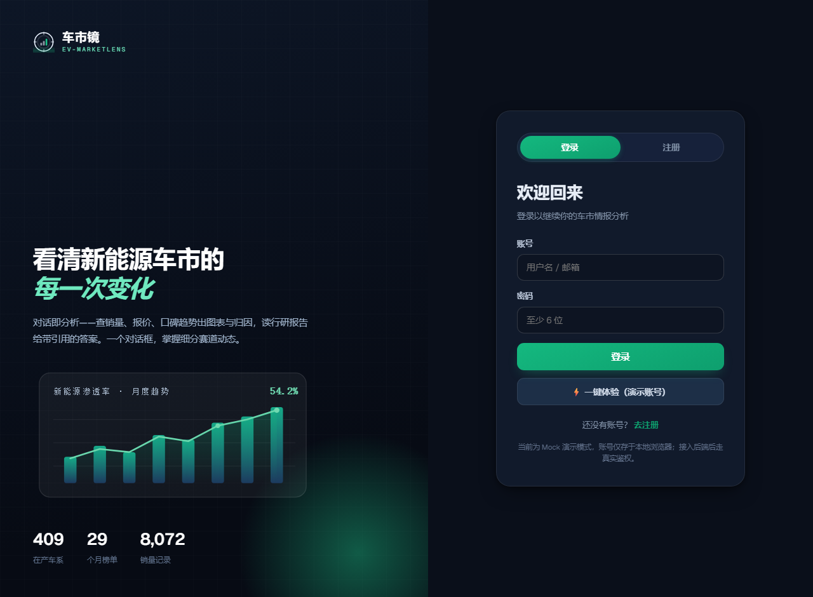
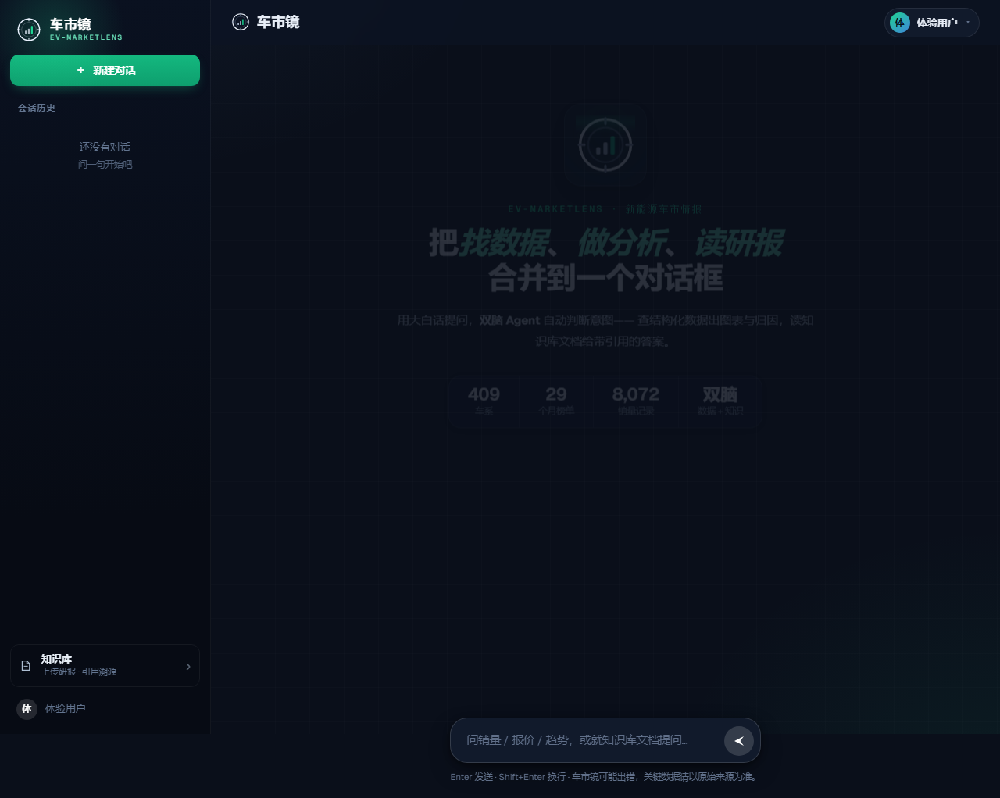
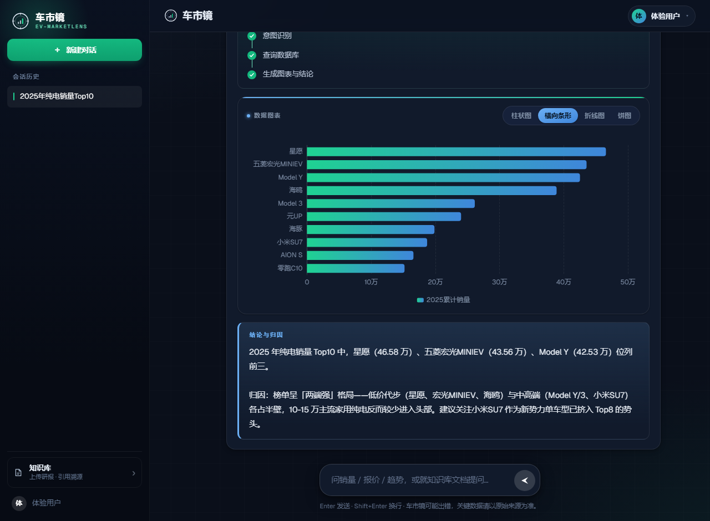
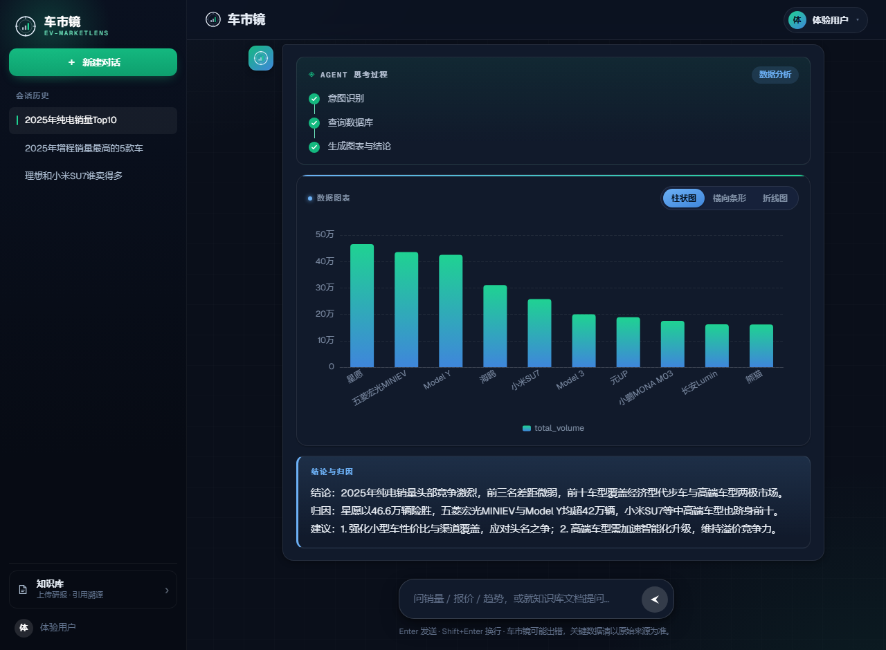

# 前端定调「精炼暗色·情报终端」+ 字体换 Geist

- 负责人：前端
- 日期：2026-05-26
- 关联工单：UI 改版（老板拍板「暗色终端」方向）；延续 PRD-2 §9（前端与交互）
- 状态：✅ 已完成（全站暗色一致、登录页打磨、图表暗色主题、mock 冒烟全过、live 联调通过）

> **一句话**：把前端从「暖纸 + Fraunces 衬线（杂志/精品气质）」整体改成「冷调暗色 + Geist 无衬线 +
> 数据为主角（Linear / Vercel / Perplexity / Raycast 那种 pro 工具质感）」。
> 靠的是 **token 驱动**——只改 `tokens.css` 的「值」、变量名一律不动，绝大多数组件自动暗色化；
> 再逐个处理「`--ink-*` 既当背景又当文字」的陷阱、登录页、图表、字体。

---

## 1. 做了什么（涉及文件）

| 文件 | 改动 |
|---|---|
| `src/styles/tokens.css` | **核心**：所有变量改暗色值（画布/面板/边框/文字/侧栏/翡翠/azure/状态/阴影），变量名不动 |
| `index.html` | 字体 link 换 **Geist + Geist Mono**（去 Fraunces/Manrope/IBM Plex Mono）；防闪烁底色 `#0a0f1a` |
| `src/styles/global.css` | body 暗背景 + azure/翡翠辉光 + 极淡网格；`::selection` 翡翠；滚动条白色低透明 |
| `src/utils/chart.js` | ECharts 暗色主题：冷光调色板、Geist 字体、轴/网格/渐变/图例/tooltip 全适配 |
| `LoginView.vue` | 重点打磨成 Linear 风：左面板深墨、tabs 滑块翡翠、表单悬浮玻璃卡、输入框凹陷 + 翡翠光环 |
| `TopBar/UserMessage/AssistantMessage/Composer/DataResultCard/EmptyState.vue` | 处理「ink 当深色背景」陷阱（见 §3） |

> **换肤铁律保住了**：除陷阱处（少数把 ink 当背景的硬编码）外，组件没动颜色；以后换主题仍只改 `tokens.css`。

---

## 2. 为什么这么做

暖纸底色（`#f3f1ea`）+ Fraunces 衬线标题 = 杂志/精品气质，不像企业数据终端。
改成**冷调暗色 + 精炼无衬线 + 数据为主角** = pro 工具高级感。设计系统是 token 驱动的，所以「改值不改名」
能让改动收敛在一个文件，风险小、可回退、可继续换肤。

### 关键陷阱：`--ink-*` 一词两用
原设计里 `--ink-900` 既当**深色背景**（侧栏/气泡/头像渐变）又当**标题文字**。暗色化时这两类要反向处理：
- 把 `--ink-950..--ink-300` 重定义为「**冷光文字阶**」（亮→暗）——所有「用 ink 当标题/正文/描边」的地方自动变亮、正确；
- 但「用 ink 当深色背景」的地方会随之变亮 → **逐个改成深色面（panel/panel-2/side-bg）或强调色（jade/azure）**。

---

## 3. 逐个处理的「ink 当背景」陷阱

| 组件 | 原（暖色背景）| 改后 |
|---|---|---|
| LoginView `.brand-panel` | `gradient(ink-800, ink-950)`（变亮后**全白**）| `gradient(165deg,#0d1626,#070b14)` 深墨 |
| LoginView `.ink` tabs 滑块 | `gradient(ink-700, ink-900)` | 翡翠 `gradient(jade-600, jade-700)` + 辉光 |
| LoginView `.form-card` | 透明 | **悬浮玻璃卡**：`var(--panel)` + 发丝边 + `--shadow-md` |
| UserMessage `.bubble` | `gradient(ink-800, ink-900)` | azure 微染 `var(--sql-soft)` + azure 描边 |
| AssistantMessage `.avatar` | `gradient(ink-800, ink-950)`（**漏白**）| `gradient(jade-600, sql-deep)` 发光头像 |
| Composer `.stop` / `.stop:hover` | `var(--ink-900)` / `ink-950`（**漏白**）| `panel-2` / `error` 系 |
| DataResultCard `.switch button.on` | `gradient(ink-700, ink-900)` | azure 填充 `gradient(sql-accent, sql-deep)` + 深字 |
| DataResultCard 顶条 / 圆点 | `ink-700` | `sql-accent`（azure，带辉光）|
| TopBar `.ua` 头像 | `gradient(jade-600, ink-700)` | `gradient(jade-500, sql-deep)` |
| EmptyState `.ex-card.sql::before` | `ink-700` | `sql-accent` |

---

## 4. 怎么跑 / 怎么验证

```bash
cd frontend
npm run dev          # 暗色界面（.env VITE_DATA_SOURCE=live 连真后端；mock 用 .env.local 覆盖）
npm run build        # ✓ built（604 模块，无编译错误）
# 冒烟（Playwright，mock）：build 出 mock 产物用 http.server 静态托管给 Chromium
SMOKE_URL=http://127.0.0.1:8899 python frontend/.smoke/smoke.py
# live 联调（后端在 :8000）：
SMOKE_URL=http://127.0.0.1:8899 python frontend/.smoke/live_check.py
```

**验收实测（2026-05-26）**：
- mock 冒烟全流程：`AUTH guard+demo / SQL canvas+4切换器+无SQL无表+重绘 / RAG 3引用+heading_path+溯源 / 历史还原图表 / KB 上传→解析→删除`，**零控制台报错**。
- **live 联调**：demo 登录真后端 → 提「2025年纯电销量Top10」→ 真 SSE 出图表 + 真实结论（"2025年纯电销量头部竞争激烈…"），`logged_in=True canvas=True`，**零报错**。

---

## 5. 截图（改造后）

| 登录页 | 空状态首屏 | 数据问答带图表 |
|---|---|---|
|  |  |  |

live 联调（连真后端）：

**前后对比**：
- 改造前：暖纸画布 `#f3f1ea` + Fraunces 衬线标题，整体米黄/编辑感（见 `2026-05-22-前端门面.md`）。
- 改造后：冷调暗色 `#0a0f1a` + Geist 无衬线 + 单一翡翠强调 + azure 数据脑色，发丝边 + 微辉光 + 网格，数据/图表为主角——企业级 AI 数据终端质感。

---

## 6. 踩过的坑

1. **TopBar 漏白（用户当场发现）**：`.topbar background: rgba(255,253,249,.82)` 是**硬编码暖白**（不是 token），
   暗色化后导航条仍亮白。首轮 Grep 搜 `#fff` 没匹配到这个 rgba 值 → 漏了。改成 `rgba(13,20,34,.72)` 毛玻璃。
   教训：排查漏白要搜 `rgba(255,253...)` `rgba(255,255,2..)` 这类暖白/浅色 rgba，不只搜 `#fff`。
2. **ink-950 变白导致多处漏白**：ink-950 重定义为 `#f4f8fd`（最亮文字），凡是 `gradient(..., ink-950)` 当背景的
   （登录左面板 / 助手头像 / stop:hover）全变白 → 逐个改深色面或强调色。
3. **hero 标题/正文对比度不足**：`h1 em` 用 `jade-700`(#0e9f6e 暗绿，暗底发闷)、`.tagline` 用 `tx-500`(<4.5:1)。
   提亮为 `jade-300`(亮翡翠) / `tx-700`，满足 WCAG AA。
4. **Playwright 对 vite dev 报 `ERR_EMPTY_RESPONSE`**：IWR 能访问、Chromium goto 却空响应（非 IPv6、非代理）。
   解法：`npm run build` 出产物，用 `python -m http.server` 静态托管给 Playwright（更稳）；launch 加 `--no-proxy-server`。
5. **图表不做暗色会很丑**：ECharts 默认浅色轴/网格在暗底刺眼 → 调色板换冷光、轴 `#7c8ba3`、网格 `rgba(255,255,255,.07)`、
   柱渐变翡翠→azure、tooltip 背景加深 `rgba(8,13,22,.96)`。

---

## 7. 待办 / 遗留
- 生产字体自托管（现 Geist 走 Google Fonts CDN，断网回退 system-ui）。
- 代码按团队规范提交，等统一配好 GitLab 后再 push。
- 换肤铁律保住：后续调色只动 `tokens.css`。
