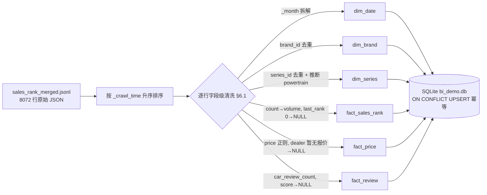
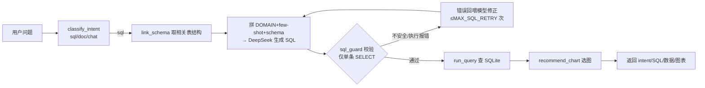

# T4+T7 本地跑通后端：自然语言 → Text2SQL → 查真实销量 → 返回结果

- 负责人：后端（zhanghuizhi）
- 日期：2026-05-22
- 关联工单：T4（清洗治理 raw→DWD 入库）+ T7（Text2SQL），见开发任务拆解书
- 状态：已完成

> 目标：本地把后端整条链路跑通——浏览器/curl 问一个真实问题（如「理想和小米SU7谁卖得多」），
> 经 意图识别 → Text2SQL → SQL 安全校验 → 查本地 SQLite 真实数据 → 返回 SQL + 数据 + 图表建议。
> 本文「每一步都写清楚逻辑 + 为什么」，详细到新人能照着从零跑通。

---

## 1. 做了什么

一句话：把 8072 行懂车帝原始榜单数据按 PRD-1 §6 清洗拆表入 SQLite，并把 starter 骨架里的
Text2SQL few-shot 换成新表，最终自然语言提问能返回真实销量结果。

涉及文件：
| 文件 | 动作 | 说明 |
|---|---|---|
| `.env` | 新建 | 按 DeepSeek 配置（base_url/model/key），库指向 `sqlite:///bi_demo.db` |
| `data/clean_load.py` | **新建** | 清洗入库脚本：raw JSONL → 清洗 → 拆 6 张表 → SQLite，幂等 UPSERT |
| `bi_demo.db` | 重建 | 由 clean_load.py 生成，含 `dim_brand/dim_series/dim_date/fact_sales_rank/fact_price/fact_review` |
| `app/text2sql.py` | 改 | 删 starter 旧「区域/经销商」few-shot，换成车市镜星型模型的领域提示 + few-shot |

最终库内行数（与预期吻合）：
```
dim_brand=101  dim_series=409  dim_date=29
fact_sales_rank=8072  fact_price=8072  fact_review=8072
其中 新上榜(last_rank→NULL)=355 行；volume 异常剔除=0 行
powertrain 分布：纯电5122 / 插混2646 / 增程304
```

---

## 2. 为什么这么做（关键设计取舍）

1. **为什么用 SQLite，而不是直接上 PostgreSQL？**
   本地 demo 求「零配置、单文件、可复现」。`app/config.py` 默认 `DATABASE_URL=sqlite:///bi_demo.db`，
   `app/db.py` 又是 schema-agnostic（靠 introspection 读表），所以只要把表建进这个文件，
   上层 Text2SQL 不用改一行就能查。PostgreSQL+pgvector 留生产（部署时只换 `DATABASE_URL`）。

2. **为什么清洗脚本用 stdlib `sqlite3`，不用 pandas/sqlalchemy？**
   清洗逻辑是「逐行字段映射 + 拆表」，没有复杂的向量化运算；用 `executemany` 批量写已经够快，
   还能少装依赖（pandas 留到数据量上来再说，PRD-1 §6.6 也是这么规划的）。

3. **为什么用 `INSERT ... ON CONFLICT DO UPDATE`（UPSERT）而不是简单 INSERT？**
   PRD-1 §6.2 去重要求：事实表按唯一键 `(series_id,date_id,new_energy_type,rank_type)` 去重；
   维度表按主键取「最新一条」。UPSERT 让脚本**幂等**——重复跑、或将来增量追加新月份数据，
   同键不会变成重复行，而是覆盖更新。配合「按 `_crawl_time` 升序处理 → 后写覆盖」即实现「取最新」。

4. **为什么先 DROP 掉 starter 的旧表（dim_region/dim_model/fact_sales…）？**
   `seed.py` 造的是「区域/车型/经销商」假数据，与本项目无关。若留在库里：
   - 库内 >6 张表会触发 `app/schema_linking.py` 的关键词筛选（`max_tables=6`），可能漏给正确表；
   - 旧表名/列名会**误导 LLM** 生成错 SQL。
   所以 clean_load.py 开头显式 DROP 这 6 张旧表，产出一个「只含车市镜分析表」的干净库。

5. **为什么 few-shot 之外还加了一段「领域提示 DOMAIN」？**
   `db.get_schema_text()` 只能给出列名+类型，**给不出业务语义**（如 `new_energy_type=1` 是纯电、
   `score` 恒为 NULL、销量在 `volume` 列）。LLM 不知道这些就会瞎猜。所以在 prompt 里补一段
   星型模型语义 + 枚举 + 口径，这是 Text2SQL 准确率的关键。

6. **score 为什么一律置 NULL？** 销量接口里 score 恒为 0（实测），是接口缺陷不是真实评分。
   置 0 会让「按评分排序」得到全 0 的假结果；置 NULL 是诚实标注「此列暂无数据」，等口碑接口补。

---

## 3. 怎么运行 / 怎么验证

```bash
# 0. 前置：用 Python 3.12 建 venv（系统 3.14 alpha 装不上 lxml 等包，别用）
#    本机已有 .venv（3.12），直接复用。
# 1. 装依赖（注意：requirements.txt 含中文注释，pip 在 Windows 默认 gbk 解码会报错，必须 PYTHONUTF8=1）
PYTHONUTF8=1 .venv/Scripts/python.exe -m pip install -r requirements.txt

# 2. 配 .env（DeepSeek）：LLM_BASE_URL=https://api.deepseek.com  LLM_MODEL=deepseek-v4-pro  LLM_API_KEY=sk-...
#    注：该 key 的 /models 接口现仅提供 deepseek-v4-flash / deepseek-v4-pro（deepseek-chat 已不在列表）。

# 3. 清洗入库（raw → SQLite）
PYTHONUTF8=1 .venv/Scripts/python.exe data/clean_load.py
#    预期尾部输出：fact_sales_rank=8072 / dim_series=409 / dim_brand=101 ...

# 4. 起服务
PYTHONUTF8=1 .venv/Scripts/python.exe -m uvicorn app.main:app --port 8000

# 5. 测试（Windows 下 curl 直接传中文 -d 会因编码报 "error parsing the body"，
#    建议用 Python 发请求，或把 JSON 存 UTF-8 文件后 curl --data-binary @file）
.venv/Scripts/python.exe -c "import urllib.request,json; \
d=json.dumps({'question':'理想和小米SU7谁卖得多'}).encode('utf-8'); \
r=urllib.request.Request('http://localhost:8000/api/ask_sync',data=d,headers={'Content-Type':'application/json'}); \
print(urllib.request.urlopen(r).read().decode('utf-8'))"
```

**实测验收结果**（2026-05-22，deepseek-v4-pro，均第 1 次就生成正确 SQL）：

| 问题 | 生成 SQL 要点 | Top 结果（真实数据） |
|---|---|---|
| 理想和小米SU7谁卖得多 | `LIKE '%理想%' OR LIKE '%小米SU7%'` + SUM(volume) | 小米SU7 **460,536** > 理想L6 387,948 > 理想L7 227,192 |
| 2025年纯电销量前10的车系 | `new_energy_type=1 AND year=2025` GROUP BY | 星愿 465,775 / 五菱宏光MINIEV 435,599 / Model Y 425,337 |
| 2025年增程销量最高前5 | `new_energy_type=3 AND year=2025` | 理想L6 166,516 / 理想L7 80,707 / 理想L9 45,214 |

结论：**自然语言 → Text2SQL → 查真实销量 → 返回结果，整链路跑通，验收通过。**

---

## 4. 输入 → 输出

**输入**：一条原始 JSONL（懂车帝销量榜，节选）：
```json
{"series_id":6173,"series_name":"理想L7","rank":1,"min_price":30.18,"max_price":35.98,
 "last_rank":1,"count":13343,"score":0,"car_review_count":476,"price":"30.18-35.98万",
 "dealer_price":"30.18-35.98万","has_dealer_price":true,"brand_id":202,"brand_name":"理想汽车",
 "_month":"202401","_new_energy_type":3,"_source_url":"...","_crawl_time":"2026-05-22T15:43:49"}
```

**输出**：拆成 5 张表各 1 行（按 §6.1 规则）：
- `dim_date`：`202401, 2024, 1, 1, '2024-01'`
- `dim_brand`：`202, '理想汽车', ...`（country_type/is_new_force=NULL，待 enrich）
- `dim_series`：`6173, '理想L7', 202, segment=NULL, powertrain='增程'(由能源类型=3 推断), 30.18, 35.98`
- `fact_sales_rank`：`6173, 202401, net=3, rank_type=11, rank=1, last_rank=1, volume=13343`
- `fact_price`：`guide 30.18~35.98, price_text='30.18-35.98万', has_dealer_price=1`
- `fact_review`：`review_count=476, score=NULL`(恒 0→置空)

---

## 5. 关键实现说明

### 5.1 字段级清洗规则（`data/clean_load.py`，对应 PRD-1 §6.1）

| 原始字段 | 处理逻辑 | 为什么 | 去向 |
|---|---|---|---|
| `_month`「202401」| 拆成 date_id/year/month/quarter/ym | 销量榜是月粒度，建月维度方便按年/季/月聚合 | `dim_date` |
| `series_id` / `brand_id` | 整数主键直接用 | 懂车帝单源内 ID 本身稳定，**天然对齐**无需模糊匹配（§6.3） | 维度主键 |
| `series_name`/`brand_name` | 去首尾空白，空串→None | 防脏数据；空名兜底 `series_{id}` 避免 NOT NULL 失败 | 维度名 |
| `count` | → `volume`(int)，校验 >0 | volume 是核心度量；非正数视为异常剔除（实测 0 条） | `fact_sales_rank.volume` |
| `last_rank` | 缺失/**0** → NULL 并计「新上榜」 | 0 表示该车系当月首次进榜，记 NULL 而非 0 才不会把「环比排名变化」算错（§6.4） | `fact_sales_rank` |
| `score` | **一律 NULL** | 销量接口恒为 0，是接口缺陷不是真分，置空才诚实 | `fact_review.score` |
| `_new_energy_type` | 1/2/3 → 推断 powertrain 纯电/插混/增程 | 清洗阶段就把 nullable 的 powertrain 补上（§6.3 对齐副产品），省一个详情接口 | `dim_series.powertrain` |
| `price`/`dealer_price` | 正则 `(\d+\.?\d*)-(\d+\.?\d*)万` 解析区间；「暂无报价」→NULL | min/max 缺失时用文本兜底；无法解析的文本（暂无报价）置空避免脏值 | `fact_price` |
| `_source/_source_url/_crawl_time` | 原样带入 | **血缘**：每行可回溯到原始接口 URL 与采集时刻 | 各事实表 |

核心解析函数：
```python
_RANGE_RE = re.compile(r"(\d+(?:\.\d+)?)\s*-\s*(\d+(?:\.\d+)?)\s*万")  # 「5.98-8.98万」
_SINGLE_RE = re.compile(r"(\d+(?:\.\d+)?)\s*万")                       # 「7.99万」单值

def clean_rank(last_rank):           # 「新上榜」语义
    if last_rank in (None, 0):
        return None, True            # NULL + 标新上榜
    return int(last_rank), False
```

### 5.2 去重 / 取最新（§6.2）

```python
rows.sort(key=lambda r: r.get("_crawl_time", ""))   # 升序 → UPSERT 时后写(更新)覆盖 = 取最新
# 维度：dict 按主键收集（同 id 后者覆盖前者）；事实：ON CONFLICT(唯一键) DO UPDATE
```
- 实测维度去重效果：8072 行原始 → `dim_series` 409 行、`dim_brand` 101 行（同车系/品牌在 29 个月里反复出现，去重成各 1 行）。
- 事实唯一键 `(series_id,date_id,new_energy_type,rank_type)`；报价/口碑两表按 `(series_id,date_id)` 唯一（榜单是车系×月口径，每对组合唯一，故三事实表都是 8072 行）。

### 5.3 Text2SQL few-shot 改造（`app/text2sql.py`，T7）

- 删掉 starter 的 `fact_sales/dim_region` 旧示例（与本项目无关，会误导）。
- 新增 `DOMAIN` 块：把星型模型语义、枚举（能源类型 1/2/3）、口径（销量=volume 需 SUM、score 恒 NULL 别用来排序）喂给模型——补 introspection 给不出的业务含义。
- 新增 3 条贴近真实问题的 few-shot（年份+能源 Top N、车系对比 LIKE、品牌×指定月份），并把 DOMAIN 拼进 user prompt。
- 其余链路（`sql_guard` 只放行单条 SELECT + `with_limit` 兜底 LIMIT + 出错回喂模型自校验重试）沿用骨架，未改。

---

## 6. 流程图

### 6.1 清洗入库（ETL）流水线


### 6.2 在线问答链路（一次问答）


---

## 7. 踩过的坑

1. **pip 装依赖报 `UnicodeDecodeError: 'gbk' codec`**：`requirements.txt` 含中文注释，
   pip 在 Windows 默认用 gbk/cp936 解码 UTF-8 文件失败。解决：`PYTHONUTF8=1 python -m pip install -r ...`。
   （第一次后台跑 `pip ... | tail` 误判成功——退出码 0 其实是 `tail` 的，不是 pip 的；务必单独看 pip 退出码。）
2. **curl 传中文 `-d` 报 `error parsing the body`**：Windows shell 把中文按本地编码发出，FastAPI 收到乱码 JSON 解析失败。
   解决：用 Python 发请求，或 JSON 存 UTF-8 文件后 `curl --data-binary @file`。
3. **库里混着 starter 旧表**：`seed.py` 之前跑过，留下 6 张「区域/经销商」假表，导致总表数 >6 触发
   schema_linking 关键词筛选、且会误导 LLM。解决：clean_load.py 开头显式 DROP。
4. **`last_rank` 实测 355 行为 0（PRD-1 §6.1 写的是 337 行）**：数据在 2026-05-22 又刷新过（merged 8072 行 vs PRD 时的 7734 行）。
   逻辑不变（0/缺失 → NULL 并标新上榜），数字以本次实测为准。
5. **控制台显示中文乱码**：bash/PowerShell 控制台编码问题，**文件内数据本身是好的 UTF-8**（已用 `encoding='utf-8'` 读写、`PYTHONUTF8=1` 运行验证）。

---

## 8. 待办 / 遗留

- `dim_series.segment`（级别 轿车/SUV/MPV）、`dim_brand.country_type/is_new_force`、`fact_review.score/sentiment` 仍为 NULL，
  等 T2 收尾补「口碑接口 + 车系详情接口」后回填（见 PROJECT-MEMORY/04 下一步）。
- 生产切 PostgreSQL+pgvector：只需改 `.env` 的 `DATABASE_URL`，把 `sql/schema.sql`（Postgres 方言）建库后，
  把 clean_load.py 的 sqlite3 写入换成对应驱动（或改用 sqlalchemy 统一）。
- Agent 编排目前是线性版（`app/agent.py`），M2 升级 LangGraph（T10）；RAG 脑（T9）尚未接入。
- 代码提交按团队规范，等统一配好 GitLab 后再 push。
