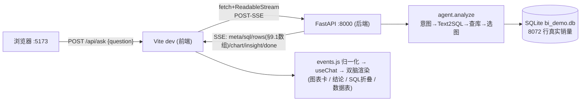

# 全栈本地端到端跑通：前端 + 后端联调（live），并修复图表数据契约 bug

- 负责人：后端（zhanghuizhi）
- 日期：2026-05-22
- 关联工单：T7 Text2SQL + T11 FastAPI + T12 前端（联调）、PRD-2 §9.1 SSE 协议
- 状态：已完成（数据分析脑 live 链路全通；RAG 脑后端未实现，前端已留位）

> 目标：把「车市镜」整个项目在本地拉起来——前端(5173) 连真后端(8000)，
> 自然语言提问 → Text2SQL → 查 SQLite 真实销量 → 图表 + 结论流式回前端。
> 本文是**整个项目怎么启动**的权威跑通记录，新人照着能起。

---

## 1. 做了什么

1. 把前端 `frontend/.env` 切到 **live**（连真后端），后端 `uvicorn:8000` + 前端 `vite:5173` 同时起。
2. 用 Playwright 真浏览器跑通一个真实问题（「2025年纯电销量Top10」），截图验收。
3. **修复一个真 bug**：live 模式下图表 X 轴标签全是 `undefined`、柱子不显示。
   根因＝后端 `rows` 事件用「字典行」，而前端按列位 `r[i]` 取值需要「数组行」（PRD-2 §9.1 契约）。
   改 `app/main.py`：`rows` 事件按 §9.1 输出 `{columns, rows(数组)}`。

涉及文件：`frontend/.env`（mock→live）、`app/main.py`（rows 事件对齐 §9.1）、
`frontend/.smoke/smoke_live.py`（新增 live 冒烟脚本）。

---

## 2. 整个项目怎么启动（本地，权威步骤）

**前置**：Python 3.12 venv（已装依赖）、Node ≥18（前端 `node_modules` 已装）、`.env` 配好 DeepSeek（`deepseek-v4-pro`）、`bi_demo.db` 已由 `data/clean_load.py` 灌好（8072 行）。

```bash
# 终端 1 —— 后端（FastAPI，端口 8000）
cd D:/lgb/t1/bi-agent-starter
PYTHONUTF8=1 .venv/Scripts/python.exe -m uvicorn app.main:app --port 8000 --reload
#   验证：curl http://localhost:8000/health  → {"ok":true}

# 终端 2 —— 前端（Vite，端口 5173）
cd D:/lgb/t1/bi-agent-starter/frontend
# 确认 .env 里 VITE_DATA_SOURCE=live（连真后端；mock=纯前端假数据）
npm run dev
#   浏览器打开 http://localhost:5173
```

**冒烟自测（可选，验收用）**：
```bash
PYTHONUTF8=1 .venv/Scripts/python.exe frontend/.smoke/smoke_live.py
# 预期：chart(canvas)=True thinking-trace=True intent=sql:True sql_fold_visible=True / CONSOLE ERRORS: none
```

> 数据没灌过先跑：`PYTHONUTF8=1 .venv/Scripts/python.exe data/clean_load.py`
> 依赖没装先跑：`PYTHONUTF8=1 .venv/Scripts/python.exe -m pip install -r requirements.txt`（必须带 PYTHONUTF8=1，否则中文注释 gbk 解码报错）

---

## 3. 验收结果（2026-05-22，真浏览器 live）

问「2025年纯电销量Top10」：
- ✅ 思考过程：意图识别 → 查询数据库 → 生成图表与结论（逐步打勾）
- ✅ ECharts 柱状图：星愿 46.6万 / 五菱宏光MINIEV / Model Y / 海鸥 / 小米SU7 …（**真实数据、真实车系名**）
- ✅ 结论与归因：流式输出，引用真实数字
- ✅ 可折叠「查看 SQL」「查看数据表(10行)」；右上「已连后端」；**无控制台报错**

截图：`frontend/.smoke/live-2-sql.png`（已 gitignore，本地可看）。

---

## 4. 关键实现说明：图表 bug 的根因与修复

### 4.1 现象
live 下图表 X 轴 10 个标签全是 `undefined`，没有柱子；但结论文字、数据表正常。

### 4.2 根因（数据契约不一致）
- 后端 `db.run_query` 返回的行是**字典**：`{"series_name":"星愿","total_volume":465775}`，
  `main.py` 原样塞进 `rows` 事件：`{"cols":[...], "rows":[{...}, ...]}`。
- 前端 `utils/chart.js` 按**列位**取值：`cats = rows.map(r => String(r[xi]))`、`vals = rows.map(r => Number(r[yi]))`，
  这里 `xi/yi` 是列的**数字下标**。对字典行 `r[0]` = `undefined` → 标签 undefined、值 NaN→0。
- `DataTable.vue` 用 `v-for="(cell) in r"` 遍历，**恰好**能遍历字典的值，所以表格没坏——这掩盖了问题，只有图表暴露。
- PRD-2 §9.1 规定 `rows` 是**数组**：`{"columns":[...], "rows":[["华东",1234], ...]}`。前端是按这个契约写的。

### 4.3 修复（后端对齐 §9.1）
`app/main.py` 的 `rows` 事件按列序把字典行拍平成数组：
```python
cols = result["cols"]
row_arrays = [[r.get(c) for c in cols] for r in result["rows"]]
yield {"event": "rows", "data": json.dumps(
    {"columns": cols, "rows": row_arrays}, ensure_ascii=False, default=str)}
```
**为什么改后端而不是前端**：§9.1 是权威契约，前端（chart.js/DataTable）已按数组实现，前端团队也明确要求后端对齐 §9.1。改后端一处，前端零改动，图表立即正确。

---

## 5. 流程图：本地两进程 + live 数据流



---

## 6. 踩过的坑

1. **图表 X 轴全 undefined**：后端 `rows` 发字典、前端按列位取值需数组 → 后端对齐 §9.1 发数组（本文 §4）。
2. **uvicorn 不加 `--reload` 改了代码不生效**：联调期建议带 `--reload`。
3. **前端 live 切换**：只改 `frontend/.env` 的 `VITE_DATA_SOURCE=live` 并**重启 dev server**（Vite 启动时读 .env）。
4. **Playwright 要装浏览器**：`python -m playwright install chromium`；本机 3.12 venv 装 sync API 即可（前端旧 smoke 用 async 是为绕开 3.14 段错误，3.12 下两种都行）。

---

## 7. 待办 / 遗留（影响"完整上线"，非本次跑通范围）

- **RAG 第二个脑后端未实现**：前端点「行研报告」类问题会走 `classify_intent→doc`，后端目前只回「M2 接入」提示，没有 `citation`。需 T5(MinerU)+T9(RAG)+pgvector。
- **`/api/kb/list`、`/api/history` 后端没有**：前端知识库弹窗/会话历史 live 下取不到数据（前端已留位，不报错）。
- **SSE 其余事件名仍是历史形态**（`meta`/裸 sql 字符串/裸 insight/`[DONE]`/chart 是选图建议非完整 option）：前端归一化层兜着能跑，但建议后续完整对齐 §9.1（尤其 `chart` 直接产出完整 ECharts option），见上线路线 P4。
- 生产：切 PostgreSQL+pgvector、部署（compose 的 db 要换 pgvector 镜像）。
