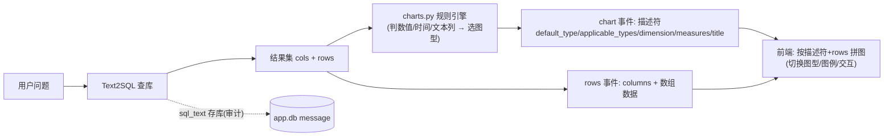

# 图表改造：从「LLM 生成图」改为「规则引擎产出图表描述符 + 数据」

- 负责人：后端（zhanghuizhi）
- 日期：2026-05-22
- 关联工单：T8 图表洞察、PRD-2 §8（选图机制）、§9.1（SSE 协议）
- 状态：已完成（后端改造 + live 实测）

> 目标：后端不再「LLM 生成一段写死的 ECharts option」，改为产出**图表描述符 +
> 数据(rows)**，让前端自由切换图型、显示图例、自己拼图。图型判定改用**规则引擎**（更快更稳），
> LLM 只留着写结论/归因。

---

## 1. 做了什么

| 文件 | 动作 | 说明 |
|---|---|---|
| `app/charts.py` | **重写** | 删掉 LLM 调用，改规则引擎：看结果集结构产出图表描述符 |
| `app/agent.py` | 改 | `recommend_chart(cols, rows, question)` 多传 question 作标题 |
| `app/main.py` | 不变 | `chart` 事件本就直接发 `result["chart"]`，自动变成发描述符；`rows`/`sql` 照旧 |

效果：每次提问的 LLM 调用从「意图 + SQL + **选图** + 洞察」减为「意图 + SQL + 洞察」，选图零延迟、不会抽风。

---

## 2. 为什么这么做

1. **图是「数据 + 怎么画」，不该把数据焊死进 option。** 后端发描述符（用哪列当维度、哪些列当系列、
   默认/可选图型）+ 原始 rows，前端就能**自由切换柱/线/饼、加图例、做交互**，不用后端重算。
2. **规则引擎比 LLM 选图更快更稳。** 图型只取决于结果集结构（有没有时间列、几个维度、类别多少），
   是确定性问题，用规则判得准、零延迟、不耗 token、不会乱答。LLM 留给真正需要语言能力的结论/归因。
3. **职责分离**：后端只负责「判定能怎么画」，前端负责「具体渲染」，契约清晰、两边都好测。

---

## 3. 契约（前后端必须对齐）

**`chart` 事件**（描述符）：
```json
{
  "default_type": "bar",
  "applicable_types": ["bar", "hbar", "line", "pie"],
  "dimension": "series_name",
  "measures": ["total_volume"],
  "title": "2025年纯电销量前10的车系"
}
```
| 字段 | 含义 |
|---|---|
| `default_type` | 首选图型 |
| `applicable_types` | 可切换的图型（前端据此出切换按钮）。图型名：`bar`竖柱 / `hbar`横条 / `line`折线 / `pie`饼 / `table` |
| `dimension` | 维度列名 → x 轴 / 饼图类别（可能为 null，如单行聚合值） |
| `measures` | 数值列名数组 → 系列；**多个 = 多系列 + 图例** |
| `title` | 标题（取自用户问题） |

**`rows` 事件**（照发，前端画图的数据来源）：
```json
{ "columns": ["series_name", "total_volume"], "rows": [["星愿", 465775], ["Model Y", 425337]] }
```

**前端约定**：按 `measures` 个数决定系列数与图例项；按 `dimension` 决定 x 轴/饼图类别；
数值全部取自 `rows`（按列名找列位），**前端绝不编造数据点**（PRD §8.3）。

**`sql` 事件**：后端仍发（`sql_text` 也照常存库做审计/调试），**但前端不展示给用户**（忽略或折叠隐藏即可）。

---

## 4. 规则引擎判图逻辑（`app/charts.py`）

逐列判定「数值列 / 时间列 / 文本列」后：
- `measures` = 数值列且非时间列（`year`/`month` 这种数值时间列算维度，不算度量）。
- **无 measures** → `default_type=table`（只有数据、无法成图）。
- **有文本维度列** → 维度=该列；类别 >12 默认 `hbar`（Top-N 友好），否则 `bar`；单系列且类别 ≤8 才把 `pie` 列入可选。
- **只有时间列（无文本）** → 维度=时间列，默认 `line`（趋势）。
- **既无文本也无时间维度**（如单行聚合值）→ `bar` 兜底，`dimension=null` 交前端决定。

实测各形态（单元测试）：
| 结果集 | 描述符结论 |
|---|---|
| (series_name, total_volume) 5 行 | bar；applicable 含 pie（≤8 类别） |
| (series_name, total_volume) 15 行 | **hbar**（>12 类别） |
| (ym, volume) | **line**，dimension=ym |
| (series_name, min, max) | bar，**measures=[min,max]（多系列+图例）** |
| (year, total_volume) | line，year 当时间维度（不当度量） |
| (series_name, powertrain) | table（无数值列） |

live 实测「2025年纯电销量前10的车系」：chart 事件返回上面契约的描述符，rows 事件同发 10 行数组。

---

## 5. 流程图



---

## 6. 踩过的坑 / 注意

1. **前端 chart.js 必须改**：`chart` 事件从 `{chart_type,x,y}`（旧）变成 `{default_type,applicable_types,dimension,measures,title}`。
   **在前端适配前，旧的图表渲染会失效**——这是约定好的契约升级（见 §3）。
2. **多维度（透视）暂不支持**：单 `dimension` 契约下，遇到「车系×月×销量」这类两个维度的结果，
   规则会优先取文本维度（车系）做 bar；分组折线（按系列分线）等透视场景留待后续扩展契约。
3. **measures 量纲混用**：若结果集里出现量纲差异大的数值列（如 volume 与 rank），会被一起当系列；
   前端可让用户取消勾选某系列，或后续在描述符里加 `secondary_axis` 提示（暂未做）。

---

## 7. 待办 / 遗留

- 前端按 §3 契约改 `utils/chart.js`：读描述符 + rows 构图、出图型切换、按 measures 渲染图例。
- 透视/双轴等高级场景按需扩展描述符字段。
- 单值结果（一行一指标）前端可渲染成大数字卡（描述符 dimension=null 时）。
