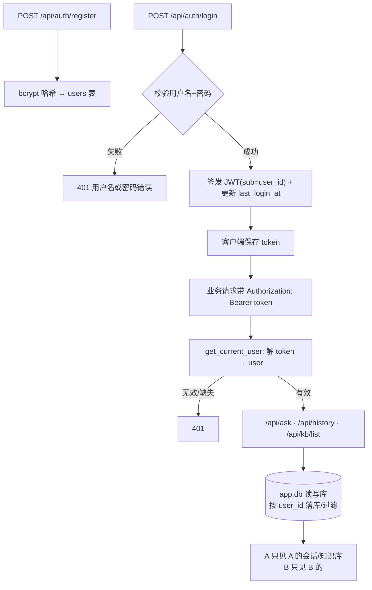

# 登录模块：JWT 鉴权 + 用户隔离

- 负责人：后端（zhanghuizhi）
- 日期：2026-05-22
- 关联工单：PRD-2 §17（安全与权限）、§17.3（按用户隔离）、§6（会话/知识库存储）
- 状态：已完成（注册/登录/鉴权/隔离全通；知识库上传待 RAG 接入）

> 目标：给「车市镜」加登录与权限——注册→登录拿 JWT→带 token 才能提问/看历史/看知识库；
> 且 A 账号看不到 B 账号的会话与知识库（数据按 user_id 隔离）。

---

## 1. 做了什么

| 文件 | 动作 | 说明 |
|---|---|---|
| `requirements.txt` | 改 | 加 `passlib[bcrypt]`、`bcrypt==4.0.1`(见踩坑)、`python-jose[cryptography]` |
| `.env` / `.env.example` | 改 | 加 `JWT_SECRET`、`JWT_EXPIRE_DAYS`、`APP_DATABASE_URL`（密钥不入库） |
| `app/config.py` | 改 | 读取上述配置 + `JWT_ALGORITHM=HS256` |
| `app/models.py` | **新建** | SQLAlchemy 模型：`users` / `conversation` / `message` / `kb_document`（均带 user_id） |
| `app/database.py` | **新建** | 应用层**读写**库引擎/Session（`app.db`），与只读分析库分开 |
| `app/security.py` | **新建** | bcrypt 哈希 + JWT 签发/校验 |
| `app/auth.py` | **新建** | 路由 `/api/auth/register|login|me` + `get_current_user` 依赖 |
| `app/main.py` | 改 | 挂 auth 路由；`/api/ask`、`/api/ask_sync` 加鉴权；新增 `/api/history`、`/api/kb/list`；问答落库归属 user_id |
| `sql/schema.sql` | 改 | 补「应用层」DDL（users/conversation/message/kb_document） |

---

## 2. 为什么这么做（关键设计取舍）

### 2.1 为什么用一个独立的「应用库」`app.db`，不放进 `bi_demo.db`？
- `bi_demo.db`（分析库）是**只读**的——只供 Text2SQL 查 `dim_*/fact_*`，生产里是 PostgreSQL **只读账号**，
  根本写不进去。用户/会话/知识库是**读写**数据，硬塞进只读库会破坏只读隔离、也与 PRD-2 §6
  「应用层数据统一用（可写）PostgreSQL」的设计冲突。
- 所以新增 `APP_DATABASE_URL`（本地 `sqlite:///app.db`，生产 PostgreSQL），用独立引擎/Session
  （`app/database.py`），与只读分析连接（`app/db.py`）彻底分开。

### 2.2 为什么密码用 bcrypt、令牌用 JWT？
- **bcrypt**：自带盐、慢哈希，抗彩虹表/暴力破解，是密码存储业界标准；**绝不存明文**。
- **JWT**：无状态令牌，服务端不存 session，水平扩展友好；`sub=user_id`、`exp` 控制有效期。
- **密钥 `JWT_SECRET` 只放 .env**（已 gitignore），换密钥即可让所有旧 token 失效。

### 2.3 为什么 user_id 既在 conversation 又冗余进 message？
按用户过滤历史/消息时不必每次 JOIN conversation，直接 `WHERE message.user_id=?` 更快更稳；
落实 §17.3「查询一律带当前用户 user_id」。

### 2.4 错误信息为什么「用户名或密码错误」合并报？
登录失败不区分「用户不存在」还是「密码错」，避免**用户名枚举**泄露哪些账号存在（安全细节）。

---

## 3. 怎么运行 / 怎么验证

```bash
# 起后端（应用层表首次启动自动建）
PYTHONUTF8=1 .venv/Scripts/python.exe -m uvicorn app.main:app --port 8000

# 1) 注册
curl -X POST localhost:8000/api/auth/register -H "Content-Type: application/json" \
     -d '{"username":"alice","password":"pwA123","nickname":"爱丽丝"}'
# 2) 登录拿 token
curl -X POST localhost:8000/api/auth/login -H "Content-Type: application/json" \
     -d '{"username":"alice","password":"pwA123"}'
#    → {"access_token":"eyJ...","token_type":"bearer","user":{...}}
# 3) 带 token 提问
curl -X POST localhost:8000/api/ask_sync -H "Content-Type: application/json" \
     -H "Authorization: Bearer <token>" -d '{"question":"2025年纯电销量前5的车系"}'
# 4) 看自己的历史
curl localhost:8000/api/history -H "Authorization: Bearer <token>"
```

**验收实测（2026-05-22，全过）**：

| 用例 | 结果 |
|---|---|
| 无 token 提问 | ❌→ 401（被拒）✅ |
| 注册 A / B | 200 ✅ |
| 重名注册 | 409 ✅ |
| 错误密码登录 | 401 ✅ |
| A/B 登录拿 token、`/me` | ✅ |
| A 带 token 提问 | 200，返回真实 SQL+数据，建会话 conversation_id=1 ✅ |
| **会话隔离** | A history=1，**B history=0（看不到 A 的会话）** ✅ |
| **知识库隔离** | 给 A 插一条文档：A 的 `/api/kb/list` 看到，**B 看不到** ✅ |

> 已建测试账号：`alice / pwA123`、`bob / pwB123`（本地 `app.db`，已 gitignore）。重置：删 `app.db` 再起服务。

---

## 4. 输入 → 输出

- **注册** `POST /api/auth/register {username,password,nickname?}` → `{user:{id,username,nickname,...}}`（密码 bcrypt 入库，响应**不含**哈希）
- **登录** `POST /api/auth/login {username,password}` → `{access_token, token_type:"bearer", user:{...}}`，并更新 `last_login_at`
- **当前用户** `GET /api/auth/me`（带 Bearer）→ `{user:{...}}`
- **提问** `POST /api/ask[_sync]`（带 Bearer，可选 `conversation_id`）→ 原结果 + `conversation_id`，并把本轮 user/assistant 两条消息落到该用户名下

---

## 5. 关键实现说明

### 5.1 鉴权依赖 `get_current_user`（`app/auth.py`）
```python
_bearer = HTTPBearer(auto_error=False)  # 自己给中文 401

def get_current_user(cred=Depends(_bearer), db=Depends(get_db)) -> User:
    if cred is None or not cred.credentials:
        raise HTTPException(401, "未提供登录凭证…")
    user_id = decode_token(cred.credentials)        # 解 JWT 取 sub
    if user_id is None: raise HTTPException(401, "登录凭证无效或已过期")
    user = db.get(User, user_id)
    if user is None: raise HTTPException(401, "用户不存在")
    return user
```
受保护接口只需 `user: User = Depends(get_current_user)` 即可拿到当前用户。
（FastAPI 依赖缓存：同请求里 `get_current_user` 与端点共享同一个 `get_db` 会话，不会开两个连接。）

### 5.2 落库按 user_id 归属（`app/main.py::_persist`）
```python
conv = db.get(Conversation, conversation_id)
if conv is None or conv.user_id != user.id:   # 只能续接自己的会话
    conv = None
if conv is None:
    conv = Conversation(user_id=user.id, title=question[:40]); db.add(conv); db.flush()
db.add(Message(conversation_id=conv.id, user_id=user.id, role="user", content=question))
db.add(Message(..., role="assistant", intent=result["intent"], sql_text=result.get("sql")))
```
查询侧 `/api/history`、`/api/kb/list` 一律 `WHERE user_id == 当前用户` → 实现隔离。

---

## 6. 流程图：鉴权与隔离



---

## 7. 踩过的坑

1. **passlib + bcrypt 版本不兼容**：`passlib 1.7.4` 与 `bcrypt>=4.1`（尤其 5.x）冲突——passlib 初始化时做
   自检会喂一个 >72 字节的串，新版 bcrypt 直接 `ValueError: password cannot be longer than 72 bytes`
   而不是截断，导致 bcrypt 后端整个加载失败。**解决：钉死 `bcrypt==4.0.1`**（最后一个兼容版），写进 requirements。
2. **可写表别混进只读分析库**：用户/会话是读写数据，放进只读 `bi_demo.db` 会破坏只读隔离 → 用独立 `app.db`（§2.1）。
3. **加鉴权会断开前端 live**：见 §8——前端 `/api/ask` 现在必须带 token，前端要先做登录流程。

---

## 8. 待办 / 遗留

- ⚠️ **前端需配合**：`/api/ask`、`/api/ask_sync`、`/api/history`、`/api/kb/list` 现在**都要 Bearer token**。
  前端要：① 接 `/api/auth/register|login`、存 token；② 所有请求带 `Authorization: Bearer <token>`；
  ③ 401 时跳登录。**在此之前，前端 live 模式提问会收到 401。**
- **知识库上传** `/api/kb/upload` 未实现（依赖 T5 MinerU 解析 + 向量化 + 存储）；`kb_document` 表与隔离已就绪，文档已能按用户列出/过滤。
- **会话多轮上下文**：已落 message，但生成时尚未取最近 N 条做指代消解（PRD §6.3），后续接。
- **生产**：`APP_DATABASE_URL` 切 PostgreSQL；`JWT_SECRET` 换长随机串并仅放服务器 env；可加刷新令牌/限流。
