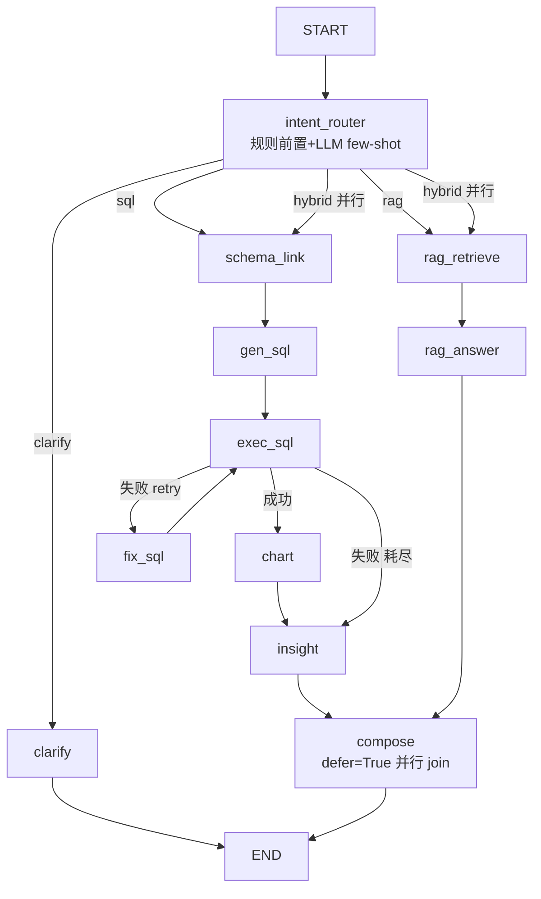

# LangGraph 双脑编排：状态图把 Text2SQL + RAG 真正串起来

- 负责人：后端（zhanghuizhi）
- 日期：2026-05-25
- 关联工单：T10；PRD-2 §7（AgentState §7.2 / 节点 §7.3 / 意图路由 §7.4 / 条件路由 §7.5 / 混合合并 §7.6）、§19.7
- 状态：✅ 已完成（11 节点状态图 + 四意图路由 + 重试环 + hybrid 并行 + trace，E2E 全 DoD 通过）

> **一句话**：把原来「线性 if-else」的简化编排，换成 **LangGraph 状态机**——一个共享 `AgentState`
> 在节点间流转，条件边决定走向。数据脑(Text2SQL)与知识脑(RAG)成为图里的两条链，hybrid 时**并行**跑、
> compose **合并**；SQL 失败走**重试环**、耗尽**降级**；每步写 `trace` 可回溯。

---

## 1. 做了什么
| 文件 | 作用 |
|---|---|
| `app/graph.py` | **本任务核心**：`AgentState` + 11 节点 + 条件路由 + 重试环 + hybrid 并行 join + trace |
| `data/graph_demo.py` | E2E 验收（四意图 / hybrid 并行 / 重试降级 / trace） |

复用既有能力做节点（不重造轮子）：`schema_linking.link_schema`、`text2sql`(DOMAIN/FEWSHOT/SYS/`_extract_sql`)、
`sql_guard`(`ensure_safe`/`with_limit`)、`db.run_query`、`charts.recommend_chart`、`rag.retrieve`(召回/重排/归并/生成)。

---

## 2. 为什么用状态图而非 if-else（§7.1，Agent 工程岗最看重）
- **显式状态+节点+条件边**：多步流程可控、可回溯；
- **天然表达「环」**：Text2SQL 自校验重试 `exec_sql ⇄ fix_sql` 是带环流程，if-else 写成大 while 难维护；
- **挂起等人**：`clarify` 反问后 END，用户回答再重入图；
- **并行 join**：hybrid 同时跑两条脑链，`compose` 合并；
- **可观测**：每节点写 `State.trace`，直接喂评测(T13)与线上调试。

---

## 3. AgentState（§7.2，节点间共享）
`TypedDict`，节点只读写自己需要的字段：`question / history / user_id / intent / clarify_question /
linked_schema / sql / cols / rows / sql_error / retry_count / chunks / citations / has_answer /
chart / insight / rag_answer / final_answer / degraded / trace`。
> `trace` 用 `Annotated[list, operator.add]`——hybrid 并行时两条链都往 trace 追加，用 add 规约合并不冲突。

---

## 4. 节点与状态图（§7.3 / §7.5）



**节点职责**：intent_router(判意图)、clarify(反问挂起)、schema_link(筛表DDL)、gen_sql(生成SQL)、
exec_sql(护栏+只读执行)、fix_sql(回喂错误修正,环)、chart(规则选图)、insight(结论归因/降级话术)、
rag_retrieve(混合召回+重排+父块归并)、rag_answer(带引用生成)、compose(合并双脑结果)。

---

## 5. 关键设计点

### 5.1 意图路由（§7.4）：规则前置 + LLM 兜底
- **规则前置**：问题含「销量/排名/趋势…」走 sql、含「报告/政策/口碑/为什么…」走 rag、两者都含→hybrid，命中即**跳过 LLM 省成本**；
- **LLM few-shot 兜底**：未命中规则时用 DeepSeek 分类，prompt 带歧义→clarify 示例（『哪个车好』——好指销量?口碑?价格?不清→clarify）。

### 5.2 SQL 重试环 + 降级（§7.5 / §4.5）
`route_exec` 条件：成功→chart；失败且 `retry_count<MAX_SQL_RETRY`→fix_sql（回 exec_sql 重试）；
**耗尽→insight 出友好降级话术**，绝不把报错的 SQL 塞给用户。

### 5.3 hybrid 并行 + compose join（§7.6）
- intent_router 的条件边对 hybrid **返回 `["schema_link","rag_retrieve"]`**→两条链并行跑；
- **compose `defer=True`**：延到所有在途分支都完成才执行**一次**——否则两条链长度不一(RAG 链短/SQL 链长)会触发 compose 跑两次（这是踩坑，见 §7）；
- compose 合并：「数据结论(图表+洞察)」+「文档佐证(带引用答案)」拼成统一回答；任一脑失败，另一脑照常返回（优雅降级）。

---

## 6. 验收（DoD）

```bash
HF_HUB_OFFLINE=1 PYTHONUTF8=1 .venv/Scripts/python.exe data/graph_demo.py
```
| DoD | 结果 |
|---|---|
| 四种意图正确路由 | sql→`schema_link→gen_sql→exec_sql→chart→insight`；rag→`rag_retrieve→rag_answer`(has_answer=True)；hybrid 识别；clarify→反问 END 不走双脑 ✅ |
| hybrid 并行双脑 + 合并 | trace 同含 `schema_link` 与 `rag_retrieve`，`compose` **跑一次**(defer join 生效)，输出「【数据分析】…【文档佐证】…」合并答案 ✅ |
| SQL 失败重试 / 耗尽降级 | 失败可重试→`fix_sql`(环)；耗尽→`insight` 降级话术(不含原始错 SQL)；坏 SQL→`exec_sql` 写 `sql_error` 不崩 ✅ |
| 每步可 trace 回溯 | 每节点结构化 trace(节点名+决策)，含生成的 SQL ✅ |

实测 trace（hybrid）：`intent_router → rag_retrieve → schema_link → gen_sql → rag_answer → exec_sql → chart → insight → compose`（两链并行交错，compose 单次 join）。

---

## 7. 踩过的坑
1. **hybrid 下 compose 跑两次**：LangGraph 并行 fan-out 后，两条链长度不一→compose 在 RAG 链完成时先跑一次、SQL 链完成时又跑一次，trace 出现两个 compose。**解决：`add_node("compose", compose, defer=True)`**，让 compose 作为 join 节点延到所有分支完成才跑一次。
2. **规则前置过宽**：「趋势」算 sql 词，导致『报告对续航趋势怎么看』这种纯文档问题被规则判成 hybrid。规则是 SPEED 优化、宁可 hybrid(安全超集)，精准判定交 LLM；做 DoD 演示时用无歧义问题。
3. **clarify 要 LLM 配合**：『哪个车好』需 LLM 判 clarify，prompt 里给足歧义示例后才稳。

---

## 8. 待办 / 遗留
- 接 `app/main.py` 的 `/api/ask`：把 `run_agent` 的 `final_answer/chart/citations/trace` 走 SSE 流式输出（前端双脑渲染已留位）。
- `trace` 落 `message.result_meta`（评测/线上调试），接 RAGAS/意图准确率统计(T13)。
- clarify 的「挂起-恢复」接多轮：用户回答后带上轮 clarify 上下文重入 intent_router。
