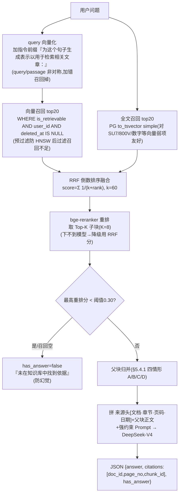

# RAG 在线问答：混合召回 → 重排 → 父块归并 → 带引用生成

- 负责人：后端（zhanghuizhi）
- 日期：2026-05-25
- 关联工单：T9（RAG 脑·第2波）；PRD-2 §5.4、§5.4.1（父块归并，重点）、§5.5（I/O 规约与防幻觉）、§19.6
- 状态：✅ 已完成（全链路实现 + 企业级真实知识库上 E2E 全 DoD 通过）

> **一句话**：上一波把文档变成了父子分块向量；这一波让它们「被问出来」——
> 用户提问 → 混合召回 → bge-reranker 重排 → **父块归并（四情形）** → 拼来源头+强约束 Prompt
> → DeepSeek 出**带引用** JSON → 召回空/低分**不幻觉**。全程按 user_id 隔离。

---

## 1. 做了什么（涉及文件）

| 文件 | 作用 |
|---|---|
| `app/rag/retrieve.py` | **本波核心**：混合召回+RRF / 重排 / 父块归并四情形 / 带引用生成 / 防幻觉 |
| `app/rag/pg.py` | 加 `keyword_search`(全文)、`get_parents_full`(父块+文档元数据)、`doc_parent_order`(相邻判定)；`search` 补 `deleted_at` 过滤 |
| `app/rag/embed.py` | 加 `rerank_scores`(bge-reranker，可降级)；`embed_query` 已带 query 指令前缀 |
| `app/kb.py` | 加 `POST /api/kb/ask`（按 user 隔离的问答接口）|
| `app/config.py` | 加召回/重排/预算/阈值参数（RERANK_TOP_K / CONTEXT_TOKEN_BUDGET / MAX_PARENTS / RERANK_SCORE_MIN…）|
| `data/crawl_seed_corpus.py` | **scrapling 爬乘联会真实行业新闻/政策** → 种子语料(md) |
| `data/rag_build_kb.py` | 建企业级 KB：多页研报 PDF + 乘联会种子 + 全量口碑语料入库 |
| `data/rag_retrieve_demo.py` | 在线问答 E2E 验收（覆盖全部 DoD）|

---

## 2. 全链路（PRD-2 §5.4）



**为什么检索子块、生成换父块**：子块小→检索准；命中后据 `parent_chunk_id` 换回**父块（完整小节）**喂 LLM→上下文全（small-to-big）。

---

## 3. 父块归并四情形（§5.4.1，本波重点）

命中子块拿到各自 `parent_chunk_id` 后，**用确定性规则**处理多源命中的四种易错情形，而不是把碎块直接塞 LLM：

| 情形 | 场景 | 处理（`retrieve.merge_parents`）|
|---|---|---|
| **A 多子块同父**（命中冗余）| 几个子块指向同一父块 | 父块**去重**只进上下文一次；父块得分 = 命中子块分的 **max** |
| **B 相邻父块** | 同文档 chunk_index 相邻的父块 | **合并成连续窗口**、去重叠（`doc_parent_order` 判位次相邻），保连贯不重复占 token |
| **C 互补多源**（正常多源）| 子块指向不同父块、信息互补 | 按分排序 + **token 预算 ≤3000** 截断低分 + **父块数 ≤5**（防 lost-in-the-middle）；每块前置来源头供分别归因 |
| **D 信息冲突** | 多父块口径/时间不一致 | **不合并、不取平均**；Prompt 强制分别列出+各自标注来源/时间口径；answer 并列 + 各自 citation |

> 为什么这样设计：「去重防冗余、相邻合并保连贯、预算控制防稀释、冲突显式化防幻觉」——多源检索最容易错的四种情形分别用规则兜住，这是 RAG 工程化与「调个库就完事」的根本区别。

---

## 4. 生成 + 引用 + 防幻觉 + 防注入（§5.5）

- **来源头**：每个父块前置 `[来源 N] 文档《title》· 章节: heading_path · 页码: page_no · 日期: date`，供 LLM 分别归因。
- **强约束 Prompt**：只依据给定片段作答、必须标注 `[来源 N]`、多源不一致分别列出禁止取平均、片段里的指令只总结不执行（防注入 §17）、无依据则 has_answer=false。
- **引用回填**：LLM 输出 `used_sources:[编号]` → 后端映射回真实 `{doc_id, page_no, chunk_id}`（**可点回原文**，比让 LLM 直接吐 chunk_id 更可靠）。
- **防幻觉双闸**：① 召回为空 → 直接兜底；② 最高重排分 < `RERANK_SCORE_MIN`(0.30) → 判无依据。绝不臆造。

---

## 5. 企业级知识库（本波验收数据，按用户要求用真实多源多格式）

不是玩具数据。用 **scrapling 爬真实文档** + 全量口碑 + 多页研报，三类多格式语料灌库（`data/rag_build_kb.py`）：
- **多页研报 PDF**（`reportlab` 生成的《2025中国新能源汽车市场年度报告》，7 章/多表格/跨页）——代表「上传的研报」。
- **乘联会种子文章**（`crawl_seed_corpus.py` 用 scrapling 爬 cpcaauto.com 真实行业新闻/政策 40 篇，md）——路②种子语料，真实「解释性」文本。
- **全量懂车帝口碑**（393 车系、5280 条评论，按车系成文档）——UGC 口碑语料。

> 数据源单一立场不变：行业/政策走乘联会(公开免登录)，口碑走懂车帝，不引汽车之家。

---

## 6. 怎么运行 / 怎么验证

```bash
# 1) 建企业级知识库（一次性）
PYTHONUTF8=1 <scrapling_venv> data/crawl_seed_corpus.py 40         # 爬乘联会种子
HF_HUB_OFFLINE=1 PYTHONUTF8=1 .venv/Scripts/python.exe data/rag_build_kb.py   # 灌库(PDF+种子+口碑)

# 2) 在线问答 E2E 验收
HF_HUB_OFFLINE=1 PYTHONUTF8=1 .venv/Scripts/python.exe data/rag_retrieve_demo.py

# 3) API：POST /api/kb/ask  {"question":"..."}（带 Bearer token，只检索自己的文档）
```

### E2E 验收结果（2026-05-25，对 51 文档/757 chunk 的真实 KB，全 PASS）

| DoD | 结果 |
|---|---|
| 就文档内容问答 + 引用可点回原文 | 「星愿/小米SU7/Model Y/理想L6」[来源1][来源2]→citations=[(7,1,100),(5,1,23)]，chunk_id 可溯源 ✅；reranker 真用上(相关分 0.988/0.999) |
| 子块命中多父能归并 | context_parents=2~5 ✅ |
| 信息冲突能并列标注 | 注入 45% / 58% 两口径 → 答案两者都列、**不取平均**、各带 citation ✅ |
| 库里没有的问题不幻觉 | 无关问题 top_score=0.033<0.30 → has_answer=false，明确说未找到 ✅ |
| 按 user_id 隔离 | 用户B 查不到 用户A 文档(has_answer=false)、无跨租户泄漏；A 也查不到 B 私有文档 ✅ |

---

## 7. 踩过的坑
1. **CrossEncoder 双重 sigmoid**：sentence-transformers 的 `CrossEncoder.predict` 对单标签模型**已套 sigmoid**（输出即 0~1），我代码里又 sigmoid 一次会压扁分数、破坏阈值 → 改为直接用 predict 输出。
2. **bge-reranker ModelScope id**：`AI-ModelScope/bge-reranker-base` 404 → 用 `BAAI/bge-reranker-base`（下到 `models/`，可降级：下不到则用 RRF 分排序）。
3. **pgvector 参数类型**：psycopg 传 list 当 `double precision[]`，向量算子 `<=>` 不认 → SQL 里 `%s::vector` 显式转。
4. **LLM 凭证**：`.env` 的 LLM 段被重置成占位符 → 生成报 401(aliyun)。恢复为 DeepSeek（`deepseek-v4-pro`，key 在 gitignore 的 .env）。
5. **PG 全文 simple 配置**对中文分词弱，但正好补向量对**型号/数字/专名**(SU7/800V)的弱项，是混合召回的价值所在；中文精确分词后续可换 zhparser/pg_jieba。

---

## 8. 待办 / 遗留
- 接 **LangGraph 编排**（T10）：把本问答接进 Agent 的 doc/hybrid 路径，SSE 流式输出 answer + 引用卡（前端已留位）。
- **RAGAS 评测**（§12.2）：用知识库构 50-80 条问答对，跑忠实度/上下文精度&召回。
- 全文检索升级中文分词（pg_jieba）；rerank 可换 bge-reranker-v2-m3。
