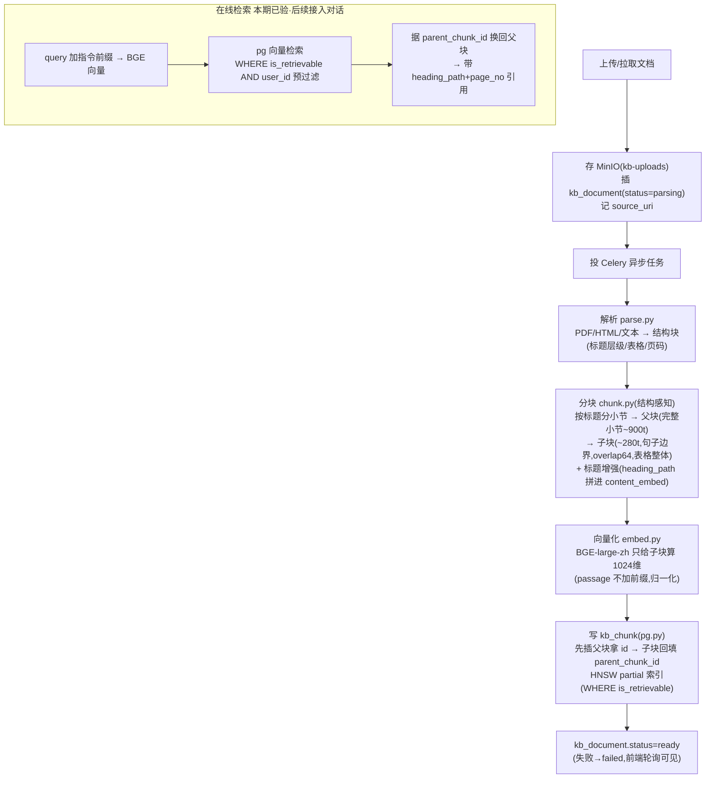

# RAG 离线入库管线：文档 → 父子分块 → BGE 向量 → pgvector

- 负责人：后端（zhanghuizhi）
- 日期：2026-05-25
- 关联工单：T5/T9；PRD-2 §5.1~5.8、§6.2(kb_chunk)、§19.4
- 状态：✅ 已完成（管线全实现 + 本地 E2E 验收通过）

> **一句话**：把一篇文档（PDF/网页/文本）变成「可被语义检索的父子分块向量」。
> 上传 → 存 MinIO → 解析成带结构的块 → 结构感知**父子分块** → BGE-large-zh 给**子块**算向量 →
> 写 PostgreSQL+pgvector（HNSW 索引）。全程 Celery 异步，前端轮询状态。

---

## 1. 做了什么（涉及文件）

| 文件 | 作用 |
|---|---|
| `app/rag/store.py` | 对象存储（MinIO）：原始文件先落 `kb-uploads` 桶，记 `source_uri` |
| `app/rag/parse.py` | **可插拔解析器**：PDF(PyMuPDF/pdfplumber)/HTML/文本 → 结构块（标题层级/表格/页码）；MinerU 留接口 |
| `app/rag/chunk.py` | **结构感知 + 父子分块**：递归切、句子边界、overlap、表格整体、标题增强、token 控制 |
| `app/rag/embed.py` | BGE-large-zh 向量化（passage 不加前缀 + 归一化）+ 精确 token 计数 |
| `app/rag/pg.py` | kb_document/kb_chunk 的 PG(pgvector) 持久层（psycopg 原生）：建档/软删/父子两段写/向量检索 |
| `app/rag/ingest.py` | 编排：存→解析→分块→embed→写库→置状态；失败置 failed |
| `app/rag/tasks.py` + `app/celery_app.py` | Celery 异步任务 |
| `app/kb.py` | API：`/api/kb/upload`、`/api/kb/documents`、`/api/kb/documents/{id}`（状态轮询，按 user 隔离）|
| `app/models.py` | `KbDocument` 补 file_type/source_uri/title/chunk_count/deleted_at（kb_chunk 不进 ORM）|
| `app/config.py` | RAG_DATABASE_URL / MinIO / Redis / **Embedding 模型名+版本** / 切块参数 |
| `data/rag_ingest_demo.py` | E2E 验收脚本（覆盖全部 DoD）|

---

## 2. 为什么这么设计（关键取舍）

### 2.1 为什么「先存 MinIO 再异步解析」
原始文件与解析解耦——解析失败可重放、换解析器可重跑，不用让用户重传；`source_uri` 进 kb_document 做血缘溯源。
解析/切块/向量化都耗时（秒~分钟），放 **Celery 后台**跑，上传接口只「存+建档(parsing)+投任务」就秒返回 doc_id，前端轮询状态（parsing→ready/failed）。

### 2.2 为什么用**父子分块（small-to-big）**（PRD-2 §5.3.2）
- 块切小 → 检索精准但上下文不全；块切大 → 上下文全但召回被稀释、易超 512 token。两头都要 → 父子分块。
- **子块**（~280 token，`is_retrievable=true`，有 embedding）= 真正进向量检索的单位，语义聚焦、召回准。
- **父块**（完整小节 ~900 token，`is_retrievable=false`，无 embedding）= 子块命中后**回填给 LLM 的上下文**，信息全。
- 父、子**同表**用 `level` 区分，子块 `parent_chunk_id` 指父块——一次建表即落父子+映射，检索拿子块、生成换父块。

### 2.3 为什么 BGE 的 512 token 是硬约束、按 token 不按字符
「切 500-800 字」是拍脑袋默认值；真正硬约束是 BGE-large-zh **最大输入 512 token**，超了直接截断丢语义。
中文 500-800 字很可能已超 512 token，所以**按 token 算**（用模型自带 tokenizer 精确数），子块目标 ~250-300 token 留余量给标题前缀。

### 2.4 标题增强 + 展示/向量文本分离（§5.6）
子块送 embed 的文本（`content_embed`）前面拼章节路径 `heading_path`（如「2025年报 > 价格分析」），把被切走的上下文补回来，召回更准、引用更可读；
而展示给用户的 `content` **不含**前缀——展示≠送 embed，分开防污染。

### 2.5 为什么 kb_chunk 走 PG 原生 SQL、不进 ORM
`embedding` 是 `vector(1024)`，SQLite 建不了、ORM 跨库别扭。RAG 一律连 PG（`RAG_DATABASE_URL`），
用 psycopg + pgvector。`KbDocument` 这种无向量的表仍用 ORM（可移植）；只有 kb_chunk 走原生。

### 2.6 解析器为什么可插拔、先不上 MinerU
MinerU(CPU) 多 GB、Windows 上难装、耗时不可控。先用 PyMuPDF/pdfplumber 轻量实现（秒装、稳、够「带表格 PDF」），
把解析抽象成 `parse_document()` 一个入口，日后 `PARSER_BACKEND=mineru` 想换随时换，**下游分块/向量化零改动**。

---

## 3. 字段含义（kb_chunk，父子分块表）

| 字段 | 含义 |
|---|---|
| `level` | `child`(子块,检索单元) / `parent`(父块,上下文单元) |
| `parent_chunk_id` | 子块→所属父块；父块为 NULL（命中子块后据此换回父块）|
| `is_retrievable` | true=子块进向量检索；false=父块仅作上下文回填（HNSW partial 索引只建在 true 上）|
| `chunk_type` | text / table / title（表格整体成块）|
| `heading_path` | 章节标题路径（标题增强 + 溯源展示「出自 X 节」）|
| `content` | 展示给用户的原文（引用卡显示）|
| `content_embed` | 实际送 BGE 的文本（原文 + 标题前缀）；展示≠embed，分开防污染 |
| `embedding` | BGE 1024 维向量，**仅子块有**；HNSW partial 索引（WHERE is_retrievable）|
| `page_no` | 引用溯源页码 |
| `token_count` | 切块校验 ≤512 + 组装上下文控预算 |
| `user_id` | 冗余：检索热路径 `WHERE user_id` 直接过滤（多租户**预过滤**，§5.8）|

---

## 4. 流程图：文档 → Markdown → 父子分块 → 向量



---

## 5. 怎么运行 / 怎么验证

```bash
# 0) 基础设施（PG+pgvector / MinIO / Redis）已由 docker-compose 起好
#    本机原生 PG17 占了 5432 → 容器 PG 避让到 5433（见 .env POSTGRES_PORT/RAG_DATABASE_URL）

# 1) E2E 验收（造带表格 PDF → 全管线 → 检索/换父块/重传/语料）
HF_ENDPOINT=... PYTHONUTF8=1 .venv/Scripts/python.exe data/rag_ingest_demo.py

# 2) 起 Celery worker（Windows 用 solo 池）
PYTHONUTF8=1 .venv/Scripts/python.exe -m celery -A app.celery_app.celery worker --pool=solo -l info

# 3) 起后端，前端可调 /api/kb/upload 上传、轮询 /api/kb/documents/{id}
#    注意：上传走 API 时 app 需以 APP_DATABASE_URL=PG 运行（kb_document.user_id 外键指 PG users）
```

### E2E 验收结果（2026-05-25，`data/rag_ingest_demo.py` 全 PASS）

| DoD | 结果 |
|---|---|
| 带表格 PDF 解析干净 + 父子分块入库 | 父块=2、子块=8、表格成块=1；表格数据含「Model Y / 425337」✅ |
| 子块有 embedding / 父块无 | ✅（父块不进检索）|
| 子块带 heading_path（标题增强）| ✅ |
| 所有 chunk token≤512 | ✅（该文档 max=234；父块预算 900 不受 512 约束、不参与 embedding）|
| 向量检回子块 → 换回父块 | 查询「纯电和增程续航」检回 3 子块，top score=0.554，据 parent_chunk_id 换回父块 ✅ |
| 引用带章节 + 页码 | 章节「2025…年度报告 > 价格分析」、页码=1 ✅ |
| 重传不产生重复 chunk | 重传后活跃 chunk 10→10、同名活跃文档仅 1（旧版软删）✅ |
| 后端①评论语料能入库 | 悦也Plus 评论 → status=ready、64 chunks、可被检回 ✅ |

---

## 6. 踩过的坑

1. **本机原生 PostgreSQL 17 占用 5432**：容器 PG 的 `5432:5432` 发布被原生 PG 顶掉，宿主连 localhost:5432
   进的是原生 PG（没有 pgvector/app 库/kb_chunk）→ psycopg 报 `app_rw 密码认证失败`。
   **修：** 用 compose 的 `POSTGRES_PORT` 旋钮把容器 PG 发布到 **5433**，重建容器（数据在 named volume `pgdata`，不丢），RAG 连 5433。不动用户的原生 PG。
2. **容器内 127.0.0.1 是 trust 认证**：`docker exec psql` 任意密码都能进（迷惑），但宿主经 TCP 进来走 scram 验密码——
   排查端口冲突时别被「容器内能连」误导。
3. **BGE 权重下载**：`huggingface_hub` 连 hf-mirror.com 失败（库层连接问题，尽管 curl 能 200）→ 改用 **ModelScope**
   `snapshot_download("AI-ModelScope/bge-large-zh-v1.5")` 下到本地 `models/`，`EMBED_MODEL_NAME` 指向本地目录，运行期不再连 HF。
4. **FastAPI 文件上传**需 `python-multipart`，否则 `/api/kb/upload` 路由注册即报错。
5. **Celery 在 Windows** 用 `--pool=solo`（默认 prefork 在 Windows 上有 fork 问题）。

---

## 7. 待办 / 遗留
- **MinerU 接入**：`PARSER_BACKEND=mineru` 留好接口，装好后在 `parse._parse_pdf` 旁加 MinerU 分支即可，下游零改动。
- **在线检索接 Agent**：本管线已验「子块检回→换父块→引用」，下一步把混合召回(向量+BM25/RRF)+rerank+父块归并接进 `app/agent.py` 的 doc 路径（§5.4/5.5）。
- **统一到 PG**：上传 API 要求 app 以 `APP_DATABASE_URL=PG` 运行（kb_document.user_id 外键指 PG users）；生产本就该统一到 PG。
- **换 embedding 模型**：`EMBED_MODEL_VERSION` 变了必须全量重算向量 + 重建 HNSW（§5.8 版本一致性）。
