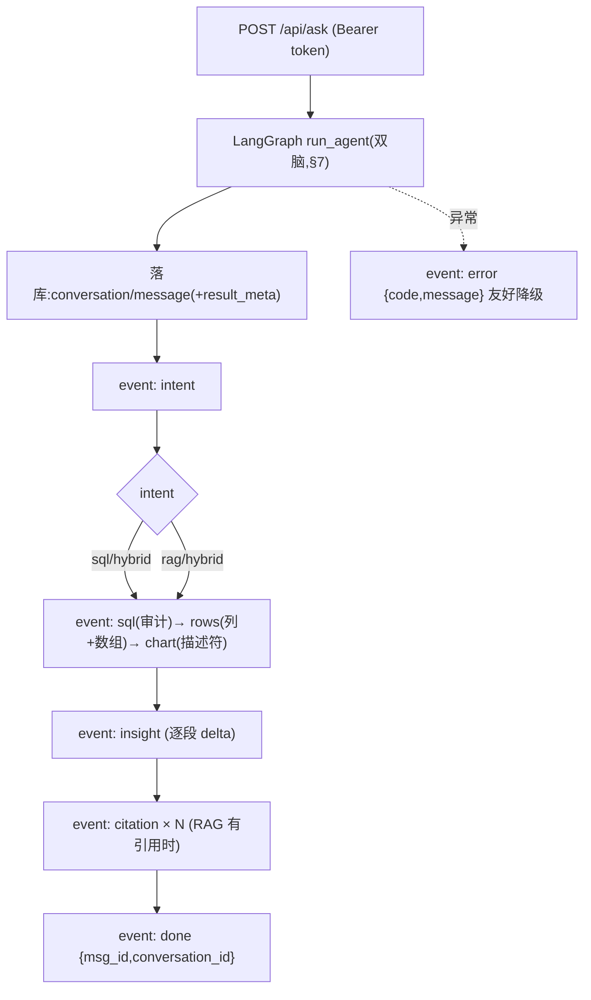

# 后端对齐 PRD §9.1 SSE 协议 + 补全 §10 接口

- 负责人：后端（zhanghuizhi）
- 日期：2026-05-25
- 关联工单：PRD-2 §9.1(SSE 事件协议)、§10(接口清单)、§8.2/8.3(chart 描述符)
- 状态：✅ 已完成（SSE 按 §9.1 发命名事件 + §10 接口补全 + 鉴权/隔离，E2E 全 DoD 通过）

> **背景**：之前后端 SSE 事件名/格式与 §9.1 有出入（`meta` vs `intent`、`cols` vs `columns`、`sql/insight` 推裸字符串、
> `done=[DONE]`、chart 旧格式），**前端靠「归一化层」兜着**。本次后端对齐 §9.1，**前端兼容层可以撤掉了**。

---

## 1. 做了什么
| 文件 | 改动 |
|---|---|
| `app/main.py` | `/api/ask` 改用 **LangGraph `run_agent`** 并严格按 §9.1 发命名事件；`/api/ask_sync` 同步版；`/api/history` + `/api/history/{conv_id}`(还原含图表/引用)；移除旧 `/api/kb/list` |
| `app/kb.py` | `/upload`(加类型/大小校验) `/list` `GET /{doc_id}`(状态) `DELETE /{doc_id}`(软删) `/ask` |
| `app/models.py` | `Message` 加 `result_meta`(JSON：图表/列行/引用，供历史还原) |
| `app/rag/pg.py` | 加 `soft_delete()` |

---

## 2. SSE 事件协议对照表（§9.1，前端按 event 类型渲染）

`POST /api/ask`（SSE）按阶段推命名事件。**顺序随意图变化**：纯 RAG 无 `sql/rows/chart`，只有 `insight`(答案)+`citation`。

| event | data(JSON) | 含义 | 前端 |
|---|---|---|---|
| `intent` | `{intent, confidence, conversation_id}` | 意图(sql/rag/hybrid/clarify) | 显示思考过程 |
| `sql` | `{sql_text}` | 生成的 SQL | **仅审计/调试，前端不展示** |
| `rows` | `{columns:[...], rows:[[...]]}` | 结果集(**列+数组行**) | 画图数据源 |
| `chart` | `{default_type, applicable_types[], dimension, measures[], title}` | **图表描述符**(§8.2/8.3) | 按描述符+rows 自建图，出图型切换+图例 |
| `insight` | `{delta}` | 洞察/答案(**逐段** delta) | 追加渲染(打字机效果) |
| `citation` | `{doc_id, page_no, chunk_id, heading_path, title}` | RAG 引用 | 来源卡(可点回原文) |
| `done` | `{msg_id, conversation_id, has_answer}` | 结束 | 收尾 |
| `error` | `{code, message}` | 降级(§4.6) | 友好提示+引导问题，**非堆栈** |

**对比旧协议（前端归一化层兜的就是这些差异，现已对齐）**：

| 维度 | 旧（前端兜） | 新（对齐 §9.1） |
|---|---|---|
| 意图事件 | `meta` | `intent` |
| 结果列 | `cols` | `columns` |
| sql/insight | 裸字符串 | JSON(`{sql_text}` / `{delta}`) |
| 结束 | `done=[DONE]` | `done={msg_id,...}` |
| chart | 选图建议旧格式 | 图表描述符 |
| 引用 | 无独立事件 | `citation` 事件 |

---

## 3. 接口清单（§10，全部 JWT 鉴权 + 按 user_id 隔离）

| 接口 | 方法 | 说明 |
|---|---|---|
| `/api/ask` | POST(SSE) | 双脑问答，按 §9.1 流式 |
| `/api/ask_sync` | POST | 同步返回完整结果(调试) |
| `/api/kb/upload` | POST | 上传(校验类型/大小)→存MinIO+建档(parsing)+投Celery异步解析 |
| `/api/kb/list` | GET | 知识库文档列表(过滤软删) |
| `/api/kb/{doc_id}` | GET | 文档解析状态(轮询 parsing→ready/failed) |
| `/api/kb/{doc_id}` | DELETE | 软删除(置 deleted_at，检索/列表自动排除) |
| `/api/kb/ask` | POST | RAG 直接问答(检索+归并+引用) |
| `/api/history` | GET | 会话列表 |
| `/api/history/{conv_id}` | GET | 会话消息(还原含图表/引用的历史) |

- **鉴权**：除 `/health`、`/api/auth/*` 外全部 `Depends(get_current_user)`；无/失效 token → **401**。
- **隔离**：落库/查询/检索一律带 `user_id`；取他人会话/文档 → **404**。
- **错误结构化**：HTTPException → `{detail}`；类型不支持 415、超大 413、空 400。

---

## 4. 历史会话怎么还原图表/引用
助手消息落库时把 `{chart, columns, rows, citations, intent, trace}` 存进 `message.result_meta`(JSON)。
`GET /api/history/{conv_id}` 读出并解析，前端据此**重绘图表、还原引用卡**，无需重新跑 Agent。

---

## 5. 流程图：一次 /api/ask 的事件流



---

## 6. 验收（DoD）
```bash
HF_HUB_OFFLINE=1 PYTHONUTF8=1 .venv/Scripts/python.exe data/api_demo.py   # app 跑在 PG
```
E2E 全 PASS（`data/api_demo.py`）：
- 未鉴权 → 401 ✅
- kb 上传→ready(4 chunks)→问答(答案含「1234公里」+引用)✅；不支持类型 → 415 ✅
- SSE 数据脑事件序列 `intent→sql→rows→chart→insight×N→done`；chart 描述符(default=bar, applicable=[bar,hbar,line,pie])；rows={columns,数组行} ✅
- SSE 纯 RAG 事件序列 `intent→insight×N→citation→done`（无 sql/rows/chart）✅
- history：会话列表；SQL 会话还原 chart+rows、RAG 会话还原 citations；他人/不存在会话 → 404 ✅
- 软删：DELETE 成功→list 排除→该内容问不到 ✅

---

## 7. 踩过的坑
1. **Redis 容器无密码**：`.env` 的 `REDIS_URL` 带了密码但 dev 容器 `requirepass` 未生效 → Celery `.delay()` 连 redis 报 `AUTH but no password set`。改 `REDIS_URL` 为无密码(生产再启用)。
2. **Celery `.delay()` 在无 worker/同进程下阻塞**：默认会连 result backend 等结果。上传是 fire-and-forget(状态走 `kb_document.status`)，设 `task_ignore_result=True`，发到 broker 即返回。
3. **`Message` 加列**：`init_db`(create_all) 不会给已存在的表加列 → 给 PG `message` 手动 `ALTER ADD result_meta`(生产用迁移工具)。
4. **路由意图歧义**：『续航/价格』这类词在结构化库(`dim_series`)里也有 → 易被判 sql；问文档内容请用「报告/解读」等框定词走 rag。协议本身正确(intent=sql 就发 sql)。

---

## 8. 通知前端
✅ **后端已对齐 §9.1，前端可以撤掉 SSE 归一化兼容层**：直接按上表 event 名/JSON 结构消费即可
（`intent`/`sql`(忽略)/`rows{columns,rows}`/`chart`(描述符)/`insight{delta}`/`citation`/`done`/`error`）。
注意：上传走 API 时后端需以 `APP_DATABASE_URL=PG` 运行（kb_document.user_id 外键指 PG users）。
