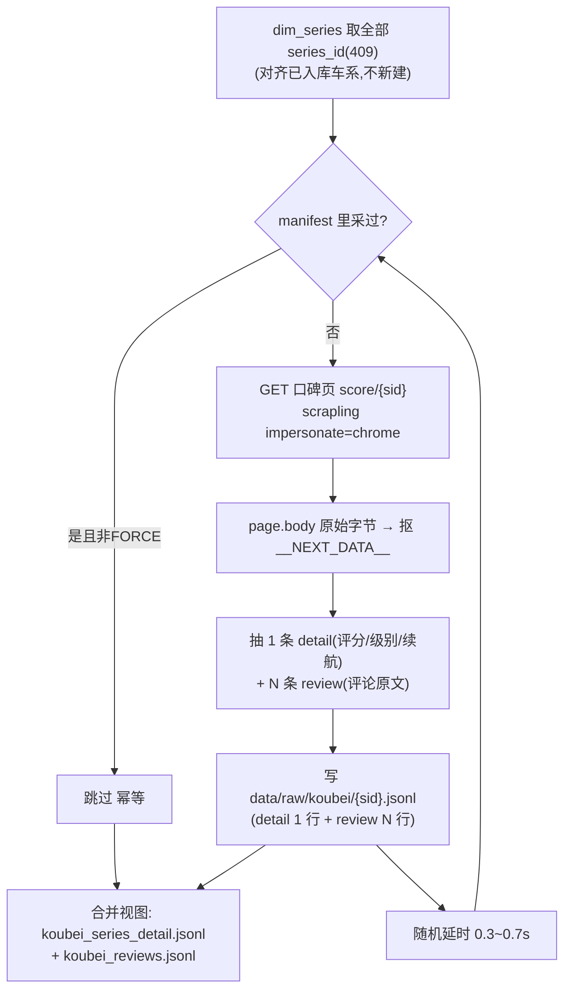
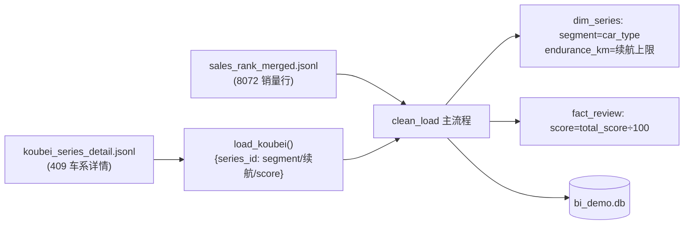

# 补采：懂车帝口碑评分 + 车系详情 → 回填三个缺失字段 + 产出 RAG 语料

- 负责人：后端/数据（zhanghuizhi）
- 日期：2026-05-25
- 关联工单：T2 收尾、T3 采集、T4 清洗、T9 RAG 语料；PRD-1 §5.5（采集方法）、§6（清洗）
- 状态：✅ 已完成（探针 + 采集 + 导语料 + 回填入库全跑通）

> **一句话**：销量榜接口给不了的三个字段——口碑**评分 score**、车系**级别 segment**、**续航**——
> 这次从懂车帝**口碑页**补采回填进库；顺带把车主**评论原文**导出成一份 RAG 知识库语料候选。
> **单数据源懂车帝，不引汽车之家**（避免实体对齐）。

---

## 0. 背景：为什么要补这一步

之前销量榜接口（`rank_data`）已采集入库 8072 行（品牌/车系/销量/排名/价格/口碑**条数**）。
但有三类字段那个接口**根本不返回**，`PROJECT-MEMORY/03` 早标注为「拿不到/待补」：

| 缺失字段 | 销量接口的情况 |
|---|---|
| 口碑评分 `score` | **恒为 0**（假数据） |
| 级别 `segment` | 没有这列 |
| 续航 | 没有这列 |

本次就是去补这三个洞，并产出评论语料给 RAG（第二个脑）。

---

## 1. 做了什么（涉及文件）

| 文件 | 动作 | 说明 |
|---|---|---|
| `data/probe/probe_koubei_detail.py` | 新建 | 探针：试候选接口 + 抓页面反查真实数据位置 |
| `data/probe/口碑车系详情字段清单.md` | 新建 | 探针结论：字段清单（可复现） |
| `data/crawl_koubei.py` | 新建 | 增量采集器：按车系遍历口碑页，采评分/级别/续航/评论 |
| `data/export_rag_corpus.py` | 新建 | 把评论文本单独导出为 RAG 语料候选 |
| `data/clean_load.py` | 改 | 回填 score→`fact_review`、segment/续航→`dim_series` |
| `sql/schema.sql` | 改 | `dim_series` 加 `endurance_km` 列；segment/powertrain 注释更新 |

---

## 2. 探针：数据到底从哪来（关键发现）

懂车帝是 **Next.js 服务端渲染（SSR）** 站点。我先试了 11 个候选 JSON 接口
（`/motor/pc/car/series/series_all_score`、`/motor/pc/koubei/list` 等）——**全部 404**。

转而抓**口碑/评分页本身**：`GET https://www.dongchedi.com/auto/series/score/{series_id}` → **200**。
页面 HTML 里有一段把整页数据塞进去的脚本：

```html
<script id="__NEXT_DATA__" type="application/json">{ ...整页数据... }</script>
```

解析它的 `props.pageProps`，**一个页面就同时拿到了评分 + 级别 + 续航 + 评论文本**，免登录、带 `Referer` 即可。

> **小白解释**：SSR 网站为了首屏快，会把页面需要的数据先算好、塞进 HTML 的一个 `<script>` 里。
> 我们不用去猜它的后端接口，直接把这段 JSON 抠出来 `json.loads` 就行——这叫「扒 `__NEXT_DATA__`」。

### 真实字段（实测 Model Y, series_id=4363）

| 数据 | 字段路径（`pageProps` 下） | 示例 | 去向 |
|---|---|---|---|
| **评分** | `seriesHomeHead.total_score` | `404`（=4.04 分，**值×100**） | `fact_review.score`（÷100） |
| **级别** | `seriesHomeHead.car_type` | `中型SUV` | `dim_series.segment` |
| **续航** | `seriesHomeHead.pc_config.recharge_mileage` | `593-821km` | `dim_series.endurance_km`（取上限 821） |
| **评论原文** | `reviewListData.review_list[].content` | 「作为坦克300车主，突发奇想买电车…」 | RAG 语料 |
| 评论元数据 | `review_list[].buy_car_info` | `{bought_time,location,price}` | RAG 元数据 |

完整清单见 `data/probe/口碑车系详情字段清单.md`。

---

## 3. 采集逻辑（`data/crawl_koubei.py`，沿用 `crawl_sales.py` 范式）



**和 `crawl_sales.py` 一致的范式**：scrapling 专用 venv；`page.body` 取原始字节再解码；
随机延时 + 失败指数退避重试 3 次（1.5/3/4.5s）；manifest 记已采、再跑只补未采（**幂等**）；按车系分文件互不覆盖。

**为什么按车系遍历**：口碑/级别是「车系」粒度（不是按月），所以遍历 `dim_series` 的 409 个 series_id，
**严格对齐已入库车系，绝不新建重复车系**。

**运行**：
```bash
# scrapling 专用 venv
PYTHONUTF8=1 C:/Users/Lenovo/.claude/skills/scrapling/.venv/Scripts/python.exe data/crawl_koubei.py
#   末尾加数字只采前 N 个做冒烟：... data/crawl_koubei.py 5
#   FORCE=1 强制全量重采：FORCE=1 ... data/crawl_koubei.py
```

**实测结果（2026-05-25）**：409 车系全采到、**0 个空**；`detail=409` 行、`reviews=5280` 行。

---

## 4. RAG 语料导出（`data/export_rag_corpus.py`）

把 `koubei_reviews.jsonl` 清洗成「即可入 RAG 的文档」：去重(gid)、过滤空/极短正文、字段裁剪、评分归一(÷100)。

- 输出：`data/rag_corpus/dongchedi_koubei_reviews.jsonl`，每行 = `{doc_id, source, series_id, series_name, text, metadata{车款/年份/评分/购车时间/城市/价格/...}}`
- 实测：**5280 篇**、覆盖 **393 个车系**、约 **344 万字**、平均每篇 653 字。

> **这份语料在整体里的定位（重要）**：车市镜的 RAG 知识库语料是**两条路**——
> **路① 用户上传**（产品核心：登录用户传自己的研报/政策/资料，按 user_id 隔离，是护城河）；
> **路② Scrapling 爬种子语料**（解决冷启动：乘联会月报/政策/垂媒 + **本次的口碑评论**，挂公共账号供所有人检索）。
> **本次产出的口碑评论 = 路②种子语料的第一块（UGC 口碑语料）**；乘联会/政策/垂媒的种子爬虫是路②后续扩展。
> 两路都走同一条 RAG 管线（MinerU→分块→BGE 向量化→`kb_chunk`），差别只在「这块语料属于谁」。

---

## 5. 回填逻辑（`data/clean_load.py` 扩展）

`clean_load.py` 是**全量重建**（每跑一次 DROP+CREATE 从 raw 重灌），所以回填不是事后 UPDATE，
而是**在重建时把口碑详情作为一路输入并进来**：



**字段级处理（小白版）**：
- **score**：口碑总分是 `404` 这种「真实分×100」，回填时 **÷100 四舍五入到 1 位**（404→4.0）。
  销量接口里那个恒为 0 的假 score 彻底弃用。`0/缺失 → NULL`（冷门车系没人打分，不硬造）。
- **segment**：直接取 `car_type`（如「中型SUV」）。
- **endurance_km**：把 `593-821km` 这种文本**解析成上限整数 821**（满足「续航≥X」类查询；上下限原文留在 raw）。
- **powertrain**：**仍沿用销量接口按能源类型推断的值**（纯电/插混/增程，标准枚举更干净），**不被详情覆盖**。
- **对齐**：全部按 `series_id` 关联（`dim_series` 主键 UPSERT），**不会新建重复车系**。

**实测回填覆盖（2026-05-25）**：
| 字段 | 覆盖 | 说明 |
|---|---|---|
| `dim_series.segment` | 406 / 409 车系 | 3 个无 car_type |
| `dim_series.endurance_km` | 403 / 409 车系 | 6 个续航为「-」无法解析 |
| `fact_review.score` | 256 / 409 车系有真实分 | 其余 153 个评分=0（无人评价）→ 诚实 NULL |
| 车系去重 | 409 = 409 | **无重复车系** ✅ |

抽查 Model Y：`segment=中型SUV, powertrain=纯电, endurance_km=821, score=4.0` ✅

**运行**：
```bash
PYTHONUTF8=1 .venv/Scripts/python.exe data/export_rag_corpus.py   # 先导语料(可选)
PYTHONUTF8=1 .venv/Scripts/python.exe data/clean_load.py          # 重建库+回填
```

---

## 6. 新解锁的分析能力（举例）

回填后，Text2SQL 能答之前答不了的问题，例如：
- 「**续航超过 600km 的纯电车系**有哪些」→ 用 `dim_series.endurance_km`；
- 「**中型SUV** 里销量前十」→ 用 `dim_series.segment`；
- 「口碑分最高的车系」→ 用 `fact_review.score`（真实分）。

实测「续航>600km 纯电车系」：腾势Z9GT EV(1036km)、AION LX(1008km,口碑4.0)、仰望U7 EV(1006km)… 正常返回。

---

## 7. 踩过的坑 / 注意

1. **候选 JSON 接口全 404**：别浪费时间猜接口路径；SSR 站点优先抓页面扒 `__NEXT_DATA__`。
2. **评分量纲是 ×100**：`404` 是 4.04 分不是 404 分。回填 `fact_review.score(NUMERIC(3,1))` 必须 ÷100。
3. **评论分页要逆向 XHR、易踩反爬**：本期只取页面内嵌**首页约 14 条/车系**作语料**候选**（5280 条够 RAG 起步）；全量分页留后续。
4. **score 是车系级当前快照，硬塞进按月的 `fact_review`**：口碑总分是累计值、变化慢，作「该车系口碑水平」近似，
   回填到该车系各月口碑事实行；要严格历史口径需另存「口碑快照月」，本期从简。
5. **后台跑全量约 8 分钟**：中途遇到几个 0 评论车系会连着退避重试显得「卡住」，其实在跑（看 `data/raw/koubei/` 文件数在涨即正常）。

---

## 8. DoD 对照（全过）
- ✅ 两接口（口碑/详情）字段清单可复现：脚本 + 样本 + `口碑车系详情字段清单.md`。
- ✅ 采集脚本幂等可重跑：manifest 跳过已采，重跑 0 新增。
- ✅ score/segment/续航 回填进库，按 series_id 对齐**无重复车系**（409=409）。
- ✅ 评论文本导出成 RAG 语料文件：`data/rag_corpus/dongchedi_koubei_reviews.jsonl`（5280 篇）。
