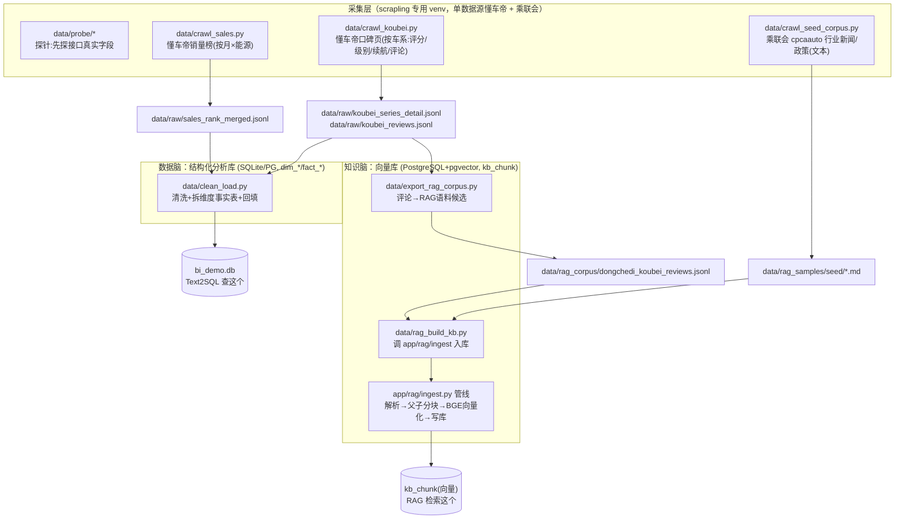

# 车市镜 · 数据采集与语料构建 总说明（爬虫 + 清洗 + 语料）

- 维护：后端/数据（zhanghuizhi）
- 更新：2026-05-25
- 读者：任何接手数据层的同学。**看完这篇就懂：数据从哪来、怎么处理、最后变成什么、各脚本谁调谁。**

> 车市镜是「双脑」Agent：**数据脑(Text2SQL)** 查结构化的分析库，**知识脑(RAG)** 查非结构化的向量库。
> 这两个库的数据**全部来自爬虫**。本文把「爬 → 清洗/向量化 → 两个库」整条链路讲清。

---

## 0. 一张图看懂全局



**一句话**：爬虫产出 `data/raw/` 原始 JSONL / `data/rag_samples/` 文档 → 两条清洗线分别灌进**两个库**：
`clean_load.py` 灌**分析库**（给 Text2SQL），`rag_build_kb.py`（经 `app/rag/ingest`）灌**向量库**（给 RAG）。

---

## 1. 采集层（所有爬虫）

> **共同规范**（PRD-1 §5.5）：用 scrapling 专用 venv（系统 Python 3.14 装不了）；取响应用 `page.body`(bytes) 再解码；
> `impersonate="chrome"` 浏览器级指纹；随机延时 0.3~0.7s + 失败指数退避重试 3 次；按主键分文件、manifest 记录已采→**幂等可重跑**。
> 立场：个人非商用、爬公开数据，防封措施(延时/伪装)保留；**单数据源**——结构化与口碑走懂车帝，行业/政策走乘联会，不引汽车之家(避免实体对齐)。

### 1.0 探针 `data/probe/`（先探后爬）
动手爬之前先探接口真实字段，把字段清单落 `data/probe/*.md`，schema 据此定。
- `probe.py` / `volume_probe.py`：懂车帝销量榜字段 + 数据量探针 → `数据源字段清单.md`
- `probe_koubei_detail.py`：懂车帝口碑页探针 → `口碑车系详情字段清单.md`
- **关键方法**：懂车帝是 Next.js SSR 站，候选 JSON 接口多 404，但页面 `<script id="__NEXT_DATA__">` 里有整页数据，解析它即可。

### 1.1 `data/crawl_sales.py` —— 懂车帝销量榜（结构化金矿）
- **爬什么**：`rank_data` 接口，按「月 × 能源类型(纯电/插混/增程)」遍历翻页。
- **产出**：`data/raw/sales_rank/{月}_{能源}.jsonl`（分文件）+ 合并视图 `sales_rank_merged.jsonl`。
- **增量逻辑**：历史月已采就跳过，最近 N 月强制刷新（当月还在变）。
- **字段**：品牌/车系/销量/排名/指导价/经销商价/口碑数。→ 喂 `clean_load.py`。

### 1.2 `data/crawl_koubei.py` —— 懂车帝口碑页（补 3 字段 + 评论语料）
- **爬什么**：口碑页 `auto/series/score/{series_id}`，**按车系遍历**（车系列表取自已入库的 `dim_series`，保证 series_id 对齐不新建重复）。
- **怎么爬**：扒页面 `__NEXT_DATA__` 的 `props.pageProps`，一次拿全：评分 `total_score`(×100)、级别 `car_type`、续航 `pc_config.recharge_mileage`、评论 `reviewListData.review_list[].content`。
- **产出**：`data/raw/koubei/{series_id}.jsonl`（detail 1 行 + reviews N 行）+ 两个合并视图 `koubei_series_detail.jsonl` / `koubei_reviews.jsonl`。
- **去向**：detail → `clean_load.py` 回填分析库；reviews → `export_rag_corpus.py` → RAG 语料。

### 1.3 `data/crawl_seed_corpus.py` —— 乘联会行业新闻/政策（RAG 种子语料）
- **爬什么**：乘联会 cpcaauto.com 的**「行业新闻(news)」类**文章详情页 `newslist.php?types=news&id=XXX`（实测 200+ 篇带文字正文）。
- **怎么爬**：列表页(`news.php?types=news&anid=X`)收集详情链接 → 逐篇抽「标题/日期/来源/正文」存 md。
- **关键质量校验（踩坑后加的）**：**「车市解读(csjd)」类详情页是图片/图表、无文字正文**——爬到的是网站导航菜单垃圾。
  所以**只爬 news 类**，且 `parse_article` 强制要求有「来源」标记、正文≥100 字、不含导航特征，否则 **return None 丢弃**。重爬后 36 篇 0 垃圾。
- **产出**：`data/rag_samples/seed/cpca_*.md`（标题 + 来源信息(血缘链接) + 正文）。→ 喂 `rag_build_kb.py`。

---

## 2. 数据脑线：`clean_load.py` → 分析库（结构化）

把销量原始 JSONL + 口碑 detail 清洗、拆成 Kimball 维度/事实表，入 SQLite `bi_demo.db`（生产切 PG）。
- **拆表**：`dim_brand / dim_series / dim_date` + `fact_sales_rank / fact_price / fact_review`。
- **回填**（口碑补采）：`score`(÷100)→`fact_review.score`；`car_type`→`dim_series.segment`；续航→`dim_series.endurance_km`；按 `series_id` 对齐**不新建重复车系**。
- **幂等**：全量重建(DROP+CREATE) + ON CONFLICT UPSERT。
- **谁查它**：`app/text2sql.py`（数据脑）只读查询。
- 详见 `docs/工作记录/后端/2026-05-22-T4+T7-跑通后端.md`、`2026-05-25-补采口碑车系详情回填.md`。

---

## 3. 知识脑线：评论导出 + 建向量库（非结构化）

### 3.1 `data/export_rag_corpus.py` —— 评论文本 → RAG 语料候选
把 `koubei_reviews.jsonl` 去重/过滤/裁剪/评分归一 → `data/rag_corpus/dongchedi_koubei_reviews.jsonl`（5280 篇/393 车系）。
每行 = `{doc_id, source, series_id, series_name, text, metadata}`，是「即可入 RAG 的文档」。

### 3.2 `data/rag_build_kb.py` —— 建企业级向量库（调 ingest 管线）
把**三类多格式语料**统一灌进向量库：
1. **多页研报 PDF**（reportlab 生成的《2025市场年度报告》，7 章/多表/跨页）——代表「上传的研报」。
2. **乘联会种子文章**（§1.3 爬的 md）——行业/政策解释性文本。
3. **全量懂车帝口碑**（§3.1，按车系成文档）——UGC 口碑。
对每篇调 `app/rag/ingest.ingest_bytes()`。

### 3.3 `app/rag/ingest.py` 管线 —— 文档怎么变成「语料库」（关键澄清）
**「RAG 语料库」不是那些 md/PDF 文件，而是 PostgreSQL `kb_chunk` 表里一条条「切块文本 + 1024 维向量」。** md/PDF 只是喂进管线的原料：
```
原料(md/PDF/评论) → store(存MinIO) → parse(解析成带标题/页码的结构块)
  → chunk(结构感知父子分块) → embed(BGE-large-zh 给子块算向量) → 写 kb_chunk(pgvector+HNSW)
```
- **父子分块**：子块~280token(进检索,有向量)、父块=完整小节(命中后回填上下文)。
- **谁查它**：`app/rag/retrieve.py`（知识脑）做向量+全文混合检索。
- 详见 `docs/工作记录/后端/2026-05-25-RAG离线入库管线.md`、`2026-05-25-RAG在线检索-归并-引用.md`。

---

## 4. 文件关系速查表

| 文件 | 角色 | 输入 | 输出 | 下游 |
|---|---|---|---|---|
| `data/probe/*` | 探针 | 接口/页面 | 字段清单 md | 定 schema |
| `data/crawl_sales.py` | 爬销量 | 懂车帝 rank_data | sales_rank_merged.jsonl | clean_load |
| `data/crawl_koubei.py` | 爬口碑/详情 | 懂车帝口碑页 | koubei_*.jsonl | clean_load + export_rag |
| `data/crawl_seed_corpus.py` | 爬乘联会 | cpcaauto news | rag_samples/seed/*.md | rag_build_kb |
| `data/clean_load.py` | 清洗入分析库 | raw jsonl | bi_demo.db(dim/fact) | Text2SQL |
| `data/export_rag_corpus.py` | 评论→语料 | koubei_reviews | rag_corpus/*.jsonl | rag_build_kb |
| `data/rag_build_kb.py` | 建向量库 | PDF+seed+语料 | (调 ingest) | — |
| `app/rag/ingest.py` | 入库管线 | 文档字节 | kb_chunk(向量) | RAG 检索 |

---

## 5. 怎么从零重建两个库（可复制）

```bash
S=C:/Users/Lenovo/.claude/skills/scrapling/.venv/Scripts/python.exe   # scrapling venv
V=.venv/Scripts/python.exe                                           # 项目 venv

# —— 数据脑（分析库）——
PYTHONUTF8=1 $S data/crawl_sales.py            # 爬销量
PYTHONUTF8=1 $S data/crawl_koubei.py           # 爬口碑/详情
PYTHONUTF8=1 $V data/clean_load.py             # 清洗入 bi_demo.db

# —— 知识脑（向量库，需 PG+pgvector+MinIO 起着）——
PYTHONUTF8=1 $S data/crawl_seed_corpus.py 40   # 爬乘联会种子
PYTHONUTF8=1 $V data/export_rag_corpus.py      # 评论→RAG语料
HF_HUB_OFFLINE=1 PYTHONUTF8=1 $V data/rag_build_kb.py   # 灌向量库(PDF+种子+口碑)
```

---

## 6. 企业级到了什么程度 / 还能怎么加

**现在**：真实多源（懂车帝销量+口碑、乘联会行业/政策）、多格式（API-JSON / SSR-HTML / PDF / UGC文本）、有体量（近万条销量事实 + 5280 条口碑 + 36 篇行业文+多页研报）、幂等可重跑、来源留痕可溯源、质量校验（拒收图片/导航垃圾页）。对 demo/作品集是**够企业级**的。

**要再往真·企业级推**，按需加（管线通用，加爬虫即可）：
- 更多源：工信部/发改委政策**原文 PDF**、第三方研报 PDF、更多垂媒资讯；
- **定时增量**：Celery 定时任务每日/每周增量爬 + 重建索引（现已有 Celery）；
- **质量监控**：采集成功率/字段非空率/新鲜度告警（PRD-1 §8）；
- **去重/对齐**：跨源同一实体（车系/品牌）归一；文档级去重（near-dup）。
