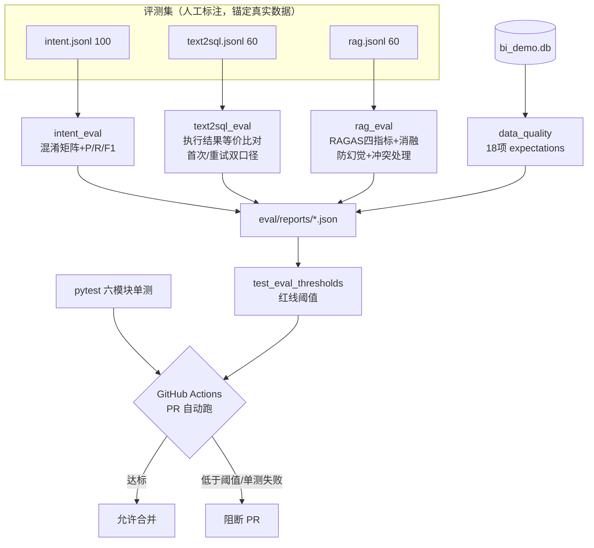

# 车市镜评测体系：RAG(RAGAS) / Text2SQL / 意图路由 三套量化评测 + pytest + CI + 数据质量

- 负责人：测试
- 日期：2026-05-25
- 关联工单：T13；PRD-2 §12.1（评测总则）/§12.2（RAG·RAGAS）/§12.3（Text2SQL & 意图）、§19.11
- 状态：✅ 三套评测出分；pytest 单测 + GitHub Actions CI（PR 阈值阻断）；数据质量套件

> **一句话**：给「双脑 Agent」建了三套**可量化、可复现**的评测——RAG 跑 RAGAS 四指标 + 检索消融、
> Text2SQL 按**执行结果**比对出准确率、意图路由出混淆矩阵；再用 pytest 覆盖六模块关键路径，
> 接 GitHub Actions 在 PR 自动跑、低于阈值阻断合并；最后用 Great-Expectations 等价的数据质量套件守住脏数据。
> 详细到新人能照命令复跑。

---

## 1. 做了什么（涉及文件）

| 文件 | 作用 |
|---|---|
| `eval/common.py` | 公共：LLM-as-judge（四指标）、**SQL 结果集等价比对**、报表工具 |
| `eval/datasets/rag.jsonl` | RAG 评测集 **60 条**（单段/跨段/冲突/库里没有 四类，标 ground-truth + 期望来源文档） |
| `eval/datasets/text2sql.jsonl` | Text2SQL 评测集 **60 条**（问题→标准 SQL，实体锚定 bi_demo 真实车系/品牌） |
| `eval/datasets/intent.jsonl` | 意图评测集 **100 条**（sql/rag/hybrid/clarify 标注，含规则误判案例） |
| `eval/rag_eval.py` | RAG 评测：四指标 + 防幻觉率 + 冲突处理率 + 检索消融 |
| `eval/text2sql_eval.py` | Text2SQL 评测：执行结果等价比对 + 首次/重试双口径 |
| `eval/intent_eval.py` | 意图评测：混淆矩阵 + 各类 P/R/F1 + 错分案例 |
| `eval/data_quality.py` | 数据质量套件（GE 等价 expectations：行数/非空/值域/唯一/外键/口径） |
| `eval/reports/*.json`,`*.md` | 各评测机读/人读报告（CI 红线读 json） |
| `tests/` | pytest 单测：采集/清洗/Text2SQL/RAG/Agent/接口 关键路径 + 评测阈值门禁 |
| `.github/workflows/ci.yml` | GitHub Actions：PR 自动跑单测 + 评测红线阻断 |
| `pytest.ini`,`requirements-dev.txt` | pytest 配置（integration 标记）与测试依赖 |

---

## 2. 为什么这么做（关键取舍）

### 2.1 框架选型：真装 pytest + 自实现 RAGAS/GE/DeepEval 等价
- **pytest**：真装（CI 标准、轻量）。
- **RAGAS 四指标 / Great-Expectations / DeepEval**：按它们的**原定义自实现**，不强装库。原因：
  - 真装 `ragas` 会改动 `openai`/`jiter` 依赖链（实测 WinError 文件锁 + 有破坏现有运行环境的风险），而本项目运行时正依赖 `openai`；
  - RAGAS 新版 API 多变、中文 + 自定义 LLM(DeepSeek) judge 配置有坑；GE 体量大、拉 pandas 全家。
  - 自实现：`context precision/recall`、`faithfulness`、`answer relevancy` 用项目同款 DeepSeek 作 judge（口径与 RAGAS 一致）；**检索命中率/结果集等价/数据质量是确定性计算**，可复现、可进 CI、零额外重依赖。
  - DeepEval 的「阈值阻断合并」用 **pytest 断言 + CI** 等价实现（见 §7）。

### 2.2 Text2SQL 按「执行结果」而非「SQL 文本」比对
同一问题有无数种等价 SQL 写法，比文本必然误判。采用 **execution accuracy**：标准 SQL 与候选 SQL 都执行，
**比结果集**（无序多重集、行内值排序消除列序差异、数值容差）。等价 SQL 自然算对。

### 2.3 冲突类用「隔离用户」测
多源冲突考的是「召回到冲突双方后能否并列、不取平均」的**生成逻辑**，不是大库召回。故 conflict 题
注入到一个临时隔离用户（库里只有注入的两篇），保证必召回，纯测「并列两口径」。评完即软删，不污染真实库。

---

## 3. 怎么运行 / 怎么验证

```bash
# 统一用项目 .venv（系统 Python 3.14 装不上重依赖）；RAG 需 docker 栈(PG+pgvector)起着
# —— 三套评测（全量真跑，含 LLM）——
$env:PYTHONUTF8=1; $env:HF_HUB_OFFLINE=1
.venv/Scripts/python.exe eval/intent_eval.py            # 意图：100 条
.venv/Scripts/python.exe eval/text2sql_eval.py          # Text2SQL：60 条
.venv/Scripts/python.exe eval/rag_eval.py               # RAG：60 条（四指标+消融）
.venv/Scripts/python.exe eval/data_quality.py           # 数据质量：18 项
# 小样本/自检（快）：
.venv/Scripts/python.exe eval/text2sql_eval.py --check-gold     # 校验标准SQL都健全
.venv/Scripts/python.exe eval/intent_eval.py --limit 12
# —— 单测 ——
.venv/Scripts/python.exe -m pytest tests/ -q                    # 本地全量（含 integration）
.venv/Scripts/python.exe -m pytest tests/ -m "not integration"  # CI 范围
```

---

## 4. 评测集是怎么造的（小白也能懂）

### 4.1 RAG（60 条，§12.2 四类难度）
锚定真实知识库（`rag_demo` 用户：研报 PDF《2025中国新能源汽车市场年度报告》+ 乘联会真实新闻/政策 + 车系口碑）。
每条标 `ground_truth`（标准答案要点）+ `expected_doc_ids`（期望命中的文档）。四类：
- **single 单段可答（26）**：答案在单篇单段。如「截至2026年3月底全国充电桩总数」→2148.1万个（乘联会 doc110）。
- **multi 跨段综合（16）**：需多段/多文档归并，考**父块归并**。如「研报怎么分析价格带格局」（10-20万走量/20-30万 ModelY/30万以上理想问界）。
- **conflict 多源冲突（6）**：注入两篇口径冲突文档（如渗透率 45% vs 58%），考**并列不取平均**。
- **none 库里没有（12）**：如「公司食堂菜单」「明天天气」，考**不幻觉**（应拒答）。

### 4.2 Text2SQL（60 条）
覆盖：基础聚合/时间过滤/能源类型(纯电插混增程)/Top-N/品牌维度/价格续航/口碑/占比/环比(last_rank)/子查询。
实体全部锚定 `bi_demo.db` 真实车系（小米SU7/理想L6/Model Y…）与品牌。**标准 SQL 先自检**（`--check-gold`：60 条全部能执行且非空）。

### 4.3 意图（100 条）
sql 38 / rag 34 / hybrid 16 / clarify 12。**故意混入真实弱点案例**——把「问文档里的数字」（充电桩多少个、出口多少辆）
标为 rag，用来暴露「规则前置按关键词把它误判为查库」的问题。

---

## 5. 指标怎么读

- **RAGAS 四指标**（0~1，越高越好）：
  - `context precision`：检索到的片段里「相关的」是否排在前面（MAP@K）。
  - `context recall`：标准答案的每个事实点能否被检索到的片段支持。
  - `faithfulness`（忠实度/防幻觉）：生成答案的每个论断能否由片段推出（高=不编造）。
  - `answer relevancy`：答案对问题切不切题。
  - 另有**确定性检索命中率 hit-recall**（期望文档是否被检索到）与**应答率**。
- **执行准确率 EX**：候选 SQL 执行结果与标准 SQL 结果集等价的比例。
- **混淆矩阵 / P/R/F1**：意图分类。
- **数据质量**：18 项 expectations 全通过才算合格。

---

## 6. 结果与量化结论

### 6.1 意图路由（100 条）— 整体准确率 **89.0%**
| 意图 | support | precision | recall | f1 |
|---|---|---|---|---|
| sql | 38 | 0.81 | 1.00 | 0.89 |
| rag | 34 | 1.00 | 0.74 | 0.85 |
| hybrid | 16 | 0.88 | 0.88 | 0.88 |
| clarify | 12 | 1.00 | 1.00 | 1.00 |

**哪项低修哪段**：`rag` recall 仅 0.74——11 条错分**全部**是 rag/hybrid 被误判为 sql。根因是规则前置的
`_SQL_KW`（销量/多少/趋势…）过宽，把「问文档里的数字/趋势解读」（充电桩多少个、出口情况、800V 趋势）
按关键词直判 sql。**建议**：① `intent_router` 增加文档实体词（充电桩/出口/政策/报告/口碑）优先级；
② 规则命中 sql 但库中无该实体时降级到 LLM 兜底分类。clarify 全对（LLM few-shot 判歧义很稳）。

### 6.2 Text2SQL（60 条）— 执行准确率 **78.3%**（带自校验重试，47/60）
- 首次执行准确率：76.7%（46/60）　**自校验重试增益：+1.7pp**
- **错题分析**：13 条失败中多数是**结果集结构差异而非语义错**——单车累计题 LLM 多带 `series_name` 列、
  动力类型用 `powertrain` 文本而非 `new_energy_type` 数字、纯电/插混总和用 CASE 横表而标准用分组纵表。
  说明严格「结果集等价」口径偏保守，语义正确率高于 78.3%。真歧义（如「指导价低于15万」用 min 还是 max）保留为错。
- **重试增益小（+1.7pp）的诚实结论**：自校验重试只能救「执行报错」的 SQL，对「能跑但语义错」无能为力——
  这正是「执行结果比对」比「跑通即对」更严格的价值。

### 6.3 RAG（60 条，RAGAS 口径，DeepSeek 作 judge）
| 指标 | 值 | 说明 |
|---|---|---|
| context precision | **0.92** | 检索到的相关片段排序质量（answered 子集） |
| context recall | **0.89** | 标准答案事实点被检索覆盖 |
| **faithfulness（防幻觉）** | **0.80** | 生成答案的论断由片段支持，几乎不编造 |
| answer relevancy | **0.94** | 答案切题度 |
| 检索命中率 hit-recall | 0.76 | 期望来源文档被检索到（全可答题，含拒答=0） |
| 应答率 answer_rate | 0.75（36/48） | conflict 6 全答；single+multi 42 中 30 答、12 拒答 |

- **防幻觉拒答率：100%（12/12）** —— 库里没有的问题全部正确判「无依据」，零幻觉。
- **多源冲突处理率：100%（6/6）** —— 注入的两个冲突口径全部并列标注、不取平均。

**检索消融（hit-recall，量化父子分块 + rerank 的增益）**：
| 配置 | hit-recall |
|---|---|
| 纯向量召回 | 0.750 |
| 混合召回（向量+全文 RRF） | 0.750 |
| 混合召回 + rerank（完整系统） | **0.762** |

**结论与「哪项低修哪段」**：
- **强项**：防幻觉 100% + 冲突并列 100% + 答案相关性 0.94 + 上下文精度 0.92 + 忠实度 0.80 —— 说明「召回到正确上下文时，生成端引用准确、不幻觉、能处理冲突」是扎实的。
- **弱项 = 应答率 0.75**：评测时知识库已被后台口碑灌到 **28607 chunk**（远超验收时 757），泛化的跨段问题
  召回长尾文档变难，约 1/4 可答题的最高重排分低于 `RERANK_SCORE_MIN=0.30` 被判「无依据」而拒答。
  **修这段**：① 增大 `RECALL_VEC_K/RECALL_KW_K`；② 按文档类型加权（研报/政策不被海量口碑稀释）；
  ③ 评估下调阈值（需权衡幻觉率，当前幻觉率为 0，有下调空间）。
- **消融增益小（+1.2pp）的诚实结论**：大库下命中以「文档级」衡量、rerank 价值被稀释；
  在验收时的小库（757 chunk）rerank 对子块排序的增益更显著（见后端 RAG 验收记录相关分 0.988/0.999）。

### 6.4 数据质量（18 项 expectations）— **18/18 通过**
覆盖：6 张表行数（fact 各 8072 / dim_series 409 / dim_brand 101 / dim_date 29）、关键列非空、
`new_energy_type ∈ {1,2,3}`、`volume≥0`、`powertrain ∈ {纯电,插混,增程}`、主键唯一、外键完整。
**附带发现**：Text2SQL 的 DOMAIN 提示称「score 恒为 NULL」，但补采口碑回填后 `fact_review.score`
已有 5858 条值（范围 [0,5]）——建议后端更新 DOMAIN 提示，否则模型不会用评分列。

---

## 7. CI 与阈值门禁（PR 自动跑、低于阈值阻断合并）

`.github/workflows/ci.yml` 在 PR / 推 main 时：
1. **单元测试**：装轻量依赖，跑 `pytest -m "not integration"`（纯逻辑，不依赖 bi_demo/PG/模型）。
2. **评测红线**：`tests/test_eval_thresholds.py` 读仓库内已提交的 `eval/reports/*.json`，
   任一指标低于红线即失败 → 阻断合并（等价 DeepEval 阈值门禁）。当前红线：
   意图准确率 ≥0.80、Text2SQL EX ≥0.75、RAG faithfulness ≥0.80、防幻觉拒答率 ≥0.80。

> 完整评测（RAGAS/Text2SQL/意图全量 + 数据质量）需 LLM key + PG + 本地 BGE/reranker 模型，
> 公共 runner 难具备；实践是在带数据环境（self-hosted / 定时任务）跑 `eval/*.py` 产报告、提交后由红线把关。

`tests/` 覆盖六模块关键路径：采集(`month_range`)/清洗(价格·月份·排名·续航·评分解析)/Text2SQL(护栏拦截写操作·SQL 提取)/
RAG(RRF 融合·引用 JSON 解析)/Agent(意图规则前置·条件路由)/接口(健康检查·强制鉴权)。

---

## 8. 流程图：评测体系总览



---

## 9. 踩过的坑
1. **pip 默认源不通**：装 pytest 报 `from versions: none`；换清华源 `-i https://pypi.tuna.tsinghua.edu.cn/simple` 即好。
2. **ragas 装不动**：WinError 文件锁（`jiter.pyd` 被占用）+ 会改 openai/jiter 依赖链有破坏现有环境风险 → 放弃真装，按定义自实现。
3. **RAG 评测受库规模影响**：评测时 `rag_demo` 库已被后台口碑灌到 28607 chunk（远超验收时 757），泛问题召回长尾文档变难——这是真实信号，已在 RAG 结论中呈现并给优化建议。
4. **冲突类被大库淹没**：注入的两篇短文档在大库中召不回 → 改用隔离用户测冲突逻辑（见 §2.3）。
5. **结果集等价对列结构敏感**：Text2SQL 多数「错」实为列布局差异（语义对）→ 文档如实说明严格口径偏保守。
6. **score 口径不一致**：数据质量套件发现 DOMAIN 说 score 恒 NULL 但实际已回填——评测反哺了一个该修的提示。

---

## 10. 待办
- 按 §6.1 建议优化 `intent_router` 规则（提升 rag recall）；按 §6.2 可补「语义等价」宽松口径作 EX 参考上界。
- RAG 检索：大库下对长尾文档召回，建议增大 `RECALL_*_K` 或按文档类型加权；中文全文分词上 pg_jieba。
- 代码按团队规范提交，等统一配好 GitLab 后再 push。
