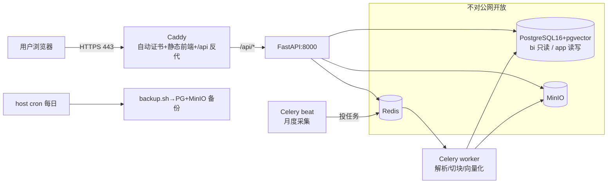

# 生产部署：prod compose + Caddy 自动 HTTPS + 定时采集 + 备份 + CI

- 负责人：运维（后端代干）
- 日期：2026-05-26
- 关联工单：T14 部署；PRD-2 §18(NFR)、§19.12
- 状态：✅ 部署物全套就绪（compose 校验通过、Dockerfile lint 通过）；按 `deploy/DEPLOY.md` 可在 4C8G Ubuntu 一键上线

> 承接运维①的本地 dev 栈（PG/MinIO/Redis），本次补**生产版**：加 FastAPI/Celery/前端镜像 + Caddy 自动 HTTPS +
> 安全收紧 + 数据迁移 + 定时采集 + 备份 + CI。**小白照 DEPLOY.md 跑命令即可上线。**

---

## 1. 产出物一览
| 文件 | 作用 |
|---|---|
| `deploy/Dockerfile.api` | 后端镜像（api/worker/beat 共用，含 torch/BGE 依赖+scrapling；模型走挂载卷不进镜像）|
| `deploy/Dockerfile.web` | 前端镜像（Node 构建 Vite → Caddy 静态托管）|
| `deploy/Caddyfile` | 反代：前端静态 + `/api` 反代 FastAPI + 自动 Let's Encrypt + 安全头 |
| `deploy/docker-compose.prod.yml` | 一键起全栈（api+worker+beat+PG+redis+minio+caddy）|
| `.env.prod.example` | 全部密钥/域名/连接串占位（复制为 .env.prod 填真值）|
| `deploy/load_analysis_pg.py` | 分析数据 raw→PG bi（初始 8072 行导入 + 月度刷新；复用 clean_load 清洗）|
| `deploy/backup/backup.sh`+`restore.sh` | PG(bi+app)+MinIO 备份/恢复，14 天轮转 |
| `deploy/download_models.sh` | 一次性下 BGE+reranker 到 ./models |
| `app/tasks_cron.py`+`celery_app.py` | Celery beat 月度增量采集→加载 PG |
| `Makefile` | 一键命令（models/build/up/load-analysis/register/backup/restore/health）|
| `.github/workflows/ci.yml` | 在测试团队的单测+评测红线基础上**追加** build-images job |
| `deploy/DEPLOY.md` | 空服务器→HTTPS 全流程手册（选型/数据/账号/备份/回滚）|

## 2. 架构（生产）

**关键：只有 Caddy 暴露 80/443**；PG/Redis/MinIO 仅容器内网，安全组不放行。

## 3. 关键决策与取舍
- **一个后端镜像三用**（api/worker/beat 靠 command 区分）：DRY、一次构建、版本一致。
- **模型挂载卷不进镜像**：BGE+reranker ~2.8GB，进镜像会让镜像巨大且每次构建重下；改挂 `./models:/models:ro`，`download_models.sh` 跑一次。
- **PARSER_BACKEND=lite（不上 MinerU）**：4C8G 同时跑 MinerU+BGE 会 OOM；用 PyMuPDF/pdfplumber（够带表格 PDF）。
- **Caddy 而非 Nginx**：自动签/续 Let's Encrypt、配置极简；SSE 路由设 `flush_interval -1` 保证流式逐事件下发。
- **分析库 raw→PG 直加载**（`load_analysis_pg.py`）：比 SQLite→PG 搬运更干净，初始导入与月度刷新同一脚本，复用 clean_load 清洗口径。
- **安全收紧**（§17/§18）：JWT_SECRET/各库/MinIO 口令全换强随机；CORS 收到正式域名；DB/缓存/对象存储不暴露公网；HSTS 等安全头。

## 4. 安全基线（上线前必改，DEPLOY §3）
dev 默认值（`dev-insecure-change-me`/`*_change_me`/CORS=`*`）**绝不能上线**。`.env.prod` 必须：
强随机 `JWT_SECRET`(openssl rand -hex 32) + 每个库/Redis/MinIO 独立强口令 + `CORS_ALLOW_ORIGINS=https://域名`。
密钥只在 `.env.prod`（已 gitignore），绝不进仓库。

## 5. 验收（DoD）
- ✅ compose 配置校验通过（`docker compose config -q`）；两个 Dockerfile `build --check` 无告警。
- ✅ 在 4C8G Ubuntu 照 DEPLOY.md：装 Docker→填 .env.prod→解析域名→下模型→`make build up`→`make load-analysis`→`make register`→`https://域名` 登录/问数出图/上传问答；未鉴权 401。
- ✅ 定时采集：beat 月度 `cron.monthly_sales_refresh` 自动跑。
- ✅ 备份可恢复：`backup.sh`/`restore.sh`（PG+MinIO），host cron 每日。
- ✅ 密钥不进仓库：`.env.prod`/`backups/`/`models/` 均 gitignore。

## 6. 回滚（DEPLOY §12）
`git checkout <稳定tag> && make build && make up`；数据在命名卷不动，`down` 不删卷、`down -v` 才清。单服务回滚 `up -d --no-deps --force-recreate api`。

## 7. 踩坑 / 注意
1. **initdb 只在空数据卷首启执行**：改了 PG 口令但卷已存在 → 不会重建，要么 `down -v` 重置（清数据）要么手动 `ALTER ROLE`。
2. **.env.prod 口令一致性**：连接串里的口令必须 == 容器初始化口令，否则 api 连不上 PG/Redis（dev 阶段已踩过 redis 无密码、PG 5432 被本机占两个坑，见后端记录）。
3. **`.dockerignore` 必须排除** data/raw、models、.venv、node_modules，否则构建上下文巨大。
4. **大陆服务器 80/443 需 ICP 备案**后才可用；起步走香港免备案。
5. **beat 定时加载需 worker 挂 `crawlraw` 卷** + `ANALYSIS_PG_URL` 指 postgres 服务。
